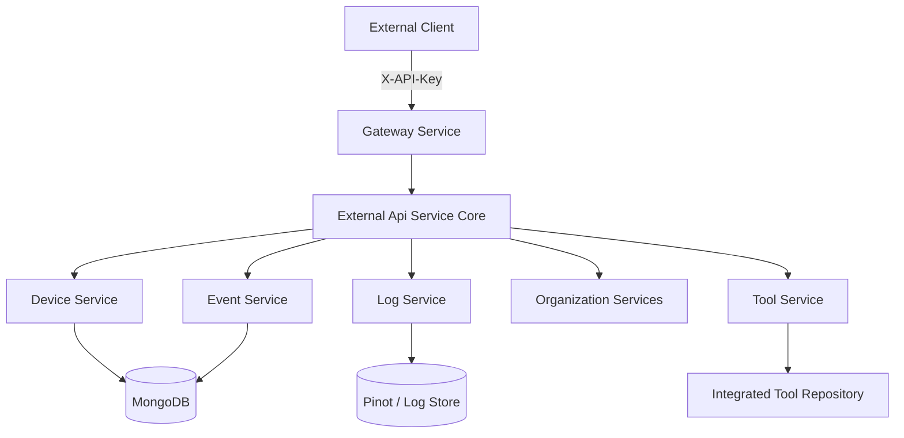
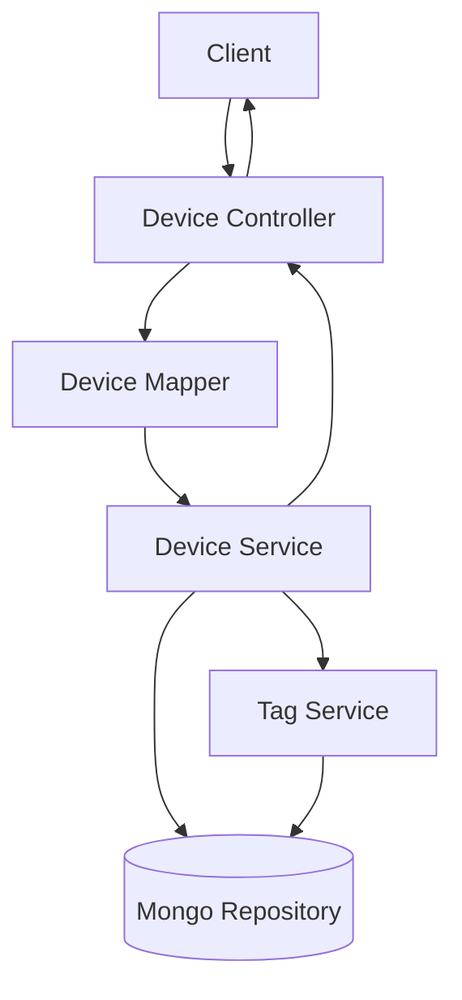
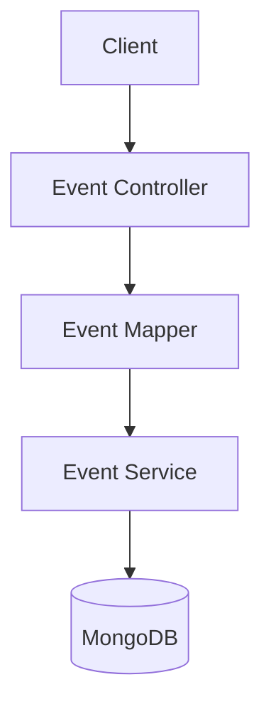
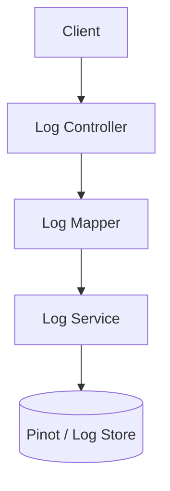
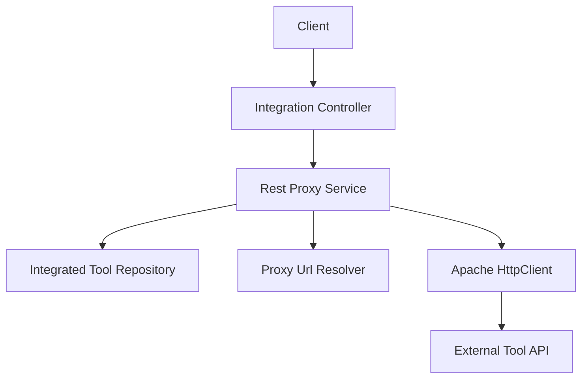
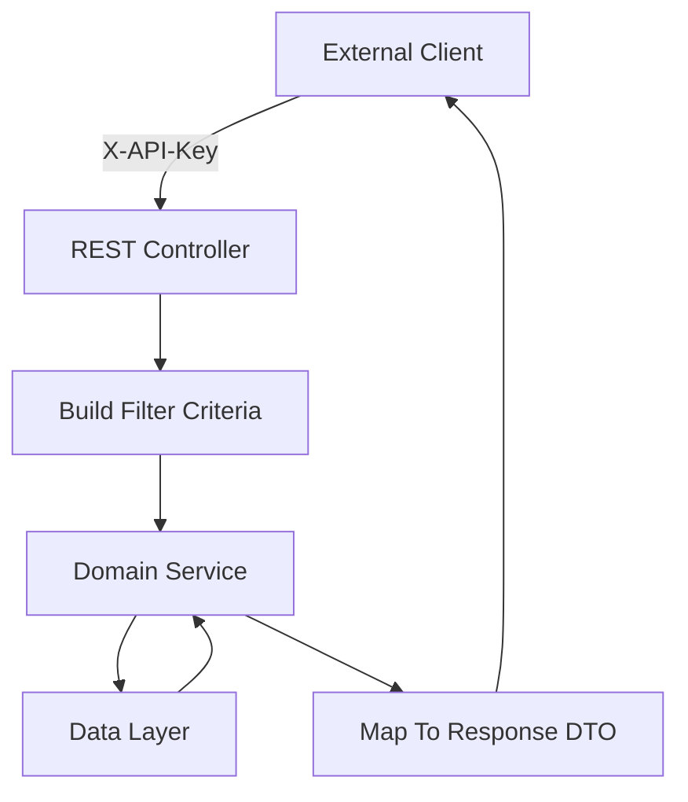

# External Api Service Core

## Overview

The **External Api Service Core** module exposes a secure, API key–based REST interface for external systems to interact with the OpenFrame platform. It provides:

- Device management and filtering
- Event ingestion and querying
- Log querying and detailed audit retrieval
- Organization CRUD operations
- Integrated tool discovery and proxying
- Public OpenAPI documentation

Unlike internal platform APIs, this module is designed specifically for **third-party integrations**, automation scripts, and external systems that authenticate using API keys.

---

## Architectural Context

The External Api Service Core sits at the edge of the backend service layer and delegates business logic to internal platform services.



### Key Responsibilities

1. **Expose stable REST endpoints** under `/api/v1/**` and `/tools/**`
2. **Enforce API key authentication** (via `X-API-Key` header)
3. **Translate REST DTOs to internal service models**
4. **Apply pagination, sorting, and filtering**
5. **Proxy tool API requests securely**
6. **Provide OpenAPI documentation via Swagger**

---

## Authentication Model

All endpoints require an API key in the `X-API-Key` header.

```text
X-API-Key: ak_keyId.sk_secretKey
```

Internally:

- API key validation is enforced by the security layer
- Validated identity metadata is injected via headers:
  - `X-User-Id`
  - `X-API-Key-Id`
- Controllers log both values for traceability

Rate limiting is applied per API key, and rate limit headers are returned in responses.

---

## OpenAPI Configuration

**Core Component:** `OpenApiConfig`

Responsibilities:

- Defines OpenAPI metadata (title, version, license, contact)
- Registers `ApiKeyAuth` security scheme
- Documents rate limiting and authentication rules
- Groups endpoints under `external-api`
- Excludes internal paths such as `/actuator/**` and `/api/core/**`

This ensures:

- Interactive Swagger documentation
- Clear third-party integration guidance
- Strongly typed schema generation

---

# REST API Domains

The module is organized around business domains. Each domain has:

- Controller
- Filter criteria DTOs
- Response DTOs
- Mapper layer (REST ↔ internal models)
- Delegation to platform services

---

## 1. Device API

**Controller:** `DeviceController`

### Endpoints

- `GET /api/v1/devices`
- `GET /api/v1/devices/{machineId}`
- `GET /api/v1/devices/filters`
- `PATCH /api/v1/devices/{machineId}`

### Capabilities

- Filter by:
  - Status
  - Device type
  - OS type
  - Organization
  - Tags
- Search by hostname or display name
- Cursor-based pagination
- Sorting (field + direction)
- Optional tag expansion (`includeTags=true`)

### Flow



### Design Notes

- Uses `DeviceFilterCriteria`, `PaginationCriteria`, and `SortCriteria`
- Supports tag aggregation with fallback on failure
- Returns `DevicesResponse` with `PageInfo`

---

## 2. Event API

**Controller:** `EventController`

### Endpoints

- `GET /api/v1/events`
- `GET /api/v1/events/{id}`
- `POST /api/v1/events`
- `PUT /api/v1/events/{id}`
- `GET /api/v1/events/filters`

### Capabilities

- Filter by user IDs
- Filter by event types
- Date range filtering
- Cursor pagination
- Sorting
- Event creation and update

### Architecture



### Design Characteristics

- Uses `EventFilterCriteria`
- Returns `EventsResponse`
- Throws domain-specific `EventNotFoundException`

---

## 3. Log API

**Controller:** `LogController`

### Endpoints

- `GET /api/v1/logs`
- `GET /api/v1/logs/filters`
- `GET /api/v1/logs/details`

### Capabilities

- Filter by:
  - Date range
  - Tool type
  - Event type
  - Severity
  - Organization
  - Device ID
- Search across summary and content
- Cursor-based pagination
- Detailed lookup by composite key

### Log Detail Retrieval

Log detail retrieval uses a composite lookup:

- Ingest day
- Tool type
- Event type
- Timestamp
- Tool event ID

### Architecture



### Response Types

- `LogsResponse`
- `LogResponse`
- `LogDetailsResponse`
- `LogFilterResponse`

---

## 4. Organization API

**Controller:** `OrganizationController`

### Endpoints

- `GET /api/v1/organizations`
- `GET /api/v1/organizations/{id}`
- `GET /api/v1/organizations/by-organization-id/{organizationId}`
- `POST /api/v1/organizations`
- `PUT /api/v1/organizations/{id}`
- `DELETE /api/v1/organizations/{id}`

### Features

- Filtering by category and contract status
- Employee count range
- Search support
- Cursor pagination
- Full CRUD operations

### Safety Controls

- Prevent deletion if organization has associated machines
- Throws `OrganizationHasMachinesException`

---

## 5. Tool API

**Controller:** `ToolController`

### Endpoints

- `GET /api/v1/tools`
- `GET /api/v1/tools/filters`

### Capabilities

- Filter by enabled state
- Filter by type and category
- Sorting support
- Returns tool URLs and credential metadata

### Response Types

- `ToolResponse`
- `ToolsResponse`
- `ToolFilterResponse`

---

# Integration Proxy Layer

**Controller:** `IntegrationController`  
**Service:** `RestProxyService`

Endpoint pattern:

```
/tools/{toolId}/**
```

This enables full HTTP proxying to integrated tools.

## Proxy Flow



## Behavior

1. Validate tool exists
2. Ensure tool is enabled
3. Resolve API URL using `ToolUrlService`
4. Inject credentials:
   - Header-based API key
   - Bearer token
   - None
5. Forward method, headers, and body
6. Return upstream status and response body

Timeout configuration:

- Connection request timeout: 10 seconds
- Response timeout: 60 seconds

---

# Shared Infrastructure Components

## PaginationCriteria

- Cursor-based pagination
- Enforces limit between 1 and 100
- Default limit: 20

## SortCriteria

- Field name
- Direction (`ASC` or `DESC`)

## Filter DTOs

Each domain defines:

- Filter criteria (input)
- Filter response (available options)
- Response DTOs

These provide strict separation between:

- External REST schema
- Internal service models

---

# Error Handling Strategy

The module relies on:

- Domain-specific exceptions (e.g., `DeviceNotFoundException`)
- Standard HTTP codes
- Structured `ErrorResponse`

Common responses:

- 200 Success
- 201 Created
- 204 No Content
- 400 Bad Request
- 401 Unauthorized
- 404 Not Found
- 409 Conflict
- 429 Too Many Requests
- 500 Internal Server Error

---

# Design Principles

## 1. Strict Separation of Layers

- Controller → Mapper → Service → Repository
- No business logic in controllers

## 2. External Contract Stability

- DTOs versioned under `/api/v1`
- Clear OpenAPI documentation
- Backward-compatible filtering and pagination

## 3. Secure-by-Default

- Mandatory API key
- No internal endpoints exposed
- Tool proxy restricted to enabled tools only

## 4. Extensible Architecture

Adding a new domain requires:

1. Controller
2. Filter DTOs
3. Response DTOs
4. Mapper
5. Delegation to internal service

---

# Request Lifecycle Example



---

# Summary

The **External Api Service Core** module is the public-facing REST layer of OpenFrame. It provides:

- Secure API key–based access
- Rich filtering and pagination
- Full CRUD support for core entities
- Integrated tool proxy capabilities
- Comprehensive OpenAPI documentation

It acts as a stable, secure, and extensible integration surface for automation systems, MSP tooling, and third-party services interacting with the OpenFrame platform.
