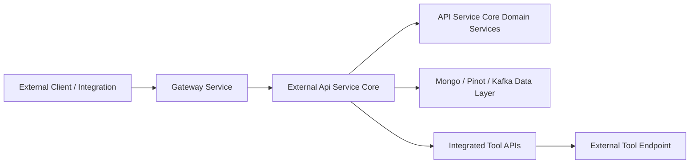
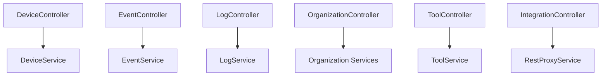
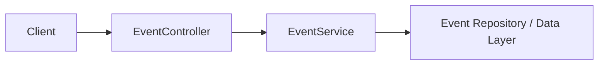
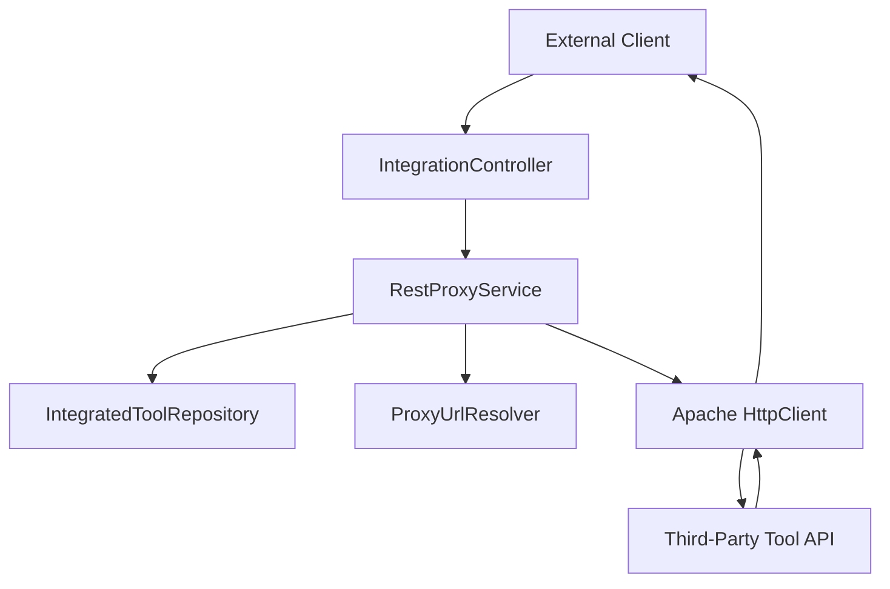

# External Api Service Core

## Overview

The **External Api Service Core** module exposes a secure, API-key–based REST interface for third-party systems and external integrations to interact with the OpenFrame platform.

It provides:

- Device management APIs
- Event ingestion and querying APIs
- Log access APIs
- Organization management APIs
- Integrated tool discovery APIs
- A generic tool proxy for external system integration
- OpenAPI (Swagger) documentation and API grouping

This module is designed as a public-facing integration layer that sits behind the Gateway and enforces API key–based authentication, rate limiting, and tenant-aware access control.

---

## Architectural Positioning

Within the overall OpenFrame platform, the External Api Service Core acts as a controlled integration boundary between external consumers and internal domain services.



### Key Characteristics

- **Authentication**: API key via `X-API-Key` header.
- **Rate Limiting**: Applied per API key.
- **Multi-Tenant Awareness**: Headers such as `X-User-Id` and `X-API-Key-Id` propagated internally.
- **Cursor-Based Pagination**: Consistent across listing endpoints.
- **Filter & Sort Model**: Structured filtering, search, and sort inputs.

---

## OpenAPI and Documentation Configuration

### OpenApiConfig

The `OpenApiConfig` component defines:

- API metadata (title, version, contact, license)
- API key security scheme (`ApiKeyAuth`)
- Default server base path (`/external-api`)
- Grouped API documentation for:
  - `/tools/**`
  - `/api/v1/**`

### Authentication Model

All endpoints require an API key in the header:

```text
X-API-Key: ak_keyId.sk_secretKey
```

Security scheme configuration:

- Type: `APIKEY`
- Location: `HEADER`
- Header Name: `X-API-Key`

---

# REST Controllers

The module is primarily composed of REST controllers organized by domain.



---

## DeviceController

**Base Path:** `/api/v1/devices`

### Responsibilities

- Query devices with:
  - Status filtering
  - Type filtering
  - OS filtering
  - Organization filtering
  - Tag filtering
  - Search
  - Cursor pagination
  - Sort field & direction
- Retrieve single device by `machineId`
- Retrieve device filter options with counts
- Update device status (e.g., `DELETED`, `ARCHIVED`)

### Key Patterns

- Uses `DeviceService` for queries and updates
- Uses `DeviceFilterService` for filter metadata
- Uses `TagService` to optionally enrich results
- Maps domain models (`Machine`, `Tag`) to external DTOs

### Optional Tag Enrichment

If `includeTags=true`, tag data is fetched per machine and merged into the response. Failures gracefully fall back to non-enriched responses.

---

## EventController

**Base Path:** `/api/v1/events`

### Responsibilities

- Query events with:
  - User filtering
  - Event type filtering
  - Date range filtering
  - Search
  - Cursor pagination
  - Sorting
- Retrieve event by ID
- Create new event
- Update existing event
- Retrieve available event filters

### Service Interaction



Events are persisted and retrieved via internal API Service Core domain services and data repositories.

---

## LogController

**Base Path:** `/api/v1/logs`

### Responsibilities

- Query logs with:
  - Date range filtering
  - Tool type filtering
  - Event type filtering
  - Severity filtering
  - Organization filtering
  - Device ID filtering
  - Search
  - Cursor pagination
  - Sorting
- Retrieve available log filters
- Retrieve detailed log entry via composite identifiers:
  - `ingestDay`
  - `toolType`
  - `eventType`
  - `timestamp`
  - `toolEventId`

This controller integrates closely with log indexing and analytical storage (e.g., Pinot or similar systems in the data layer).

---

## OrganizationController

**Base Path:** `/api/v1/organizations`

### Responsibilities

- List organizations with filtering and search
- Retrieve by database ID
- Retrieve by business identifier (`organizationId`)
- Create organization
- Update organization
- Delete organization (with constraint: cannot delete if machines exist)

### Service Model

- `OrganizationQueryService` → read operations
- `OrganizationCommandService` → write operations
- `OrganizationService` → direct entity retrieval
- `OrganizationMapper` → DTO transformations

This separation enforces a clean CQRS-style boundary between read and write operations.

---

## ToolController

**Base Path:** `/api/v1/tools`

### Responsibilities

- List integrated tools
  - Filter by enabled status
  - Filter by type
  - Filter by category
  - Search
  - Sorting
- Retrieve tool filter options

The controller delegates to `ToolService` and returns mapped DTO responses.

---

# IntegrationController and RestProxyService

## IntegrationController

**Base Path:** `/tools/{toolId}/**`

This controller acts as a dynamic HTTP proxy to integrated tools.

It supports:

- GET
- POST
- PUT
- PATCH
- DELETE
- OPTIONS

All requests are forwarded to `RestProxyService`.

---

## RestProxyService

The `RestProxyService` is responsible for:

1. Validating tool existence
2. Ensuring the tool is enabled
3. Resolving target URL via `ProxyUrlResolver`
4. Injecting credentials based on `APIKeyType`
5. Forwarding request using Apache HttpClient
6. Returning proxied response transparently

### Proxy Flow



### Credential Injection Modes

Based on `APIKeyType`:

- `HEADER` → Custom header injection
- `BEARER_TOKEN` → `Authorization: Bearer <token>`
- `NONE` → No credential injection

Timeout configuration:

- Connection request timeout: 10 seconds
- Response timeout: 60 seconds

---

# Cross-Cutting Concerns

## Authentication and Headers

Requests are authenticated using:

- `X-API-Key`
- Internally propagated headers:
  - `X-User-Id`
  - `X-API-Key-Id`

Authentication and rate limiting are typically enforced upstream (e.g., Gateway layer), but the module expects validated context headers.

---

## Pagination Model

All listing endpoints use cursor-based pagination:

```text
limit=20
cursor=opaqueCursorToken
```

Internally converted to domain-level `CursorPaginationCriteria`.

---

## Sorting Model

Endpoints accept:

```text
sortField=hostname
sortDirection=ASC
```

Mapped to domain-level `SortInput`.

---

# Error Handling Strategy

The module uses:

- Standard HTTP status codes
- Structured `ErrorResponse` DTO
- Domain-specific exceptions (e.g., `DeviceNotFoundException`, `OrganizationNotFoundException`, `LogNotFoundException`)
- Graceful degradation where possible (e.g., optional tag enrichment)

Common response codes:

- `200` – Success
- `201` – Created
- `204` – No Content
- `400` – Bad Request
- `401` – Unauthorized
- `404` – Not Found
- `409` – Conflict
- `429` – Rate Limit Exceeded
- `500` – Internal Server Error

---

# Summary

The **External Api Service Core** module provides a structured, secure, and extensible REST interface for external systems to interact with OpenFrame.

It:

- Wraps internal domain services
- Enforces API key–based security
- Provides consistent filtering, pagination, and sorting
- Enables proxy-based integration with third-party tools
- Exposes comprehensive OpenAPI documentation

This module forms the primary public integration surface of the OpenFrame backend ecosystem.