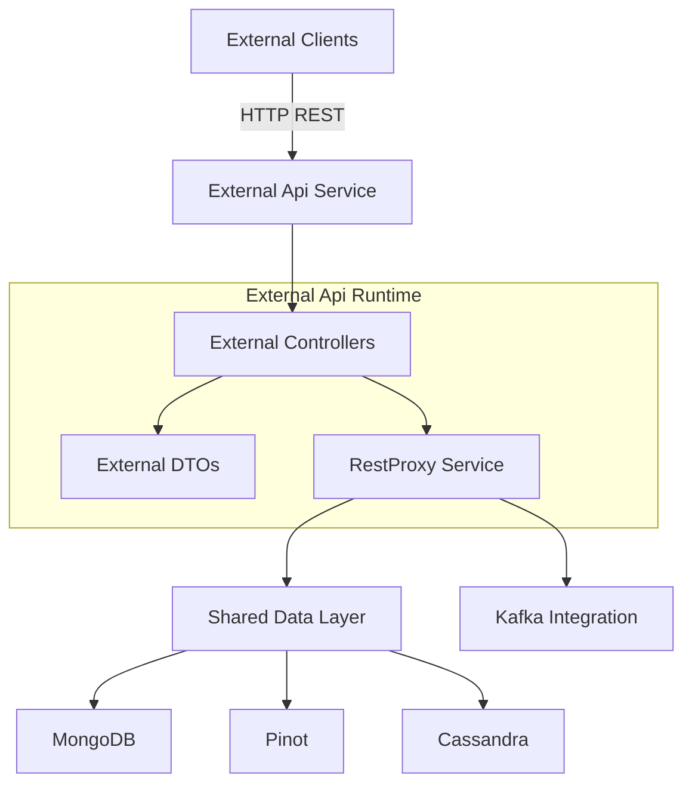
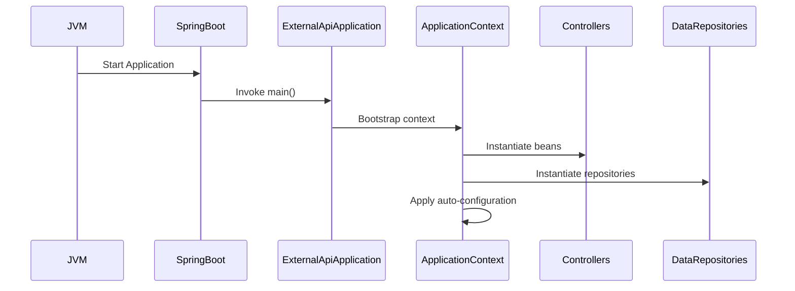
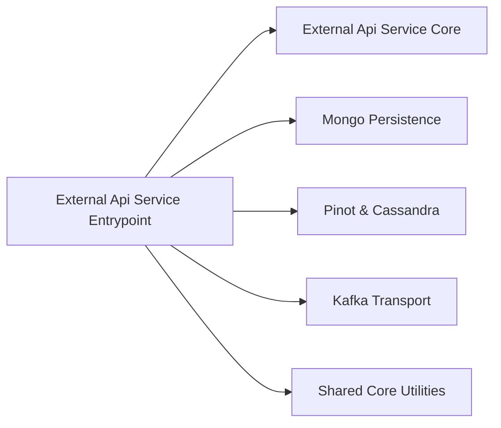

# External Api Service Entrypoint

## Overview

The **External Api Service Entrypoint** module is the bootstrap layer for the OpenFrame External API service. It is responsible for initializing the Spring Boot application context, enabling component scanning across required packages, and wiring together the External API core, shared data modules, and integration infrastructure.

This module does not contain business logic itself. Instead, it acts as the runtime entrypoint that assembles the following layers into a cohesive microservice:

- External REST controllers and DTOs (from External Api Service Core)
- Shared data access (Mongo, Pinot, Cassandra)
- Kafka integration
- Core utilities and shared domain components

It is the executable boundary of the External API microservice.

---

## Core Component

### ExternalApiApplication

```java
@SpringBootApplication
@ComponentScan(basePackages = {
        "com.openframe.external",
        "com.openframe.data",
        "com.openframe.core",
        "com.openframe.api",
        "com.openframe.kafka"
})
public class ExternalApiApplication {
    public static void main(String[] args) {
        SpringApplication.run(ExternalApiApplication.class, args);
    }
}
```

### Responsibilities

1. Bootstraps the Spring Boot application.
2. Enables auto-configuration.
3. Defines the component scan boundaries.
4. Establishes the External API service as a standalone microservice.

---

## Architectural Role in the Platform

The External Api Service Entrypoint launches a dedicated **External REST API** that exposes:

- Devices
- Events
- Logs
- Organizations
- Tools
- Integration endpoints

Unlike the internal API service, this service is optimized for:

- Third-party integrations
- External clients
- Tooling and automation systems
- Public-facing or partner APIs

It relies on shared domain and persistence modules rather than implementing its own data layer.

---

## High-Level Architecture



The entrypoint initializes this entire graph by activating Spring auto-configuration and scanning all required packages.

---

## Component Scan Strategy

The `@ComponentScan` annotation is critical for understanding how this service is assembled.

### Scanned Base Packages

```text
com.openframe.external
com.openframe.data
com.openframe.core
com.openframe.api
com.openframe.kafka
```

### What This Enables

| Package | Purpose |
|----------|----------|
| `com.openframe.external` | External controllers, DTOs, OpenAPI configuration |
| `com.openframe.data` | Mongo, Pinot, Cassandra repositories and models |
| `com.openframe.core` | Shared utilities and base DTOs |
| `com.openframe.api` | Shared API contracts and processors |
| `com.openframe.kafka` | Kafka configuration and producers |

This means the External Api Service Entrypoint is not isolated — it is a composition layer over reusable platform modules.

---

## Service Initialization Flow



### Key Steps

1. JVM launches the main class.
2. Spring Boot initializes the application context.
3. Component scanning registers beans.
4. Data repositories and controllers are wired.
5. The embedded web server starts.

---

## Relationship to External Api Service Core

The External Api Service Entrypoint loads all REST controllers and DTOs defined in:

- `com.openframe.external.controller`
- `com.openframe.external.dto`
- `com.openframe.external.service`

These are implemented in the **External Api Service Core** module.

The entrypoint does not:

- Define REST endpoints
- Implement filtering logic
- Handle business validation

It strictly boots and wires the system.

---

## Dependency Graph



This shows that the entrypoint is thin, but depends on multiple platform layers.

---

## How It Differs from Internal Api Service Entrypoint

The External Api Service Entrypoint:

- Exposes external-facing REST APIs
- Uses OpenAPI documentation
- Serves integration and automation use cases

The internal API service typically:

- Supports administrative or internal UI operations
- May include GraphQL endpoints
- Contains internal domain orchestration logic

This separation improves:

- Security boundaries
- API stability guarantees
- Versioning control
- Operational isolation

---

## Deployment Characteristics

Because this module is a standalone Spring Boot application:

- It can be containerized independently.
- It scales independently.
- It can be deployed behind an API Gateway.
- It can have isolated rate limits and authentication rules.

Typical runtime dependencies include:

- MongoDB
- Pinot
- Cassandra
- Kafka
- Redis (if enabled via shared modules)

---

## Security Considerations

Although no explicit security configuration is defined in this entrypoint, security is applied through:

- Shared security configurations
- JWT validation
- API key mechanisms
- Gateway-level enforcement

The entrypoint enables these via component scanning rather than declaring them locally.

---

## Summary

The **External Api Service Entrypoint** module is the runtime bootstrapper of the OpenFrame External API microservice.

It:

- Starts the Spring Boot runtime
- Wires controllers and services
- Integrates shared data and messaging modules
- Establishes the External API as a deployable boundary

It is intentionally minimal by design, serving as a clean executable shell around reusable platform components.

In a microservice architecture, this module represents the service boundary — the point where infrastructure, business logic, and external communication converge into a running system.