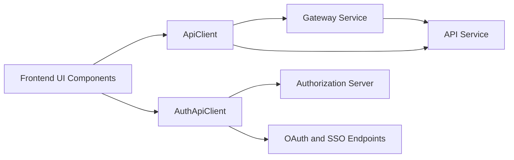
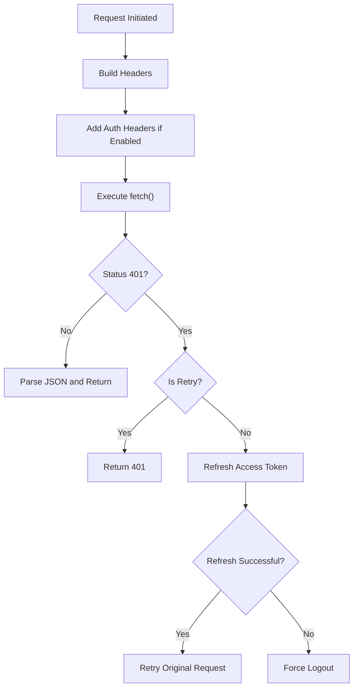
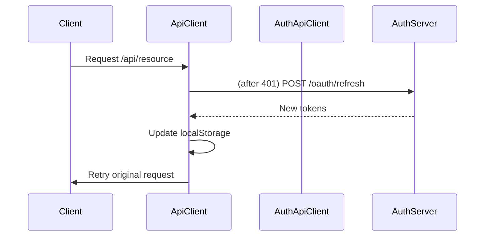
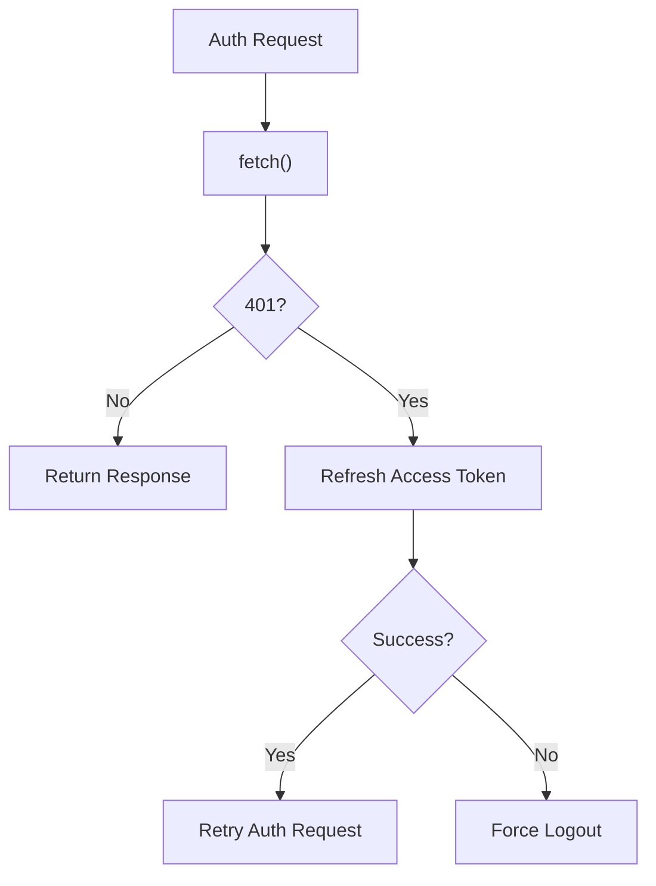

# Frontend Tenant Api Clients

The **Frontend Tenant Api Clients** module provides the unified HTTP communication layer for the OpenFrame multi-tenant frontend application. It encapsulates:

- Authenticated API communication with tenant-scoped backend services
- OAuth and SSO flows against the Authorization Server
- Token refresh and session lifecycle management
- Support for both cookie-based and header-based authentication (Dev Ticket mode)

This module acts as the boundary between the frontend UI and the backend platform services such as API Service, Authorization Server, Gateway, and External APIs.

---

## 1. Module Overview

### Core Components

- `ApiClient` – General-purpose authenticated API client for tenant APIs.
- `AuthApiClient` – Specialized client for authentication, OAuth, SSO, and registration flows.

Together, they standardize:

- Request construction
- Environment-based URL resolution
- Automatic token handling
- Refresh and retry logic
- Unified response format

---

## 2. High-Level Architecture

The Frontend Tenant Api Clients module sits between UI components and backend services.



### Responsibilities Split

| Client | Responsibility |
|--------|----------------|
| ApiClient | Business API calls (`/api/*`, `/external/*`) |
| AuthApiClient | OAuth, login, registration, password reset, tenant discovery |

---

## 3. ApiClient

`ApiClient` is the default HTTP client used for authenticated tenant API calls.

### 3.1 Core Responsibilities

1. URL resolution based on runtime configuration
2. Automatic auth header injection (Dev Ticket mode)
3. Cookie-based authentication support (`credentials: include`)
4. Automatic token refresh on `401`
5. Request queuing during refresh
6. Unified error and response normalization

---

### 3.2 Request Lifecycle



---

### 3.3 Authentication Modes

`ApiClient` supports two authentication strategies:

#### 1. Cookie-Based Authentication (Default)

- Uses `credentials: include`
- Backend validates session cookies
- No Authorization header required

#### 2. Header-Based Authentication (Dev Ticket Mode)

Enabled via:

```typescript
runtimeEnv.enableDevTicketObserver()
```

Behavior:

- Reads `of_access_token` from `localStorage`
- Injects:

```text
Authorization: Bearer <access_token>
```

- Refreshes tokens using refresh token storage

This mode is useful for local development or environments without secure cookie domains.

---

### 3.4 Token Refresh Strategy

Key properties:

- `isRefreshing` – prevents parallel refresh calls
- `refreshPromise` – shared promise for concurrent requests
- `requestQueue` – stores requests during refresh

#### Refresh Flow



If refresh fails:

- All queued requests are resolved
- `forceLogout()` is executed
- User is redirected to login

---

### 3.5 Public API

Convenience methods:

```typescript
apiClient.get(path)
apiClient.post(path, body)
apiClient.put(path, body)
apiClient.patch(path, body)
apiClient.delete(path)
apiClient.external(url, options)
apiClient.me()
```

All methods return:

```typescript
interface ApiResponse<T> {
  data?: T
  error?: string
  status: number
  ok: boolean
}
```

This standardizes response handling across the frontend.

---

## 4. AuthApiClient

`AuthApiClient` is dedicated to authentication and identity-related operations.

It handles:

- OAuth login/logout
- Token refresh
- Tenant discovery
- Registration
- SSO flows
- Password reset
- Invitation acceptance

---

### 4.1 URL Resolution

Auth endpoints may target a shared SaaS domain:

```typescript
runtimeEnv.sharedHostUrl()
```

If defined:

- All auth requests are sent to the shared host

If not defined:

- Relative URLs are used

This enables:

- Multi-tenant SaaS shared auth
- Self-hosted tenant-specific auth

---

### 4.2 Refresh Handling

Unlike `ApiClient`, `AuthApiClient` handles refresh inline for auth routes.



It also supports:

- `Refresh-Token` header in Dev Ticket mode
- Access token extraction from response headers

---

### 4.3 Supported Functional Areas

#### 1. OAuth

- `loginUrl()`
- `logout()`
- `refresh()`
- `oauth()` generic wrapper

#### 2. Tenant & SaaS

- `discoverTenants(email)`
- `checkDomainAvailability(subdomain, organizationName)`
- `registerOrganization()`
- `registerOrganizationSSO()`

#### 3. Invitations

- `acceptInvitation()`
- `acceptInvitationSSO()`
- `getInviteProviders()`

#### 4. Password Reset

- `requestPasswordReset()`
- `confirmPasswordReset()`

Each returns:

```typescript
interface AuthApiResponse<T> {
  data?: T
  error?: string
  status: number
  ok: boolean
}
```

---

## 5. Multi-Tenant Considerations

The module is multi-tenant aware.

Tenant ID resolution is derived from:

- Auth store state
- User object (`organizationId` or `tenantId`)

During refresh:

```typescript
authApiClient.refresh(tenantId)
```

This ensures:

- Tenant-scoped tokens
- Correct issuer and client configuration
- Isolation between organizations

---

## 6. Error Handling Strategy

Both clients:

- Normalize network errors
- Extract JSON error payloads
- Avoid infinite refresh loops
- Avoid refresh during `/auth/*` routes

Special safeguards:

- Single refresh at a time
- Queued retry mechanism
- Forced logout on irrecoverable auth failure

---

## 7. Environment Integration

The module depends on runtime configuration utilities:

- `runtimeEnv.tenantHostUrl()`
- `runtimeEnv.sharedHostUrl()`
- `runtimeEnv.enableDevTicketObserver()`

These allow the same frontend bundle to operate in:

- Local development
- SaaS shared mode
- Dedicated tenant mode
- Reverse proxy deployments

---

## 8. Design Principles

### 1. Centralization
All network calls flow through a single abstraction layer.

### 2. Resilience
Automatic refresh and retry minimize user disruption.

### 3. Multi-Tenant Safety
Tenant context is consistently propagated.

### 4. Backend-Agnostic
The client does not embed backend logic — it simply standardizes communication.

---

## 9. Summary

The **Frontend Tenant Api Clients** module is the authentication-aware communication backbone of the OpenFrame frontend.

It provides:

- Secure tenant-scoped API access
- OAuth and SSO integration
- Automatic token lifecycle management
- Unified error handling
- Environment-aware URL routing

By encapsulating all authentication and request logic, it keeps UI components clean, consistent, and backend-agnostic while ensuring secure multi-tenant behavior across the platform.
