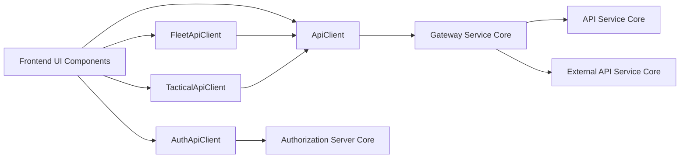
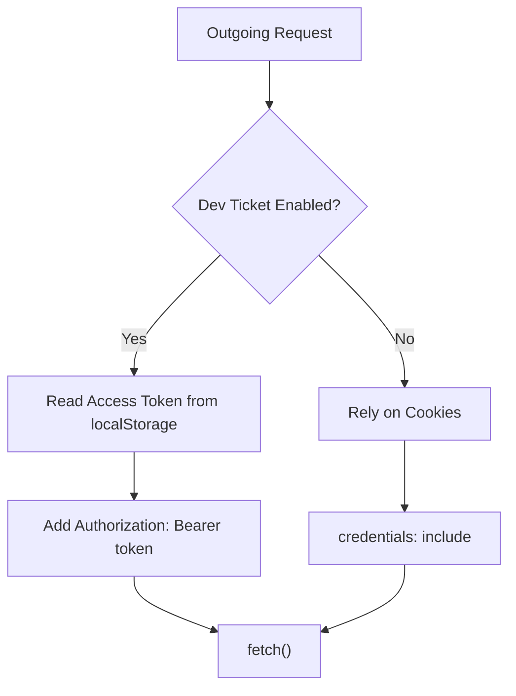
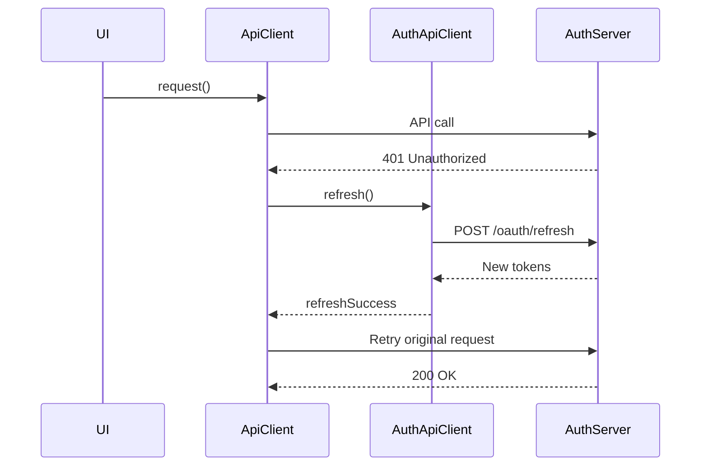
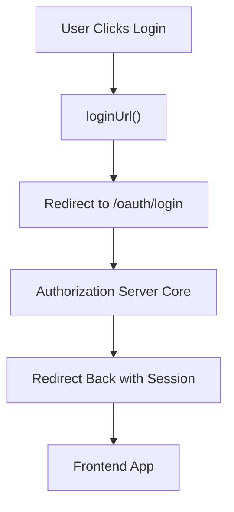
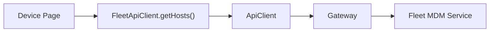
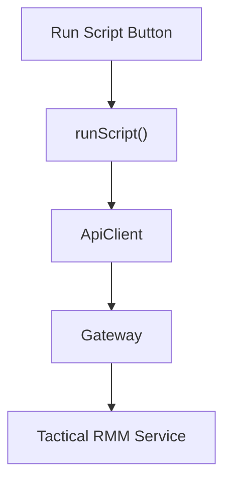
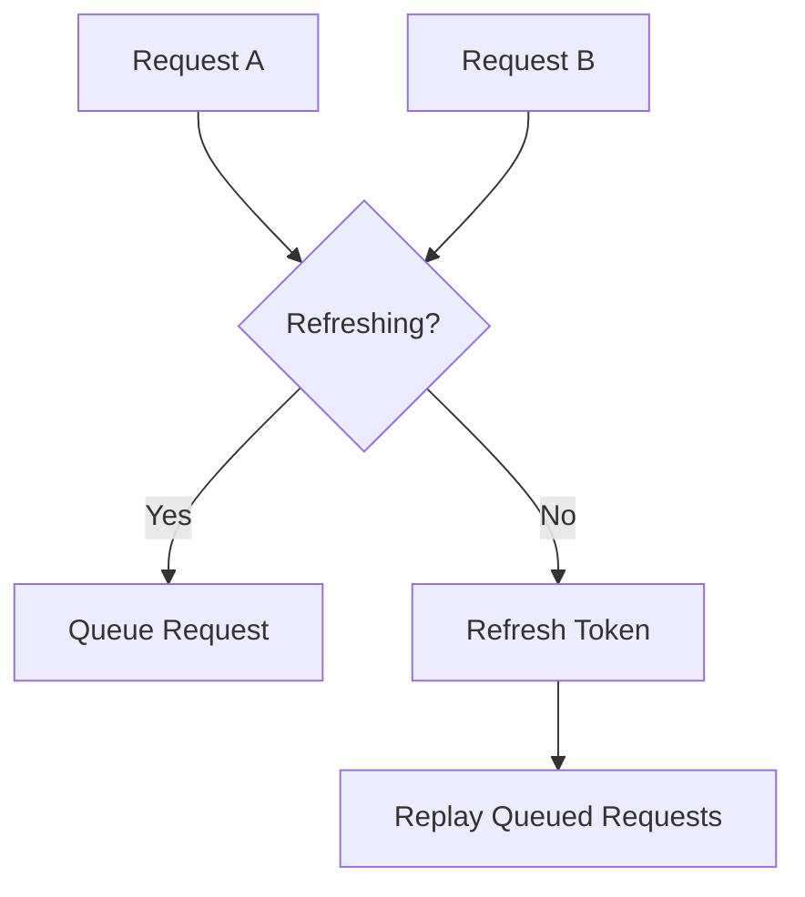

# Frontend App Core Clients

The **Frontend App Core Clients** module provides the typed, centralized HTTP client layer used by the OpenFrame frontend application. It is responsible for:

- Standardizing API communication across services
- Handling authentication (cookie-based + token-based)
- Managing automatic access token refresh flows
- Providing tool-specific API adapters (Fleet MDM, Tactical RMM)
- Encapsulating OAuth and SaaS onboarding flows

This module acts as the frontend gateway into the backend ecosystem, integrating with:

- [Gateway Service Core](../gateway_service_core/gateway_service_core.md)
- [Authorization Server Core](../authorization_server_core/authorization_server_core.md)
- [API Service Core](../api_service_core/api_service_core.md)
- [External API Service Core](../external_api_service_core/external_api_service_core.md)

It ensures the frontend remains clean, consistent, and resilient to authentication failures.

---

## Architecture Overview



### Design Principles

1. **Single source of truth for HTTP behavior** – `ApiClient` centralizes headers, credentials, and refresh logic.
2. **Tool isolation** – Fleet and Tactical integrations are encapsulated in dedicated clients.
3. **Automatic resilience** – 401 handling and refresh logic are built-in.
4. **Environment awareness** – Uses runtime configuration for tenant and shared-host modes.

---

# Core Components

## 1. ApiClient

**Component:**  
`openframe-oss-tenant.openframe.services.openframe-frontend.src.lib.api-client.ApiClient`

The `ApiClient` is the foundational HTTP abstraction for all authenticated API communication.

### Responsibilities

- Builds full request URLs using tenant-aware runtime configuration
- Automatically attaches authentication headers
- Supports both:
  - Cookie-based authentication
  - Header-based bearer token authentication (Dev Ticket mode)
- Handles automatic access token refresh
- Queues concurrent requests during refresh
- Forces logout when refresh fails

---

### Authentication Strategy

The client dynamically supports two authentication modes:



### 401 Handling and Refresh Flow

The client performs a single automatic refresh attempt on `401 Unauthorized`.



If refresh fails:

- All queued requests are flushed
- Stored tokens are cleared
- Unified logout is triggered

---

### Key Features

- `request()` – Core method with retry logic
- HTTP helpers: `get`, `post`, `put`, `patch`, `delete`
- `external()` – Allows full external URL usage
- `me()` – Convenience wrapper for `/api/me`

This client is used by all tool-specific clients.

---

## 2. AuthApiClient

**Component:**  
`openframe-oss-tenant.openframe.services.openframe-frontend.src.lib.auth-api-client.AuthApiClient`

The `AuthApiClient` is a specialized client dedicated to authentication, onboarding, SaaS flows, and OAuth interactions.

Unlike `ApiClient`, it communicates primarily with the **Authorization Server Core**.

### Responsibilities

- OAuth login/logout
- Token refresh
- Dev ticket exchange
- Tenant discovery
- SaaS registration
- Invitation acceptance
- Password reset flows
- SSO provider routing (Google, Microsoft)

---

### OAuth Flow Integration



### Refresh Logic Differences from ApiClient

- Handles `Refresh-Token` header injection in Dev mode
- Performs retry internally via `handleUnauthorized()`
- Uses `credentials: include` for cookie-based sessions
- Supports shared-host SaaS mode via `runtimeEnv.sharedHostUrl()`

---

### Public vs Authenticated Requests

- `request()` → Authenticated
- `requestRefresh()` → Refresh-specific logic
- `requestPublic()` → No credentials, no auth headers

This separation prevents leaking authentication headers into public endpoints.

---

## 3. FleetApiClient

**Component:**  
`openframe-oss-tenant.openframe.services.openframe-frontend.src.lib.fleet-api-client.FleetApiClient`

The `FleetApiClient` provides an adapter layer over Fleet MDM APIs exposed through the Gateway.

### Base Path

```text
/tools/fleetmdm-server
```

The base URL is dynamically built from the tenant host:

- Uses `runtimeEnv.tenantHostUrl()`
- Falls back to relative path when absent
- Delegates all HTTP behavior to `ApiClient`

---

### Fleet Domains Covered

- Policies
- Queries
- Hosts
- Teams
- Labels
- Packs

Example interaction:



### Design Characteristics

- Strongly typed responses
- Query parameter handling via `URLSearchParams`
- Fully inherits refresh and retry logic from `ApiClient`

This prevents Fleet-specific code from polluting global HTTP logic.

---

## 4. TacticalApiClient

**Component:**  
`openframe-oss-tenant.openframe.services.openframe-frontend.src.lib.tactical-api-client.TacticalApiClient`

The `TacticalApiClient` integrates Tactical RMM functionality into the frontend.

### Base Path

```text
/tools/tactical-rmm
```

Like `FleetApiClient`, it:

- Builds tool-specific URLs
- Delegates HTTP execution to `ApiClient`
- Inherits refresh + logout behavior

---

### Tactical Domains Covered

- Agents
- Scripts
- Bulk actions
- Scheduled tasks
- Agent telemetry (logs, checks, services, processes)
- System information

Example flow:



---

# Cross-Module Relationships

The **Frontend App Core Clients** module integrates deeply with backend services:

| Frontend Client | Backend Module |
|------------------|---------------|
| ApiClient | Gateway Service Core |
| AuthApiClient | Authorization Server Core |
| FleetApiClient | External API Service Core + Gateway |
| TacticalApiClient | External API Service Core + Gateway |

The Gateway Service Core handles:

- JWT validation
- CORS
- API key filtering
- Routing to internal services

The Authorization Server Core handles:

- OAuth flows
- Token issuance
- Refresh token rotation
- SSO provider integrations

---

# Resilience & Concurrency Model

The module prevents token refresh storms using:

- `isRefreshing` flag
- Shared `refreshPromise`
- Request queue replay after refresh



This guarantees:

- Only one refresh call at a time
- No duplicated refresh requests
- Predictable retry behavior

---

# Security Considerations

- Tokens are never blindly trusted
- 401 on auth pages does not trigger infinite loops
- Local storage tokens are only used in Dev Ticket mode
- Refresh token is sent via header in Dev mode
- Cookie-based auth uses `credentials: include`

---

# Summary

The **Frontend App Core Clients** module is the frontend’s communication backbone. It:

- Abstracts all HTTP behavior
- Implements safe token refresh
- Separates authentication logic from domain logic
- Provides tool-specific API adapters
- Integrates cleanly with Gateway and Authorization services

By centralizing networking and authentication concerns, it keeps the UI layer declarative, predictable, and secure.
