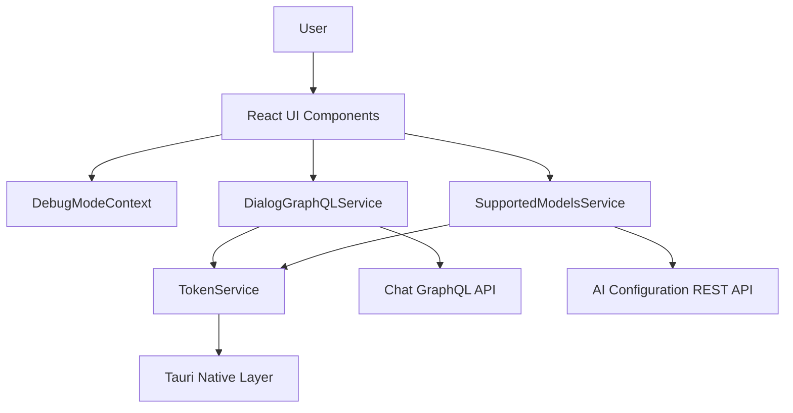
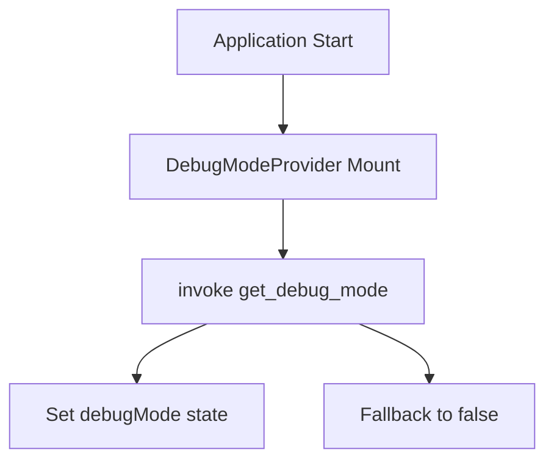
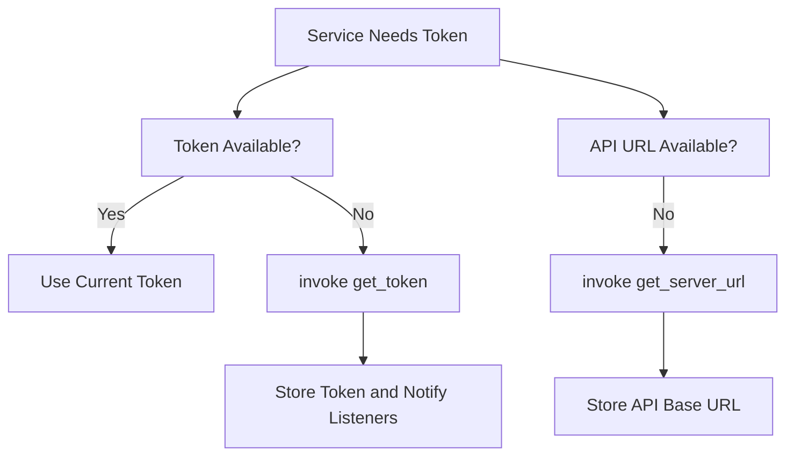
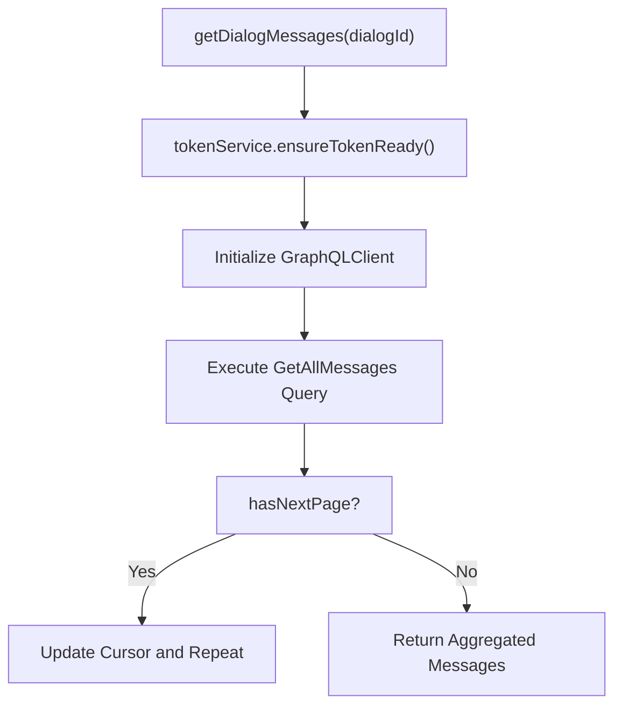
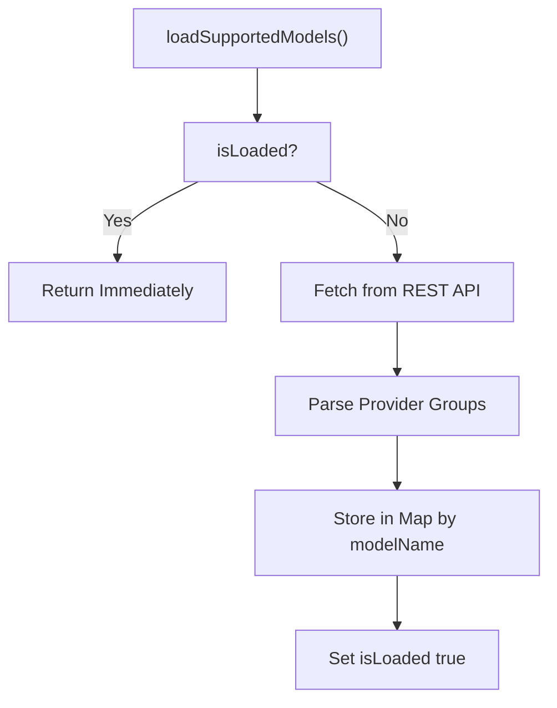
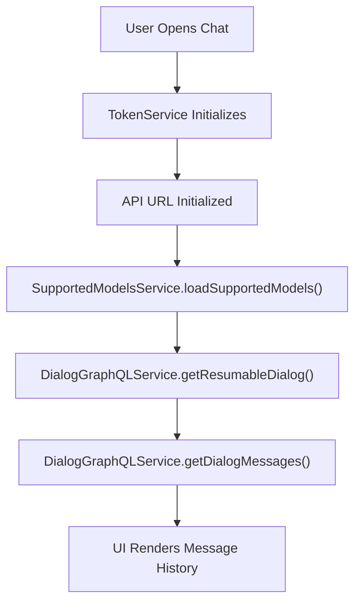

# Frontend Chat Client

The **Frontend Chat Client** module is the desktop chat interface for OpenFrame, built with React and Tauri. It enables users to interact with AI-powered dialog workflows exposed by the backend Chat GraphQL API.

This module is responsible for:

- Managing authentication tokens and API base URLs provided by the native (Rust) layer
- Fetching and paginating dialog messages via GraphQL
- Loading supported AI models from the backend
- Providing debug mode state across the React component tree

The Frontend Chat Client acts as a thin, secure presentation and orchestration layer on top of the OpenFrame backend services.

---

## High-Level Architecture

The module sits at the edge of the system and communicates with backend services through authenticated HTTP and GraphQL calls.



### Key Responsibilities

| Component | Responsibility |
|------------|----------------|
| DebugModeContext | Global debug state management |
| TokenService | Authentication token and API base URL management |
| DialogGraphQLService | GraphQL dialog and message retrieval |
| SupportedModelsService | Discovery of supported AI models |

---

# Core Components

## DebugModeContext

**Component:** `DebugModeContextType`  
**File:** `contexts/DebugModeContext.tsx`

The Debug Mode Context provides a global React context for enabling or disabling debug behavior in the UI.

### Responsibilities

- Fetch initial debug state from the Tauri layer
- Provide `debugMode` boolean flag
- Provide `setDebugMode` setter for UI controls
- Enforce usage within `DebugModeProvider`

### Initialization Flow



The debug state is fetched using a Tauri command (`get_debug_mode`). If the command fails, the system safely defaults to `false`.

### Design Notes

- Uses React `createContext` and `useContext`
- Throws a runtime error if accessed outside provider
- Debug state is local to the client and not persisted server-side

---

## TokenService

**Component:** `TokenService`  
**File:** `services/tokenService.ts`

The Token Service is the security backbone of the Frontend Chat Client. It manages:

- Authentication token lifecycle
- API base URL configuration
- Communication with the Tauri (Rust) layer
- Listener subscription model for token and URL changes

### Responsibilities

- Listen for `token-update` events from Rust
- Request token via `get_token` command if not available
- Initialize API base URL via `get_server_url`
- Provide subscription hooks for token and URL updates
- Ensure token and API URL are available before requests

### Authentication Flow



### Event-Driven Model

The service subscribes to Tauri events:

- Event: `token-update`
- Command: `get_token`
- Command: `get_server_url`

This allows the native layer to control authentication while keeping the frontend reactive.

### Security Considerations

- Tokens are masked in logs
- No persistent browser storage is used
- Token lifecycle is managed externally (authorization server)

---

## DialogGraphQLService

**Component:** `DialogGraphQLService`  
**File:** `services/dialogGraphQLService.ts`

This service provides GraphQL-based access to dialog and message history.

### Responsibilities

- Initialize authenticated `GraphQLClient`
- Fetch resumable dialog metadata
- Fetch paginated dialog messages
- Aggregate all pages into a single message list
- Automatically attach Bearer token headers

### GraphQL Endpoint

The endpoint is dynamically built:

```text
{apiBaseUrl}/chat/graphql
```

### Message Retrieval Flow



### Pagination Strategy

- Uses cursor-based pagination
- Continues fetching until `hasNextPage` is false
- Merges all edges into a single array
- Returns final `pageInfo` snapshot

### Supported Message Types

The service supports multiple message data variants including:

- Text messages
- Tool execution requests
- Tool execution results
- Approval requests and results
- Error messages

This polymorphism allows AI-driven tool invocation workflows inside chat conversations.

---

## SupportedModelsService

**Component:** `SupportedModelsService`  
**File:** `services/supportedModelsService.ts`

This service retrieves and caches supported AI models from the backend.

### Responsibilities

- Fetch supported models from REST endpoint
- Cache models in memory
- Provide lookup utilities
- Prevent duplicate concurrent loads

### REST Endpoint

```text
{apiBaseUrl}/chat/api/v1/ai-configuration/supported-models
```

### Load Lifecycle



### Internal Caching Model

- Models are stored in `Map<string, SupportedModel>`
- Keyed by `modelName`
- Exposes:
  - `getModelDisplayName()`
  - `getModel()`
  - `getAllModels()`
  - `isModelSupported()`
  - `reset()`

This design minimizes repeated backend calls and ensures model metadata is quickly accessible.

---

# Runtime Interaction Flow

Below is the full runtime interaction when a user opens the chat and loads a dialog:



---

# Error Handling Strategy

The module follows a defensive design:

- Missing token throws explicit authentication error
- Missing API base URL throws configuration error
- GraphQL failures return `null` instead of crashing UI
- Model fetch failures log warnings but do not block UI
- Debug mode defaults safely to `false`

This ensures graceful degradation when backend services are unavailable.

---

# Architectural Characteristics

## 1. Thin Client Philosophy

The Frontend Chat Client contains:

- No business logic
- No persistence layer
- No security decisions

All domain logic resides in backend services.

## 2. Event-Driven Security

Authentication is controlled by the native Tauri layer and authorization server. The frontend reacts to token updates rather than managing credentials itself.

## 3. Stateless Networking Layer

Services:

- Do not persist tokens
- Do not cache dialog history permanently
- Rebuild GraphQL client dynamically

## 4. In-Memory Model Caching

Supported models are cached only for runtime session efficiency.

---

# Summary

The **Frontend Chat Client** module provides a secure, reactive, and minimal UI integration layer for OpenFrame's AI chat functionality.

It orchestrates:

- Authentication via TokenService
- Dialog and message retrieval via DialogGraphQLService
- AI model discovery via SupportedModelsService
- Global debug state via DebugModeContext

By delegating domain logic to backend services and focusing strictly on UI orchestration and secure communication, the module maintains clean separation of concerns and strong architectural boundaries.