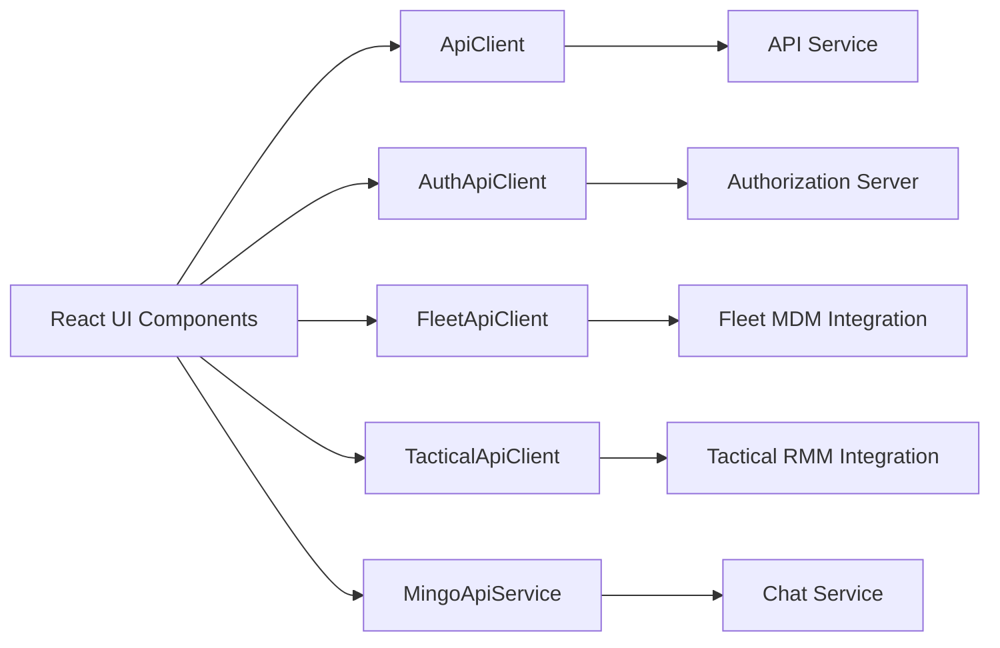
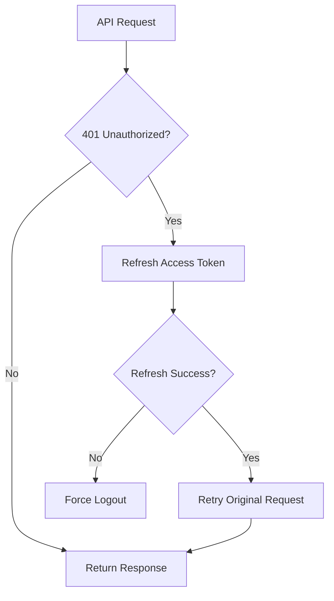
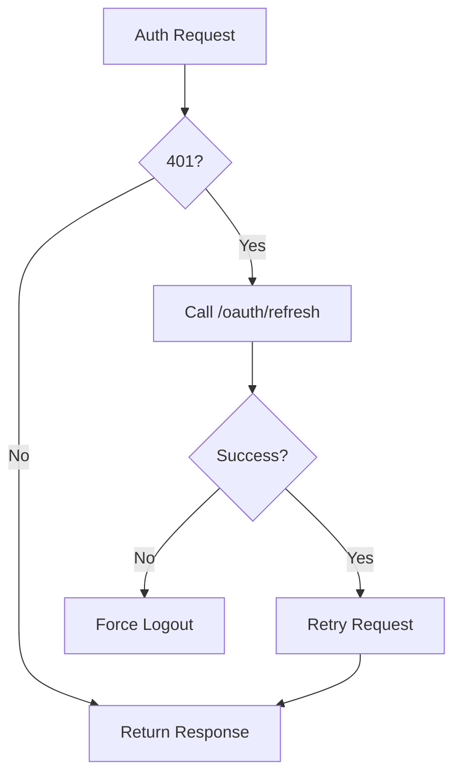
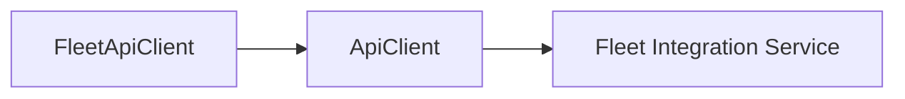
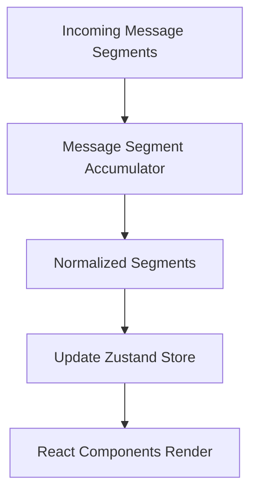
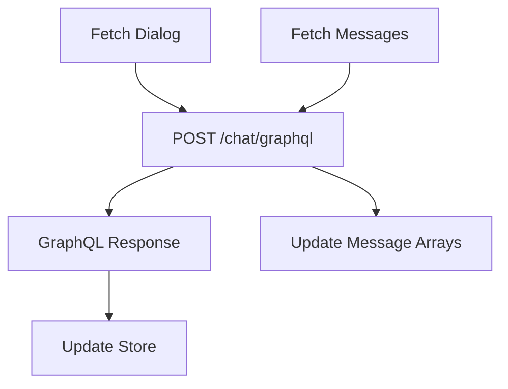
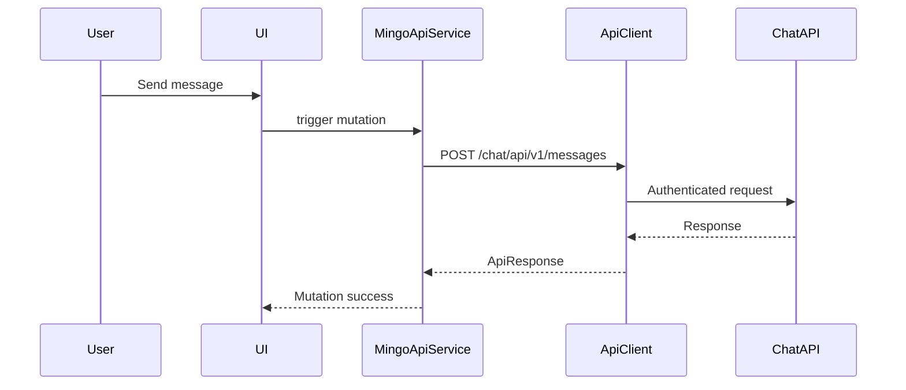

# Frontend Openframe App Core Clients And Mingo

## Overview

The **Frontend Openframe App Core Clients And Mingo** module provides the primary client-side integration layer for the OpenFrame web application. It is responsible for:

- Centralized HTTP communication with backend services
- Authentication-aware request handling and token refresh
- Tool-specific API integrations (Fleet MDM and Tactical RMM)
- Mingo AI chat orchestration and state management
- Ticket dialog data retrieval via GraphQL

This module acts as the **frontend gateway abstraction**, shielding UI components from authentication complexity, multi-tenant routing, and backend service topology.

---

## Architectural Context

The frontend communicates with multiple backend services, including:

- API Service (REST + GraphQL)
- Authorization Server (OAuth2 / OIDC)
- Gateway Service
- Tool integrations (Fleet MDM, Tactical RMM)
- Chat Service (Mingo)

The clients in this module unify all communication through structured, authenticated API wrappers.

### High-Level Interaction Flow



---

# Core HTTP Infrastructure

## ApiClient

**Component:** `ApiClient`

The `ApiClient` is the centralized HTTP abstraction used across the frontend.

### Responsibilities

- Builds full URLs using runtime environment configuration
- Automatically attaches authentication headers
- Supports cookie-based and header-based authentication
- Handles token refresh on `401 Unauthorized`
- Queues requests during refresh to avoid race conditions
- Normalizes response format via `ApiResponse<T>`

### Authentication Strategy

The client supports two modes:

1. Cookie-based authentication (default production behavior)
2. Header-based token injection (development mode via localStorage)

If a request returns `401`:

- It attempts a token refresh via `AuthApiClient`
- Retries the original request once
- If refresh fails, forces logout

### Token Refresh Flow



### Key Features

- Request queueing during refresh (`requestQueue`)
- Singleton instance export
- Convenience HTTP methods (`get`, `post`, `put`, `patch`, `delete`)
- External URL passthrough support

---

## AuthApiClient

**Component:** `AuthApiClient`

Dedicated client for authentication-specific endpoints.

### Responsibilities

- OAuth login and logout
- Token refresh handling
- Tenant discovery
- Organization registration
- SSO flows (Google and Microsoft)
- Password reset
- Invitation acceptance

### Special Characteristics

- Uses shared host URL when configured
- Performs refresh retry logic internally
- Supports SaaS shared mode
- Handles redirect-based SSO registration

### Refresh Handling

Unlike `ApiClient`, this client owns the refresh lifecycle and can retry failed authentication calls directly.



---

# Tool Integration Clients

These clients extend `ApiClient` and specialize request paths.

---

## FleetApiClient

**Component:** `FleetApiClient`

Provides a typed wrapper for Fleet MDM operations under the path:

```
/tools/fleetmdm-server
```

### Capabilities

- Policy management
- Query management
- Host inspection
- Team and label retrieval
- Pack management
- Live query execution

### Delegation Pattern



Fleet-specific URL building is handled internally, but authentication and retry logic are delegated to `ApiClient`.

---

## TacticalApiClient

**Component:** `TacticalApiClient`

Wrapper for Tactical RMM integration under:

```
/tools/tactical-rmm
```

### Capabilities

- Agent management
- Script execution
- Bulk actions
- Logs and checks
- Scheduled tasks
- System diagnostics

### Design Pattern

Identical extension strategy as `FleetApiClient`:

- Build tool-specific base URL
- Delegate network logic to `ApiClient`

This ensures uniform authentication and retry behavior across tools.

---

# Mingo AI Integration

The Mingo subsystem integrates AI-driven chat functionality into the frontend.

It consists of:

- `MingoApiService`
- `MingoMessagesStore`

---

## MingoApiService

**Component:** `MingoApiService`

Provides React Query mutation wrappers for chat-related actions.

### Supported Operations

- Create dialog
- Send message
- Approve request
- Reject request

All requests route through:

```
/chat/api/v1/*
```

### Design Characteristics

- Uses `useMutation` from React Query
- Throws errors for non-OK responses
- Integrates toast notifications for approval errors
- Keeps API logic outside UI components

---

## MingoMessagesStore

**Component:** `MingoMessagesStore`

Zustand-based state container for chat dialogs and streaming messages.

### State Structure

- `messagesByDialog` (Map)
- `streamingMessages`
- `segmentAccumulators`
- `typingStates`
- `unreadCounts`
- Pagination state
- Loading and error flags

### Streaming Message Processing

Incoming message segments are accumulated and normalized before rendering.



### Advanced Features

- Deduplicated message insertion
- Approval request state updates
- Real-time typing indicators
- Per-dialog unread counters
- Streaming AI response assembly
- Dialog-level accumulator lifecycle management

---

# Ticket Dialog GraphQL Store

## DialogDetailsStore

**Component:** `DialogDetailsStore`

Manages GraphQL-based ticket dialog data.

### Responsibilities

- Fetch dialog metadata
- Fetch paginated messages
- Poll for new messages
- Maintain separate client and admin streams
- Manage typing indicators
- Merge consecutive assistant messages

### GraphQL Flow



### Message Handling Strategy

- Separates `CLIENT_CHAT` and `ADMIN_AI_CHAT`
- Deduplicates by message ID
- Merges assistant text segments
- Tracks cursors for pagination and polling

---

# Design Patterns Used

## 1. Centralized HTTP Abstraction

All tool and feature clients rely on `ApiClient`, ensuring:

- Unified authentication logic
- Consistent error handling
- Shared retry strategy

## 2. Delegation Over Inheritance

Tool clients delegate to `ApiClient` instead of duplicating HTTP logic.

## 3. Optimistic and Reactive UI

- React Query for mutations
- Zustand for client-side state
- Real-time message accumulation

## 4. Token Refresh Concurrency Control

Refresh locking ensures:

- Only one refresh request executes at a time
- Queued requests retry safely
- No refresh storm under concurrent failures

---

# End-to-End Flow Example

## User Sends a Chat Message



---

# Summary

The **Frontend Openframe App Core Clients And Mingo** module is the backbone of frontend-to-backend communication in OpenFrame.

It provides:

- Robust authentication-aware API abstraction
- Tool-specific integration layers
- AI chat orchestration
- GraphQL ticket dialog management
- Real-time streaming message assembly

By centralizing request logic and isolating state management, this module ensures scalability, maintainability, and consistent multi-tenant behavior across the entire OpenFrame frontend ecosystem.
