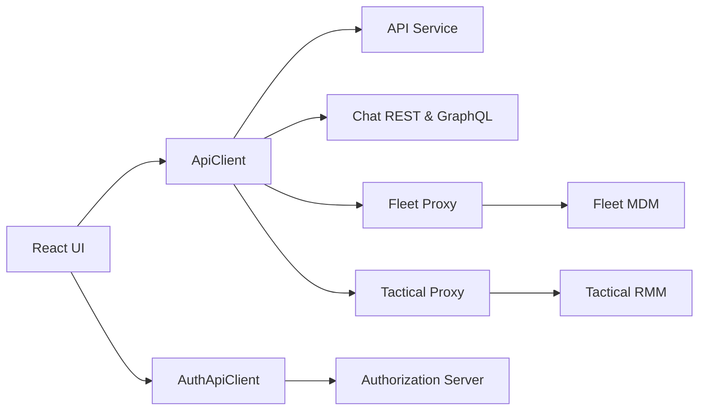
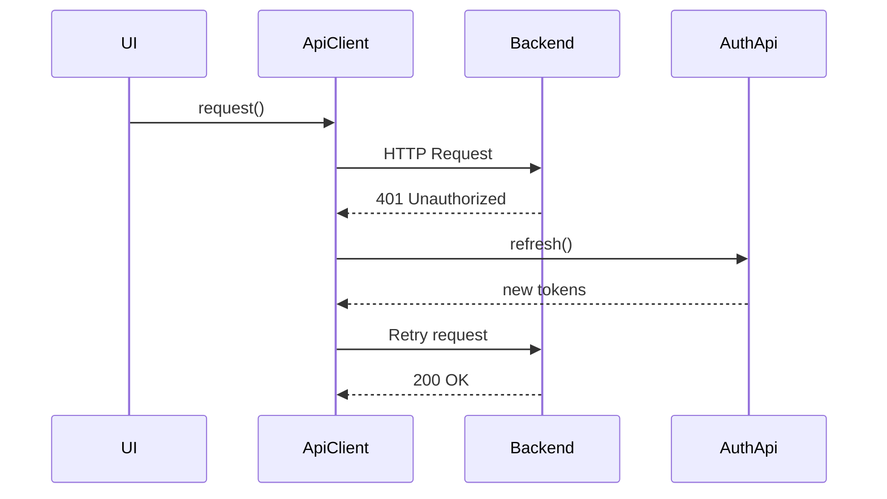
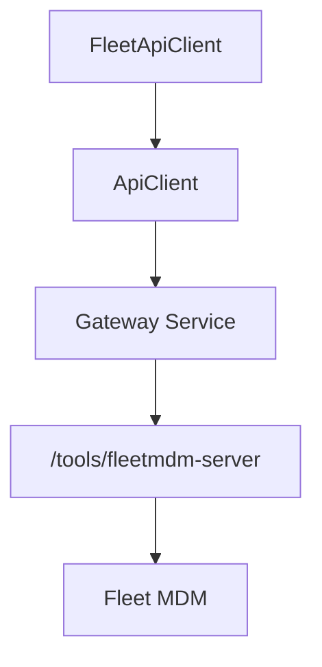
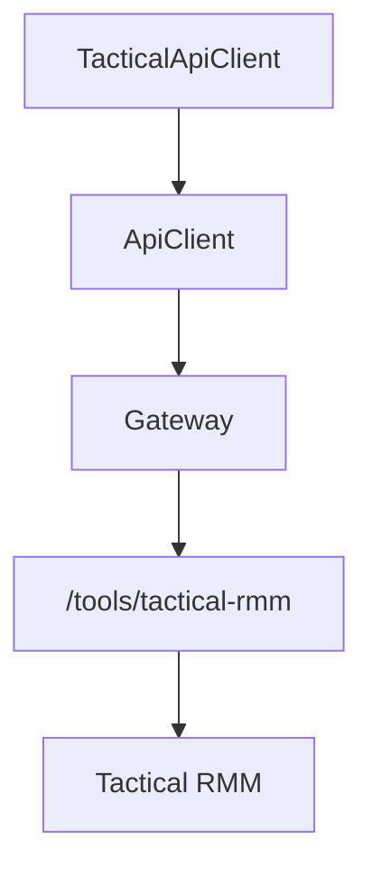
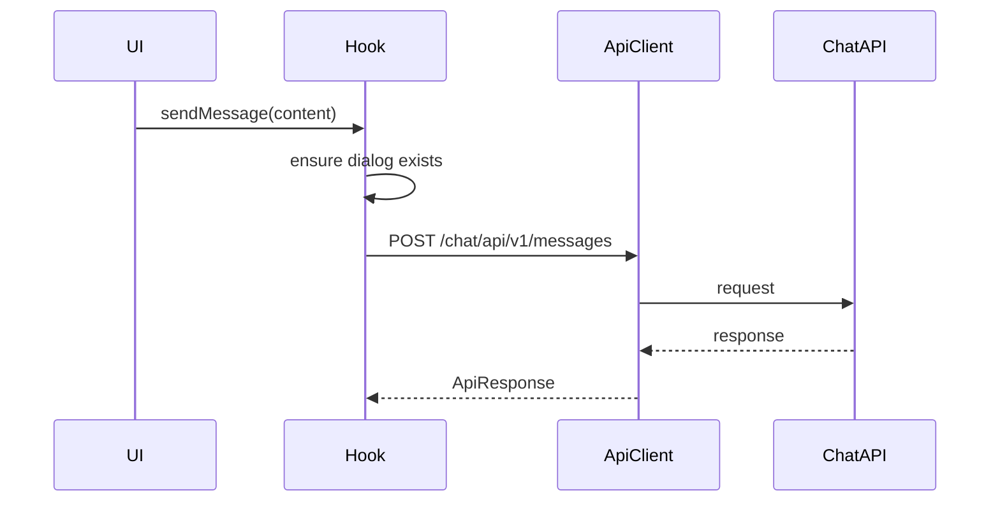
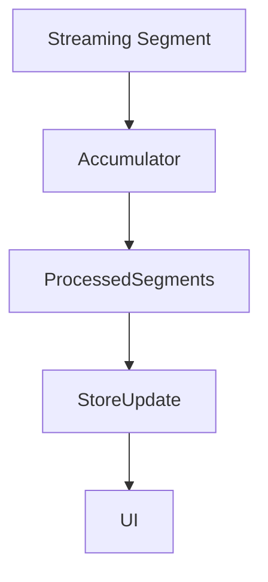
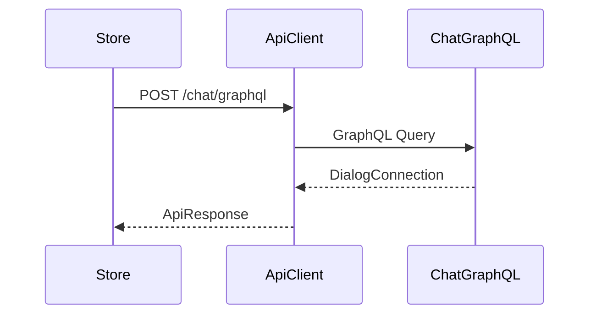

# Frontend Service Api Clients And Mingo

The **Frontend Service Api Clients And Mingo** module is the integration layer between the OpenFrame frontend UI and the backend microservices (API, Authorization, Gateway, Chat, Fleet, Tactical RMM).

It provides:

- A centralized, token-aware HTTP client (`ApiClient`)
- A dedicated authentication client (`AuthApiClient`)
- Tool-specific API clients (Fleet and Tactical RMM)
- A complete frontend-side integration for **Mingo AI chat**, including:
  - REST mutations
  - GraphQL queries
  - Streaming message handling
  - Zustand-based state management

This module ensures consistent authentication, multi-tenant routing, and resilient token refresh across all frontend-to-backend interactions.

---

## High-Level Architecture



### Responsibilities by Layer

| Layer | Responsibility |
|-------|----------------|
| ApiClient | Unified HTTP client with token refresh and retry logic |
| AuthApiClient | OAuth, SSO, tenant discovery, password reset |
| FleetApiClient | Fleet MDM operations (policies, queries, hosts) |
| TacticalApiClient | Tactical RMM operations (agents, scripts, tasks) |
| Mingo Services | AI chat dialog creation, messaging, approvals |
| Stores | Streaming state, pagination, dialog state, typing indicators |

---

# Core HTTP Layer

## ApiClient

The `ApiClient` is the central HTTP abstraction used across the frontend.

### Key Features

- Automatic inclusion of cookies (`credentials: include`)
- Optional Bearer token injection (DevTicket mode)
- Automatic token refresh on `401`
- Request queueing during refresh
- Retry-once strategy
- Unified response wrapper

### Authentication Flow



### Token Refresh Strategy

- Only one refresh request runs at a time
- Concurrent requests are queued
- On success → queued requests retry
- On failure → force logout

This prevents token refresh storms and race conditions.

---

## AuthApiClient

`AuthApiClient` handles:

- `/oauth/*`
- `/oauth/refresh`
- Tenant discovery
- SSO registration
- Invitation acceptance
- Password reset flows

### Architectural Separation

Unlike `ApiClient`, `AuthApiClient`:

- Can target a shared host (`sharedHostUrl`)
- Supports SaaS multi-domain setups
- Supports DevTicket header-based token exchange
- Handles redirect-based SSO flows

### Example Responsibilities

- `refresh()` → refresh access token
- `loginUrl()` → build OAuth login URL
- `registerOrganization()` → SaaS tenant registration
- `acceptInvitationSSO()` → SSO invitation redirect

---

# Tool-Specific API Clients

These clients extend `ApiClient` but apply tool-specific base URLs.

## FleetApiClient

Base path:

```text
/tools/fleetmdm-server
```

### Capabilities

- Policies CRUD
- Queries CRUD
- Run live queries
- Hosts listing
- Teams, labels, packs

### Fleet Routing Model



Fleet traffic is transparently proxied through the Gateway.

---

## TacticalApiClient

Base path:

```text
/tools/tactical-rmm
```

### Capabilities

- Agents inspection
- Script execution
- Bulk actions
- Scheduled tasks
- Logs, checks, services, processes

### Tactical Routing Model



---

# Mingo AI Chat Integration

Mingo is the AI assistant interface embedded in OpenFrame.

The module implements:

- Dialog creation
- Message sending
- Approval workflows
- Streaming response assembly
- Zustand state management
- GraphQL pagination

---

## MingoApiService

Provides React Query mutations:

- `createDialogMutation()`
- `sendMessageMutation()`
- `approveRequestMutation()`
- `rejectRequestMutation()`

Endpoints:

```text
POST /chat/api/v1/dialogs
POST /chat/api/v1/messages
POST /chat/api/v1/approval-requests/{id}/approve
```

All calls use `ApiClient` and therefore inherit:

- Token refresh
- Cookie handling
- Error normalization

---

## useMingoDialog Hook

This hook:

- Lazily creates dialogs
- Sends messages
- Manages optimistic flows
- Handles error toasts

Flow:



---

## MingoMessagesStore

A Zustand store that manages:

- Messages per dialog (`Map<string, Message[]>`)
- Streaming assistant messages
- Typing indicators
- Unread counters
- Segment accumulators
- Pagination cursors

### Streaming Message Processing

The store uses a `MessageSegmentAccumulator` to:

- Merge text fragments
- Handle tool execution segments
- Track approval requests
- Update approval status inline



This allows incremental rendering of AI responses.

---

## DialogDetailsStore

Handles detailed ticket dialogs via GraphQL.

### Responsibilities

- Fetch dialog metadata
- Fetch paginated messages
- Poll new messages
- Merge assistant text chunks
- Manage admin vs client chat

### GraphQL Interaction



---

# Multi-Tenant & Environment Handling

This module relies on `runtimeEnv` to determine:

- Tenant host URL
- Shared SaaS host
- DevTicket mode

### URL Resolution Strategy

1. Absolute URL → pass through
2. Tenant host present → prefix path
3. Otherwise → relative path

This enables:

- Local development
- SaaS shared domain mode
- Per-tenant subdomain deployments

---

# Error Handling Model

All API responses normalize into:

```text
{
  data?: T
  error?: string
  status: number
  ok: boolean
}
```

Advantages:

- Consistent error handling
- Centralized retry logic
- Simplified UI mutation logic

---

# How This Module Fits Into the Overall System

The **Frontend Service Api Clients And Mingo** module acts as the frontend-side integration boundary to:

- API Service (business logic, GraphQL, REST)
- Authorization Server (OAuth, SSO)
- Gateway Service (tool proxying)
- Chat backend (AI dialogs)
- External tools (Fleet, Tactical RMM)

It ensures that frontend features:

- Remain authentication-aware
- Support multi-tenancy
- Handle token refresh seamlessly
- Maintain resilient streaming AI UX

Without this module, the frontend would need to implement:

- Manual token management
- Redundant fetch logic
- Tool-specific routing logic
- Complex streaming state handling

Instead, this module provides a clean abstraction layer between UI components and backend microservices.

---

# Summary

The **Frontend Service Api Clients And Mingo** module provides:

- Centralized HTTP abstraction
- Robust OAuth token refresh handling
- SaaS multi-tenant URL resolution
- Tool-specific API adapters
- AI chat service integration
- Streaming-aware state management
- GraphQL pagination logic

It is the backbone of all frontend-to-backend communication within OpenFrame.
