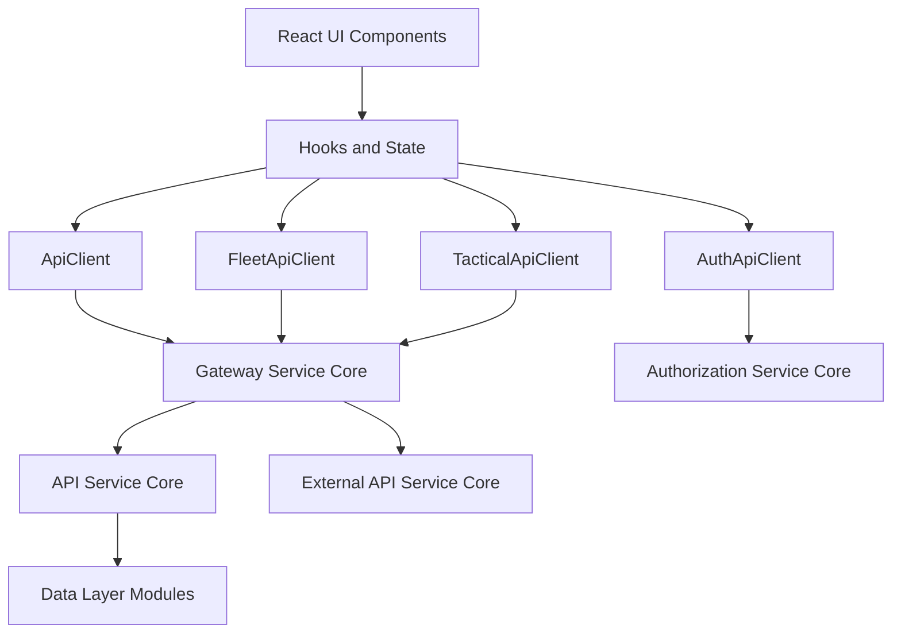
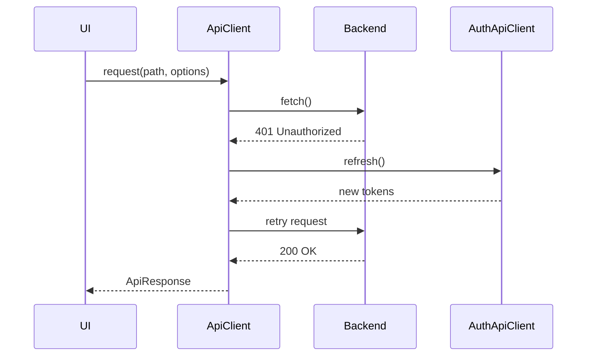
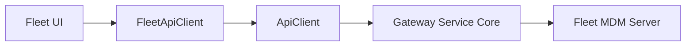
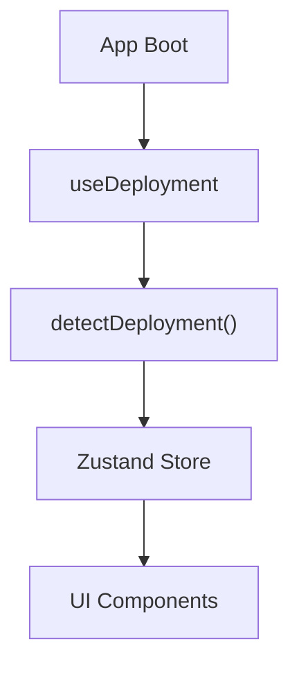
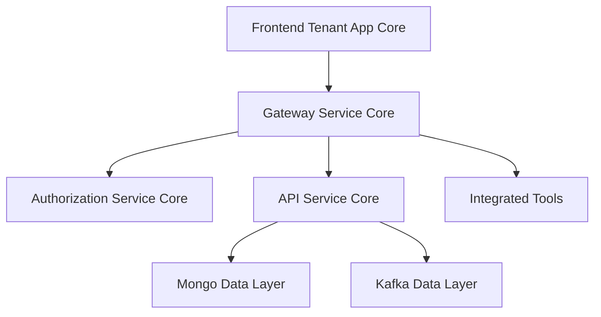

# Frontend Tenant App Core

The **Frontend Tenant App Core** module is the client-side foundation of the OpenFrame tenant application. It provides:

- A centralized API communication layer
- Authentication and OAuth orchestration
- Tool-specific API adapters (Fleet MDM and Tactical RMM)
- Deployment-aware runtime behavior
- Consistent token refresh and logout handling

This module acts as the browser-side integration layer between the UI and the backend services such as the API Service Core, Authorization Service Core, Gateway Service Core, and tool integrations.

---

## 1. Architectural Overview

At a high level, the Frontend Tenant App Core sits between the UI components and the backend microservices.



### Responsibilities

| Layer | Responsibility |
|-------|---------------|
| UI Layer | React components and pages |
| Hooks & Stores | Deployment detection, auth state, global stores |
| API Clients | HTTP abstraction, token handling, retries |
| Backend Services | Auth, API, Gateway, Tool integrations |

The module ensures the UI does not need to manage:

- Token refresh logic
- Tenant host resolution
- SaaS vs self-hosted routing
- Cookie vs header-based authentication
- Tool-specific base path composition

---

## 2. Core Components

The Frontend Tenant App Core consists of five primary components:

1. **ApiClient**  
2. **AuthApiClient**  
3. **FleetApiClient**  
4. **TacticalApiClient**  
5. **DeploymentState (useDeployment hook)**

Each component plays a clearly defined role in request orchestration and runtime configuration.

---

## 3. ApiClient

**Location:** `src/lib/api-client.ts`  
**Class:** `ApiClient`

### Purpose

The ApiClient is the centralized HTTP abstraction layer for all authenticated application requests.

It handles:

- JSON request/response normalization
- Automatic inclusion of cookies
- Optional Authorization header injection
- Access token refresh on 401
- Request queueing during refresh
- Unified logout handling

### Request Lifecycle



### Key Features

#### 3.1 Automatic Token Refresh

- Detects HTTP 401
- Ensures only one refresh runs at a time
- Queues pending requests
- Retries after refresh success
- Forces logout on failure

This prevents:

- Token refresh storms
- Infinite retry loops
- Duplicate refresh requests

#### 3.2 Dev Ticket Mode

When enabled via runtime configuration:

- Access token stored in localStorage
- Authorization header automatically injected
- Refresh token optionally passed via header

This allows local and development workflows without relying solely on cookies.

#### 3.3 URL Construction

The client builds URLs using:

- Absolute URLs (pass-through)
- Tenant host from runtime environment
- Relative fallback when host not configured

This supports:

- SaaS shared deployments
- Custom tenant subdomains
- Self-hosted environments

---

## 4. AuthApiClient

**Location:** `src/lib/auth-api-client.ts`  
**Class:** `AuthApiClient`

### Purpose

The AuthApiClient is a dedicated client for authentication and OAuth flows.

It communicates primarily with the Authorization Service Core.

### Supported Flows

- OAuth login
- Token refresh
- Tenant discovery
- Organization registration
- SSO registration (Google, Microsoft)
- Invitation acceptance
- Password reset
- Logout

### SaaS Shared Mode

AuthApiClient dynamically determines:

- Shared host URL
- Domain suffix
- Tenant domain routing

This enables:

- Multi-tenant SaaS routing
- Subdomain-based isolation
- Cross-domain authentication handling

### Unauthorized Handling Strategy

Unlike ApiClient, this client:

- Handles refresh internally
- Retries once after refresh
- Clears tokens if refresh fails
- Triggers unified logout

This separation ensures authentication flows do not depend on business API logic.

---

## 5. FleetApiClient

**Location:** `src/lib/fleet-api-client.ts`  
**Class:** `FleetApiClient`

### Purpose

FleetApiClient is a tool-specific adapter for Fleet MDM.

It extends ApiClient and automatically prefixes all routes with:

```text
/tools/fleetmdm-server
```

### Capabilities

- Policy management
- Query management
- Host inventory
- Team management
- Labels and packs
- Live query execution

### Tool Routing Model



This abstraction ensures:

- Consistent auth handling
- Reuse of retry logic
- Clean separation between tool domains

---

## 6. TacticalApiClient

**Location:** `src/lib/tactical-api-client.ts`  
**Class:** `TacticalApiClient`

### Purpose

TacticalApiClient integrates Tactical RMM via a dedicated base path:

```text
/tools/tactical-rmm
```

### Capabilities

- Agent listing and inspection
- Script execution
- Bulk actions
- Scheduled task management
- Agent logs and telemetry
- System information queries

### Integration Pattern

It follows the same pattern as FleetApiClient:

- Delegates to ApiClient
- Shares token refresh behavior
- Reuses consistent error normalization

This ensures tool integrations remain modular and scalable.

---

## 7. DeploymentState and useDeployment Hook

**Location:** `src/app/hooks/use-deployment.ts`  
**Store:** Zustand-based DeploymentState

### Purpose

DeploymentState determines the runtime environment and stores it globally.

It detects:

- Cloud deployment
- Self-hosted deployment
- Development environment
- Hostname and deployment type

### Initialization Model



### Benefits

- Centralized environment detection
- Avoids repeated detection logic
- Enables feature toggles per deployment type
- Supports SaaS vs on-prem behavior differences

The hook initializes once and caches results globally.

---

## 8. Authentication Strategy

The Frontend Tenant App Core supports two authentication models:

### 8.1 Cookie-Based Authentication

- HTTP-only cookies
- Credentials always included in fetch
- Primary mode for production SaaS

### 8.2 Header-Based Authentication (Dev Ticket Mode)

- Access token stored in localStorage
- Authorization header injected
- Refresh token optionally passed via header

This dual-mode design ensures:

- Secure production behavior
- Developer-friendly local testing

---

## 9. Error Handling and Resilience

The module provides:

- Unified ApiResponse wrapper
- JSON-safe parsing
- Graceful network error fallback
- Automatic logout on unrecoverable auth failure
- Request queue replay after refresh

This dramatically simplifies UI-layer error handling.

---

## 10. How This Module Fits Into the Overall System

The Frontend Tenant App Core is the browser gateway into the OpenFrame platform.

It connects to:

- Authorization Service Core (OAuth, SSO)
- Gateway Service Core (routing, security filters)
- API Service Core (business logic)
- External API Service Core (tool exposure)
- Tool backends via gateway



### Key Architectural Principles

1. Single source of truth for API communication  
2. Separation of auth and business requests  
3. Tool adapters instead of UI-level routing  
4. Deployment-aware behavior  
5. Automatic resilience and retry strategy  

---

# Summary

The **Frontend Tenant App Core** module is the client-side orchestration layer of OpenFrame. It provides:

- Centralized API communication
- Robust token refresh logic
- SaaS-aware authentication routing
- Tool-specific adapters
- Deployment-aware configuration

By encapsulating authentication, routing, and tool integration complexity, it enables the UI layer to remain clean, declarative, and focused on user experience rather than infrastructure concerns.