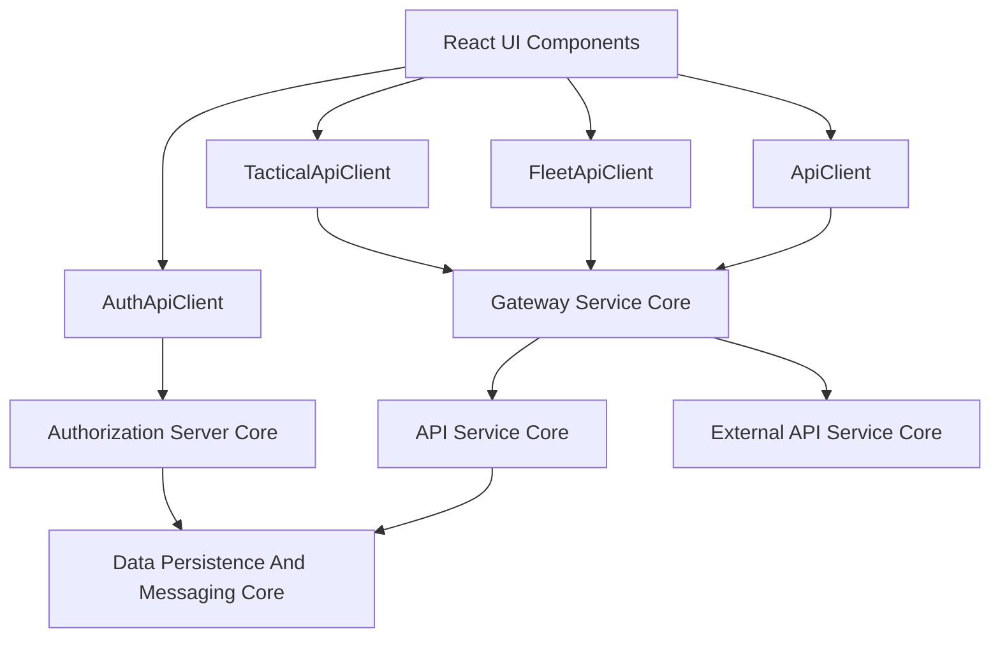
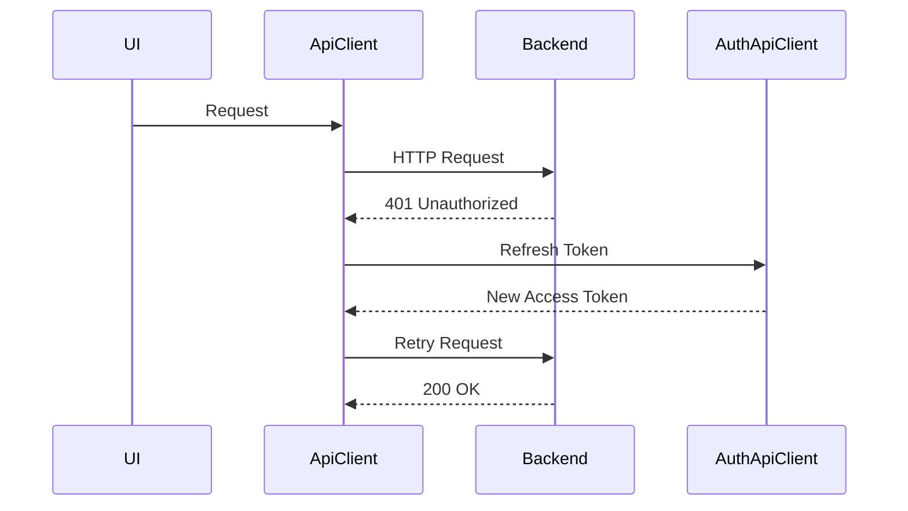
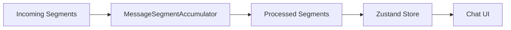
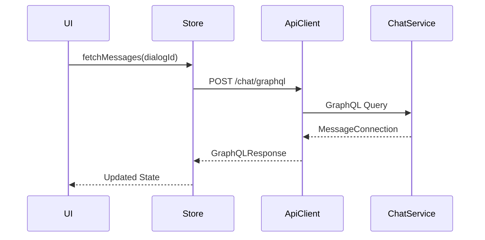

# Frontend Tenant App Core

The **Frontend Tenant App Core** module is the primary client-side integration layer for the OpenFrame tenant application. It provides:

- Centralized API communication (REST + GraphQL)
- Authentication and token lifecycle management
- Tool-specific API adapters (Fleet MDM, Tactical RMM)
- Real-time chat state management (Mingo)
- Ticket dialog state handling

This module acts as the **frontend orchestration layer** between the UI and backend services such as the API Service Core, Authorization Server Core, Gateway Service Core, and Chat services.

---

## 1. Architectural Overview

At a high level, the Frontend Tenant App Core sits between UI components and distributed backend services.



### Key Responsibilities

| Layer | Responsibility |
|--------|---------------|
| ApiClient | Centralized authenticated HTTP communication |
| AuthApiClient | OAuth flows, refresh logic, tenant discovery |
| FleetApiClient | Fleet MDM tool integration |
| TacticalApiClient | Tactical RMM integration |
| MingoApiService | AI chat dialog and approval flows |
| Zustand Stores | Local UI state and real-time synchronization |

---

## 2. Core API Infrastructure

### 2.1 ApiClient

The **ApiClient** is the central HTTP abstraction for the tenant frontend.

#### Core Capabilities

- Automatic authentication header injection
- Cookie-based + header-based hybrid auth
- Token refresh queueing mechanism
- Centralized 401 recovery logic
- Automatic JSON parsing
- Standardized `ApiResponse` contract

#### Authentication Flow



#### Important Behaviors

- Uses `credentials: include` for cookie-based sessions.
- Supports developer token override mode via local storage.
- Maintains a refresh queue to prevent multiple parallel refresh calls.
- Forces unified logout on refresh failure.

---

### 2.2 AuthApiClient

The **AuthApiClient** handles all authentication-specific endpoints and tenant-aware OAuth flows.

#### Supported Flows

- `/oauth/login`
- `/oauth/refresh`
- `/oauth/logout`
- Tenant discovery
- SSO registration (Google, Microsoft)
- Invitation acceptance
- Password reset

#### Multi-Tenant Awareness

- Dynamically resolves domain suffix
- Supports shared SaaS mode
- Injects refresh token via header in development mode
- Handles tenant-specific redirects

This client integrates directly with the **Authorization Server Core**.

---

## 3. Tool Integration Clients

The frontend supports embedded integrations with external MSP tooling platforms.

### 3.1 FleetApiClient

The **FleetApiClient** wraps the base ApiClient and targets:

```
/tools/fleetmdm-server
```

#### Features

- Policies CRUD
- Queries CRUD and live execution
- Host management
- Teams, labels, packs
- Fleet-specific filtering and pagination

All requests still inherit:

- Centralized auth
- Automatic refresh logic
- Error normalization

---

### 3.2 TacticalApiClient

The **TacticalApiClient** targets:

```
/tools/tactical-rmm
```

#### Capabilities

- Agent management
- Script execution
- Bulk actions
- System information retrieval
- Scheduled task orchestration

This design allows tool integrations to remain modular while still leveraging the core API client.

---

## 4. Mingo Chat Integration Layer

The **MingoApiService** and **MingoMessagesStore** together power the AI chat experience.

### 4.1 MingoApiService

Provides React Query mutations for:

- Dialog creation
- Sending messages
- Approvals / rejections

Endpoints:

```
/chat/api/v1/dialogs
/chat/api/v1/messages
/chat/api/v1/approval-requests/{id}/approve
```

It uses the centralized ApiClient and throws structured errors when responses are invalid.

---

### 4.2 MingoMessagesStore

A Zustand store that manages:

- Messages grouped by dialog
- Streaming message segments
- Typing states
- Unread counters
- Approval state updates
- Pagination cursors

#### Streaming Message Handling



Key behaviors:

- Deduplicates messages
- Merges assistant streaming chunks
- Updates approval segment status in-place
- Supports per-dialog accumulators

This enables real-time AI responses with incremental rendering.

---

## 5. Ticket Dialog Management

The **DialogDetailsStore** manages GraphQL-based ticket dialogs.

### Responsibilities

- Fetch dialog metadata
- Fetch paginated messages
- Poll new messages
- Merge assistant text fragments
- Maintain separate client/admin message streams
- Manage typing indicators

### GraphQL Flow



#### Smart Message Merging

Assistant messages of type TEXT are concatenated when streaming fragments arrive to avoid UI flicker.

---

## 6. State Management Strategy

The module uses:

- **Zustand** for local state
- **React Query** for mutation handling
- Centralized API abstraction for networking

### State Domains

| Store | Domain |
|--------|--------|
| MingoMessagesStore | AI chat dialogs |
| DialogDetailsStore | Ticket chat dialogs |

This separation prevents cross-feature coupling.

---

## 7. Authentication & Token Lifecycle

Token lifecycle is handled in two layers:

1. ApiClient (general API requests)
2. AuthApiClient (OAuth endpoints)

### Refresh Strategy

- Detect 401
- Pause parallel requests
- Refresh once
- Replay queued requests
- Force logout if refresh fails

This guarantees:

- No token race conditions
- No refresh storms
- Consistent logout behavior

---

## 8. How This Module Fits Into The Platform

The Frontend Tenant App Core:

- Consumes services exposed by Gateway Service Core
- Authenticates via Authorization Server Core
- Accesses business APIs via API Service Core
- Interacts with tool integrations proxied through External API Service Core
- Displays AI chat backed by chat services

It does **not** contain business logic for:

- User provisioning
- Device management
- Authorization rules
- Data persistence

Those responsibilities live in backend service cores.

---

## 9. Design Principles

1. Centralized HTTP abstraction
2. Strong separation between auth and general API logic
3. Tool integrations implemented as thin wrappers
4. Real-time state isolation per dialog
5. Tenant-aware domain resolution
6. Graceful degradation on auth failure

---

## 10. Summary

The **Frontend Tenant App Core** module is the client-side backbone of the OpenFrame tenant application.

It provides:

- Secure multi-tenant authentication handling
- Unified API orchestration
- Tool integration abstraction
- AI chat streaming state management
- Ticket dialog GraphQL orchestration

By centralizing networking, authentication, and state coordination, it ensures that the UI remains declarative, resilient, and scalable across distributed backend services.
