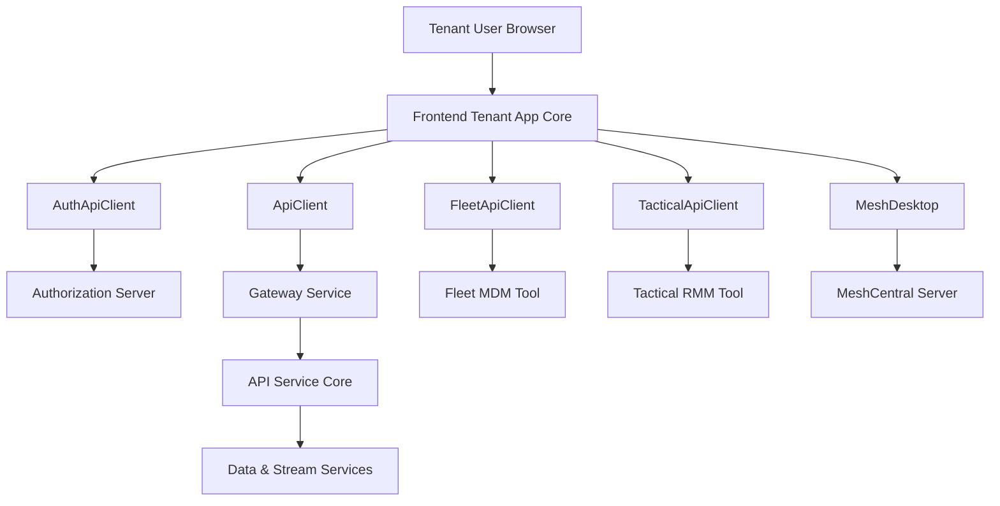
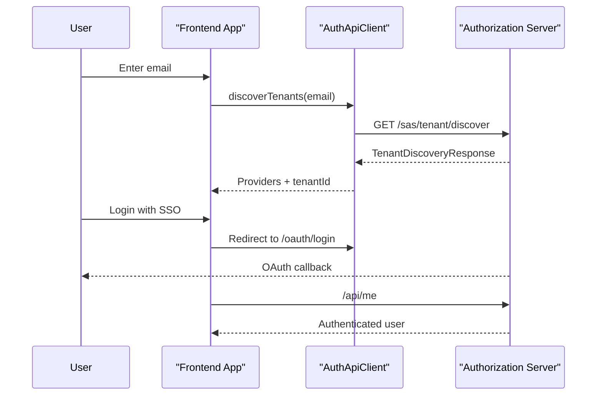
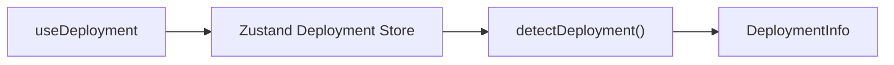
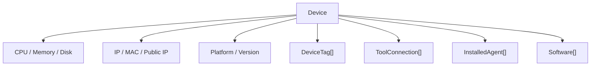
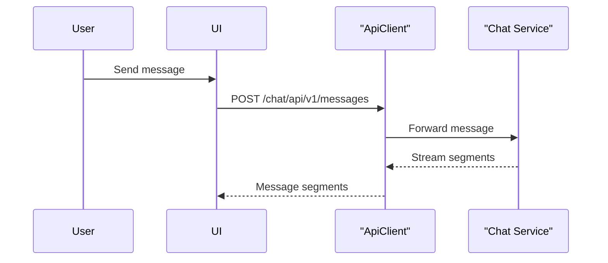
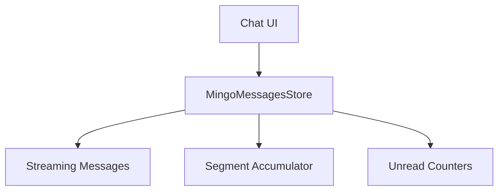
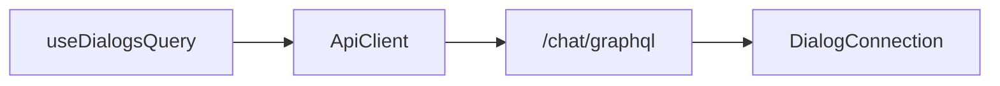
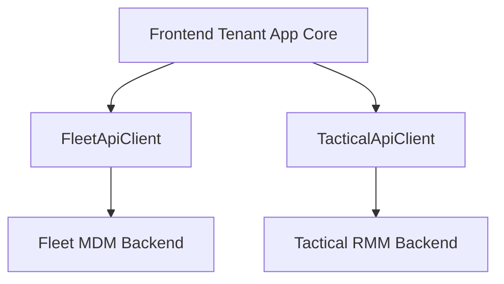
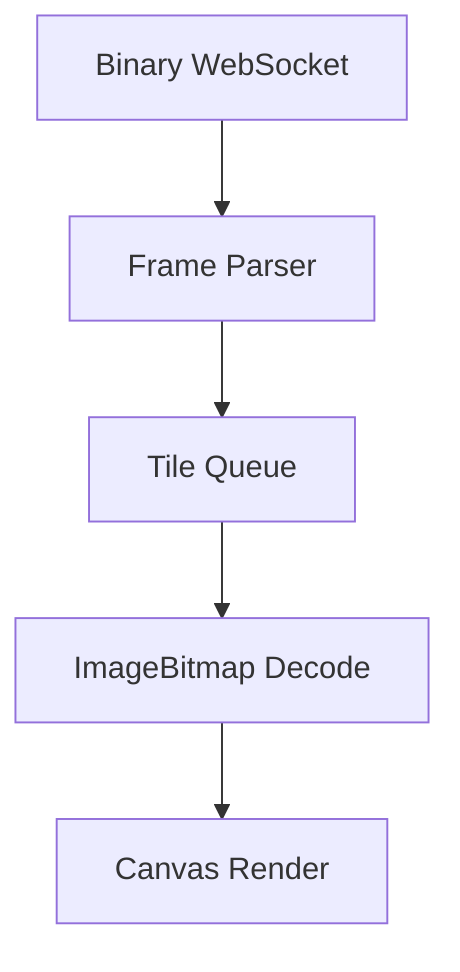
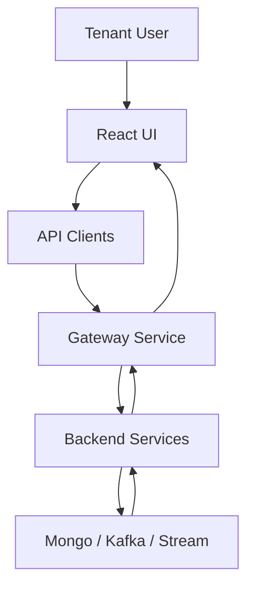

# Frontend Tenant App Core

## Overview

The **Frontend Tenant App Core** module is the primary web application for tenant users within the OpenFrame platform. It is responsible for:

- User authentication and tenant discovery
- Device and endpoint management UI
- AI-powered assistant interactions (Mingo)
- Ticket and dialog management via GraphQL
- Integration with Fleet MDM, Tactical RMM, and MeshCentral
- Centralized API communication and token lifecycle handling

This module is built with **Next.js (App Router)**, **React**, **Zustand** for state management, and **React Query** for server state synchronization. It acts as the presentation and orchestration layer over backend services such as the API Service Core, Authorization Server Core, Gateway Service Core, and tool-specific services.

---

## High-Level Architecture

### Responsibilities by Layer

- **Frontend Tenant App Core**: UI, routing, state management, user experience.
- **AuthApiClient**: OAuth, SSO, registration, invitation, password reset.
- **ApiClient**: Authenticated REST + GraphQL communication with backend APIs.
- **FleetApiClient / TacticalApiClient**: Tool-specific proxy communication.
- **MeshDesktop**: Real-time remote desktop rendering over binary WebSocket protocol.

---

## Core Functional Domains

### 1. Authentication & Tenant Lifecycle

Key elements:

- `useAuth` hook
- `AuthApiClient`
- `TenantInfo` interface
- SSO provider discovery hooks

The authentication flow supports:

- Tenant discovery by email
- Organization registration (password or SSO)
- OAuth login via external providers (Google, Microsoft)
- Token storage (access + refresh)
- Automatic refresh and forced logout handling

### Token Handling Strategy

- Access tokens stored under `of_access_token`
- Refresh tokens stored under `of_refresh_token`
- `ApiClient` automatically:
  - Attaches `Authorization` header in DevTicket mode
  - Attempts refresh on `401`
  - Queues concurrent requests during refresh
  - Forces logout on refresh failure

This ensures consistent authentication across all service integrations.

---

### 2. Deployment Detection

The `useDeployment` hook determines runtime mode:

- Cloud
- Self-hosted
- Development

It uses a global Zustand store (`DeploymentState`) to ensure detection runs once and is reused across the application.

This influences:

- Auth redirect behavior
- API base URL resolution
- Feature flags and environment assumptions

---

### 3. Device Domain Model

The `Device` interface provides a **unified device representation** with:

- Hardware specs
- OS details
- Network information
- Software inventory
- Vulnerabilities
- Tags
- Tool connections
- Installed agents

Design principles:

- All fields flattened at root level
- No deep nesting
- Backward compatibility with legacy tool formats
- Shared GraphQL node mappings

This model bridges:

- Fleet MDM
- Tactical RMM
- Internal API device representations

---

### 4. Mingo AI Chat Integration

Mingo provides AI-assisted operations within the tenant interface.

Core components:

- `useMingoDialog`
- `MingoApiService`
- `MingoMessagesStore`
- Dialog & Message GraphQL types

#### Dialog Creation & Messaging

#### State Management

`MingoMessagesStore` (Zustand) manages:

- Messages per dialog
- Streaming partial responses
- Approval requests
- Typing indicators
- Unread counts
- Segment accumulation

Segment accumulation allows:

- Incremental text rendering
- Tool execution blocks
- Approval request rendering
- Status updates (approved / rejected)

---

### 5. Ticket & Dialog GraphQL Layer

The tickets domain integrates via `/chat/graphql`.

Hooks:

- `useDialogsQuery`
- `useDialogMessages`
- `useDialogDetails`

Patterns:

- Cursor-based pagination
- React Query caching
- GraphQL response envelope validation

The `DialogDetailsStore` centralizes:

- Active dialog state
- Client vs admin messages
- Realtime updates
- Polling for new messages

---

### 6. Tool Integrations

#### Fleet API Client

- Base path: `/tools/fleetmdm-server`
- Policies
- Queries
- Hosts
- Labels
- Packs

#### Tactical API Client

- Base path: `/tools/tactical-rmm`
- Agents
- Scripts
- Tasks
- Logs
- System info

These clients reuse the shared `ApiClient` for:

- Authentication
- Error handling
- Retry logic
- Refresh handling

---

### 7. MeshCentral Remote Desktop

The `MeshDesktop` class implements a binary protocol client for remote desktop streaming.

Responsibilities:

- Canvas rendering
- JPEG tile decoding
- Keyboard & mouse encoding
- Multi-display handling
- Frame accumulation buffer

Advanced capabilities:

- Jumbo frame handling
- Backpressure queue limits
- Concurrent decode caps
- Display switching
- Ctrl+Alt+Del command support

This component enables full remote control directly in-browser.

---

## Cross-Cutting Concerns

### 1. State Management

- **Zustand**: Global UI state (auth, deployment, dialogs, chat).
- **React Query**: Server state, caching, pagination.
- **LocalStorage hooks**: Persistent auth and discovery state.

### 2. Error Handling

- Toast notifications for user-facing errors
- Centralized refresh and forced logout logic
- GraphQL error envelope validation

### 3. Environment Awareness

`runtimeEnv` drives:

- Shared host URL
- Dev ticket observer mode
- Auth check intervals
- SaaS shared mode logic

---

## End-to-End Data Flow

The Frontend Tenant App Core acts as:

- A UI orchestration layer
- An authentication boundary
- A tool integration gateway
- An AI interaction surface

It is the primary tenant-facing surface of the OpenFrame platform and ties together authentication, device management, AI operations, and remote control into a cohesive experience.

---

## Summary

The **Frontend Tenant App Core** module:

- Implements full tenant authentication and lifecycle flows
- Unifies device representations across multiple tools
- Provides AI-powered dialog management via Mingo
- Integrates GraphQL ticketing and real-time updates
- Handles secure token refresh and session lifecycle
- Enables browser-based remote desktop control

It is the central presentation and orchestration layer of the tenant experience in the OpenFrame ecosystem.