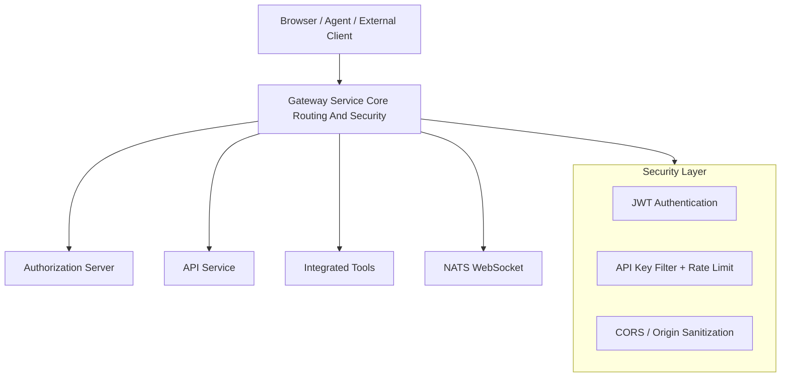
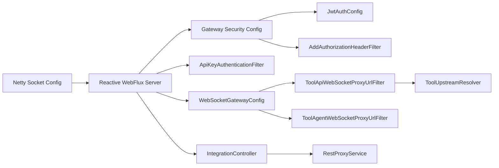
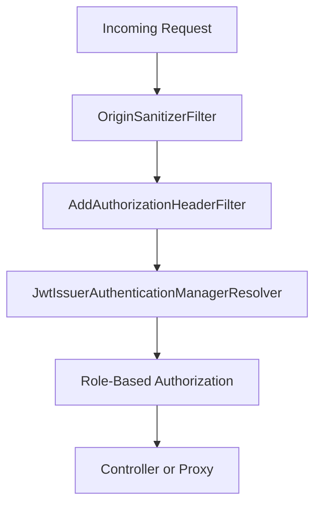
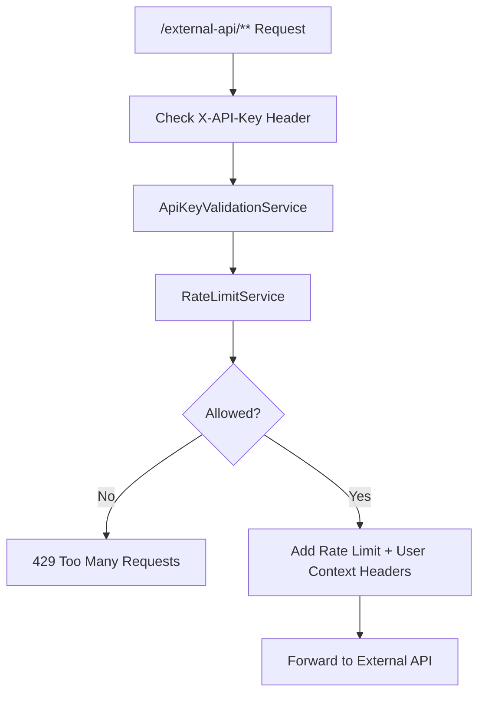
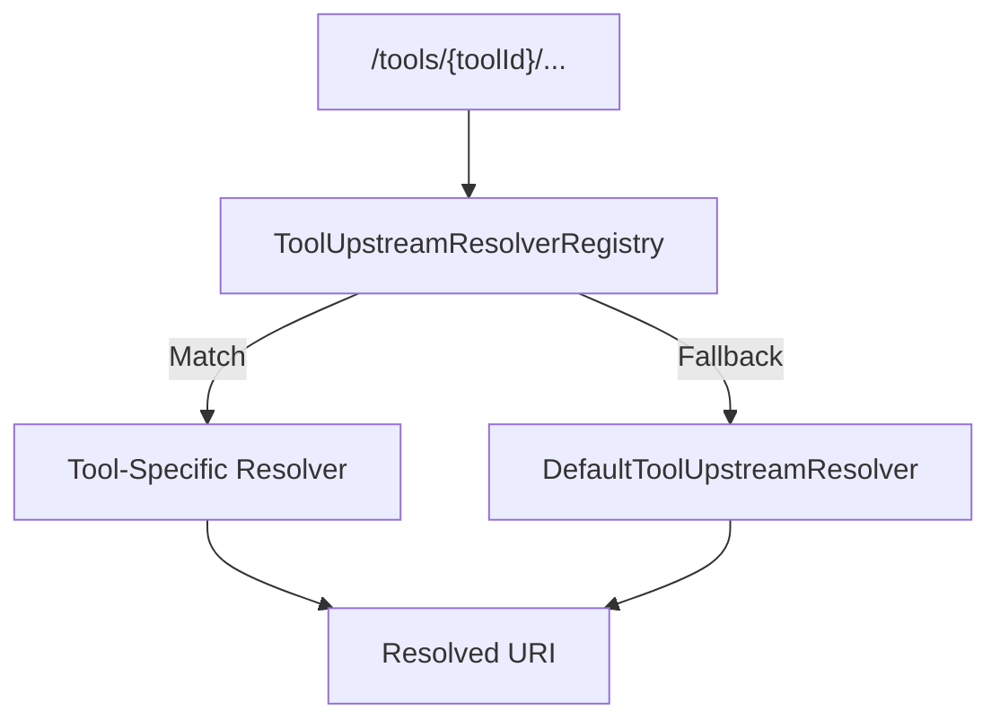
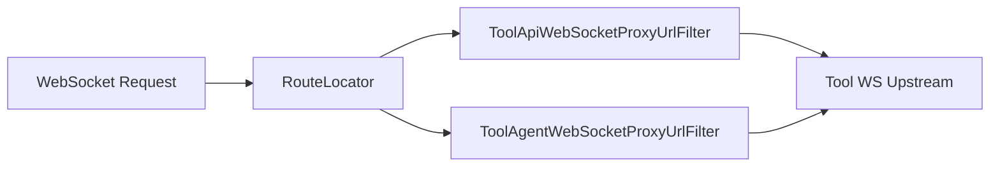

# Gateway Service Core Routing And Security

The **Gateway Service Core Routing And Security** module is the reactive edge layer of the OpenFrame platform. It is responsible for:

- Centralized HTTP and WebSocket routing
- JWT-based authentication and role-based authorization
- API key authentication and rate limiting for external APIs
- Multi-tenant issuer resolution and validation
- Tool-specific upstream resolution (REST + WebSocket)
- CORS and security hardening at the edge

This module is built on **Spring Cloud Gateway (Reactive)** and **Spring WebFlux Security**, and runs inside the `GatewayApplication` service from the service runtime layer.

---

## 1. High-Level Responsibilities

At runtime, the Gateway Service Core Routing And Security module sits between:

- Frontend clients (UI, agents, external integrations)
- Internal services (API service, Authorization server)
- Integrated tools (MeshCentral, Tactical RMM, others)
- Messaging backplanes (NATS WebSocket endpoints)

### Core Capabilities

- ✅ OAuth2 Resource Server (JWT validation)
- ✅ Multi-issuer JWT support (multi-tenant aware)
- ✅ API key validation with rate limiting
- ✅ Dynamic REST and WebSocket proxying
- ✅ Tool-specific upstream resolution strategies
- ✅ Reactive, non-blocking processing (Netty + Reactor)

---

## 2. Architectural Overview

The Gateway acts as:

- **OAuth2 Resource Server** validating access tokens
- **Reverse Proxy** for REST and WebSocket traffic
- **Policy Enforcement Point** for roles and API keys

---

## 3. Internal Architecture

Major building blocks:

- **Network Layer** – Netty configuration
- **Security Layer** – JWT, API key, CORS, authorization rules
- **Routing Layer** – REST + WebSocket route definitions
- **Upstream Resolution Layer** – Tool-specific routing strategies

---

## 4. Network & Reactive Infrastructure

### 4.1 Netty Socket Configuration

**Component:** `NettySocketConfig`

Responsibilities:

- Configures low-level Netty channel options:
  - `SO_LINGER = 0`
  - `TCP_NODELAY = true`
- Customizes both:
  - Embedded Netty server
  - Gateway outbound HTTP client
- Provides a tuned `ReactorNettyWebSocketClient`

This ensures:

- Reduced TCP latency
- Cleaner WebSocket session handling
- Better performance under high concurrency

---

### 4.2 WebClient Configuration

**Component:** `WebClientConfig`

Provides a preconfigured `WebClient.Builder` with:

- 30s connect timeout
- 30s read/write timeouts
- Reactor Netty HTTP connector

Used internally by proxy services for tool REST forwarding.

---

## 5. Security Architecture

Security is layered and reactive.

---

### 5.1 JWT Authentication

**Components:**

- `GatewaySecurityConfig`
- `JwtAuthConfig`
- `DefaultIssuerUrlProvider`

#### Key Capabilities

- OAuth2 Resource Server (Reactive)
- Multi-issuer support using:
  - `JwtIssuerReactiveAuthenticationManagerResolver`
  - Caffeine cache of issuer managers
- Strict issuer validation
- Role + scope extraction:
  - `roles` → `ROLE_*`
  - `scope` → `SCOPE_*`

#### Multi-Tenant Issuer Handling

`JwtAuthConfig`:

- Caches authentication managers per issuer
- Uses configured public key for primary issuer
- Dynamically resolves other issuers
- Applies strict issuer validation using `IssuerUrlProvider`

`DefaultIssuerUrlProvider`:

- OSS fallback
- Accepts tokens from a single configured issuer

---

### 5.2 Role-Based Authorization

Defined in `GatewaySecurityConfig`.

Key path rules:

- `/api/**` → `ROLE_ADMIN`
- `/tools/agent/**` → `ROLE_AGENT`
- `/ws/tools/agent/**` → `ROLE_AGENT`
- `/ws/nats` and `/ws/nats-api` → `ROLE_AGENT` or `ROLE_ADMIN`
- `/clients/**` → mostly `ROLE_AGENT`

Everything is enforced using `ServerHttpSecurity` in reactive mode.

---

### 5.3 Authorization Header Normalization

**Component:** `AddAuthorizationHeaderFilter`

Purpose:

Ensures that downstream security always sees a standard `Authorization: Bearer <token>` header.

Token sources:

- Cookie (`access_token`)
- Custom header (`Access-Token`)
- Query parameter

This enables:

- Browser-based auth
- WebSocket auth via query params
- Agent-based authentication

---

### 5.4 API Key Authentication & Rate Limiting

**Component:** `ApiKeyAuthenticationFilter`

Applied only to:

- `/external-api/**`

Flow:

Behavior:

1. Requires `X-API-Key`
2. Validates key
3. Checks minute/hour/day limits
4. Adds rate limit headers:
   - `X-Rate-Limit-Limit-*`
   - `X-Rate-Limit-Remaining-*`
5. Injects:
   - `X-API-Key-Id`
   - `X-User-Id`

Handles errors directly in filter (reactive-safe).

---

### 5.5 CORS Handling

Two modes:

- `CorsConfig` → standard configurable CORS
- `CorsDisableConfig` → fully permissive (SaaS mode)

Additionally:

- `OriginSanitizerFilter` removes invalid `Origin: null` headers

---

## 6. REST Routing & Tool Proxying

### 6.1 Integration Controller

**Component:** `IntegrationController`

Endpoints:

- `/tools/{toolId}/health`
- `/tools/{toolId}/test`
- `/tools/{toolId}/**` → REST proxy
- `/tools/agent/{toolId}/**` → agent REST proxy

Delegates to:

- `IntegrationService`
- `RestProxyService`

---

### 6.2 Upstream Resolution Strategy

Tool routing is pluggable via `ToolUpstreamResolver`.

#### DefaultToolUpstreamResolver

- Reads tool config from Mongo
- Resolves API or WebSocket URL
- Uses `ProxyUrlResolver`

#### MeshCentralUpstreamResolver

- No DB lookup per request
- Reads from `MeshCentralRoutingProperties`
- Supports API + WS
- Handles path prefix injection safely

#### TacticalRmmUpstreamResolver

Path-based WS routing:

- REST → backend
- WS + NATS prefix → NATS upstream
- Other WS → Daphne upstream

---

## 7. WebSocket Routing

### 7.1 WebSocketGatewayConfig

Defines routes:

- `/ws/tools/agent/{toolId}/**`
- `/ws/tools/{toolId}/**`
- `/ws/nats`
- `/ws/nats-api`

Features:

- Dynamic tool ID extraction from path
- Header mutation (e.g., API key headers)
- Optional session cleanup wrapper
- WebSocketService security decorator

---

## 8. Internal Auth Probe

**Component:** `InternalAuthProbeController`

Conditional endpoint:

- `/internal/authz/probe`

Used for:

- Health checks
- Auth layer verification in internal deployments

---

## 9. Rate Limit Constants

**Component:** `RateLimitConstants`

Defines standardized logging messages for:

- Rate limit checks
- Status retrieval

Ensures consistent observability for API key usage.

---

## 10. How It Fits in the Platform

The Gateway Service Core Routing And Security module integrates with:

- Authorization Server → JWT issuance
- API Service → Admin and core APIs
- Data & Mongo modules → Tool configuration storage
- Messaging (NATS) → Real-time events
- Integrated tools → MeshCentral, Tactical RMM, others

It acts as:

- The public entry point
- The security enforcement boundary
- The routing brain of the platform

---

## 11. Design Principles

- ✅ Fully reactive (WebFlux + Reactor)
- ✅ Stateless security (JWT-based)
- ✅ Pluggable upstream resolution
- ✅ Multi-tenant ready
- ✅ Clear separation of authentication vs API key auth
- ✅ Secure-by-default path policies

---

## 12. Summary

The **Gateway Service Core Routing And Security** module is the central edge component of OpenFrame.

It combines:

- Reactive networking (Netty)
- OAuth2 resource server security
- API key + rate limiting controls
- WebSocket proxying
- Tool-specific routing strategies

This makes it the foundational enforcement and routing layer that protects and connects every external and internal service in the OpenFrame ecosystem.
