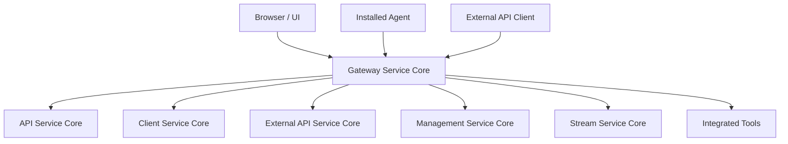
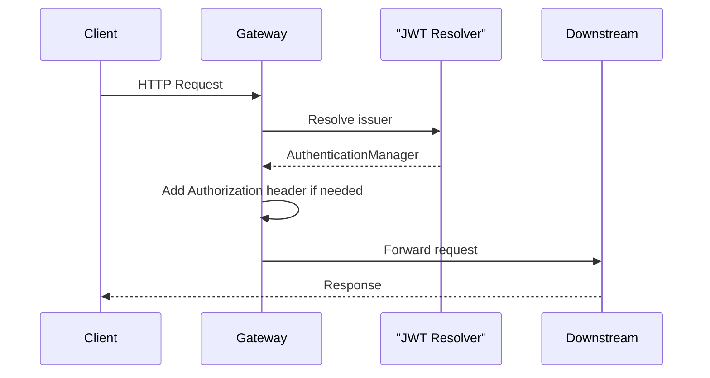
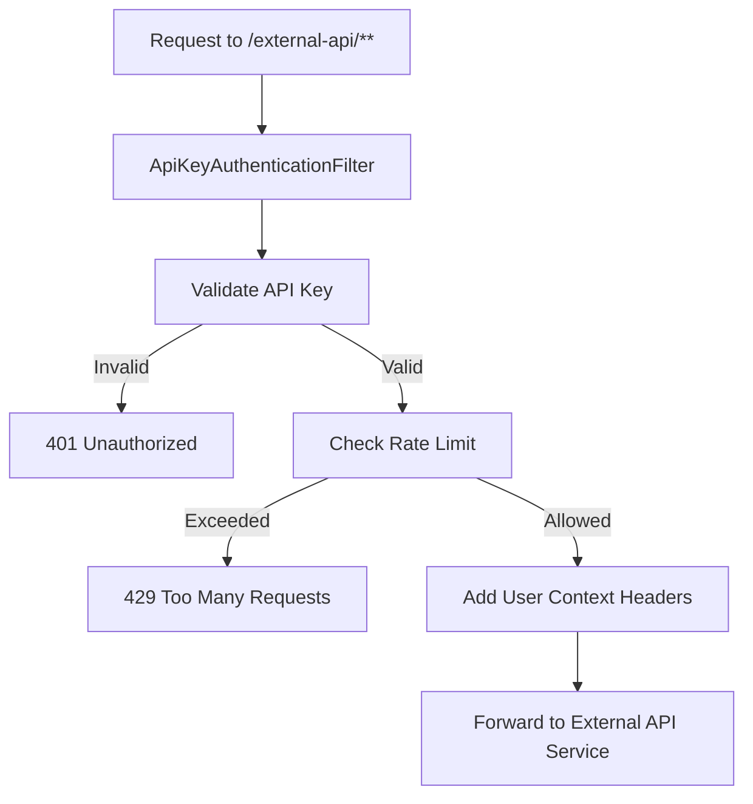
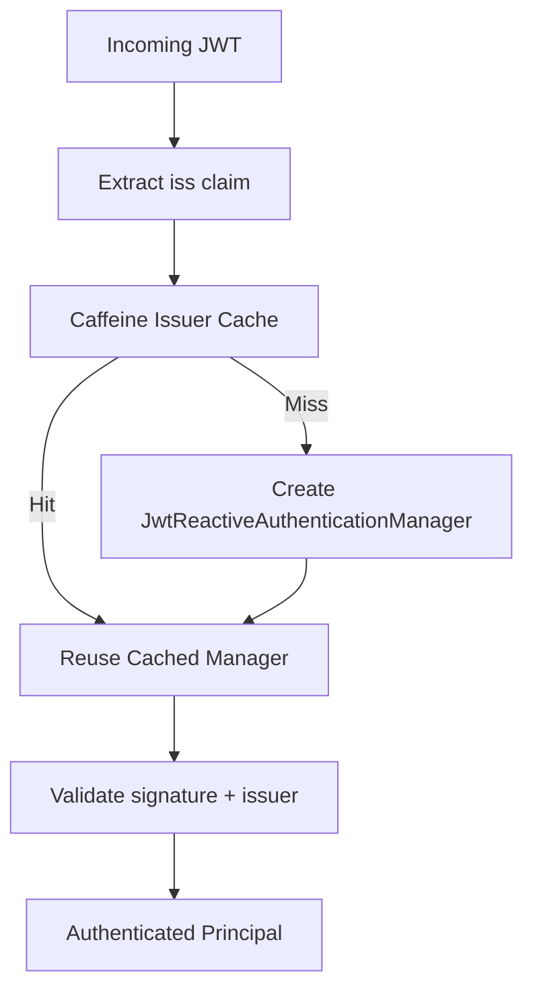
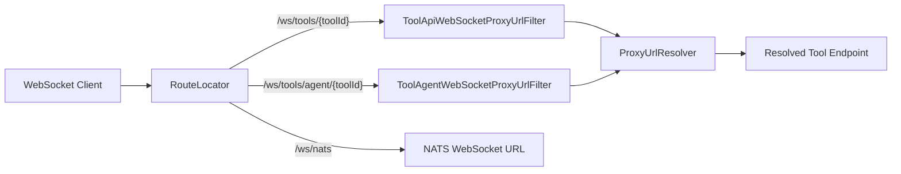
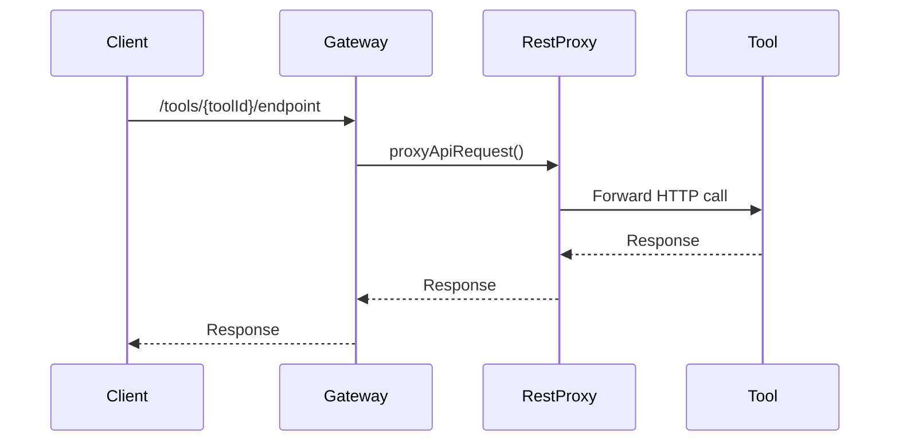

# Gateway Service Core

The **Gateway Service Core** module is the reactive edge layer of the OpenFrame platform. It acts as a unified entry point for UI clients, agents, external API consumers, WebSocket connections, and tool integrations.

Built on **Spring Cloud Gateway (WebFlux)**, this module provides:

- JWT-based multi-tenant authentication
- API key authentication with rate limiting for external APIs
- Dynamic WebSocket proxying for tools and agents
- REST proxying for integrated tools
- CORS management and origin sanitization
- Centralized security enforcement

It is packaged into the `GatewayApplication` under the platform applications layer and orchestrates traffic toward API, Client, External API, and other downstream services.

---

## 1. Architectural Overview

At runtime, the Gateway Service Core sits between external clients and internal platform services.



### Responsibilities at a Glance

| Concern | Responsibility |
|----------|----------------|
| Authentication | JWT validation (multi-issuer) |
| Authorization | Role-based path security |
| API Key Security | API key validation + rate limiting |
| Proxying | REST and WebSocket proxy to tools |
| Multi-tenancy | Dynamic issuer resolution |
| CORS | Configurable CORS or fully disabled (SaaS mode) |
| Token Resolution | Cookie/header/query-based bearer token injection |

---

## 2. Request Processing Flow

### 2.1 Standard Authenticated Request



Flow summary:

1. `AddAuthorizationHeaderFilter` ensures an `Authorization` header exists.
2. `JwtAuthConfig` resolves the correct authentication manager based on token issuer.
3. `GatewaySecurityConfig` enforces role-based access.
4. Request is forwarded to the target service.

---

### 2.2 External API Key Flow

External API endpoints are protected with API key authentication.



### Core Behavior

- Requires `X-API-Key` header
- Validates via `ApiKeyValidationService`
- Applies minute/hour/day rate limits
- Injects headers:
  - `X-API-Key-Id`
  - `X-User-Id`
- Removes raw API key before forwarding
- Adds standard rate limit headers

`RateLimitConstants` centralizes logging keys and rate limit logging semantics.

---

## 3. Security Architecture

Security is defined primarily by:

- `GatewaySecurityConfig`
- `JwtAuthConfig`
- `IssuerUrlProvider`
- `AddAuthorizationHeaderFilter`
- `OriginSanitizerFilter`

### 3.1 JWT Multi-Issuer Support

The Gateway supports:

- A primary issuer (platform issuer)
- Dynamically resolved tenant issuers
- Super-tenant issuer (optional)



`IssuerUrlProvider` retrieves tenant-based issuers from the tenant repository and caches them reactively.

### 3.2 Role-Based Authorization

`GatewaySecurityConfig` defines path-based access control:

- `/api/**` → `ROLE_ADMIN`
- `/tools/**` → `ROLE_ADMIN`
- `/tools/agent/**` → `ROLE_AGENT`
- `/ws/tools/**` → role-based enforcement
- `/clients/**` → `ROLE_AGENT`
- `/external-api/**` → API key authentication

JWT roles and scopes are extracted using a custom `ReactiveJwtAuthenticationConverter`.

---

## 4. WebSocket Gateway

WebSocket routing is defined in `WebSocketGatewayConfig`.

Supported endpoints:

- `/ws/tools/{toolId}/**` → Tool API WebSocket
- `/ws/tools/agent/{toolId}/**` → Tool Agent WebSocket
- `/ws/nats` → NATS WebSocket bridge



### WebSocket Security

A `WebSocketService` decorator wraps the default implementation to enforce JWT-based security during handshake.

---

## 5. REST Tool Integration Proxy

`IntegrationController` handles dynamic routing for tool APIs.

Supported routes:

- `GET /tools/{toolId}/health`
- `POST /tools/{toolId}/test`
- `/{toolId}/**` → Tool API proxy
- `/agent/{toolId}/**` → Tool agent proxy

Requests are forwarded via `RestProxyService` after resolving the tool base URL.



---

## 6. Token Resolution Strategy

`AddAuthorizationHeaderFilter` enables flexible authentication sources:

| Source | Mechanism |
|---------|-----------|
| Cookie | Access token cookie |
| Header | Custom access token header |
| Query | Authorization query parameter |

If the `Authorization` header is missing, it is injected automatically before security filters execute.

This allows:

- Browser-based session auth
- Agent-based token auth
- WebSocket query-based auth

---

## 7. CORS Management

Two mutually exclusive configurations:

### Standard Mode

`CorsConfig`
- Uses Spring Cloud Gateway global CORS configuration
- Controlled via properties

### SaaS Mode (CORS Disabled)

`CorsDisableConfig`
- Allows all origins
- Allows credentials
- Intended for same-domain SaaS deployments

---

## 8. Internal Auth Probe

`InternalAuthProbeController` exposes:

```
GET /internal/authz/probe
```

Enabled only when:

```
openframe.gateway.internal.enable=true
```

Used for health and readiness checks of authentication flow.

---

## 9. Configuration Summary

Key properties:

| Property | Purpose |
|-----------|----------|
| `openframe.security.jwt.cache.*` | Issuer manager cache configuration |
| `openframe.security.jwt.allowed-issuer-base` | Base URL for tenant issuers |
| `openframe.gateway.disable-cors` | Enable/disable CORS restrictions |
| `nats-ws-url` | NATS WebSocket target URL |

---

## 10. Design Characteristics

### Reactive-First

All components use:

- Spring WebFlux
- Reactor `Mono`/`Flux`
- Reactive security and JWT validation

### Multi-Tenant by Design

- Issuer resolution per tenant
- Strict issuer validation
- Cached authentication managers

### Secure by Default

- Explicit path-based role enforcement
- API key validation + rate limiting
- Token injection before auth
- Origin header sanitization

---

# Conclusion

The **Gateway Service Core** is the platform’s security and routing backbone. It centralizes authentication, authorization, proxying, and integration logic while remaining fully reactive and multi-tenant aware.

It ensures:

- Consistent security enforcement
- Safe external API exposure
- Dynamic tool connectivity
- Scalable WebSocket routing

Without this module, the OpenFrame platform would lack a unified security boundary and traffic orchestration layer.