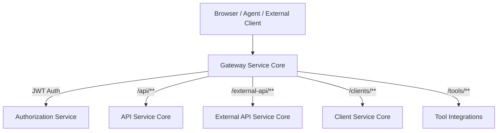
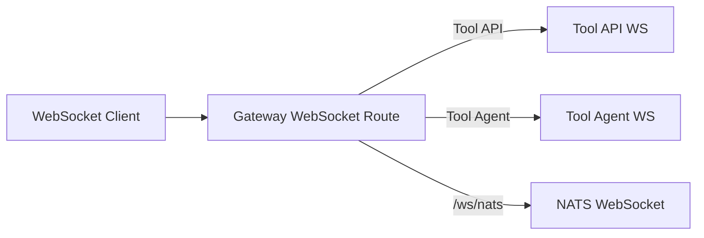
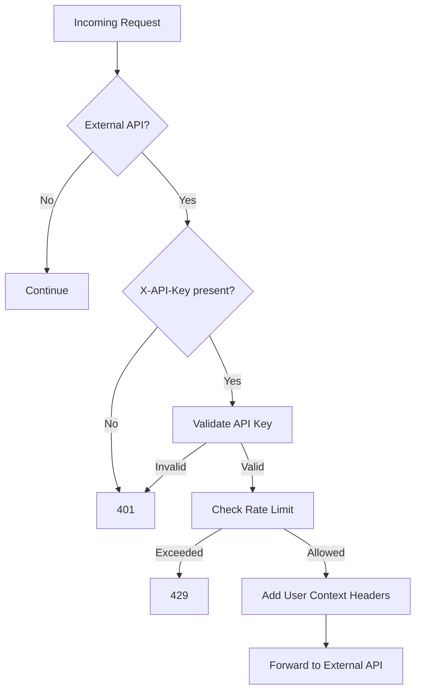
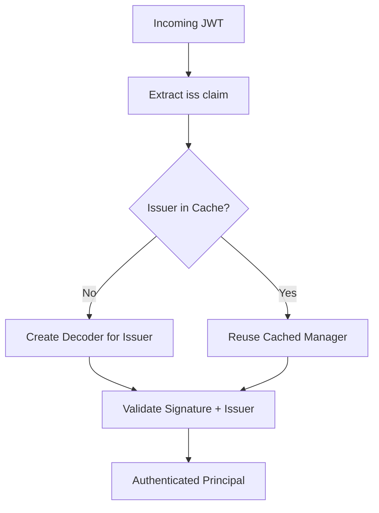
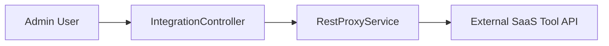

# Gateway Service Core

## Overview

The **Gateway Service Core** module is the reactive edge layer of the OpenFrame platform. It acts as the primary entry point for HTTP and WebSocket traffic, enforcing authentication, authorization, API key validation, rate limiting, multi-tenant JWT verification, and request proxying to downstream services.

Built on **Spring Cloud Gateway** and **Spring WebFlux**, the module provides:

- Centralized security enforcement (JWT + API key)
- Multi-tenant issuer validation
- WebSocket routing for tools and agents
- Tool integration proxying
- CORS and origin sanitization
- Rate limiting support for external APIs

This module is deployed via the `GatewayApplication` in the service-applications layer.

---

## Architectural Role in the Platform

The Gateway Service Core sits in front of:

- API Service Core (dashboard APIs)
- External API Service Core (public API endpoints)
- Client Service Core (agents and machine communication)
- Authorization Service Core (token issuance and OIDC flows)
- Tool integrations (external SaaS systems)

### High-Level Request Flow

The Gateway is responsible for security and routing — not domain logic.

---

# Core Responsibilities

## 1. Reactive HTTP Client Configuration

### WebClientConfig

Provides a preconfigured `WebClient.Builder` using Reactor Netty with:

- 30-second connect timeout
- 30-second response timeout
- Read/write timeout handlers

This client is used for proxying tool API calls and other downstream service communication.

---

## 2. WebSocket Gateway Routing

### WebSocketGatewayConfig

Defines dynamic WebSocket routing rules for:

- `/ws/tools/{toolId}/**`
- `/ws/tools/agent/{toolId}/**`
- `/ws/nats`

It configures:

- Custom `RouteLocator` rules
- Tool API and Tool Agent WebSocket proxy filters
- NATS WebSocket forwarding
- A `WebSocketService` security decorator

### WebSocket Routing Architecture

The gateway does not process WebSocket payloads — it securely forwards them.

---

## 3. API Key Authentication & Rate Limiting

### ApiKeyAuthenticationFilter

A **GlobalFilter** that secures `/external-api/**` endpoints.

### Authentication Flow

### Responsibilities

- Enforces `X-API-Key` header
- Validates API key via `ApiKeyValidationService`
- Enforces rate limits via `RateLimitService`
- Injects contextual headers:
  - `X-API-Key-Id`
  - `X-User-Id`
- Adds rate limit response headers
- Tracks success and failure metrics

### RateLimitConstants

Centralized logging message constants for rate limiting operations.

---

## 4. JWT Authentication & Multi-Tenant Security

The Gateway operates as an OAuth2 Resource Server.

### GatewaySecurityConfig

Configures:

- Reactive JWT authentication
- Role + scope authority mapping
- Path-based access rules
- Custom `AddAuthorizationHeaderFilter`
- BCrypt password encoder

### Path-Based Authorization Model

| Path Prefix | Required Role |
|-------------|--------------|
| `/api/**` | ADMIN |
| `/tools/**` | ADMIN |
| `/tools/agent/**` | AGENT |
| `/clients/**` | AGENT |
| `/ws/nats` | ADMIN or AGENT |
| Public endpoints | Permit All |

---

## 5. Dynamic Issuer-Based JWT Validation

### JwtAuthConfig

Implements a **multi-tenant issuer authentication resolver** using:

- `JwtIssuerReactiveAuthenticationManagerResolver`
- Caffeine cache of issuer-based authentication managers
- Strict issuer validation logic

### IssuerUrlProvider

Resolves valid issuer URLs dynamically from the tenant repository.

- Builds issuer URLs from configured base
- Supports super-tenant configuration
- Caches issuer list reactively

### Multi-Tenant JWT Validation Flow

This design allows:

- Per-tenant issuer separation
- Strict issuer enforcement
- High performance via caching

---

## 6. Authorization Header Normalization

### AddAuthorizationHeaderFilter

Ensures a standard `Authorization: Bearer <token>` header exists by resolving tokens from:

- HTTP-only cookie
- Custom access token header
- Query parameter

This enables consistent downstream authentication without requiring clients to manually manage Authorization headers.

---

## 7. Origin Sanitization & CORS

### OriginSanitizerFilter

- Removes invalid `Origin: null` headers
- Prevents security misinterpretation by downstream components

### CorsConfig

- Configurable global CORS via Spring configuration
- Enabled unless explicitly disabled

---

## 8. Tool Integration Proxying

### IntegrationController

Exposes dynamic proxy endpoints under `/tools`:

- `GET /tools/{toolId}/health`
- `POST /tools/{toolId}/test`
- `/{toolId}/**` (API proxy)
- `/agent/{toolId}/**` (Agent proxy)

The controller delegates to:

- `IntegrationService` (connection testing)
- `RestProxyService` (request forwarding)

### Proxy Architecture

The Gateway performs:

- Authentication enforcement
- Role verification
- Transparent request forwarding

---

# Security Layers Summary

The Gateway applies security in layered order:

1. OriginSanitizerFilter (header normalization)
2. AddAuthorizationHeaderFilter (token resolution)
3. JWT authentication (issuer-based)
4. Path-based authorization
5. ApiKeyAuthenticationFilter (external APIs only)
6. Rate limiting

This layered approach ensures defense-in-depth while preserving reactive performance.

---

# Reactive & Performance Characteristics

The Gateway Service Core is fully non-blocking:

- Built on Spring WebFlux
- Uses Reactor types (`Mono`, `Flux`)
- Uses Caffeine for in-memory authentication manager caching
- Uses Reactor Netty for HTTP client transport

This enables:

- High concurrency
- Low thread utilization
- Horizontal scalability

---

# Summary

The **Gateway Service Core** is the platform’s secure edge and traffic orchestrator. It:

- Enforces JWT-based multi-tenant authentication
- Secures external APIs with API key validation and rate limiting
- Proxies tool and agent traffic
- Handles WebSocket routing
- Normalizes authentication headers
- Applies fine-grained path-based authorization

It does not implement domain logic — instead, it protects and routes traffic to specialized backend modules, forming the backbone of OpenFrame’s secure service architecture.
