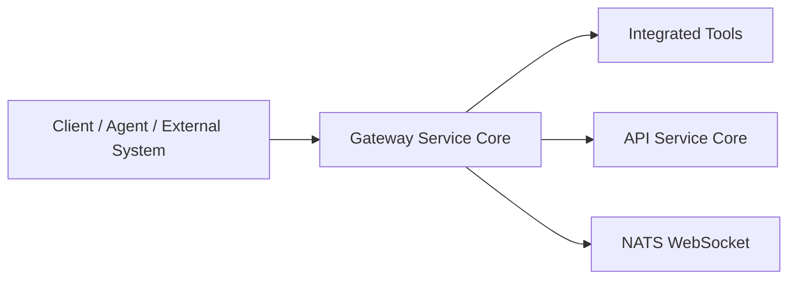
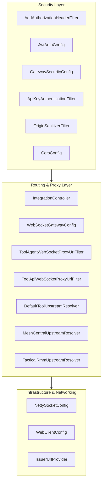
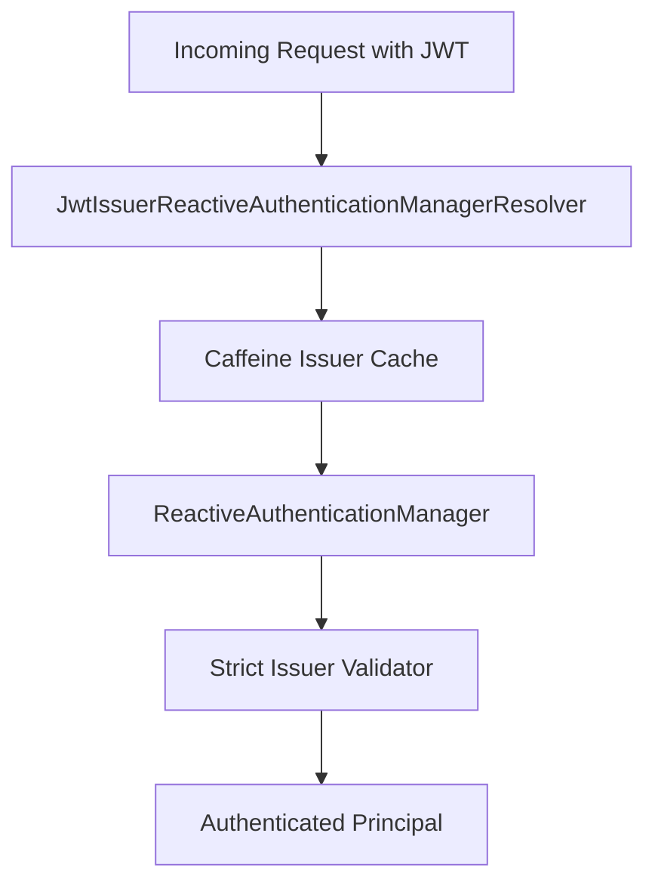
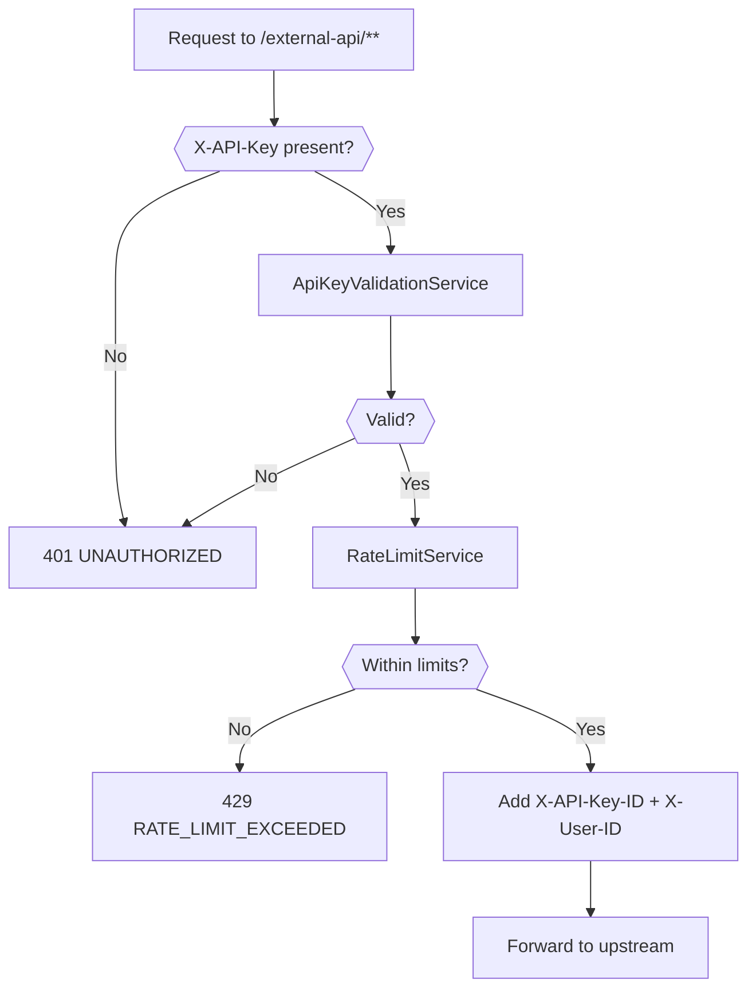
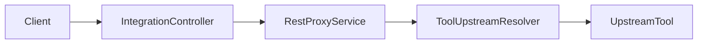
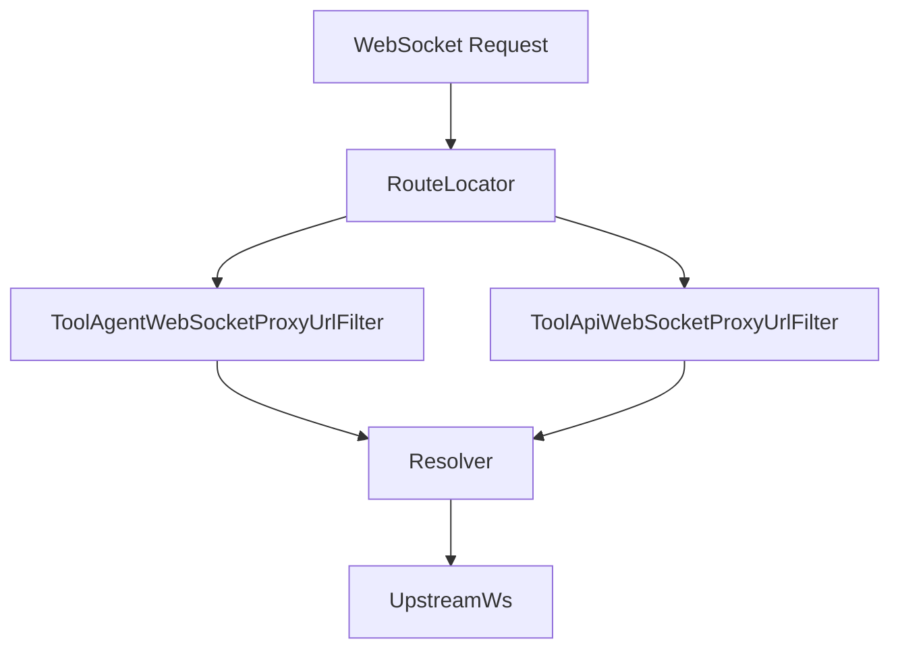
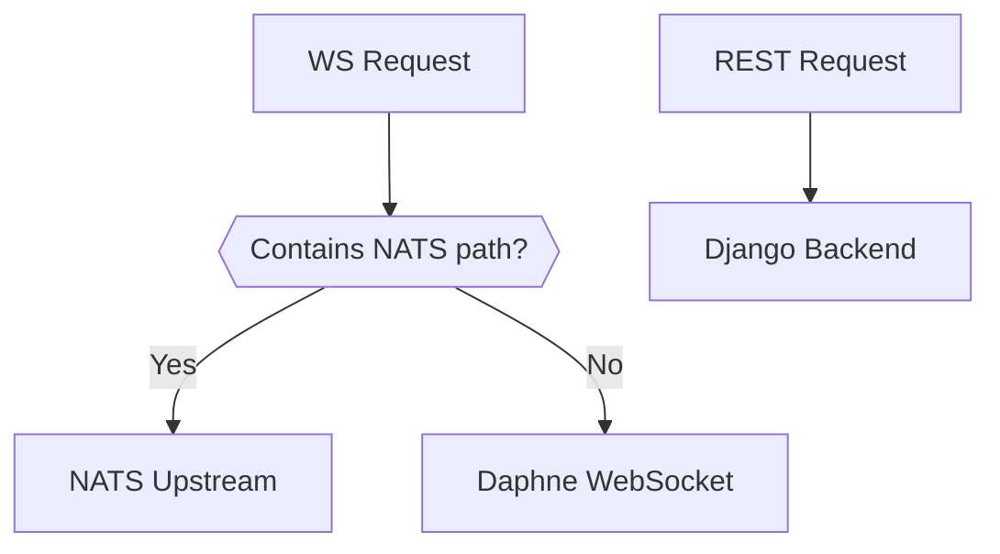

# Gateway Service Core

The **Gateway Service Core** module is the reactive edge layer of the OpenFrame platform. It acts as a secure, multi-tenant, WebSocket- and REST-capable reverse proxy that:

- Terminates authentication (JWT, API keys)
- Enforces role-based access control
- Applies rate limiting for external APIs
- Routes REST and WebSocket traffic to integrated tools
- Resolves tenant-aware issuers dynamically
- Applies upstream-specific routing strategies (MeshCentral, Tactical RMM, default tools)

It is implemented using **Spring WebFlux**, **Spring Cloud Gateway**, and **Reactor Netty**, enabling high concurrency and non-blocking I/O.

---

## 1. Architectural Role in the Platform

The Gateway Service Core sits between clients (UI, agents, external systems) and internal services or integrated third-party tools.



### Responsibilities

1. **Authentication & Authorization** (JWT, roles, scopes)
2. **API Key validation + rate limiting** for `/external-api/**`
3. **WebSocket proxying** for tools and NATS
4. **Tool-aware upstream resolution**
5. **Security hardening** (CORS, origin sanitization, header enforcement)
6. **Reactive routing and connection tuning**

---

## 2. High-Level Component Architecture



---

# 3. Security Model

The Gateway Service Core operates as an **OAuth2 Resource Server** with dynamic multi-issuer resolution.

## 3.1 JWT Authentication

### Key Components

- `JwtAuthConfig`
- `GatewaySecurityConfig`
- `IssuerUrlProvider`

### Multi-Issuer Strategy



### Behavior

- Uses `JwtIssuerReactiveAuthenticationManagerResolver`
- Caches authentication managers per issuer (Caffeine)
- Strict issuer validation via `IssuerUrlProvider`
- Supports:
  - Platform issuer (configured public key)
  - Tenant-based issuers (`allowed-issuer-base/{tenantId}`)

If issuer validation fails → `INVALID_TOKEN`.

---

## 3.2 Role-Based Authorization

Configured in `GatewaySecurityConfig`.

### Roles

- `ADMIN`
- `AGENT`

### Example Route Rules

- `/api/**` → `ADMIN`
- `/tools/agent/**` → `AGENT`
- `/ws/tools/agent/**` → `AGENT`
- `/tools/**` → `ADMIN`
- `/chat/**` → `ADMIN` or `AGENT`

Authorization is enforced via `SecurityWebFilterChain`.

---

## 3.3 API Key Authentication (External API)

Handled by `ApiKeyAuthenticationFilter`.

### Applies To

- `/external-api/**`

### Processing Flow



### Features

- Per-minute, hour, and day limits
- Adds standard rate limit headers
- Records successful/failed request statistics
- Writes error responses directly (reactive filter context)

Constants defined in `RateLimitConstants`.

---

## 3.4 Pre-Authentication Token Injection

`AddAuthorizationHeaderFilter` ensures an `Authorization` header exists.

It resolves bearer tokens from:

1. Access token cookie
2. Custom `Access-Token` header
3. `authorization` query parameter

If resolved → injects standard `Authorization: Bearer <token>` header.

This allows:
- Browser cookie-based auth
- WebSocket query-token support
- Backward compatibility with alternative headers

---

## 3.5 Origin & CORS Hardening

- `OriginSanitizerFilter` removes `Origin: null`
- `CorsConfig` configures global CORS via properties

Prevents WebSocket and browser-origin edge cases.

---

# 4. REST Tool Proxying

Handled by `IntegrationController`.

## Endpoints

- `GET /tools/{toolId}/health`
- `POST /tools/{toolId}/test`
- `/{toolId}/**` → REST proxy
- `/agent/{toolId}/**` → Agent proxy

## REST Proxy Flow



The gateway delegates URL resolution to the `ToolUpstreamResolver` strategy.

---

# 5. WebSocket Routing

Configured in `WebSocketGatewayConfig`.

## Endpoint Prefixes

- `/ws/tools/agent/{toolId}/**`
- `/ws/tools/{toolId}/**`
- `/ws/nats`
- `/ws/nats-api`

## Routing Strategy



### Differences

| Filter | Tool ID extraction | Header mutation |
|--------|-------------------|----------------|
| ToolAgentWebSocketProxyUrlFilter | Path index 4 | No extra headers |
| ToolApiWebSocketProxyUrlFilter | Path index 3 | Injects API key headers |

The API filter:
- Removes `Origin`
- Injects resolved API key headers

---

# 6. Tool Upstream Resolution Strategy

The Gateway Service Core uses a **strategy registry pattern**.

## Resolver Types

### 6.1 DefaultToolUpstreamResolver

- Fallback resolver
- Reads upstream from Mongo `IntegratedTool`
- Uses `ToolUrlService`
- Supports REST and WebSocket

### 6.2 MeshCentralUpstreamResolver

- Static config-based routing
- Avoids Mongo lookup
- Single upstream host
- Adds optional path prefix safely

### 6.3 TacticalRmmUpstreamResolver

Path-based WebSocket fan-out:



Removes previous nginx dependency by directly selecting upstream.

---

# 7. Networking & Reactive Infrastructure

## 7.1 NettySocketConfig

Optimizes TCP behavior:

- `SO_LINGER = 0`
- `TCP_NODELAY = true`

Applies to:
- Netty server
- HTTP client
- WebSocket client

Reduces latency and avoids lingering socket states.

---

## 7.2 WebClientConfig

Configures:

- 30s connect timeout
- 30s read timeout
- 30s write timeout

Uses Reactor Netty connector.

---

# 8. Internal Auth Probe

`InternalAuthProbeController`

Conditional endpoint:

- `/internal/authz/probe`

Enabled only when:

```
openframe.gateway.internal.enable=true
```

Used for internal health or infrastructure-level authentication validation.

---

# 9. Path Organization

Centralized in `PathConstants`:

- `/clients`
- `/api`
- `/tools`
- `/ws/tools`
- `/chat`
- `/guide`

Prevents path duplication and simplifies security configuration.

---

# 10. Reactive Execution Model

The Gateway Service Core is fully non-blocking:

- Built on Spring WebFlux
- Uses `Mono` and `Flux`
- No blocking servlet stack
- Suitable for high-concurrency WebSocket traffic

All filters and controllers operate within a reactive pipeline.

---

# 11. Summary of Responsibilities

| Concern | Component |
|----------|------------|
| JWT multi-issuer auth | JwtAuthConfig |
| Role-based access | GatewaySecurityConfig |
| API key auth | ApiKeyAuthenticationFilter |
| Rate limiting | RateLimitService integration |
| WebSocket routing | WebSocketGatewayConfig |
| Tool routing strategy | ToolUpstreamResolver implementations |
| TCP tuning | NettySocketConfig |
| REST client tuning | WebClientConfig |
| Origin sanitization | OriginSanitizerFilter |
| CORS | CorsConfig |

---

# 12. Design Principles

1. **Reactive-first architecture**
2. **Tenant-aware security**
3. **Strategy-based upstream resolution**
4. **Strict issuer validation**
5. **Explicit role enforcement**
6. **Centralized edge-layer security**

The **Gateway Service Core** is the enforcement boundary and traffic director of the OpenFrame platform, ensuring secure, scalable, and tool-aware communication between clients and backend services.