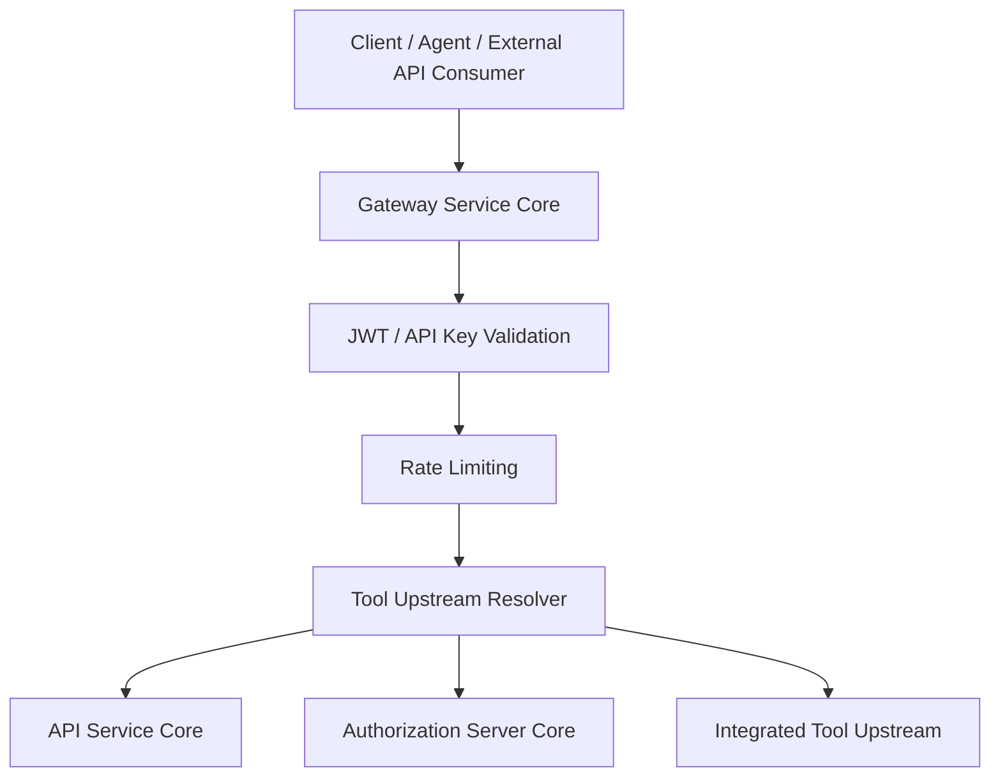
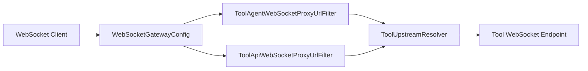
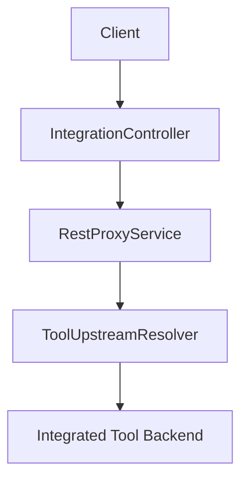
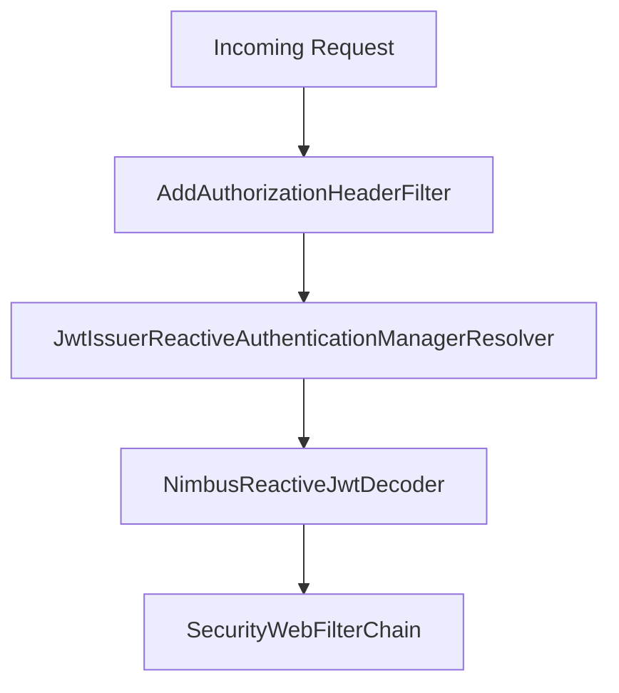
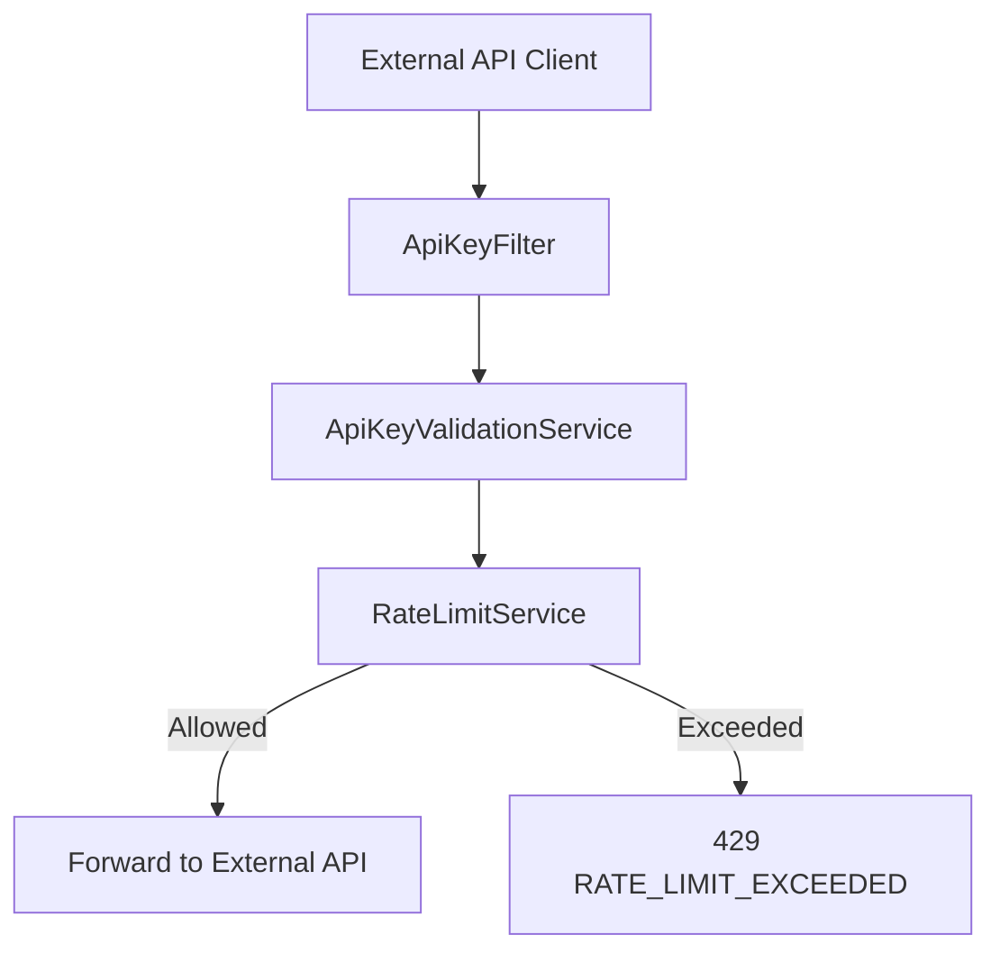
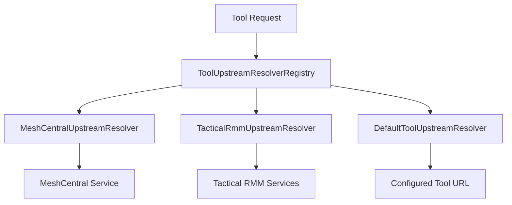

# Gateway Service Core

The **Gateway Service Core** module is the reactive edge layer of the OpenFrame platform.  
It acts as the single entry point for REST, WebSocket, and external API traffic, enforcing:

- Authentication and JWT validation  
- API key validation and rate limiting  
- Role-based access control  
- CORS and origin sanitization  
- Intelligent upstream routing for integrated tools  
- WebSocket proxying with security and metrics  

This module is used by the Gateway application (`GatewayApplication`) and sits in front of services such as:

- `api-service-core-graphql-and-rest`  
- `authorization-server-core`  
- `management-service-core`  
- Integrated tools (MeshCentral, Tactical RMM, etc.)  

---

## 1. Architectural Overview

At runtime, the Gateway Service Core is built on:

- **Spring WebFlux (Reactive stack)**  
- **Spring Cloud Gateway**  
- **Spring Security (OAuth2 Resource Server)**  
- **Reactor Netty**  

### High-Level Request Flow



The Gateway performs security checks first, then forwards traffic to the appropriate internal service or external integrated tool.

---

## 2. Core Responsibilities

### 2.1 Reactive Network Configuration

**Components:**
- `NettySocketConfig`  
- `WebClientConfig`  

These classes configure Reactor Netty for both inbound and outbound traffic.

Key characteristics:

- `SO_LINGER = 0` for fast socket cleanup  
- `TCP_NODELAY = true` to reduce latency  
- 30s connect and read/write timeouts for upstream calls  
- Custom `ReactorNettyWebSocketClient` for proxying WebSocket sessions  

This ensures low-latency proxy behavior and predictable timeout handling when forwarding to tools.

---

### 2.2 WebSocket Gateway Routing

**Component:** `WebSocketGatewayConfig`  
**Filters:**  
- `ToolAgentWebSocketProxyUrlFilter`  
- `ToolApiWebSocketProxyUrlFilter`

The Gateway exposes WebSocket endpoints:

- `/ws/tools/{toolId}/**`  
- `/ws/tools/agent/{toolId}/**`  
- `/ws/nats`  
- `/ws/nats-api`

Routing is defined via a custom `RouteLocator`.



#### Tool Agent vs Tool API

- **Agent WS** extracts `toolId` from a deeper path index  
- **API WS** injects tool-specific API key headers and strips `Origin`  

The WebSocket layer also supports:

- Optional proxy session cleanup  
- Traffic metrics  
- JWT claims extraction during handshake  

---

### 2.3 REST Proxy for Integrated Tools

**Controller:** `IntegrationController`

Exposes endpoints:

- `GET /tools/{toolId}/health`  
- `POST /tools/{toolId}/test`  
- `/{toolId}/**` proxy endpoints  
- `/agent/{toolId}/**` proxy endpoints  

Flow:



The controller delegates to:

- `IntegrationService` for health checks  
- `RestProxyService` for transparent API forwarding  

---

## 3. Security Architecture

Security is implemented using **Spring Security WebFlux** with OAuth2 Resource Server support.

### 3.1 Authorization Header Enrichment

**Filter:** `AddAuthorizationHeaderFilter`

If an `Authorization` header is missing, the filter attempts to resolve a bearer token from:

- `access_token` cookie  
- `Access-Token` header  
- `authorization` query parameter  

If found, it injects:

```text
Authorization: Bearer <token>
```

This enables flexible BFF-style authentication.

---

### 3.2 JWT Authentication and Multi-Issuer Support

**Components:**
- `GatewaySecurityConfig`  
- `JwtAuthConfig`  
- `DefaultIssuerUrlProvider`

The Gateway:

- Acts as an OAuth2 resource server  
- Resolves authentication managers dynamically by JWT issuer  
- Caches issuer-specific managers using Caffeine  
- Validates issuer against allowed tenant issuers  



Roles extracted:

- `roles` → `ROLE_*`  
- `scope` → `SCOPE_*`

Authorization rules are defined using path matchers in `GatewaySecurityConfig`.

Examples:

- `/api/**` → `ROLE_ADMIN`  
- `/tools/agent/**` → `ROLE_AGENT`  
- `/ws/tools/**` → role-based  
- `/clients/**` → `ROLE_AGENT`  

---

### 3.3 API Key Authentication and Rate Limiting

**Filter:** `ApiKeyAuthenticationFilter`

Applies to:

```text
/external-api/**
```

Flow:



Features:

- Validates `X-API-Key`  
- Increments usage counters  
- Enforces minute, hour, and day limits  
- Adds rate limit headers:
  - `X-Rate-Limit-Limit-Minute`  
  - `X-Rate-Limit-Remaining-Minute`  
  - Hour/day equivalents  

On success:

- Injects `X-API-Key-Id`  
- Injects `X-User-Id`  
- Removes original API key header  

---

### 3.4 CORS and Origin Handling

**Components:**
- `CorsConfig`  
- `CorsDisableConfig`  
- `OriginSanitizerFilter`

Modes:

- OSS mode → strict CORS using `spring.cloud.gateway.globalcors` config  
- SaaS mode → permissive CORS (`allowCredentials=true`, allow `*`)  

`OriginSanitizerFilter` removes `Origin: null` to prevent WebSocket and browser anomalies.

---

## 4. Tool Upstream Resolution

Tool routing is abstracted behind `ToolUpstreamResolver`.

### 4.1 Default Resolver

**Component:** `DefaultToolUpstreamResolver`

- Reads upstream URL from `IntegratedTool` Mongo document  
- Uses `ToolUrlService`  
- Resolves API and WebSocket endpoints  

### 4.2 MeshCentral Resolver

**Components:**
- `MeshCentralRoutingProperties`  
- `MeshCentralUpstreamResolver`

Characteristics:

- Configuration-driven routing (no Mongo lookup per request)  
- Separate API and WS upstream  
- Optional path prefix injection for tenant scoping  

### 4.3 Tactical RMM Resolver

**Component:** `TacticalRmmUpstreamResolver`

Routes based on path:

- REST → Django backend  
- WS (NATS path) → NATS listener  
- Other WS → Daphne ASGI server  



This pluggable design allows adding new tools without changing core routing logic.

---

## 5. Internal Auth Probe

**Controller:** `InternalAuthProbeController`

Conditional endpoint:

```text
/internal/authz/probe
```

Enabled when:

```text
openframe.gateway.internal.enable=true
```

Used for:

- Health checks between internal services  
- Kubernetes readiness probes  

---

## 6. Interaction with Other Modules

The Gateway Service Core sits in front of multiple platform modules:

- API handling → `api-service-core-graphql-and-rest`  
- OAuth2 / SSO → `authorization-server-core`  
- Tool and tenant data → `data-mongo-domain-and-repositories`  
- Streaming integrations → `stream-service-core`  

It does **not** implement business logic — it enforces security, routing, and protocol translation.

---

## 7. Summary

The **Gateway Service Core** is the security and routing backbone of OpenFrame.

It provides:

- Reactive edge proxy (REST + WebSocket)  
- Multi-issuer JWT authentication  
- API key authentication and rate limiting  
- Role-based access control  
- Pluggable upstream resolution for integrated tools  
- CORS and origin hardening  

By centralizing these cross-cutting concerns, it keeps downstream services focused purely on domain logic while maintaining strong security and tenant isolation at the platform edge.
