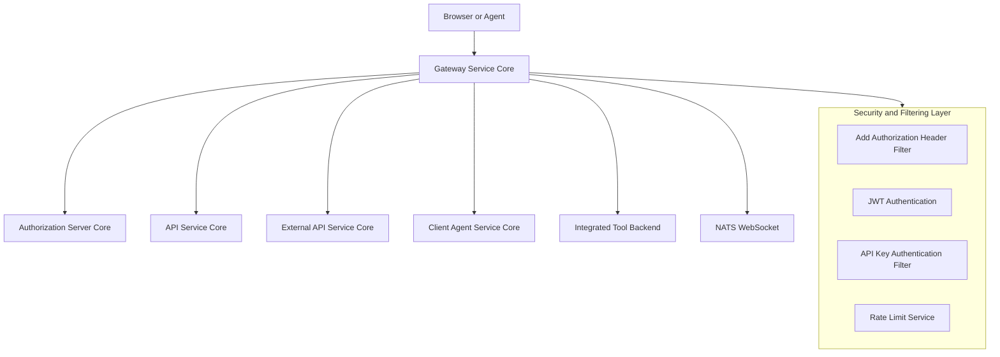
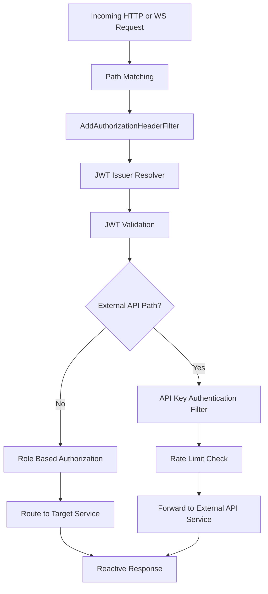
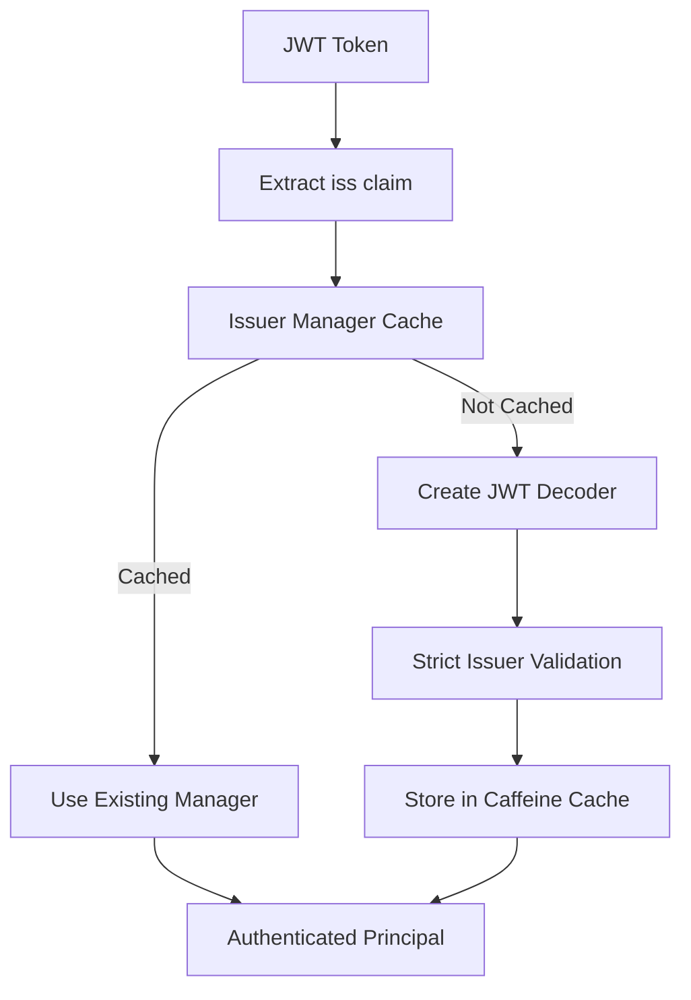
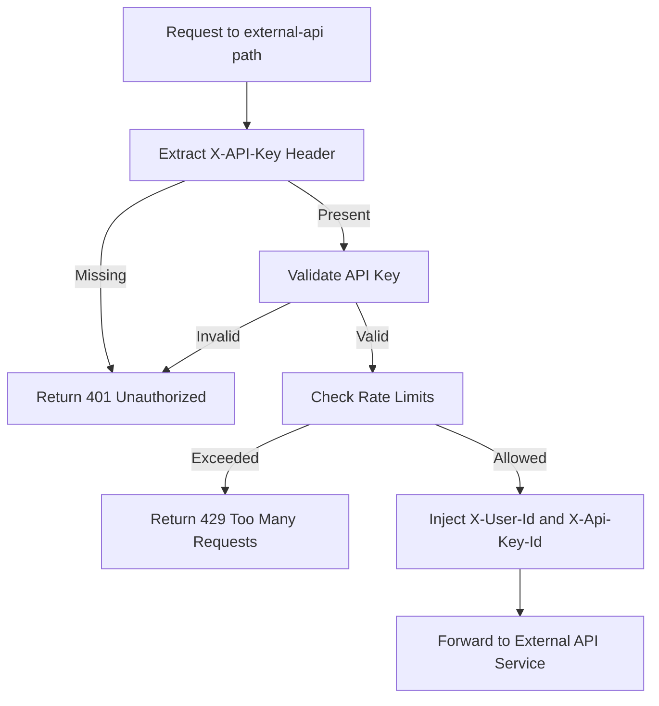
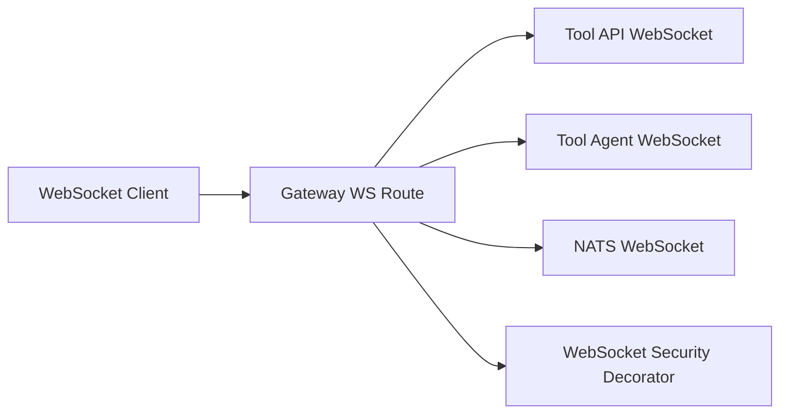
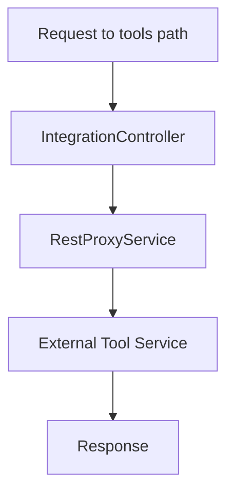

# Gateway Service Core

The **Gateway Service Core** module is the reactive edge layer of the OpenFrame platform. It acts as a unified entry point for HTTP and WebSocket traffic, enforcing authentication, authorization, rate limiting, multi-tenant JWT validation, and intelligent request routing to downstream services.

It is built on **Spring Boot WebFlux** and **Spring Cloud Gateway**, enabling high-throughput, non-blocking request processing across REST and WebSocket channels.

---

## 1. Purpose and Responsibilities

The Gateway Service Core is responsible for:

- Acting as the single external entry point for internal services
- Enforcing JWT-based authentication (multi-issuer, multi-tenant)
- Enforcing API key authentication for `/external-api/**` endpoints
- Applying rate limiting policies
- Injecting authorization headers when missing
- Routing WebSocket traffic for tools and NATS
- Proxying integration API requests to tool backends
- Enforcing role-based access control (ADMIN, AGENT)

It integrates closely with:

- Authorization Server Core (JWT issuer)
- API Service Core (dashboard APIs)
- External API Service Core (public external APIs)
- Client Agent Service Core (agent-facing endpoints)
- Data Persistence and Messaging Core (tenant + API key validation)

---

## 2. High-Level Architecture



The Gateway is reactive end-to-end and built using WebFlux and Reactor.

---

## 3. Application Bootstrap

### GatewayApplication

The `GatewayApplication` class bootstraps the service.

Key aspects:

- Uses `@SpringBootApplication`
- Scans the following base packages:
  - `com.openframe.gateway`
  - `com.openframe.core`
  - `com.openframe.data`
  - `com.openframe.security`

This ensures security, data, and shared core components are available to the gateway.

---

## 4. Request Processing Pipeline

The request lifecycle inside the Gateway Service Core:



---

## 5. Security Architecture

### 5.1 Path Constants

`PathConstants` defines major route prefixes:

- `/clients` → Client Agent Service
- `/api` → Dashboard APIs
- `/tools` → Tool REST APIs
- `/ws/tools` → Tool WebSocket APIs

These constants are reused across filters and security configuration.

---

### 5.2 AddAuthorizationHeaderFilter

This filter ensures the `Authorization` header exists before JWT validation.

It resolves bearer tokens from multiple sources:

1. `access_token` cookie
2. Custom `Access-Token` header
3. `authorization` query parameter

If found, it mutates the request and injects:

```text
Authorization: Bearer <token>
```

This enables compatibility with browsers, WebSockets, and non-standard clients.

---

### 5.3 JWT Authentication (Multi-Issuer)

JWT validation is handled by:

- `JwtAuthConfig`
- `IssuerUrlProvider`
- `GatewaySecurityConfig`

#### Multi-Tenant Issuer Resolution



Key characteristics:

- Uses `JwtIssuerReactiveAuthenticationManagerResolver`
- Uses Caffeine cache for issuer managers
- Supports super-tenant issuer
- Strict issuer validation against tenant repository

---

### 5.4 Role-Based Access Control

Configured in `GatewaySecurityConfig`.

Roles:

- `ROLE_ADMIN`
- `ROLE_AGENT`

Authorization rules include:

- `/api/**` → ADMIN
- `/tools/**` → ADMIN
- `/tools/agent/**` → AGENT
- `/clients/**` → AGENT
- `/ws/tools/**` → Role-based
- NATS WebSocket → ADMIN or AGENT

Public endpoints include:

- `/health/**`
- `/error/**`
- `/actuator/**`
- Agent registration endpoints

---

## 6. API Key Authentication and Rate Limiting

The `ApiKeyAuthenticationFilter` applies only to:

```text
/external-api/**
```

### Authentication Flow



### Features

- Enforces API key presence
- Validates via `ApiKeyValidationService`
- Increments usage statistics
- Applies minute/hour/day rate limits
- Adds rate limit headers
- Records success/failure metrics

Standard rate limit headers include:

```text
X-Rate-Limit-Limit-Minute
X-Rate-Limit-Remaining-Minute
X-Rate-Limit-Limit-Hour
X-Rate-Limit-Remaining-Hour
X-Rate-Limit-Limit-Day
X-Rate-Limit-Remaining-Day
```

---

## 7. WebSocket Routing

Configured in `WebSocketGatewayConfig`.

### Supported Endpoints

- `/ws/tools/{toolId}/**` → Tool API WebSocket
- `/ws/tools/agent/{toolId}/**` → Agent WebSocket
- `/ws/nats` → NATS WebSocket bridge

### WebSocket Routing Architecture



A custom `WebSocketService` decorator ensures JWT claims are validated before WebSocket upgrade.

---

## 8. Integration Proxy Layer

The `IntegrationController` enables dynamic REST proxying to integrated tools.

### Supported Patterns

- `GET /tools/{toolId}/health`
- `POST /tools/{toolId}/test`
- `/tools/{toolId}/**` → Proxy API
- `/tools/agent/{toolId}/**` → Proxy Agent API

### Proxy Flow



This allows the gateway to serve as a reverse proxy for external tool integrations.

---

## 9. WebClient Configuration

`WebClientConfig` provides a customized reactive HTTP client:

- 30-second connect timeout
- 30-second read/write timeout
- Reactor Netty configuration
- Shared `WebClient.Builder` bean

Used internally for proxying and downstream communication.

---

## 10. CORS Configuration

`CorsConfig` enables configurable global CORS support.

- Enabled unless `openframe.gateway.disable-cors=true`
- Uses `spring.cloud.gateway.globalcors` properties
- Registers reactive `CorsWebFilter`

---

## 11. Multi-Tenant Support

The `IssuerUrlProvider`:

- Queries tenant repository
- Builds issuer URLs dynamically
- Supports super-tenant fallback
- Caches issuer list reactively

This enables dynamic tenant onboarding without restarting the gateway.

---

## 12. Operational Characteristics

- Fully reactive (WebFlux)
- Non-blocking request processing
- Cached JWT managers per issuer
- Reactive rate limiting
- Global filters with deterministic ordering
- Compatible with horizontal scaling

---

## 13. Summary

The **Gateway Service Core** is the secure, reactive edge layer of the OpenFrame platform. It provides:

- Multi-tenant JWT authentication
- API key enforcement and rate limiting
- Role-based access control
- WebSocket routing
- Tool integration proxying
- Header mutation and token normalization

It ensures that all downstream services remain isolated from direct exposure while centralizing authentication, authorization, and routing logic in a single scalable gateway service.
