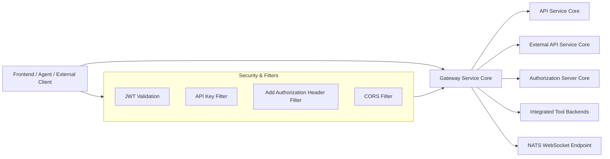
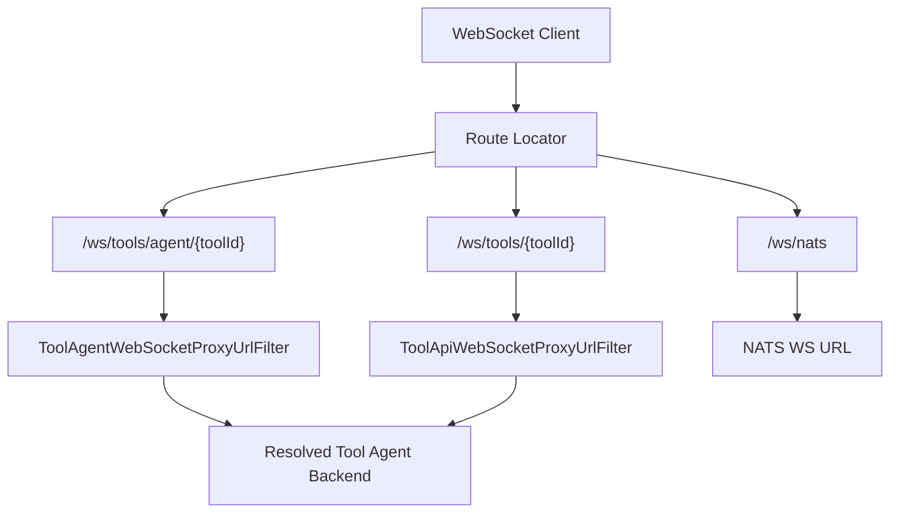
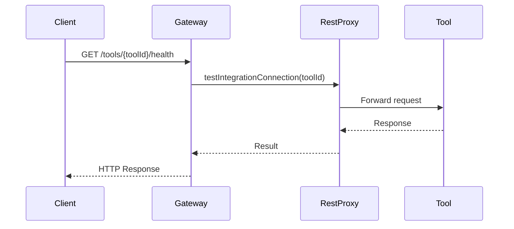
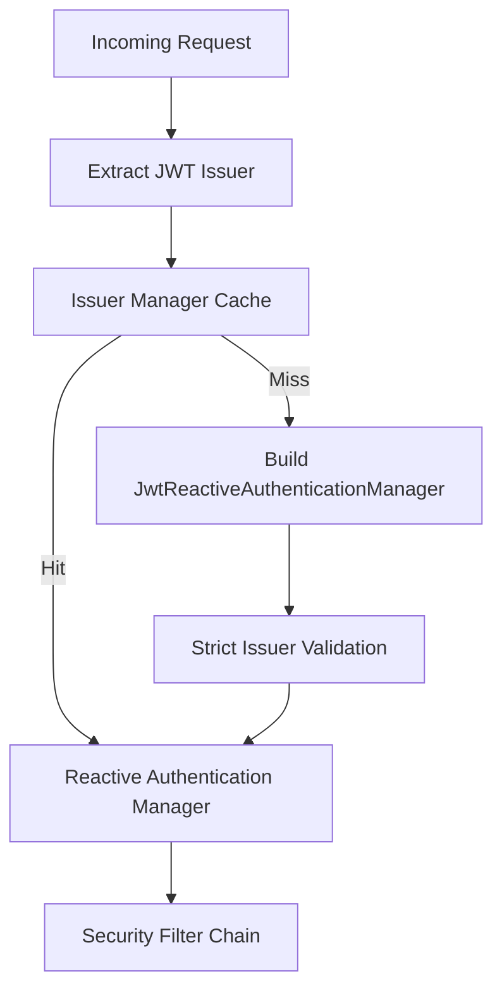
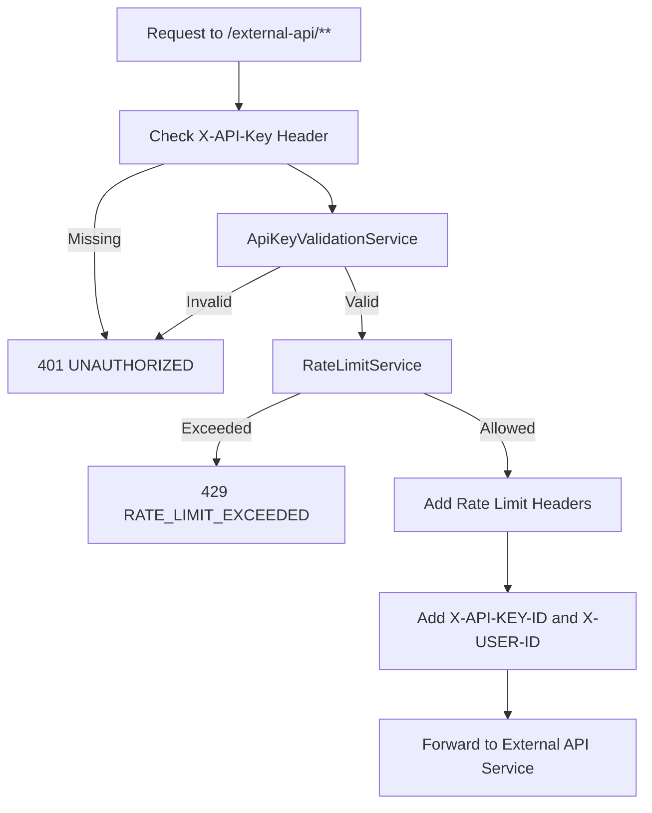
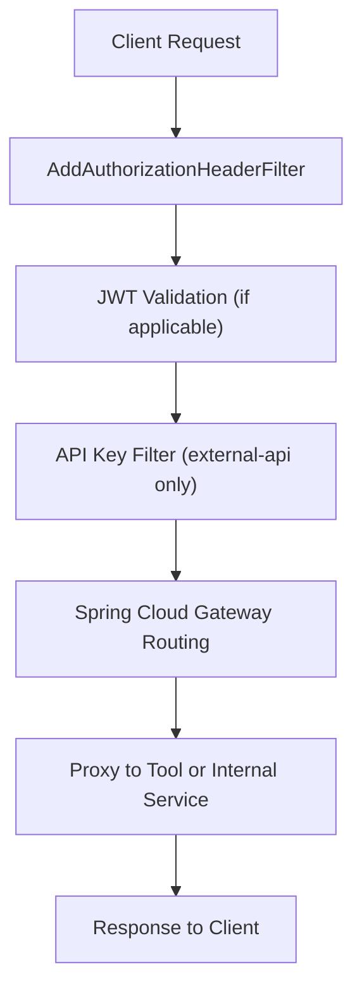

# Gateway Service Core

The **Gateway Service Core** module is the reactive edge layer of the OpenFrame platform. It acts as the single entry point for HTTP and WebSocket traffic, enforcing security, routing requests to downstream services, proxying tool integrations, and applying cross-cutting concerns such as JWT validation, API key authentication, CORS, and rate limiting.

Built on **Spring Cloud Gateway** and **Spring WebFlux**, this module is fully reactive and designed to operate in multi-tenant, OAuth2/OIDC-secured environments.

---

## 1. Purpose and Responsibilities

The Gateway Service Core is responsible for:

- ✅ Acting as the **API Gateway** for all platform services
- ✅ Enforcing **JWT-based authentication and authorization**
- ✅ Supporting **multi-issuer (multi-tenant) JWT validation**
- ✅ Authenticating external API requests using **API keys**
- ✅ Applying **rate limiting policies**
- ✅ Proxying REST and WebSocket requests to integrated tools
- ✅ Enriching requests with security headers
- ✅ Managing CORS policies

It sits between clients (frontend, agents, external integrations) and backend services such as:

- API Service Core
- Authorization Server Core
- External API Service Core
- Management Service Core
- Stream Processing Core

---

## 2. High-Level Architecture



The Gateway is structured around three core pillars:

1. **Security Layer** – JWT validation, role-based access control, API key authentication.
2. **Routing & Proxy Layer** – REST and WebSocket routing to internal services and tool integrations.
3. **Integration Layer** – Dynamic resolution and proxying of tool-specific endpoints.

---

## 3. Core Configuration Components

### 3.1 WebClient Configuration

**Component:** `WebClientConfig`

Provides a preconfigured `WebClient.Builder` with:

- 30-second connection timeout
- 30-second response timeout
- Read and write timeout handlers
- Reactor Netty-based HTTP connector

This builder is used by internal proxy services for outbound calls to tools and backend services.

---

## 4. WebSocket Gateway

### 4.1 WebSocket Routing

**Component:** `WebSocketGatewayConfig`

Defines WebSocket routes for:

- `/ws/tools/agent/{toolId}/**`
- `/ws/tools/{toolId}/**`
- `/ws/nats`



### 4.2 Tool WebSocket Proxy Filters

**Components:**
- `ToolAgentWebSocketProxyUrlFilter`
- `ToolApiWebSocketProxyUrlFilter`

Responsibilities:

- Extract `toolId` from the request path
- Resolve the correct backend URL using:
  - `ReactiveIntegratedToolRepository`
  - `ToolUrlService`
  - `ProxyUrlResolver`
- Rewrite and forward WebSocket traffic

These filters enable dynamic routing per tool and per tenant.

---

## 5. REST Tool Integration

### 5.1 Integration Controller

**Component:** `IntegrationController`

Base path: `/tools`

Exposes:

- `GET /tools/{toolId}/health`
- `POST /tools/{toolId}/test`
- Proxy endpoints for:
  - `/tools/{toolId}/**`
  - `/tools/agent/{toolId}/**`



The controller delegates to:

- `IntegrationService` – connectivity testing
- `RestProxyService` – request forwarding

---

## 6. Security Architecture

The Gateway Service Core enforces multiple authentication strategies depending on the endpoint type.

### 6.1 JWT Resource Server Configuration

**Components:**
- `GatewaySecurityConfig`
- `JwtAuthConfig`
- `IssuerUrlProvider`

#### Multi-Issuer Support

The gateway supports dynamic JWT issuers:

- Uses `JwtIssuerReactiveAuthenticationManagerResolver`
- Caches authentication managers using Caffeine
- Supports:
  - Platform issuer
  - Tenant-specific issuer
  - Optional super-tenant issuer



#### Role-Based Access Control

Defined in `GatewaySecurityConfig`:

- `ROLE_ADMIN`
- `ROLE_AGENT`
- Scope-based authorities (`SCOPE_*`)

Path-level enforcement examples:

- `/api/**` → `ADMIN`
- `/tools/agent/**` → `AGENT`
- `/ws/tools/agent/**` → `AGENT`
- `/tools/**` → `ADMIN`

---

### 6.2 Add Authorization Header Filter

**Component:** `AddAuthorizationHeaderFilter`

Purpose:

Ensures an `Authorization: Bearer` header exists before authentication.

Token resolution order:

1. Access token cookie
2. Custom `Access-Token` header
3. `authorization` query parameter

If found, the filter mutates the request and injects:

```text
Authorization: Bearer <token>
```

This enables consistent downstream authentication using standard OAuth2 resource server configuration.

---

### 6.3 API Key Authentication for External APIs

**Component:** `ApiKeyAuthenticationFilter`

Applies only to:

```text
/external-api/**
```

Flow:



Key features:

- Validates API key
- Increments usage counters
- Applies minute/hour/day limits
- Returns standard rate limit headers
- Writes JSON error responses directly from the filter

This mechanism is independent from JWT authentication.

---

## 7. CORS Configuration

**Component:** `CorsConfig`

- Enabled by default
- Controlled by `openframe.gateway.disable-cors`
- Loads configuration from:

```text
spring.cloud.gateway.globalcors.cors-configurations.[/**]
```

Registers a `CorsWebFilter` that applies global CORS rules.

---

## 8. Path Constants

**Component:** `PathConstants`

Defines key route prefixes:

```text
CLIENTS_PREFIX = /clients
DASHBOARD_PREFIX = /api
TOOLS_PREFIX = /tools
WS_TOOLS_PREFIX = /ws/tools
```

These constants ensure consistent routing and authorization rules across the gateway.

---

## 9. Request Lifecycle Overview



Depending on the path:

- Dashboard → Routed to API Service Core
- External API → API key validated and forwarded to External API Service Core
- Tool REST → Proxied via RestProxyService
- Tool WebSocket → Routed via WebSocket filters
- NATS WebSocket → Routed to configured NATS backend

---

## 10. How Gateway Service Core Fits into the Platform

Within the OpenFrame platform architecture, the Gateway Service Core:

- Serves as the **security boundary** for all incoming traffic
- Centralizes authentication and authorization logic
- Enables multi-tenant JWT validation
- Standardizes request headers and context propagation
- Abstracts tool-specific backends behind consistent URLs
- Provides rate limiting for public external APIs

It decouples clients from internal service topology, allowing backend services to evolve without exposing structural changes.

---

## 11. Key Design Characteristics

- ✅ Fully reactive (Spring WebFlux)
- ✅ Multi-tenant JWT validation
- ✅ Dynamic issuer resolution
- ✅ Pluggable API key authentication
- ✅ Dynamic WebSocket routing per tool
- ✅ Centralized role-based authorization
- ✅ Non-blocking rate limiting

The Gateway Service Core is the foundational traffic control layer that ensures security, scalability, and consistency across the entire OpenFrame ecosystem.
