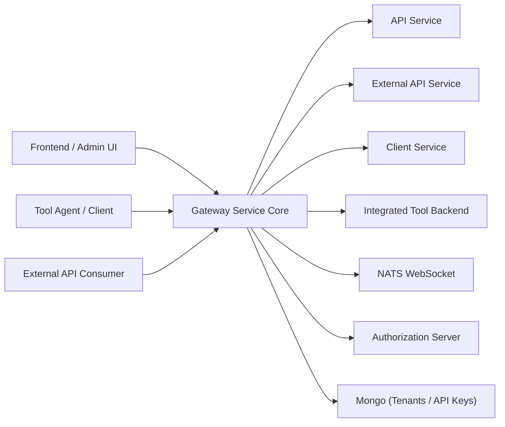
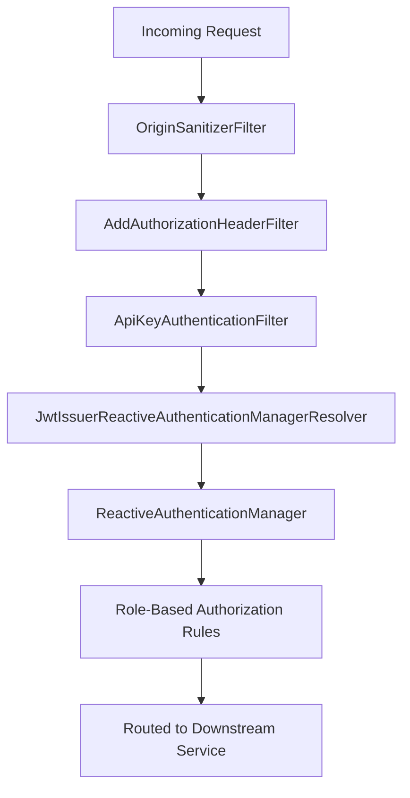
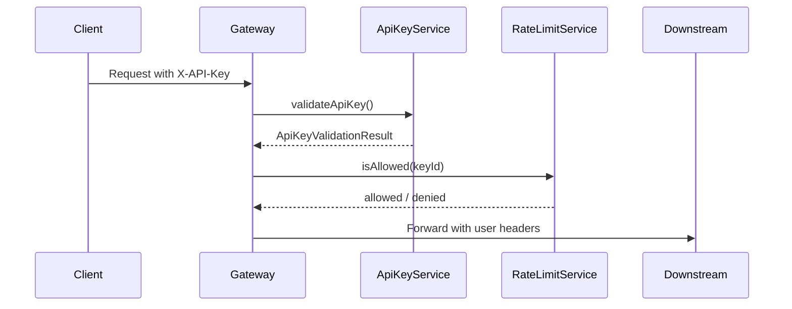
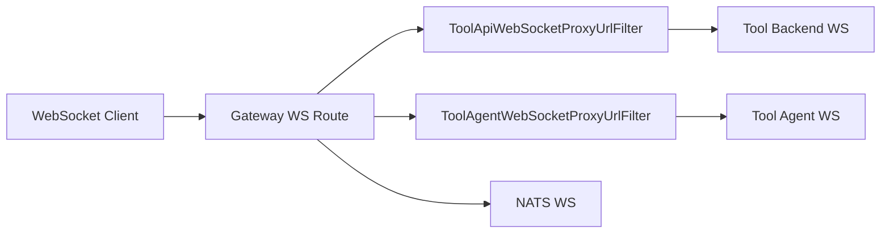
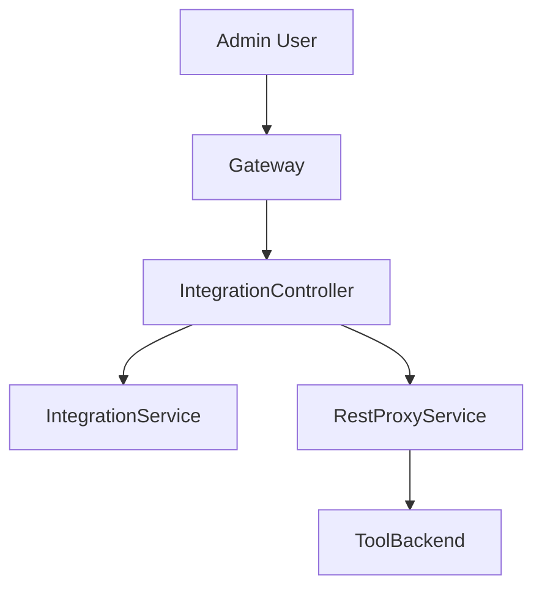

# Gateway Service Core

The **Gateway Service Core** module is the reactive edge layer of the OpenFrame platform. It acts as a unified entry point for HTTP and WebSocket traffic, enforcing authentication, authorization, API key validation, rate limiting, CORS policies, and dynamic proxying to downstream services and integrated tools.

Built on **Spring Cloud Gateway** and **Spring WebFlux**, this module provides:

- Reactive request routing and filtering
- Multi-tenant JWT validation
- API key authentication for external APIs
- Role-based access control (ADMIN / AGENT)
- WebSocket proxying for tools and NATS
- Dynamic issuer resolution for SaaS tenants
- Tool API and agent proxying

It integrates closely with:

- Authorization Server (JWT issuer)
- API Service and External API Service
- Client Service (agents)
- Data persistence (Mongo repositories)
- Shared security and OAuth utilities

---

# Architectural Overview

The Gateway Service Core sits at the boundary between clients and backend services.



## Responsibilities at a Glance

| Concern | Component(s) |
|----------|--------------|
| JWT Authentication | `JwtAuthConfig`, `GatewaySecurityConfig`, `IssuerUrlProvider` |
| Authorization Header Enrichment | `AddAuthorizationHeaderFilter` |
| API Key Auth + Rate Limit | `ApiKeyAuthenticationFilter`, `RateLimitConstants` |
| CORS Handling | `CorsConfig`, `CorsDisableConfig` |
| WebSocket Routing | `WebSocketGatewayConfig`, Tool WS filters |
| Tool HTTP Proxy | `IntegrationController` |
| Origin Hardening | `OriginSanitizerFilter` |
| HTTP Client Configuration | `WebClientConfig` |

---

# Security Architecture

Security in Gateway Service Core is layered and reactive.



## 1. Authorization Header Resolution

**AddAuthorizationHeaderFilter** ensures a valid `Authorization: Bearer` header exists by resolving tokens from:

- Secure HTTP cookies
- Custom `Access-Token` header
- `authorization` query parameter

This enables flexible token transport strategies (browser-based, WebSocket, query-based flows) while standardizing authentication via the resource server layer.

---

## 2. JWT Authentication & Multi-Tenancy

### JwtAuthConfig

Provides:

- `JwtIssuerReactiveAuthenticationManagerResolver`
- Per-issuer `ReactiveAuthenticationManager`
- Caffeine cache for issuer managers

It supports:

- Static issuer (platform JWT)
- Dynamic tenant-based issuers

### IssuerUrlProvider

Resolves valid issuer URLs dynamically from tenant data stored in Mongo.

Key characteristics:

- Lazy initialization
- Cached issuer list
- Support for super-tenant issuer
- Strict issuer validation

This enables SaaS multi-tenancy without hardcoding issuer URLs.

---

## 3. Role-Based Access Control

Defined in **GatewaySecurityConfig**.

Roles:

- `ADMIN`
- `AGENT`

Authorization mapping includes:

- `/api/**` → ADMIN
- `/tools/**` → ADMIN
- `/tools/agent/**` → AGENT
- `/ws/tools/**` → ADMIN
- `/ws/tools/agent/**` → AGENT
- `/clients/**` → AGENT
- `/ws/nats` → ADMIN or AGENT

JWT roles are extracted from:

- `roles` claim → `ROLE_*`
- `scope` claim → `SCOPE_*`

---

# API Key Authentication & Rate Limiting

External APIs under `/external-api/**` use API key authentication.



## ApiKeyAuthenticationFilter

Responsibilities:

1. Applies only to `/external-api/**`
2. Requires `X-API-Key`
3. Validates key via `ApiKeyValidationService`
4. Checks rate limits via `RateLimitService`
5. Adds context headers:
   - `X-API-Key-Id`
   - `X-User-Id`
6. Removes original API key header
7. Writes JSON error responses directly (WebFlux filter layer)

### Rate Limit Headers

If enabled, responses include:

- `X-Rate-Limit-Limit-Minute`
- `X-Rate-Limit-Remaining-Minute`
- `X-Rate-Limit-Limit-Hour`
- `X-Rate-Limit-Remaining-Hour`
- `X-Rate-Limit-Limit-Day`
- `X-Rate-Limit-Remaining-Day`

Rate limit logging constants are defined in **RateLimitConstants**.

---

# WebSocket Gateway

The Gateway supports secure WebSocket proxying for:

- Tool API connections
- Tool Agent connections
- NATS WebSocket endpoint

## WebSocket Routing

Defined in **WebSocketGatewayConfig**.



### ToolApiWebSocketProxyUrlFilter

- Extracts `toolId` from `/ws/tools/{toolId}/**`
- Resolves target URL
- Proxies connection

### ToolAgentWebSocketProxyUrlFilter

- Extracts `toolId` from `/ws/tools/agent/{toolId}/**`
- Uses repository + tool URL service
- Proxies agent-level WS traffic

### WebSocket Security Decoration

The `WebSocketService` is wrapped by a security decorator that:

- Reads JWT claims
- Enforces authentication before WebSocket handshake

---

# Tool HTTP Proxy Layer

The **IntegrationController** exposes HTTP proxy endpoints for tools.

Endpoints:

- `GET /tools/{toolId}/health`
- `POST /tools/{toolId}/test`
- `/{toolId}/**` → API proxy
- `/agent/{toolId}/**` → Agent proxy



This allows:

- Centralized authentication
- Transparent proxying
- Tool isolation by ID

---

# CORS Strategy

Two mutually exclusive configurations:

## CorsConfig (Default)

Enabled when:

`openframe.gateway.disable-cors=false`

Uses Spring Cloud Gateway global CORS configuration.

## CorsDisableConfig (SaaS Mode)

Enabled when:

`openframe.gateway.disable-cors=true`

Behavior:

- Allows all origins
- Allows credentials
- Permissive wildcard rules

Intended for single-domain SaaS deployments.

---

# HTTP Client Configuration

## WebClientConfig

Provides a preconfigured `WebClient.Builder` with:

- 30s connect timeout
- 30s read timeout
- 30s write timeout
- Reactor Netty client connector

This is used by internal services for:

- Tool backend calls
- Integration validation
- Downstream service communication

---

# Origin Hardening

## OriginSanitizerFilter

Prevents problematic CORS scenarios by:

- Removing `Origin: null` header

This avoids security misinterpretation by downstream services.

---

# Internal Auth Probe

## InternalAuthProbeController

Conditional endpoint:

`/internal/authz/probe`

Enabled via:

`openframe.gateway.internal.enable=true`

Used for:

- Liveness checks
- Internal connectivity validation

---

# Path Model

Path prefixes are centralized in **PathConstants**:

```text
/clients
/api
/tools
/ws/tools
```

These constants ensure consistent routing and security mapping.

---

# Reactive Design Principles

The Gateway Service Core follows strict reactive patterns:

- Non-blocking request handling
- Mono/Flux-based service contracts
- Filter-level error handling
- Header mutation via immutable request copies
- Deferred response header mutation via `beforeCommit`

This allows the gateway to scale horizontally under high concurrency.

---

# Summary

The **Gateway Service Core** is the security and routing backbone of OpenFrame.

It provides:

- Multi-tenant JWT validation
- Role-based access control
- API key validation and rate limiting
- Secure WebSocket proxying
- Tool HTTP proxying
- CORS flexibility (OSS vs SaaS)
- Reactive, non-blocking edge processing

By centralizing cross-cutting concerns at the gateway layer, the platform ensures:

- Clean downstream services
- Strong perimeter security
- Flexible multi-tenant SaaS operation
- Scalable reactive performance
