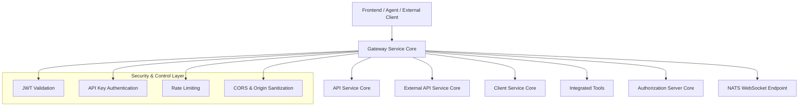
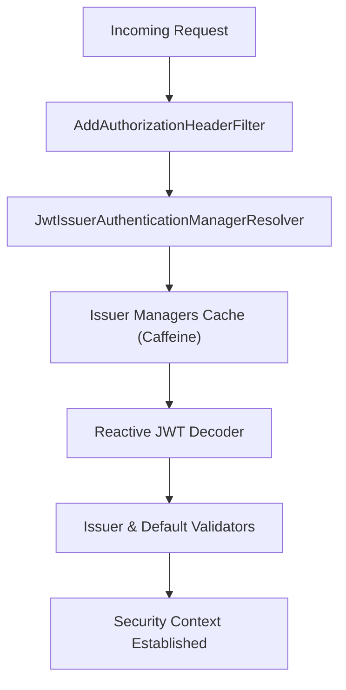
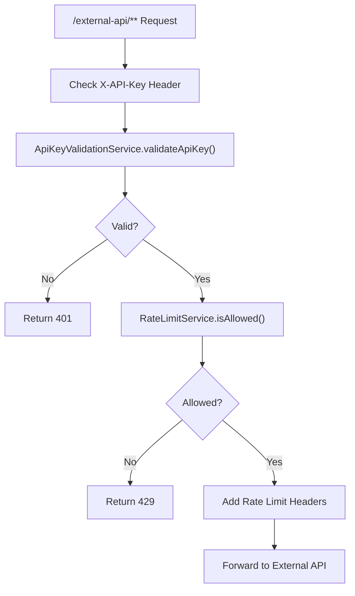
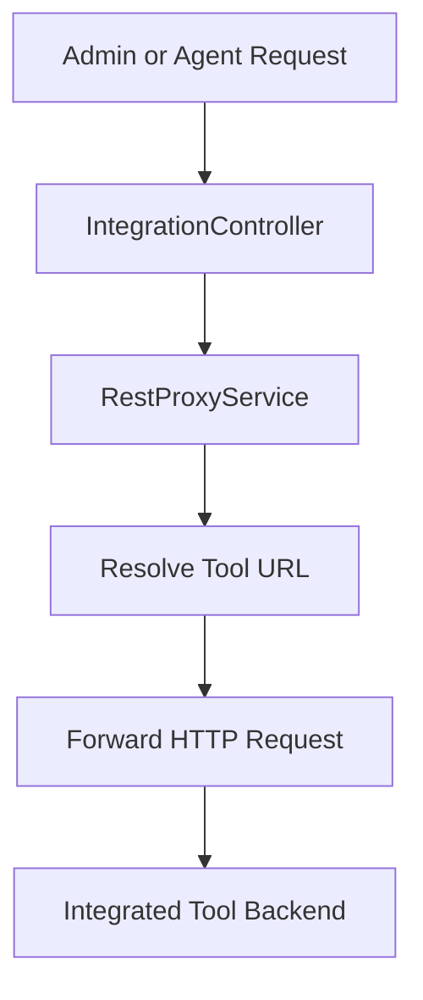
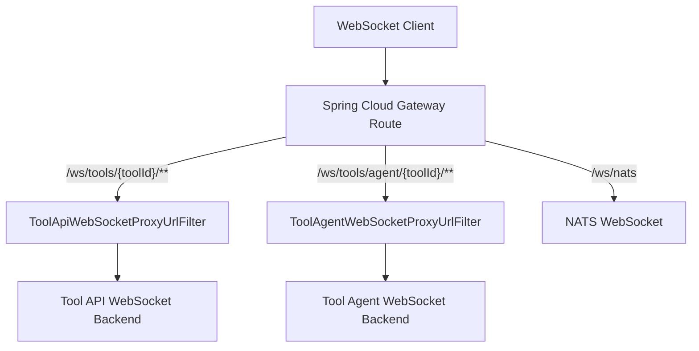
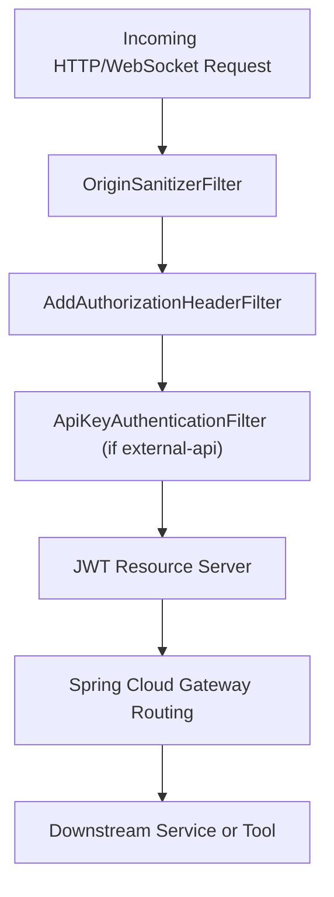

# Gateway Service Core

The **Gateway Service Core** module is the reactive edge layer of the OpenFrame platform. It acts as the single entry point for HTTP and WebSocket traffic, enforcing authentication, authorization, rate limiting, and multi-tenant JWT validation before routing requests to downstream services such as API, Client, External API, and integrated tools.

Built on **Spring Cloud Gateway** and **Spring WebFlux**, this module provides:

- Centralized security enforcement (JWT + API key)
- Multi-tenant issuer validation and caching
- Tool API and Agent API proxying (HTTP + WebSocket)
- Rate limiting for external API consumers
- Header normalization and token propagation
- CORS and origin sanitization

---

## 1. Architectural Overview

The Gateway Service Core sits at the edge of the system and brokers traffic between clients (UI, agents, third-party integrations) and internal services.



### Key Responsibilities

1. **Authentication**
   - JWT-based resource server validation
   - API key validation for `/external-api/**`

2. **Authorization**
   - Role-based route access (ADMIN, AGENT)

3. **Multi-tenant Issuer Resolution**
   - Dynamic issuer validation per tenant

4. **Tool Proxying**
   - HTTP proxying for integrated tools
   - WebSocket proxying for tools and NATS

5. **Rate Limiting**
   - Per-API key minute/hour/day limits

---

## 2. Security Architecture

Security in the Gateway Service Core is layered and reactive.

### 2.1 JWT-Based Authentication

Core components:

- `GatewaySecurityConfig`
- `JwtAuthConfig`
- `IssuerUrlProvider`
- `AddAuthorizationHeaderFilter`
- `PathConstants`

#### JWT Flow



### Multi-Tenant Issuer Validation

`IssuerUrlProvider` dynamically resolves allowed issuer URLs using the tenant repository and caches them. `JwtAuthConfig` uses a Caffeine `LoadingCache` to maintain per-issuer `ReactiveAuthenticationManager` instances.

Strict issuer validation ensures:

- The token issuer matches configured tenant issuer URLs
- Super-tenant issuer is optionally allowed

---

### 2.2 Role-Based Route Authorization

Defined in `GatewaySecurityConfig`.

Roles:

- `ROLE_ADMIN`
- `ROLE_AGENT`

Example route protections:

- `/api/**` → ADMIN
- `/tools/agent/**` → AGENT
- `/ws/tools/agent/**` → AGENT
- `/tools/**` → ADMIN
- `/clients/**` → AGENT

Public routes include health, registration, token endpoints, and UI resources.

---

## 3. API Key Authentication & Rate Limiting

Core components:

- `ApiKeyAuthenticationFilter`
- `RateLimitConstants`

The API key filter applies only to:

```text
/external-api/**
```

### Processing Flow



### Key Features

- Requires `X-API-Key` header
- Increments request counters
- Enforces minute/hour/day limits
- Adds rate limit headers:
  - `X-Rate-Limit-Limit-Minute`
  - `X-Rate-Limit-Remaining-Minute`
  - `X-Rate-Limit-Limit-Hour`
  - `X-Rate-Limit-Remaining-Hour`
  - `X-Rate-Limit-Limit-Day`
  - `X-Rate-Limit-Remaining-Day`
- Records successful and failed request statistics

Errors are written reactively in the filter (not via `@ControllerAdvice`).

---

## 4. Tool HTTP Proxying

Core component:

- `IntegrationController`

Base path:

```text
/tools
```

### Supported Endpoints

- `GET /tools/{toolId}/health`
- `POST /tools/{toolId}/test`
- `/{toolId}/**` (generic proxy)
- `/agent/{toolId}/**` (agent-specific proxy)

### HTTP Proxy Flow



The controller delegates actual forwarding to `RestProxyService`, preserving method, headers, and body.

---

## 5. WebSocket Routing & Proxying

Core components:

- `WebSocketGatewayConfig`
- `ToolApiWebSocketProxyUrlFilter`
- `ToolAgentWebSocketProxyUrlFilter`

### Endpoint Prefixes

```text
/ws/tools/{toolId}/**
/ws/tools/agent/{toolId}/**
/ws/nats
```

### WebSocket Route Configuration



Each filter:

- Extracts `toolId` from the path
- Resolves the target backend URL
- Rewrites and forwards the WebSocket connection

A custom `WebSocketService` decorator ensures JWT claims are available during the handshake phase.

---

## 6. Pre-Authentication & Header Enrichment

Core component:

- `AddAuthorizationHeaderFilter`

### Purpose

Ensures that a standard `Authorization: Bearer <token>` header exists before Spring Security evaluates the request.

### Token Resolution Order

1. Access token cookie
2. Custom `Access-Token` header
3. `authorization` query parameter

If a token is found, it mutates the request and injects the `Authorization` header.

This enables:

- Browser-based cookie auth
- Agent-based header auth
- WebSocket query param auth

---

## 7. CORS & Origin Hardening

Core components:

- `CorsConfig`
- `OriginSanitizerFilter`

### CORS

- Controlled via `spring.cloud.gateway.globalcors.cors-configurations`
- Enabled by default unless explicitly disabled

### Origin Sanitization

If a request contains:

```text
Origin: null
```

The header is removed before further processing to prevent ambiguous CORS behavior.

---

## 8. WebClient Configuration

Core component:

- `WebClientConfig`

Provides a shared `WebClient.Builder` configured with:

- 30s connect timeout
- 30s response timeout
- Read and write timeout handlers

This is used by proxy services for outbound HTTP calls to tools or internal services.

---

## 9. Internal Auth Probe

Core component:

- `InternalAuthProbeController`

Endpoint:

```text
/internal/authz/probe
```

Enabled only when:

```text
openframe.gateway.internal.enable=true
```

Used for internal health and security diagnostics.

---

## 10. Request Lifecycle Summary



The Gateway Service Core guarantees that:

- Every secured request has validated JWT claims
- External API calls are API-key validated and rate limited
- WebSocket traffic is authenticated and properly routed
- Multi-tenant issuer validation is enforced

---

# Conclusion

The **Gateway Service Core** is the security and routing backbone of the OpenFrame platform. It centralizes authentication, authorization, rate limiting, and protocol bridging (HTTP + WebSocket) while maintaining strict multi-tenant isolation.

Its reactive architecture ensures high concurrency, non-blocking I/O, and scalable edge enforcement for all tenant traffic.