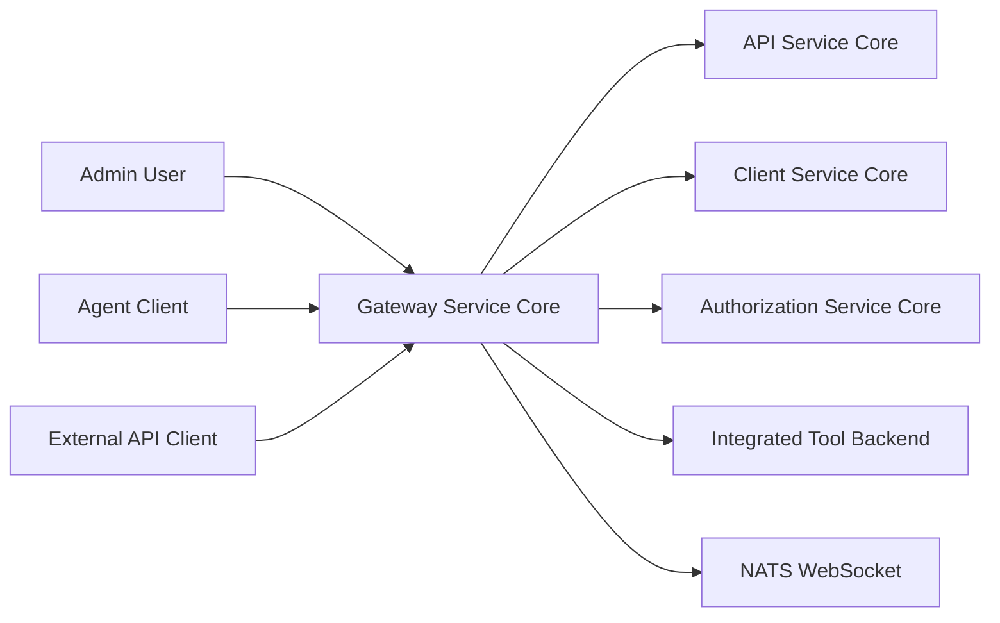
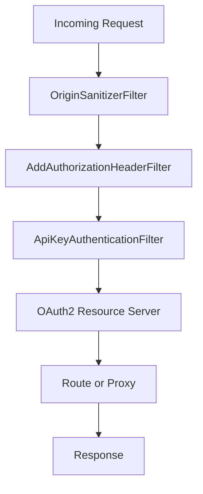
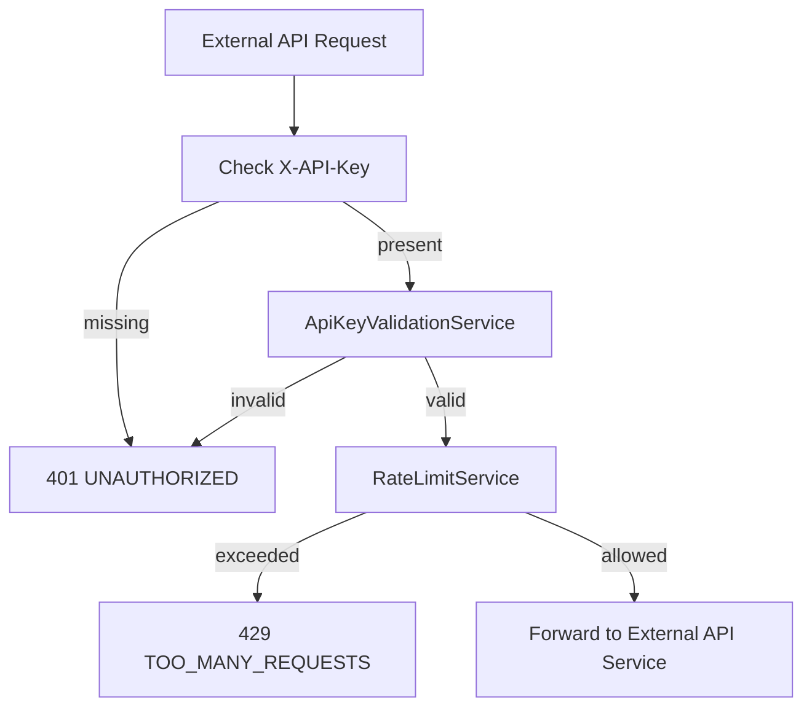
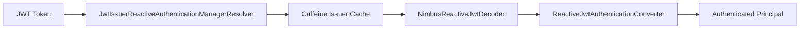
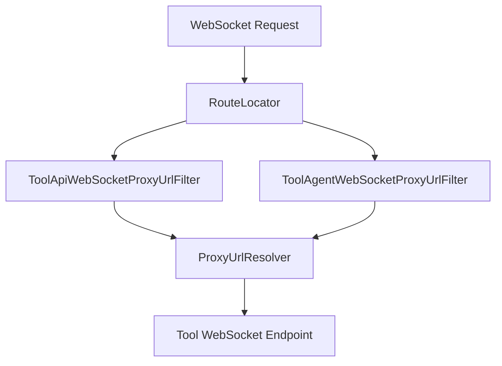
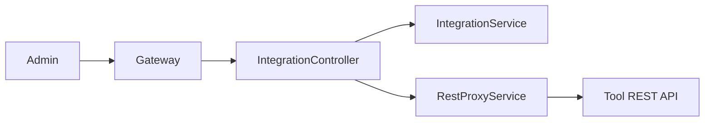
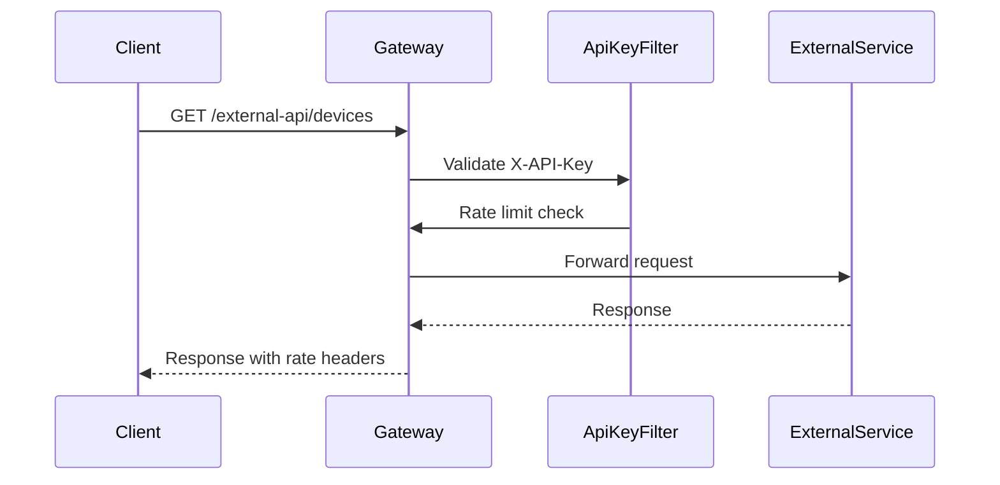

# Gateway Service Core

The **Gateway Service Core** module is the central reactive edge layer of the OpenFrame platform. It acts as the single entry point for HTTP and WebSocket traffic, enforcing authentication, authorization, rate limiting, tenant isolation, and dynamic proxying to downstream services and integrated tools.

Built on **Spring Cloud Gateway** and **Spring WebFlux**, the Gateway Service Core provides:

- OAuth2 Resource Server with multi-tenant JWT validation  
- API key authentication and rate limiting for external APIs  
- Dynamic REST and WebSocket proxying to integrated tools  
- Role-based access control for Admin and Agent users  
- CORS handling and origin sanitization  
- Token propagation and normalization across services  

This module is used by the `GatewayApplication` entrypoint and integrates closely with the Authorization Service Core, API Service Core, Client Service Core, and data-layer modules.

---

## 1. Architectural Overview

At a high level, the Gateway Service Core sits between external clients and internal microservices.

### Responsibilities

| Concern | Handled By |
|----------|------------|
| JWT validation | `JwtAuthConfig`, `GatewaySecurityConfig` |
| Multi-tenant issuer resolution | `IssuerUrlProvider` |
| API key auth & rate limiting | `ApiKeyAuthenticationFilter` |
| WebSocket routing | `WebSocketGatewayConfig` |
| Tool REST proxy | `IntegrationController` |
| Token normalization | `AddAuthorizationHeaderFilter` |
| CORS | `CorsConfig` |
| Origin sanitization | `OriginSanitizerFilter` |

---

## 2. Request Processing Pipeline

The Gateway uses a layered reactive filter chain.

### 2.1 Origin Sanitization

`OriginSanitizerFilter` removes invalid `Origin: null` headers to prevent CORS bypass edge cases.

### 2.2 Authorization Header Normalization

`AddAuthorizationHeaderFilter` ensures a `Authorization: Bearer <token>` header exists by resolving tokens from:

- Secure cookie
- Custom header
- Query parameter

This allows downstream authentication to remain standardized.

### 2.3 API Key Authentication (External APIs)

`ApiKeyAuthenticationFilter` activates only for `/external-api/**` routes.

Flow:

When allowed, the filter:

- Adds `X-API-Key-Id` header  
- Adds `X-User-Id` header  
- Removes raw `X-API-Key` header  
- Injects rate limit headers

Rate limit logging constants are defined in `RateLimitConstants`.

---

## 3. Security Architecture

### 3.1 Reactive Resource Server

`GatewaySecurityConfig` configures the application as a reactive OAuth2 Resource Server.

Key features:

- Multi-issuer JWT support
- Role extraction from `roles` claim
- Scope extraction from `scope` claim
- Role-based route authorization

### 3.2 Multi-Tenant Issuer Resolution

`IssuerUrlProvider` dynamically resolves allowed issuers from the tenant repository.

- Reads tenant IDs from MongoDB
- Builds issuer URLs using configured base
- Caches resolved issuers
- Supports optional super-tenant issuer

This enables strict issuer validation per tenant.

### 3.3 Role-Based Access Control

Routes are protected by role:

- `ADMIN` → `/api/**`, `/tools/**`
- `AGENT` → `/tools/agent/**`, `/clients/**`
- Both → `/ws/nats`

Path prefixes are centralized in `PathConstants`.

---

## 4. WebSocket Gateway

The Gateway Service Core supports dynamic WebSocket proxying.

### 4.1 WebSocket Route Configuration

`WebSocketGatewayConfig` defines routes:

- `/ws/tools/{toolId}/**`
- `/ws/tools/agent/{toolId}/**`
- `/ws/nats`

### 4.2 Tool WebSocket Filters

- `ToolApiWebSocketProxyUrlFilter` extracts tool ID from `/ws/tools/{toolId}/...`
- `ToolAgentWebSocketProxyUrlFilter` extracts tool ID from `/ws/tools/agent/{toolId}/...`

Both:

- Load tool metadata from repository  
- Resolve actual backend URL  
- Rewrite target URI dynamically

### 4.3 WebSocket Security Decoration

A custom `WebSocketService` decorator ensures JWT claims are accessible during WebSocket session establishment.

---

## 5. Tool Integration and REST Proxying

`IntegrationController` handles REST proxying to integrated tools.

### Endpoints

- `GET /tools/{toolId}/health`
- `POST /tools/{toolId}/test`
- `/{toolId}/**` dynamic API proxy
- `/agent/{toolId}/**` agent proxy

This enables dynamic integration of third-party tools without direct exposure.

---

## 6. CORS and HTTP Client Configuration

### 6.1 CORS

`CorsConfig`:

- Configurable via `spring.cloud.gateway.globalcors`
- Enabled by default
- Can be disabled via property flag

### 6.2 Reactive WebClient

`WebClientConfig` defines a tuned `WebClient.Builder`:

- 30s connect timeout  
- 30s read timeout  
- 30s write timeout  

Used internally for outbound service calls and proxying.

---

## 7. External API Flow Summary

---

## 8. Integration with Other Core Modules

The Gateway Service Core interacts with:

- **Authorization Service Core** → JWT issuance and OIDC flows  
- **API Service Core** → Admin dashboard APIs  
- **Client Service Core** → Agent communication  
- **External API Service Core** → External REST endpoints  
- **Data Layer Mongo** → Tenant and API key data  
- **Data Layer Kafka** → NATS and event streaming

The Gateway does not implement business logic. It enforces security, routing, and protocol normalization.

---

## 9. Key Design Principles

### Reactive and Non-Blocking

All filters and controllers are built using Reactor (`Mono`, `Flux`) to maintain scalability.

### Zero Trust Edge

- Every request is authenticated  
- Issuer validation is strict  
- API keys are validated and rate limited  
- Headers are sanitized  

### Multi-Tenant Isolation

- Dynamic issuer validation  
- Tenant-aware routing  
- Role-based authorization per tenant

### Dynamic Tool Integration

- Tool ID based routing  
- Runtime URL resolution  
- REST and WebSocket support

---

## 10. Summary

The **Gateway Service Core** is the secure, multi-tenant, reactive edge of OpenFrame.

It provides:

- OAuth2 resource server capabilities  
- API key authentication and rate limiting  
- Dynamic REST and WebSocket proxying  
- Multi-tenant issuer validation  
- Centralized security and access control

By consolidating authentication, routing, and protocol handling in one place, it ensures that downstream services remain focused on business logic while the gateway enforces platform-wide security and consistency.