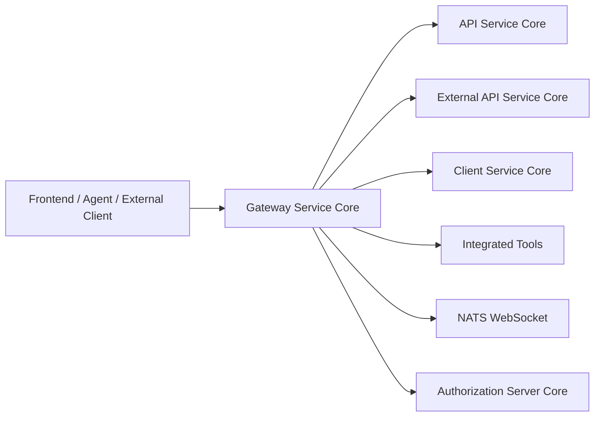
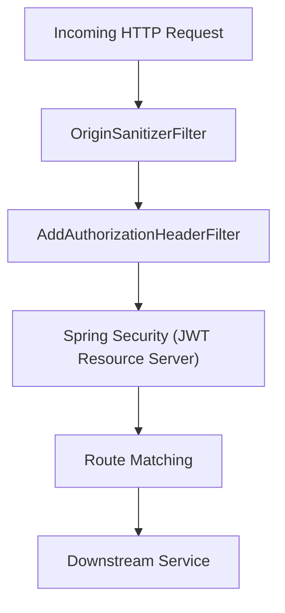
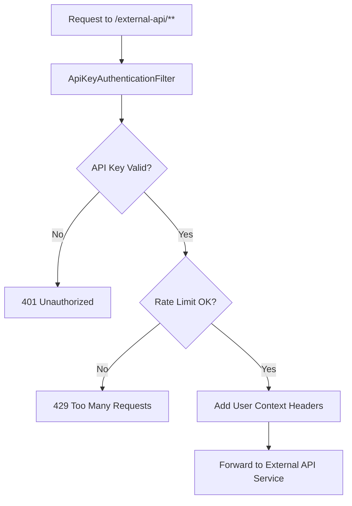
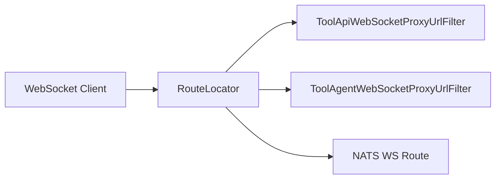
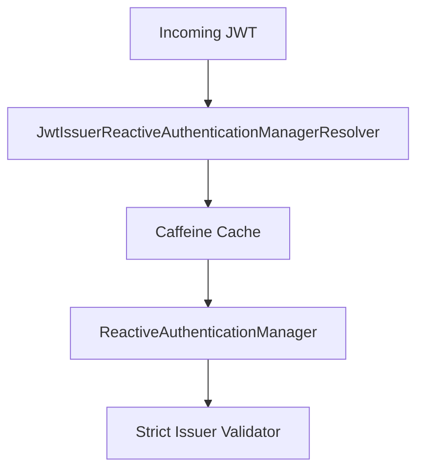
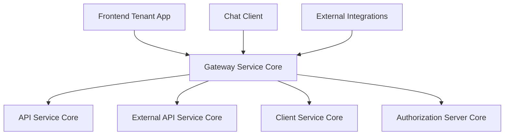

# Gateway Service Core

The **Gateway Service Core** module is the reactive edge layer of the OpenFrame platform. It acts as the unified entry point for:

- Frontend tenant applications
- External API consumers (API key–based access)
- Integrated tools (REST and WebSocket proxying)
- Agents communicating over HTTP and WebSocket
- Internal services requiring JWT-based authentication

Built on **Spring WebFlux** and **Spring Cloud Gateway**, the Gateway Service Core is responsible for:

- Routing and proxying HTTP and WebSocket traffic
- Enforcing authentication and authorization (JWT + API keys)
- Applying rate limiting for external APIs
- Resolving multi-tenant JWT issuers dynamically
- Sanitizing and enriching inbound requests

---

## 1. High-Level Responsibilities

At a high level, the Gateway Service Core provides:

1. **Reactive API Gateway** (HTTP + WebSocket)
2. **JWT-based resource server security**
3. **Multi-tenant issuer validation**
4. **API key authentication and rate limiting** for `/external-api/**`
5. **Tool integration proxying** (REST + WebSocket)
6. **Security header normalization and token resolution**

It sits in front of modules such as:

- API Service Core
- External API Service Core
- Client Service Core
- Authorization Server Core

---

## 2. Architectural Overview

### 2.1 Logical Architecture



The Gateway Service Core acts as:

- A **resource server** validating JWTs
- A **reverse proxy** for tool APIs and agents
- A **policy enforcement point** for rate limits and role-based access

---

## 3. Request Processing Flow

### 3.1 HTTP Request Flow (JWT-secured endpoints)



**Key stages:**

- **OriginSanitizerFilter** removes invalid `Origin: null` headers.
- **AddAuthorizationHeaderFilter** resolves bearer tokens from:
  - Cookie
  - Custom header
  - Query parameter
- **JWT authentication** uses a dynamic issuer resolver.
- Route rules enforce role-based access control.

---

### 3.2 External API Flow (API Key + Rate Limiting)



The **ApiKeyAuthenticationFilter** performs:

1. X-API-Key validation
2. Rate limit enforcement (minute, hour, day)
3. Header enrichment:
   - `X-API-Key-Id`
   - `X-User-Id`
4. Success/failure tracking

---

## 4. Core Components

### 4.1 Web Client Configuration

**Class:** `WebClientConfig`

Provides a preconfigured `WebClient.Builder` with:

- 30-second connection timeout
- 30-second read/write timeout
- Reactor Netty–based connector

This is used by proxy and integration services to communicate with downstream systems in a fully reactive manner.

---

### 4.2 Tool Integration Proxy (REST)

**Controller:** `IntegrationController`

Base path: `/tools`

Capabilities:

- `GET /{toolId}/health`
- `POST /{toolId}/test`
- Proxy all HTTP methods to:
  - `/tools/{toolId}/**`
  - `/tools/agent/{toolId}/**`

Internally delegates to:

- `IntegrationService`
- `RestProxyService`

This enables the Gateway to dynamically route requests to integrated third-party tools without exposing them directly.

---

### 4.3 WebSocket Routing and Proxying

**Configuration:** `WebSocketGatewayConfig`

Defines reactive routes for:

- `/ws/tools/{toolId}/**`
- `/ws/tools/agent/{toolId}/**`
- `/ws/nats`



Two specialized filters:

- `ToolApiWebSocketProxyUrlFilter`
- `ToolAgentWebSocketProxyUrlFilter`

They:

- Extract `toolId` from the path
- Resolve actual tool URL
- Delegate to proxy resolution logic

Additionally, a `WebSocketService` decorator enforces JWT-based security during WebSocket handshake.

---

### 4.4 Security Configuration

#### 4.4.1 Gateway Security Rules

**Class:** `GatewaySecurityConfig`

Configures:

- Reactive WebFlux security
- OAuth2 resource server
- Role-based path matching

Key role rules:

- `ADMIN` → `/api/**`, `/tools/**`, `/ws/tools/**`
- `AGENT` → `/tools/agent/**`, `/clients/**`
- Both → `/ws/nats`

Public endpoints include:

- `/health/**`
- `/error/**`
- Metrics
- Agent registration endpoints

---

#### 4.4.2 Authorization Header Enrichment

**Filter:** `AddAuthorizationHeaderFilter`

Resolves bearer token from:

1. Access token cookie
2. Custom `Access-Token` header
3. Authorization query parameter

If no `Authorization` header exists, it injects:

```text
Authorization: Bearer <token>
```

This allows the Gateway to support browser-based authentication and WebSocket clients without duplicating security logic downstream.

---

#### 4.4.3 Multi-Tenant JWT Issuer Resolution

**Classes:**

- `JwtAuthConfig`
- `IssuerUrlProvider`



Features:

- Caches authentication managers per issuer using Caffeine
- Supports:
  - Primary issuer (platform config)
  - Tenant-specific issuers
  - Optional super-tenant issuer
- Enforces strict issuer validation

Issuer URLs are dynamically built using:

- `ReactiveTenantRepository`
- `allowed-issuer-base` configuration

---

### 4.5 API Key Authentication and Rate Limiting

**Filter:** `ApiKeyAuthenticationFilter`

Applied globally with high precedence.

Scope:

- Only applies to `/external-api/**`
- Skips Swagger/OpenAPI paths

Key responsibilities:

1. Validate API key via `ApiKeyValidationService`
2. Enforce limits via `RateLimitService`
3. Add rate limit headers:
   - `X-Rate-Limit-Limit-Minute`
   - `X-Rate-Limit-Remaining-Minute`
   - Hour and day equivalents
4. Emit structured JSON error responses

Rate limiting logic is abstracted and not hardcoded in the filter, keeping it policy-driven.

---

### 4.6 CORS and Origin Sanitization

- `CorsConfig` registers global CORS configuration.
- `OriginSanitizerFilter` removes `Origin: null` headers to prevent downstream validation issues.

CORS can be disabled via:

```text
openframe.gateway.disable-cors=true
```

---

### 4.7 Internal Auth Probe

**Controller:** `InternalAuthProbeController`

Path:

```text
/internal/authz/probe
```

Enabled only if:

```text
openframe.gateway.internal.enable=true
```

Used for internal liveness and authentication verification.

---

## 5. Path and Routing Constants

**Class:** `PathConstants`

Defines prefixes used consistently across security and routing:

- `/clients`
- `/api`
- `/tools`
- `/ws/tools`

This ensures route definitions and security matchers stay aligned.

---

## 6. Multi-Module Positioning in the Platform



The Gateway Service Core centralizes:

- Authentication enforcement
- Authorization rules
- Cross-cutting concerns (CORS, rate limits, header normalization)
- Tool proxying logic

Downstream services remain focused on business logic rather than security orchestration.

---

## 7. Design Principles

The Gateway Service Core follows these principles:

- **Reactive-first**: Fully WebFlux-based, non-blocking I/O
- **Separation of concerns**: Security, routing, and proxy logic are modularized
- **Tenant-aware security**: Issuer validation is dynamic and cache-backed
- **Edge enforcement**: Rate limits and API key validation occur before business logic
- **Extensibility**: Filters and route definitions can be extended without rewriting core logic

---

## 8. Summary

The **Gateway Service Core** is the enforcement and routing boundary of the OpenFrame platform. It:

- Validates JWTs across tenants
- Authenticates API keys and enforces rate limits
- Proxies REST and WebSocket traffic to integrated tools
- Normalizes authentication headers
- Applies fine-grained role-based access control

By concentrating security and routing concerns at the edge, the Gateway Service Core keeps downstream services simpler, more focused, and easier to evolve.
