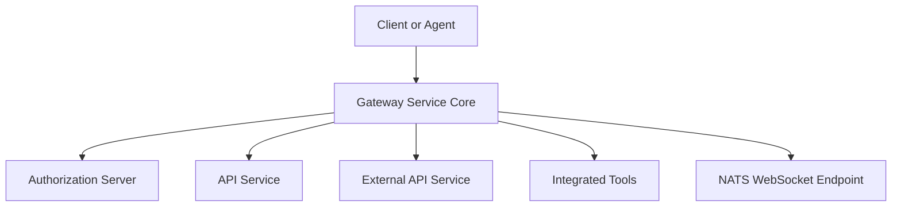
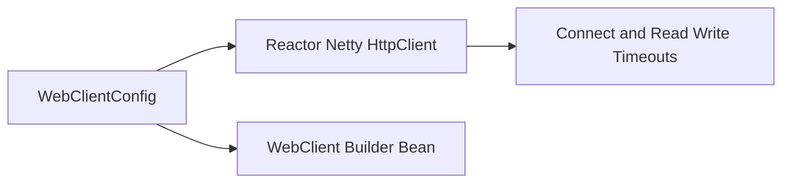
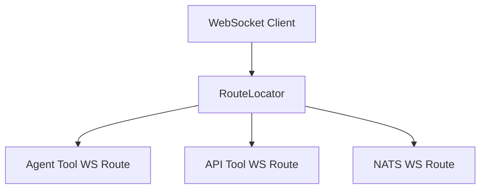
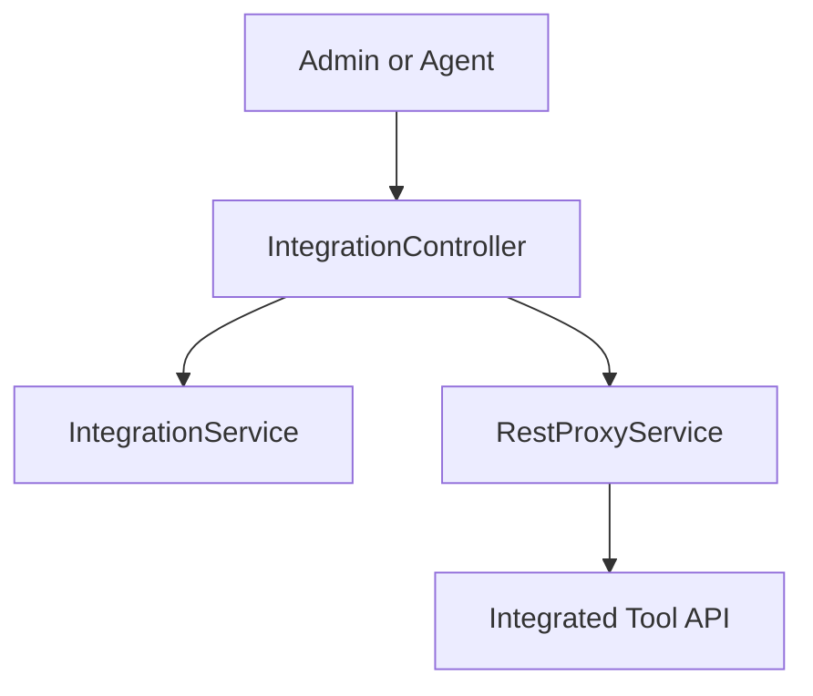
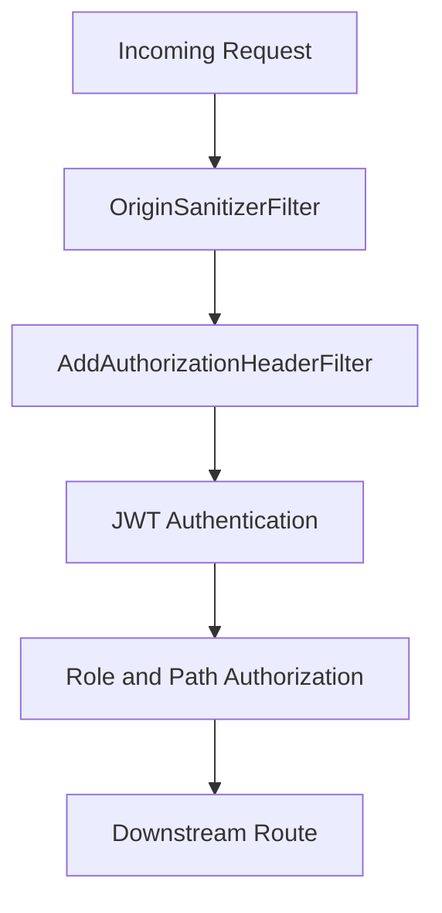
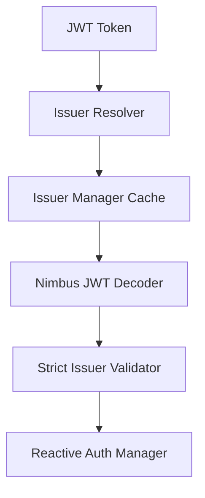
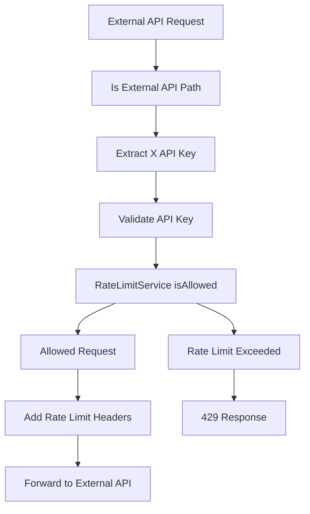
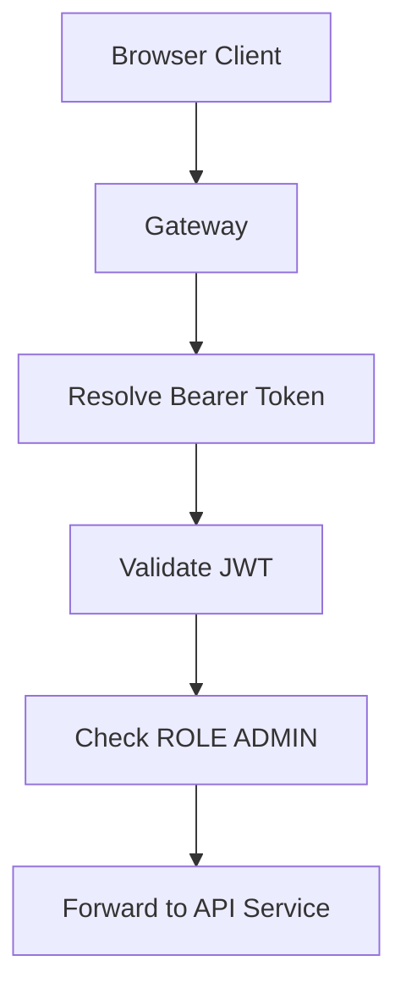
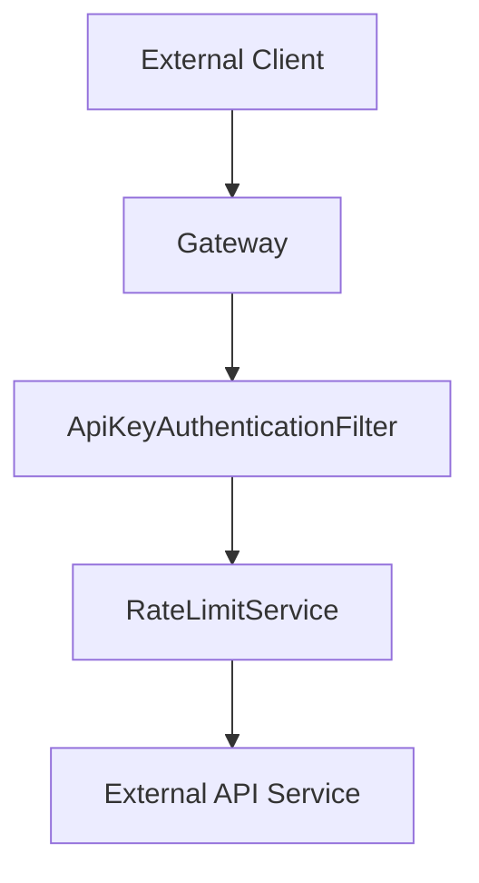

# Gateway Service Core

The **Gateway Service Core** module is the reactive edge layer of the OpenFrame platform. It is responsible for:

- Acting as the single entry point for HTTP and WebSocket traffic
- Enforcing authentication and authorization policies
- Applying API key validation and rate limiting for external APIs
- Proxying tool REST and WebSocket traffic
- Resolving multi-tenant JWT issuers dynamically

Built on **Spring Cloud Gateway** and **Spring WebFlux**, this module provides a non-blocking, reactive gateway optimized for high-concurrency MSP workloads.

---

# 1. Architectural Overview

At a high level, the Gateway Service Core sits between clients and internal services.



## Responsibilities

1. **Security enforcement** (JWT, roles, scopes)
2. **API key validation** for `/external-api/**`
3. **Rate limiting** with standard HTTP headers
4. **WebSocket routing and proxying**
5. **Multi-tenant issuer resolution**
6. **CORS and request sanitization**

---

# 2. Core Configuration Components

## 2.1 WebClient Configuration

**Component:** `WebClientConfig`

Provides a preconfigured reactive `WebClient.Builder` with:

- 30 second connect timeout
- 30 second response timeout
- Netty read/write timeout handlers

This builder is used internally for proxying and outbound service communication.



---

# 3. WebSocket Gateway Layer

The Gateway Service Core supports WebSocket proxying for tools and NATS.

## 3.1 WebSocket Routes

**Component:** `WebSocketGatewayConfig`

Defines three main routes:

- `/ws/tools/agent/{toolId}/**`
- `/ws/tools/{toolId}/**`
- `/ws/nats`



## 3.2 Tool WebSocket Proxy Filters

### ToolAgentWebSocketProxyUrlFilter
- Extracts `toolId` from agent WebSocket paths
- Resolves actual backend tool URL
- Delegates proxying

### ToolApiWebSocketProxyUrlFilter
- Extracts `toolId` from API WebSocket paths
- Resolves tool backend URL

Both rely on:

- `ReactiveIntegratedToolRepository`
- `ToolUrlService`
- `ProxyUrlResolver`

---

# 4. REST Proxy Layer

## 4.1 IntegrationController

**Component:** `IntegrationController`

Handles all tool-related REST proxying.

### Endpoints

- `GET /tools/{toolId}/health`
- `POST /tools/{toolId}/test`
- `/{toolId}/**` proxy
- `/agent/{toolId}/**` proxy



---

# 5. Security Architecture

Security in the Gateway Service Core is layered and reactive.



---

## 5.1 Path Constants

**Component:** `PathConstants`

Defines canonical path prefixes:

- `/clients`
- `/api`
- `/tools`
- `/ws/tools`

These constants are used consistently in authorization rules.

---

## 5.2 AddAuthorizationHeaderFilter

Ensures a standard `Authorization: Bearer` header exists.

Token resolution order:

1. Access token cookie
2. Custom `Access-Token` header
3. `authorization` query parameter

If found, the filter mutates the request and injects a proper `Authorization` header before authentication occurs.

---

## 5.3 GatewaySecurityConfig

Defines the reactive security filter chain:

- Disables CSRF, form login, and HTTP basic
- Enables OAuth2 Resource Server
- Uses a dynamic issuer resolver
- Applies role-based route protection

### Role-Based Access

- `ROLE_ADMIN` → Dashboard and tool APIs
- `ROLE_AGENT` → Agent endpoints and NATS
- Public → Health, metrics, registration

---

## 5.4 JWT Multi-Tenant Support

### JwtAuthConfig

Implements dynamic issuer resolution using:

- `JwtIssuerReactiveAuthenticationManagerResolver`
- Caffeine cache for authentication managers



### IssuerUrlProvider

Resolves allowed issuer URLs dynamically from:

- `ReactiveTenantRepository`
- Configured base issuer URL
- Optional super-tenant

This enables true multi-tenant JWT validation without restarting the gateway.

---

# 6. API Key Authentication and Rate Limiting

## 6.1 ApiKeyAuthenticationFilter

Applies only to `/external-api/**`.

### Processing Flow



### Features

- API key validation
- Per-minute, per-hour, per-day limits
- Automatic statistics recording
- Standard rate limit headers
- Proper reactive error handling

### RateLimitConstants

Defines standardized log message constants for rate limit operations.

---

# 7. CORS and Request Hardening

## 7.1 CorsConfig

- Enabled by default
- Driven by Spring Cloud Gateway global CORS configuration
- Can be disabled via property

## 7.2 OriginSanitizerFilter

Removes `Origin: null` headers to prevent:

- Misleading cross-origin requests
- Security inconsistencies

---

# 8. Internal Authentication Probe

**Component:** `InternalAuthProbeController`

Conditional endpoint:

- `/internal/authz/probe`

Used for:

- Internal health checks
- Infrastructure readiness validation

Only enabled when:

```text
openframe.gateway.internal.enable=true
```

---

# 9. End-to-End Request Flow

## 9.1 Authenticated Dashboard Request



## 9.2 External API Request with API Key



---

# 10. Design Principles

The Gateway Service Core follows these core principles:

1. **Reactive and non-blocking** — built on WebFlux and Reactor
2. **Stateless security** — JWT-based resource server
3. **Multi-tenant by design** — dynamic issuer validation
4. **Separation of concerns** — proxy, security, rate limiting isolated
5. **Zero trust edge enforcement** — all authorization enforced at gateway

---

# 11. Summary

The **Gateway Service Core** is the security and routing backbone of the OpenFrame platform. It:

- Enforces JWT and role-based access control
- Validates API keys and enforces rate limits
- Dynamically resolves tenant issuers
- Proxies REST and WebSocket traffic to tools
- Protects internal services from direct exposure

In the OpenFrame architecture, this module acts as the hardened edge boundary that ensures every request entering the platform is authenticated, authorized, validated, and safely routed.