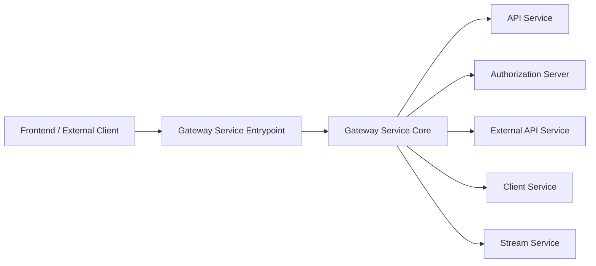
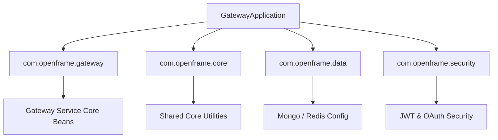
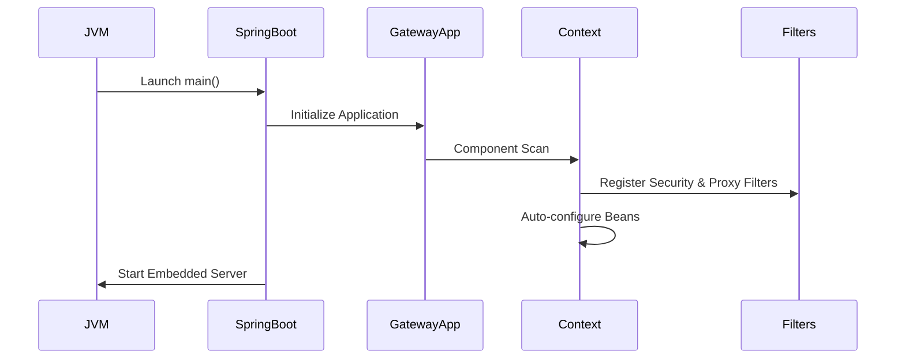
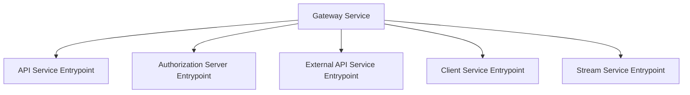
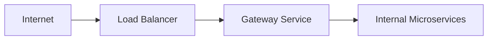

# Gateway Service Entrypoint

The **Gateway Service Entrypoint** module is the bootstrap layer of the OpenFrame Gateway service. It is responsible for initializing the Spring Boot application context, configuring component scanning across shared libraries, and starting the API Gateway runtime.

While the core routing, security filters, WebSocket proxying, and rate limiting logic live in [Gateway Service Core](gateway_service_core/gateway_service_core.md), this module defines:

- The main Spring Boot application class
- Global component scanning boundaries
- The runtime composition of gateway + shared infrastructure modules

At runtime, this module becomes the **single entry process** that fronts all downstream services including the API service, authorization server, client service, and stream service.

---

## 1. Core Component

### GatewayApplication

```java
@SpringBootApplication
@ComponentScan(basePackages = {
        "com.openframe.gateway",
        "com.openframe.core",
        "com.openframe.data",
        "com.openframe.security"
})
public class GatewayApplication {

    public static void main(String[] args) {
        SpringApplication.run(GatewayApplication.class, args);
    }
}
```

### Responsibilities

1. Bootstraps the Spring Boot runtime
2. Aggregates configuration from multiple shared modules
3. Enables auto-configuration for:
   - WebFlux / Gateway routing
   - Security filters (JWT, API keys, CORS)
   - Data access abstractions
   - Shared core utilities
4. Defines the base package scanning boundaries

---

## 2. High-Level Architecture Context

The Gateway Service Entrypoint sits at the edge of the OpenFrame platform.



### Architectural Role

- Terminates HTTP and WebSocket traffic
- Applies cross-cutting security and tenant logic
- Forwards traffic to internal microservices
- Enforces global policies such as rate limiting

The gateway is a **reverse proxy + policy enforcement layer**, not a business logic layer.

---

## 3. Component Scanning and Runtime Composition

The `@ComponentScan` configuration is critical to how the gateway is assembled.



### Why This Matters

This scanning configuration ensures that the gateway can:

- Load security configuration from [Shared Security and OAuth BFF](shared_security_and_oauth_bff/shared_security_and_oauth_bff.md)
- Use shared data configuration from [Data Persistence Mongo](data_persistence_mongo/data_persistence_mongo.md)
- Reuse cross-service utilities from Shared Core
- Wire all filters and controllers from [Gateway Service Core](gateway_service_core/gateway_service_core.md)

Without this composition layer, the gateway would not integrate properly with the broader OpenFrame platform.

---

## 4. Startup Lifecycle

The gateway startup process follows the standard Spring Boot lifecycle.



### Startup Phases

1. JVM invokes `main()`
2. Spring Boot initializes auto-configuration
3. Component scanning registers:
   - Gateway filters
   - WebSocket proxy configuration
   - JWT validation
   - CORS configuration
4. Embedded Netty server (WebFlux) starts

At this point, the gateway begins accepting traffic.

---

## 5. Relationship to Gateway Service Core

The Gateway Service Entrypoint is intentionally minimal.

| Layer | Responsibility |
|--------|---------------|
| Gateway Service Entrypoint | Bootstrapping & composition |
| Gateway Service Core | Routing, security filters, proxy logic |

All operational behavior (filters, controllers, rate limits, WebSocket proxying) is defined in:

- [Gateway Service Core](gateway_service_core/gateway_service_core.md)

This separation keeps:

- The entrypoint stable
- Business routing logic modular
- Shared libraries reusable

---

## 6. Integration with Platform Services

Although the entrypoint contains no business logic, it orchestrates runtime access to the following services:



Referenced modules:

- [API Service Entrypoint](api_service_entrypoint/api_service_entrypoint.md)
- [Authorization Server Entrypoint](authorization_server_entrypoint/authorization_server_entrypoint.md)
- [External API Service Entrypoint](external_api_service_entrypoint/external_api_service_entrypoint.md)
- [Client Service Entrypoint](client_service_entrypoint/client_service_entrypoint.md)
- [Stream Service Entrypoint](stream_service_entrypoint/stream_service_entrypoint.md)

The gateway does not directly implement their logic — it routes and secures traffic destined for them.

---

## 7. Deployment Perspective

From an infrastructure standpoint, the Gateway Service Entrypoint is:

- The public-facing service
- The ingress target behind load balancers
- The TLS termination point (if configured at application level)
- The central enforcement point for authentication and rate limits



This design provides:

- Service isolation
- Centralized security
- Independent scaling of backend services

---

## 8. Design Principles

The Gateway Service Entrypoint follows these principles:

1. Minimal surface area
2. No embedded business logic
3. Clear separation from routing and filter implementation
4. Heavy reuse of shared infrastructure modules
5. Stateless runtime (scalable horizontally)

---

## 9. Summary

The **Gateway Service Entrypoint** is the bootstrap and composition root of the OpenFrame Gateway.

It:

- Starts the Spring Boot application
- Aggregates shared core, data, and security modules
- Enables gateway routing and proxy behavior
- Serves as the public edge of the OpenFrame microservice architecture

All advanced routing, filtering, WebSocket proxying, and tenant-aware security logic is implemented in:

- [Gateway Service Core](gateway_service_core/gateway_service_core.md)

This module remains intentionally small, stable, and infrastructure-focused — forming the foundation upon which the rest of the gateway behavior is built.
