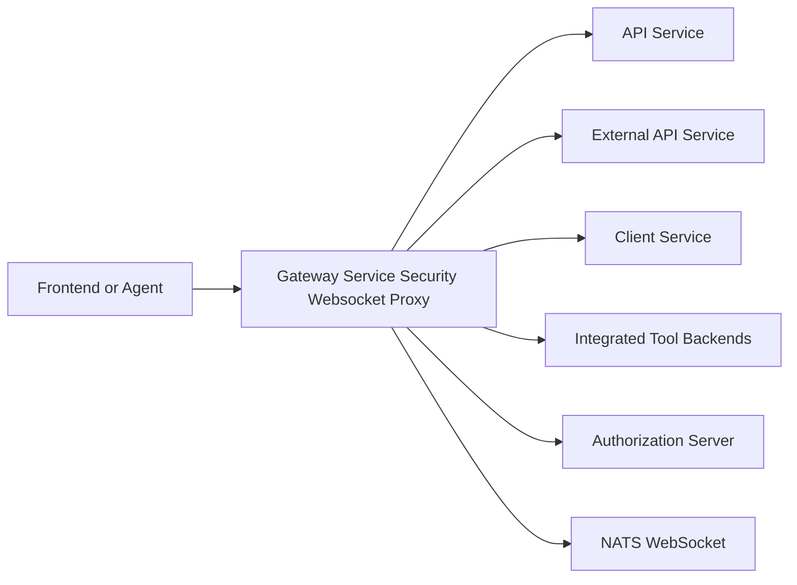
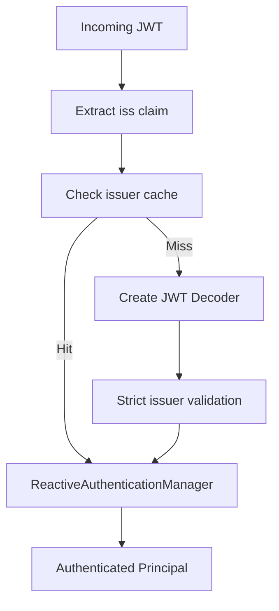
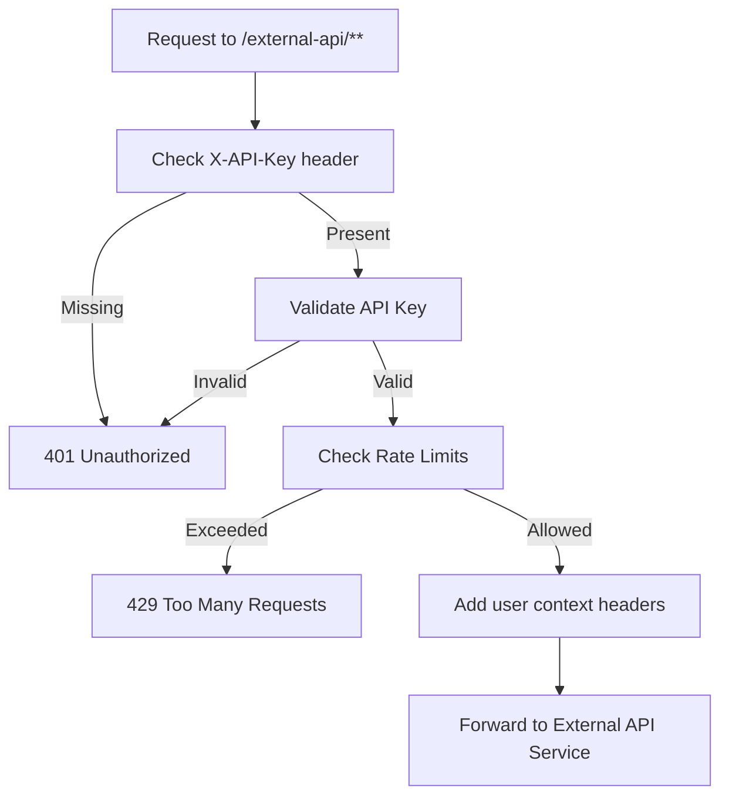
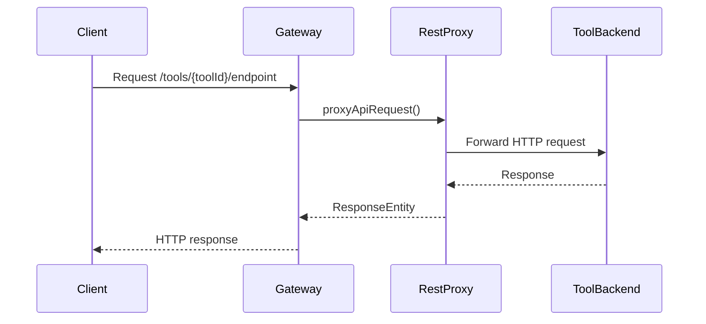
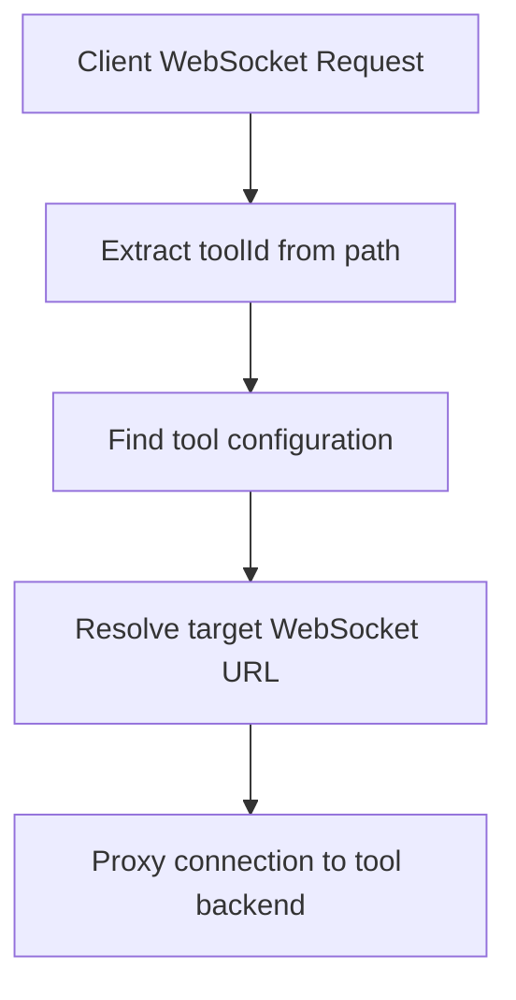
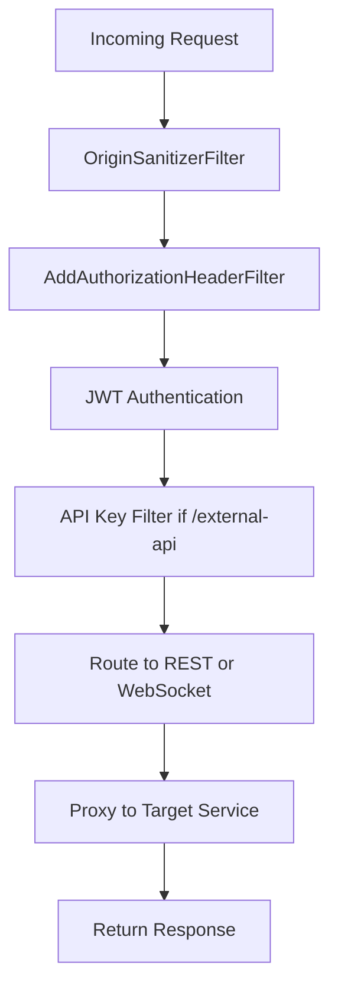

# Gateway Service Security Websocket Proxy

## Overview

The **Gateway Service Security Websocket Proxy** module is the reactive edge layer of the OpenFrame platform. It acts as:

- A **security enforcement point** (JWT, API keys, roles)
- A **REST and WebSocket proxy** for integrated tools and agents
- A **multi-tenant authentication gateway**
- A **rate-limiting and request enrichment layer**

Built on **Spring WebFlux** and **Spring Cloud Gateway**, this module sits in front of internal services such as the API Service, External API Service, Client Service, and tool integrations.

It is deployed as part of the `GatewayApplication` entrypoint.

---

## High-Level Responsibilities

1. Authenticate and authorize all incoming traffic
2. Resolve JWT issuers dynamically for multi-tenant environments
3. Validate API keys for `/external-api/**` endpoints
4. Enforce rate limits
5. Proxy REST calls to integrated tools
6. Proxy WebSocket traffic to tools and NATS
7. Normalize and enrich security headers
8. Apply CORS policies based on deployment mode

---

## Architectural Position



The gateway is the single public entrypoint. All internal services remain protected behind it.

---

# Core Architecture

The module can be divided into five major layers:

1. Security Layer
2. API Key & Rate Limiting Layer
3. REST Proxy Layer
4. WebSocket Proxy Layer
5. Infrastructure & Configuration Layer

---

# 1. Security Layer

## GatewaySecurityConfig

Defines the main `SecurityWebFilterChain`:

- Disables CSRF, form login, HTTP basic
- Enables OAuth2 Resource Server
- Uses dynamic issuer resolution
- Applies role-based access control

### Role Model

```text
Roles:
- ROLE_ADMIN
- ROLE_AGENT

Scopes are mapped with prefix SCOPE_
JWT principal claim: sub
```

### Path Authorization Strategy

- `/api/**` → ADMIN
- `/tools/**` → ADMIN
- `/tools/agent/**` → AGENT
- `/ws/tools/**` → ADMIN
- `/ws/tools/agent/**` → AGENT
- `/ws/nats` → ADMIN or AGENT
- `/clients/**` → AGENT

---

## AddAuthorizationHeaderFilter

This filter ensures a standard `Authorization: Bearer <token>` header is present before authentication occurs.

Token resolution order:

1. Access token cookie
2. Custom `Access-Token` header
3. `authorization` query parameter

This enables:

- Browser-based authentication
- WebSocket token propagation
- Agent-based access

---

## JwtAuthConfig

Supports **multi-issuer JWT validation** using:

- `JwtIssuerReactiveAuthenticationManagerResolver`
- Caffeine cache for issuer managers
- Strict issuer validation via `IssuerUrlProvider`

### Issuer Resolution Flow



---

## IssuerUrlProvider

- Retrieves tenant information from `ReactiveTenantRepository`
- Builds issuer URLs dynamically
- Caches resolved issuers
- Supports optional super-tenant

This enables **true multi-tenant JWT validation**.

---

# 2. API Key & Rate Limiting Layer

## ApiKeyAuthenticationFilter

A `GlobalFilter` that secures `/external-api/**` endpoints.

### Flow



### Responsibilities

- Validate API key
- Enforce minute, hour, and day limits
- Inject context headers:
  - `X-API-Key-Id`
  - `X-User-Id`
- Remove raw API key header
- Add standard rate limit headers

### RateLimitConstants

Provides structured logging constants for rate limiting operations.

---

# 3. REST Proxy Layer

## IntegrationController

Exposes REST endpoints for tool integrations:

```text
GET  /tools/{toolId}/health
POST /tools/{toolId}/test
ANY  /tools/{toolId}/**
ANY  /tools/agent/{toolId}/**
```

Delegates to:

- `IntegrationService`
- `RestProxyService`

### REST Proxy Flow



Supports:

- Full HTTP method passthrough
- Path forwarding
- Request body forwarding
- Authentication propagation

---

# 4. WebSocket Proxy Layer

## WebSocketGatewayConfig

Defines dynamic WebSocket routing:

```text
/ws/tools/{toolId}/**
/ws/tools/agent/{toolId}/**
/ws/nats
```

### Route Configuration

- Agent WebSocket Route
- API WebSocket Route
- NATS WebSocket Route

Routes use `uri("no://op")` with custom filters for dynamic target resolution.

---

## ToolApiWebSocketProxyUrlFilter
## ToolAgentWebSocketProxyUrlFilter

Both extend a common WebSocket proxy filter and:

- Extract `toolId` from path
- Resolve backend URL
- Use `ProxyUrlResolver`
- Use `ReactiveIntegratedToolRepository`
- Use `ToolUrlService`

### WebSocket Proxy Flow



---

## WebSocket Security Decorator

The configured `WebSocketService` is wrapped by a security decorator that:

- Reads JWT claims
- Ensures authenticated context
- Applies tenant security

---

# 5. Infrastructure & Configuration Layer

## WebClientConfig

Creates a tuned `WebClient.Builder`:

- 30s connection timeout
- 30s response timeout
- Read/write timeout handlers
- Reactor Netty connector

Used by proxy services for outbound communication.

---

## CORS Configuration

### CorsConfig

Enabled when:

```text
openframe.gateway.disable-cors=false
```

Uses Spring Cloud Gateway global CORS properties.

### CorsDisableConfig

Enabled when:

```text
openframe.gateway.disable-cors=true
```

Allows:

- All origins
- All methods
- Credentials support

Intended for SaaS same-domain deployments.

---

## OriginSanitizerFilter

Removes invalid `Origin: null` headers before security evaluation.

Prevents browser-origin related rejections.

---

## InternalAuthProbeController

Exposes:

```text
GET /internal/authz/probe
```

Conditionally enabled via:

```text
openframe.gateway.internal.enable=true
```

Used for internal health and readiness checks.

---

# Request Processing Lifecycle



---

# Multi-Tenancy Model

The Gateway Service Security Websocket Proxy enables:

- Per-tenant JWT issuer validation
- Tenant-aware routing
- Shared infrastructure with isolated authentication domains

Issuer URLs are constructed as:

```text
{allowedIssuerBase}/{tenantId}
```

With optional super-tenant support.

---

# Deployment Considerations

1. Must be deployed before all internal services
2. Requires connection to:
   - Authorization Server
   - Mongo (tenant repository)
   - Integrated tool registry
3. Requires JWT configuration properties
4. CORS mode must match deployment topology

---

# Key Design Principles

- Reactive, non-blocking I/O
- Security-first routing
- Explicit role-based access control
- Dynamic multi-tenant issuer validation
- Transparent proxying
- Standard HTTP rate limiting semantics

---

# Summary

The **Gateway Service Security Websocket Proxy** is the security and integration backbone of OpenFrame.

It combines:

- OAuth2 resource server capabilities
- API key authentication
- Rate limiting
- Multi-tenant JWT validation
- REST proxying
- WebSocket proxying
- CORS governance

All external traffic flows through this module, making it the primary enforcement point for authentication, authorization, tenant isolation, and integration routing.
