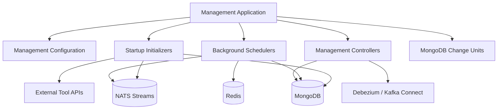
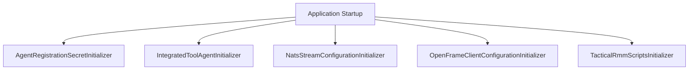
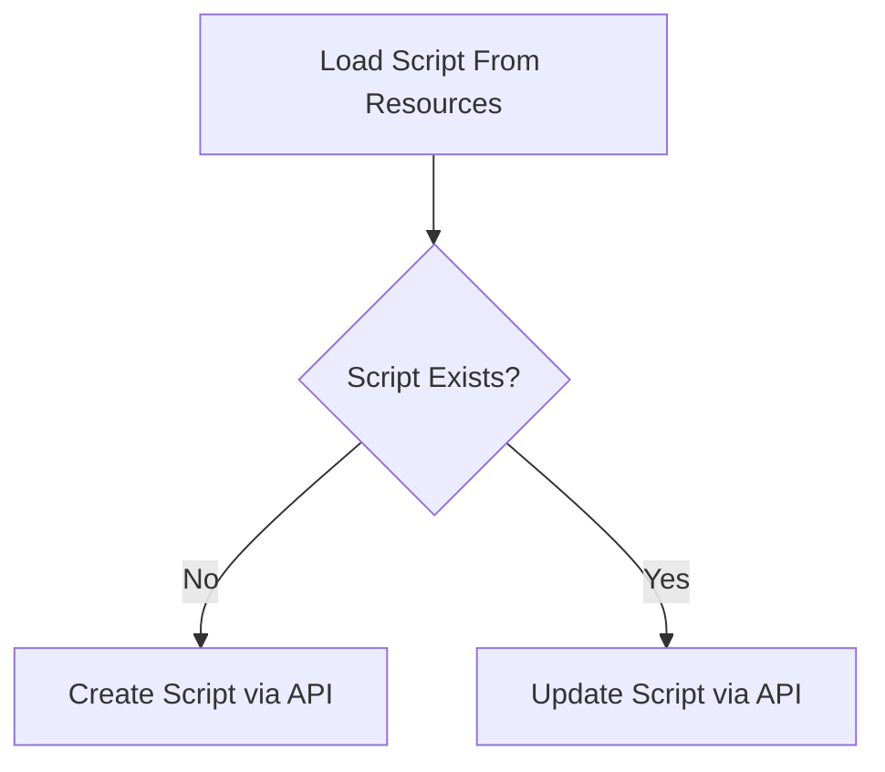
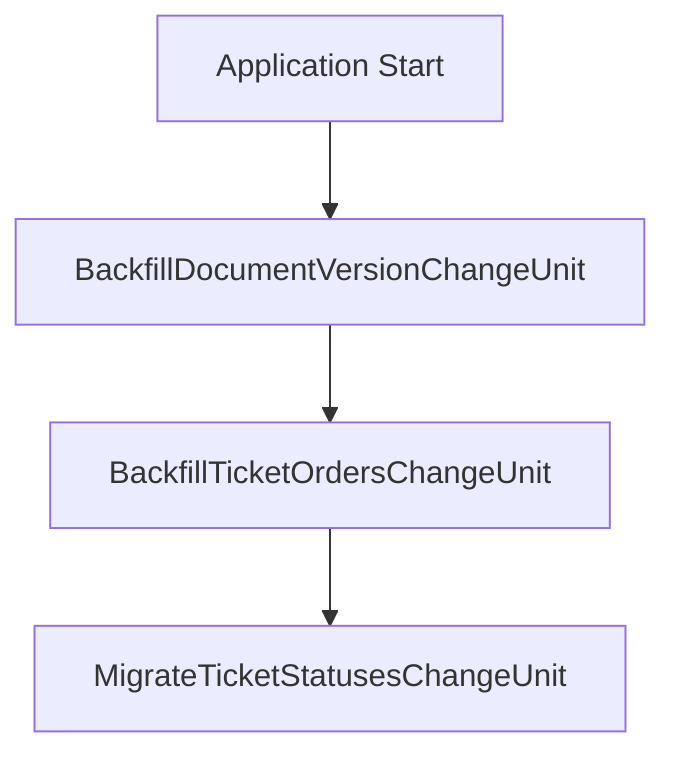
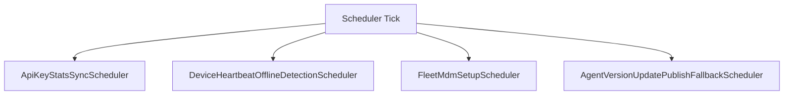
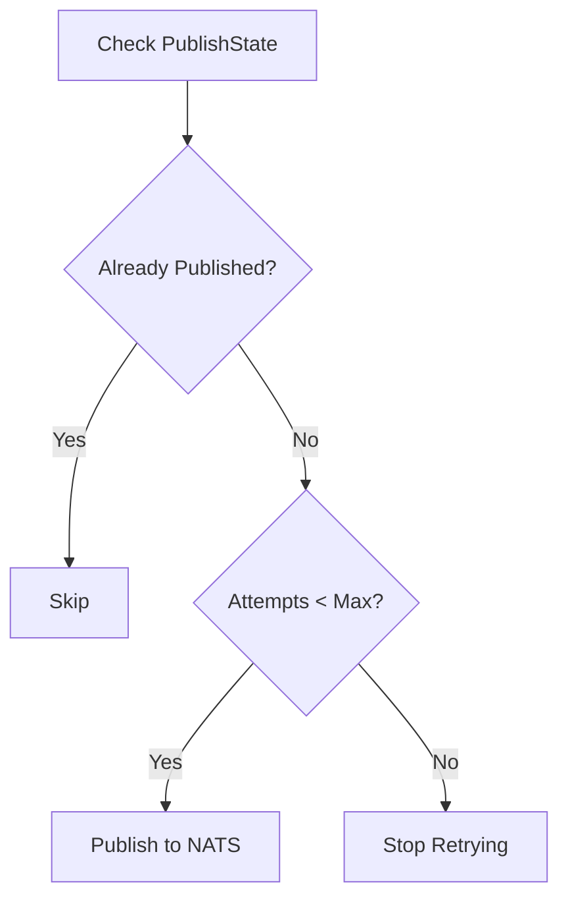

# Management Service Core Initialization And Scheduling

## Overview

The **Management Service Core Initialization And Scheduling** module is responsible for bootstrapping tenant-aware runtime state, executing data migrations, configuring messaging infrastructure, and orchestrating scheduled background jobs across the OpenFrame platform.

This module acts as the operational backbone of the management service. It ensures that:

- Critical secrets and configurations are initialized at startup
- Tenant-scoped infrastructure (NATS streams, agent configurations, tool integrations) is provisioned
- Database migrations are applied safely and incrementally
- Background schedulers run reliably with distributed locking
- Tool integrations and client update flows are kept consistent and recoverable

It is typically loaded by the Management Application runtime and integrates with data, messaging, and tool SDK layers.

---

## Architectural Role in the Platform

The module sits between the runtime application layer and the infrastructure/service layers (MongoDB, Redis, NATS, Kafka Connect, external RMM systems).



The module is structured into the following responsibility areas:

1. Configuration and infrastructure wiring
2. Startup initializers
3. Controllers for operational endpoints
4. Distributed schedulers
5. Database migrations (Mongock change units)
6. Post-save hooks and processors

---

## 1. Configuration Layer

### ManagementConfiguration

- Performs component scanning under `com.openframe`
- Explicitly excludes `CassandraHealthIndicator`
- Defines a `PasswordEncoder` bean using `BCryptPasswordEncoder`

This ensures secure password hashing within management flows and consistent Spring context wiring.

### RetryConfiguration

- Enables Spring Retry via `@EnableRetry`
- Allows services in this module to apply retry semantics (e.g., transient infrastructure failures)

### ShedLockConfig

- Enables Spring scheduling
- Enables distributed locking via ShedLock
- Uses `RedisLockProvider`
- Generates tenant-scoped Redis keys using `OpenframeRedisKeyBuilder`

Lock keys follow a tenant-aware pattern:

```text
of:{tenantId}:job-lock:{environment}:{lockName}
```

This ensures:
- Only one node executes a scheduled job in clustered deployments
- Locks remain tenant-aware
- Safe multi-instance scaling

---

## 2. Startup Initializers

Startup initializers implement `ApplicationRunner` and execute during application bootstrap.



### AgentRegistrationSecretInitializer

- Invokes `AgentRegistrationSecretManagementService.createInitialSecret()`
- Ensures an initial agent registration secret exists
- Triggers post-processing via `AgentRegistrationSecretManagementProcessor`

A default processor (`DefaultAgentRegistrationSecretManagementProcessor`) logs creation if no custom processor is provided.

### IntegratedToolAgentInitializer

- Loads agent configuration files from classpath
- Deserializes into `IntegratedToolAgentConfiguration`
- Applies configuration using `IntegratedToolAgentService`
- Fails fast if no configurations are defined

This guarantees tool agents are consistently initialized from declarative configuration.

### NatsStreamConfigurationInitializer

- Provisions required NATS JetStream streams
- Includes streams such as:
  - TOOL_INSTALLATION
  - CLIENT_UPDATE
  - TOOL_UPDATE
  - TOOL_CONNECTIONS
  - INSTALLED_AGENTS
- Accepts additional stream configurations via `AdditionalStreamConfigurationProvider`

Ensures messaging infrastructure exists before agents or tools publish events.

### OpenFrameClientConfigurationInitializer

- Loads `client-configuration.json` from classpath
- Updates configuration via `OpenFrameClientConfigurationService`

This ensures a baseline client configuration is always present.

### TacticalRmmScriptsInitializer

- Integrates with Tactical RMM via `TacticalRmmClient`
- Loads PowerShell scripts from resources
- Creates or updates scripts in Tactical RMM
- Uses a declarative `ScriptConfig` model

Behavior:



This guarantees required automation scripts are synchronized with external RMM systems.

---

## 3. Controllers

Controllers expose operational and configuration endpoints.

### IntegratedToolController

Endpoints under `/v1/tools`:

- GET `/v1/tools` → list tools
- GET `/v1/tools/{id}` → fetch tool
- POST `/v1/tools/{id}` → save tool configuration

Key behaviors:

- Preserves existing Mongo `_id`
- Enforces tenant scoping
- Automatically enables tool
- Conditionally applies Debezium connectors
- Executes all registered `IntegratedToolPostSaveHook` implementations

This design allows:
- Pre-registration configuration persistence
- Deferred connector provisioning
- Extensible post-save side effects

### DevicePinotResyncController

Endpoint: POST `/v1/devices/pinot-resync`

- Loads all machines
- Invokes `MachineTagEventService.processMachineSaveAll`
- Forces reindex/synchronization to Pinot

Used for operational re-sync or recovery scenarios.

### ReleaseVersionController

Endpoint: POST `/v1/cluster-registrations`

- Accepts `ReleaseVersionRequest`
- Delegates to `ReleaseVersionService.process`

This enables cluster-wide release version propagation.

---

## 4. Database Migrations (Mongock Change Units)

Migrations are implemented using `@ChangeUnit`.



### BackfillDocumentVersionChangeUnit

- Adds `documentVersion` field where missing
- Applies to:
  - integrated_tool_agents
  - openframe_client_configuration
  - release_versions
- Tenant-scoped execution

### BackfillTicketOrdersChangeUnit

- Generates LexoRank-based ordering
- Backfills missing `order` field
- Processes tickets per status

Ensures stable ordering for UI and workflow sorting.

### MigrateTicketStatusesChangeUnit

- Seeds system ticket statuses
- Migrates legacy `status` field to new model
- Maps legacy values to `TicketStatusKind`
- Removes deprecated fields
- Guarded by feature flag

This supports progressive rollout of the new lifecycle model.

---

## 5. Scheduled Background Jobs

Schedulers use Spring `@Scheduled` and optionally ShedLock.



### ApiKeyStatsSyncScheduler

- Periodically syncs Redis API key stats to MongoDB
- Uses distributed locking
- Controlled by configuration properties

### DeviceHeartbeatOfflineDetectionScheduler

- Marks stale devices offline
- Runs at configurable interval
- Conditional activation via property flag

### FleetMdmSetupScheduler

- Checks for Fleet MDM tool
- Invokes `FleetMdmSetupService.setupAndSaveApiToken`
- Retries on failure

### AgentVersionUpdatePublishFallbackScheduler

- Retries publishing client and tool agent updates
- Evaluates `PublishState`
- Uses distributed locking
- Respects max retry attempts

Decision logic:



This provides resilience for unreliable or transient messaging failures.

---

## 6. Version Update Service

### OpenFrameClientVersionUpdateService

- Intended to process new release versions
- Delegates to `OpenFrameClientUpdatePublisher`
- Forms the bridge between release events and client update distribution

While currently minimal, this service is the extension point for advanced release orchestration.

---

## Design Principles

The Management Service Core Initialization And Scheduling module follows several core principles:

- **Tenant awareness everywhere** (locks, migrations, persistence)
- **Declarative initialization** (classpath-driven configuration)
- **Resilient scheduling** (retry + distributed locks)
- **Extensibility via hooks and processors**
- **Idempotent infrastructure provisioning**
- **Safe progressive migrations**

---

## Summary

The **Management Service Core Initialization And Scheduling** module ensures that every OpenFrame tenant environment:

- Boots with correct configuration
- Has required messaging infrastructure
- Applies schema and lifecycle migrations
- Synchronizes external tools
- Recovers from publish failures
- Runs distributed background tasks safely

It is the operational control center of the management service, guaranteeing deterministic startup, safe evolution, and reliable background processing in multi-tenant, clustered deployments.