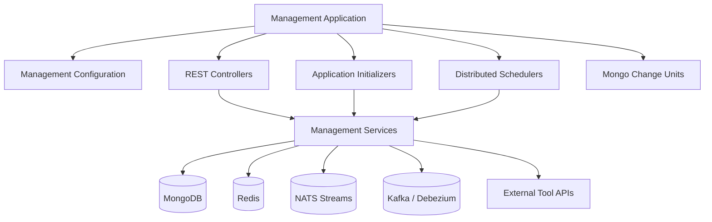
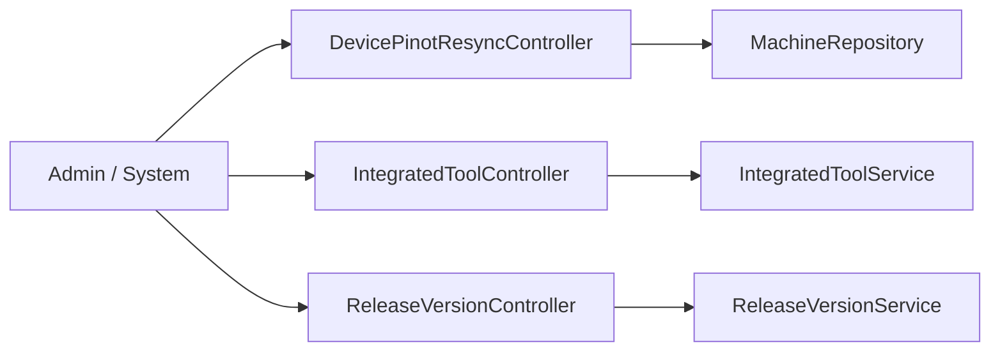
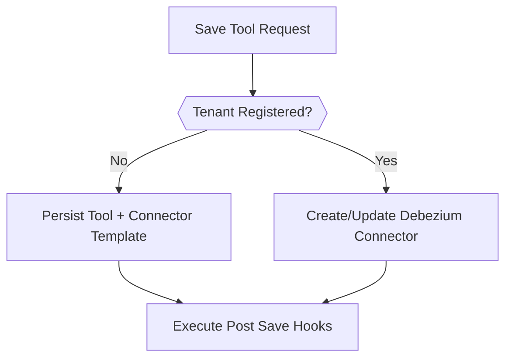
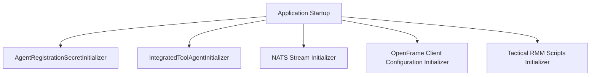
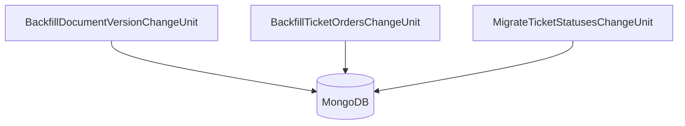
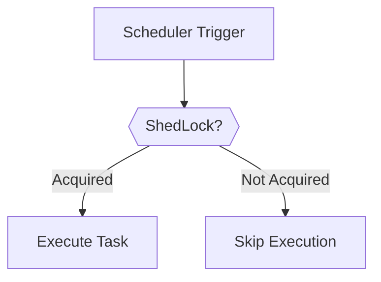

# Management Service Core

The **Management Service Core** module is the operational backbone of the OpenFrame platform. It is responsible for:

- System bootstrapping and initialization
- Integrated tool lifecycle management
- Agent and client configuration orchestration
- Distributed scheduling and background jobs
- Data migrations and tenant-scoped change units
- Release version propagation
- Operational maintenance endpoints

This module runs inside the `ManagementApplication` and coordinates infrastructure components such as MongoDB, Redis, NATS, Debezium, and external tool APIs.

---

## Architectural Overview

The Management Service Core sits between the data layer, messaging infrastructure, and external tool ecosystems.



The module is structured around the following responsibility groups:

1. Configuration Layer
2. REST Controllers
3. Bootstrapping Initializers
4. Database Migrations
5. Distributed Schedulers
6. Domain Services and Processors

---

## 1. Configuration Layer

### ManagementConfiguration

- Enables component scanning for the `com.openframe` base package
- Excludes `CassandraHealthIndicator`
- Registers a `BCryptPasswordEncoder` bean for secure password hashing

This configuration establishes core security primitives used by management-level services.

---

### RetryConfiguration

- Enables Spring Retry via `@EnableRetry`
- Allows idempotent retry behavior for transient failures

Used primarily for:
- External tool calls
- Messaging retries
- Infrastructure instability resilience

---

### ShedLockConfig

Enables distributed scheduling using Redis-backed locks.

Key characteristics:

- `@EnableScheduling`
- `@EnableSchedulerLock`
- Redis-based `LockProvider`
- Tenant-scoped lock keys

Lock key structure:

```text
of:{tenantId}:job-lock:{environment}:{lockName}
```

This ensures:

- Multi-instance safety
- Tenant isolation
- Protection against duplicate scheduler execution

---

## 2. REST Controllers

The Management Service Core exposes operational REST endpoints for administrative and orchestration tasks.



---

### DevicePinotResyncController

Endpoint:

- `POST /v1/devices/pinot-resync`

Function:

- Fetches all machines from `MachineRepository`
- Replays machine tag events
- Forces reindexing / resync into analytics (Pinot)

This is an operational recovery endpoint used after data drift or analytics desynchronization.

---

### IntegratedToolController

Endpoint base:

- `/v1/tools`

Responsibilities:

- Retrieve all integrated tools
- Retrieve single tool by ID
- Create or update tool configuration

Core behaviors:

1. Enforces tenant scoping
2. Preserves existing UUID if tool exists
3. Enables tool automatically
4. Conditionally applies Debezium connector configuration
5. Executes post-save hooks

Connector behavior logic:



Extension mechanism:

- `IntegratedToolPostSaveHook`
- Lightweight pluggable side-effects
- Avoids heavy event bus coupling

---

### ReleaseVersionController

Endpoint:

- `POST /v1/cluster-registrations`

Accepts:

- `ReleaseVersionRequest`

Purpose:

- Processes image tag version updates
- Delegates to `ReleaseVersionService`
- Triggers downstream version propagation

Used for:

- Cluster release coordination
- Agent version updates
- Client compatibility enforcement

---

## 3. Application Initializers

Application initializers implement `ApplicationRunner` and execute during startup.



---

### AgentRegistrationSecretInitializer

- Ensures an initial agent registration secret exists
- Delegates creation to `AgentRegistrationSecretManagementService`
- Supports post-processing via `AgentRegistrationSecretManagementProcessor`

Default implementation:

- `DefaultAgentRegistrationSecretManagementProcessor`
- Logs creation event

---

### IntegratedToolAgentInitializer

- Loads agent configurations from classpath
- Deserializes JSON into `IntegratedToolAgentConfiguration`
- Applies updates via `IntegratedToolAgentService`

Fail-fast behavior:

- Throws exception if no configuration paths are provided

---

### NatsStreamConfigurationInitializer

Defines core NATS streams:

- TOOL_INSTALLATION
- CLIENT_UPDATE
- TOOL_UPDATE
- TOOL_CONNECTIONS
- INSTALLED_AGENTS

Each stream defines:

- Subject patterns
- File storage
- Retention policy

Allows additional stream providers via extension interface.

---

### OpenFrameClientConfigurationInitializer

- Loads `client-configuration.json`
- Updates persisted client configuration
- Ensures client defaults exist at boot

---

### TacticalRmmScriptsInitializer

Automates Tactical RMM script lifecycle.

Responsibilities:

1. Fetch existing scripts via `TacticalRmmClient`
2. Load script resources from classpath
3. Create missing scripts
4. Update existing scripts

This guarantees platform-managed automation scripts are always present and version-aligned.

---

## 4. MongoDB Migrations (Mongock Change Units)

The Management Service Core uses Mongock change units for tenant-aware migrations.



---

### BackfillDocumentVersionChangeUnit

- Adds `documentVersion` field
- Applies to multiple collections
- Tenant-scoped update
- Sets default value to `0`

---

### BackfillTicketOrdersChangeUnit

- Backfills missing ticket ordering
- Uses `LexoRank` for stable ordering
- Groups by ticket status

Ensures deterministic ticket sorting.

---

### MigrateTicketStatusesChangeUnit

- Controlled by feature flag
- Migrates legacy ticket status model
- Seeds system statuses
- Maps legacy values to new `TicketStatusDefinition`
- Removes deprecated fields

Supports gradual lifecycle rollout.

---

## 5. Distributed Schedulers

Schedulers are:

- Feature-flag driven
- Tenant-safe
- Optionally distributed via ShedLock



---

### AgentVersionUpdatePublishFallbackScheduler

Purpose:

- Detect unpublished version updates
- Retry NATS publish operations

Logic:

- Checks `PublishState`
- Retries if attempts < max
- Publishes via:
  - `OpenFrameClientUpdatePublisher`
  - `ToolAgentUpdateUpdatePublisher`

Provides resilience against transient messaging failures.

---

### ApiKeyStatsSyncScheduler

- Syncs API key stats from Redis to MongoDB
- Uses distributed locking
- Runs at configurable interval

Ensures analytics durability.

---

### DeviceHeartbeatOfflineDetectionScheduler

- Detects stale devices
- Marks devices offline
- Interval-based sweep

Critical for accurate device state modeling.

---

### FleetMdmSetupScheduler

- Detects presence of Fleet MDM tool
- Performs API token setup if required
- Retries automatically on failure

Ensures proper Fleet MDM integration lifecycle.

---

## 6. Domain Services and Processors

### OpenFrameClientVersionUpdateService

Coordinates release version update publishing.

Although the `process` method is currently minimal, it is intended to:

- Accept new release versions
- Trigger NATS publish
- Update configuration state

---

### DefaultAgentRegistrationSecretManagementProcessor

Fallback processor that:

- Executes when no custom processor exists
- Logs secret creation
- Enables extension-based overrides

---

## Cross-Cutting Concerns

### Tenant Awareness

Many operations rely on:

- `TenantIdProvider`
- Tenant-scoped Mongo queries
- Tenant-scoped Redis keys

This ensures strict multi-tenant isolation.

---

### Messaging Integration

The module integrates with:

- NATS (stream provisioning + publish)
- Kafka / Debezium (connector management)
- Redis (distributed locking + stats)

It acts as the orchestration layer between persistence and event streaming.

---

### Resilience Strategy

The Management Service Core employs:

- Spring Retry
- ShedLock distributed coordination
- Publish retry fallback
- Idempotent migrations
- Conditional feature toggles

This design enables safe operation in distributed, multi-instance deployments.

---

## Operational Role in the Platform

Within the OpenFrame architecture, the Management Service Core is responsible for:

- Bootstrapping tenant infrastructure
- Coordinating tool integrations
- Managing agent and client lifecycle
- Ensuring data integrity during evolution
- Providing operational recovery endpoints

It is not a user-facing API module — instead, it is the control plane for platform orchestration.

---

# Summary

The **Management Service Core** module provides:

- Infrastructure initialization
- Distributed scheduling
- Tenant-aware migrations
- Tool integration lifecycle management
- Release propagation
- Operational maintenance endpoints

It forms the orchestration layer that keeps the OpenFrame platform consistent, resilient, and upgrade-safe across tenants and environments.