# Management Service Core

The **Management Service Core** module is responsible for cluster-level orchestration, configuration bootstrapping, distributed scheduling, and lifecycle management of integrated tools, agents, and client configurations within the OpenFrame platform.

It acts as the operational control plane for:

- Integrated tool configuration and Debezium connector orchestration
- Agent and client configuration initialization
- Distributed scheduled jobs (with Redis-backed locking)
- NATS stream bootstrapping
- Release version propagation
- API key statistics synchronization

This module is packaged into the `ManagementApplication` and operates as a backend service in the OpenFrame multi-service architecture.

---

## 1. Architectural Overview

The Management Service Core sits between persistent data stores, messaging infrastructure, and higher-level orchestration logic.

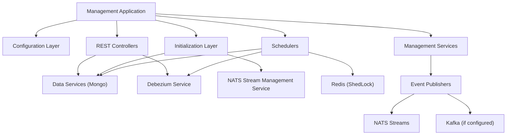

### Key Responsibilities

1. Bootstrap platform configuration at startup
2. Ensure distributed jobs run safely across instances
3. Manage integrated tool lifecycle and Debezium connectors
4. Propagate client and agent version updates
5. Maintain health of streaming connectors
6. Synchronize runtime metrics to persistent storage

---

## 2. Module Structure

The Management Service Core is composed of the following logical layers:

| Layer | Responsibility |
|--------|---------------|
| Configuration | Spring context, password encoding, scheduling, distributed locking |
| Controllers | Administrative REST endpoints |
| Initializers | Boot-time configuration bootstrap |
| Listeners | Startup-triggered infrastructure checks |
| Schedulers | Distributed background jobs |
| Services | Version update and orchestration services |
| Hooks | Lightweight extension points |

---

# 3. Configuration Layer

## 3.1 ManagementConfiguration

Defines core Spring configuration and component scanning.

### Responsibilities

- Scans all `com.openframe` packages
- Excludes `CassandraHealthIndicator`
- Registers `PasswordEncoder` bean using BCrypt

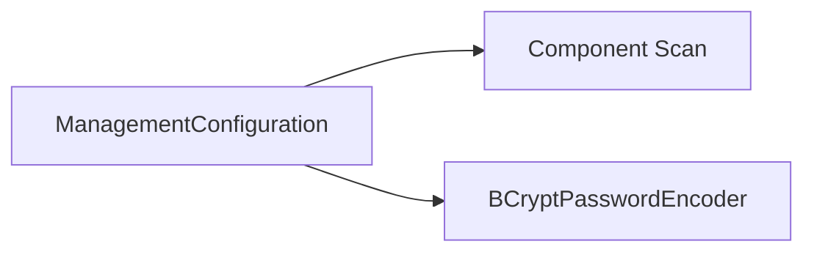

The `PasswordEncoder` ensures secure password hashing for internal credential flows.

---

## 3.2 ShedLockConfig

Enables distributed scheduling using Redis.

### Key Features

- Enables Spring scheduling
- Enables ShedLock
- Uses `RedisLockProvider`
- Tenant-scoped lock keys

Lock key format:

```text
of:{tenantId}:job-lock:{environment}:{lockName}
```

### Distributed Scheduling Flow

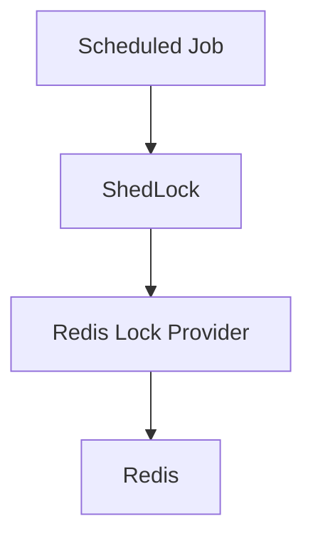

This guarantees:

- Only one node executes a scheduled task at a time
- Multi-tenant key isolation
- Safe horizontal scaling

---

# 4. Controllers Layer

## 4.1 IntegratedToolController

Endpoint: `/v1/tools`

### Responsibilities

- List all integrated tools
- Fetch tool by ID
- Save tool configuration
- Trigger Debezium connector creation
- Execute post-save hooks

### Save Flow

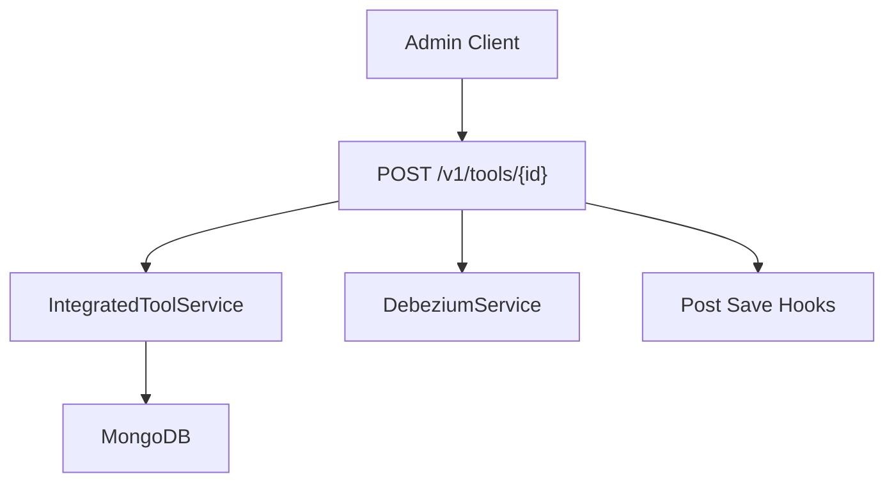

After saving:

1. Tool is persisted
2. Debezium connectors are created or updated
3. All `IntegratedToolPostSaveHook` implementations are executed

### Extension Mechanism

`IntegratedToolPostSaveHook` provides a lightweight extension point:

```java
void onToolSaved(String toolId, IntegratedTool tool);
```

This allows modular side effects without Spring event plumbing.

---

## 4.2 ReleaseVersionController

Endpoint: `/v1/cluster-registrations`

### Responsibility

- Accept cluster image tag version updates
- Delegate processing to `ReleaseVersionService`

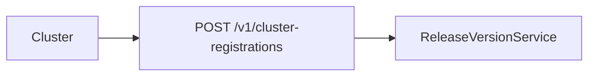

Used for controlled release rollout and version synchronization.

---

# 5. Initialization Layer

Initializers run at application startup to bootstrap system configuration.

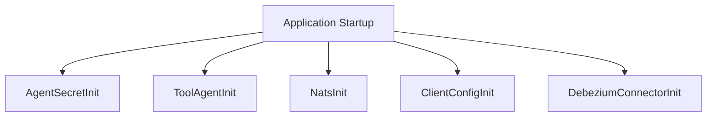

---

## 5.1 AgentRegistrationSecretInitializer

- Runs as `ApplicationRunner`
- Ensures agent registration secret exists
- Logs but does not crash application on failure

Ensures secure agent onboarding.

---

## 5.2 IntegratedToolAgentInitializer

Loads agent configurations from classpath JSON files.

### Key Behaviors

- Reads agent definitions
- Creates or updates existing entries
- Preserves release versions
- Publishes version updates when necessary

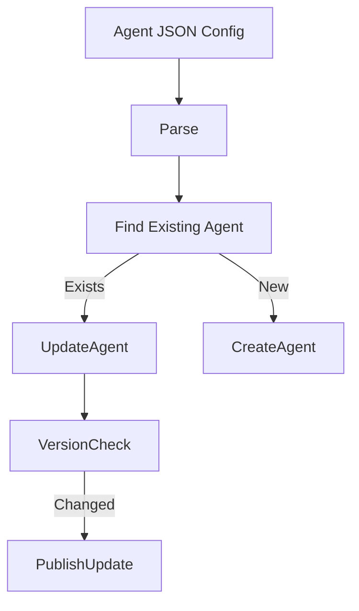

Prevents accidental override of release agent versions.

---

## 5.3 NatsStreamConfigurationInitializer

Creates required NATS streams at startup.

Configured streams:

- TOOL_INSTALLATION
- CLIENT_UPDATE
- TOOL_UPDATE
- TOOL_CONNECTIONS
- INSTALLED_AGENTS

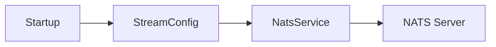

Ensures messaging topology exists before runtime operations.

---

## 5.4 OpenFrameClientConfigurationInitializer

Loads default client configuration from:

```text
agent-configurations/client-configuration.json
```

Behavior:

- Sets default ID
- Preserves existing version
- Updates publish state
- Avoids overwriting release metadata

---

## 5.5 DebeziumConnectorInitializer

Triggered on `ApplicationReadyEvent`.

### Logic

1. Check if connectors exist
2. If empty, load tools from MongoDB
3. Create Debezium connectors for tools that define them

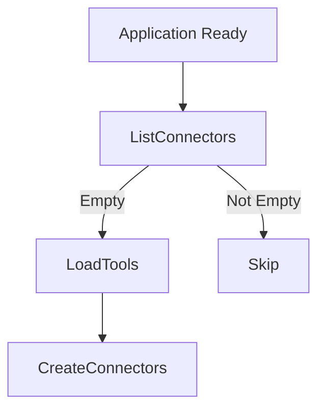

Prevents duplicate connector provisioning.

---

# 6. Scheduler Layer

Schedulers perform background maintenance and publishing.

All schedulers:

- Are conditional on properties
- Use ShedLock for distributed safety

---

## 6.1 AgentVersionUpdatePublishFallbackScheduler

Purpose: Retry publishing version updates if initial publish failed.

### Logic

- Retrieve client configuration
- Retrieve enabled tool agents
- Retry publishing if:
  - Not published
  - Attempts &lt; max allowed

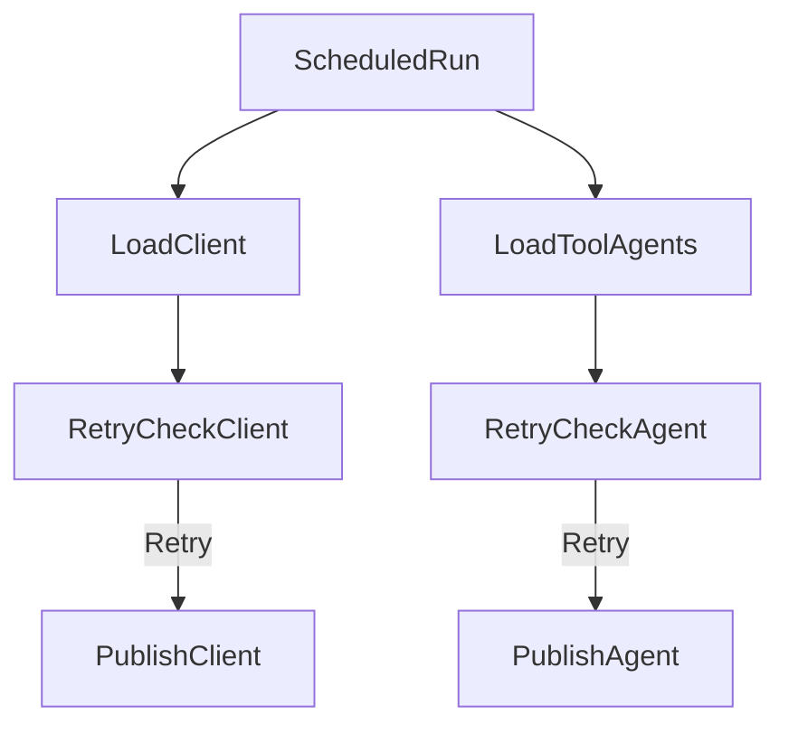

Ensures eventual consistency of version propagation.

---

## 6.2 ApiKeyStatsSyncScheduler

Purpose: Sync API key usage stats from Redis to MongoDB.

Features:

- Distributed lock (`apiKeyStatsSync`)
- Configurable interval
- Failure-safe logging


Provides durable analytics persistence.

---

## 6.3 DebeziumHealthCheckScheduler

Purpose: Monitor and restart failed Debezium tasks.

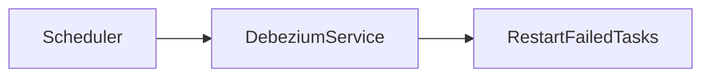

Maintains CDC pipeline reliability.

---

# 7. Service Layer

## 7.1 OpenFrameClientVersionUpdateService

Currently acts as orchestration entry point for version update processing.

Depends on:

- `OpenFrameClientUpdatePublisher`

Intended responsibilities:

- Trigger client version updates
- Coordinate release propagation

---

# 8. Cross-Cutting Concerns

## 8.1 Multi-Tenancy

- Lock keys are tenant-scoped
- Debezium connectors can be tool-specific
- Messaging subjects include machine-level routing

## 8.2 Distributed Safety

- ShedLock ensures single execution
- Conditional bean loading prevents misconfiguration
- Retry-based publishing ensures resilience

## 8.3 Event-Driven Design

The Management Service Core integrates deeply with:

- MongoDB (state persistence)
- Redis (locking and temporary stats)
- NATS (agent updates and tool events)
- Debezium (CDC orchestration)

---

# 9. End-to-End Lifecycle Example

Example: Updating an Integrated Tool

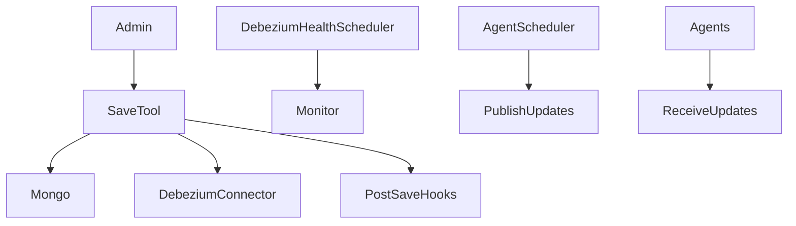

Flow summary:

1. Tool is saved via REST
2. Connector created/updated
3. Hooks executed
4. Health checks monitor CDC
5. Version scheduler ensures agents receive updates

---

# 10. Summary

The **Management Service Core** provides the operational backbone of the OpenFrame platform by:

- Bootstrapping system configuration
- Orchestrating distributed jobs safely
- Managing integrated tools and connectors
- Ensuring reliable version propagation
- Maintaining infrastructure health

It is the control-plane service that guarantees consistency, reliability, and orchestration across agents, tools, messaging systems, and data stores.
