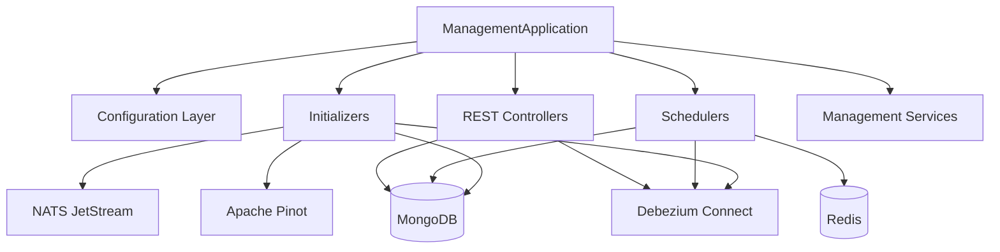
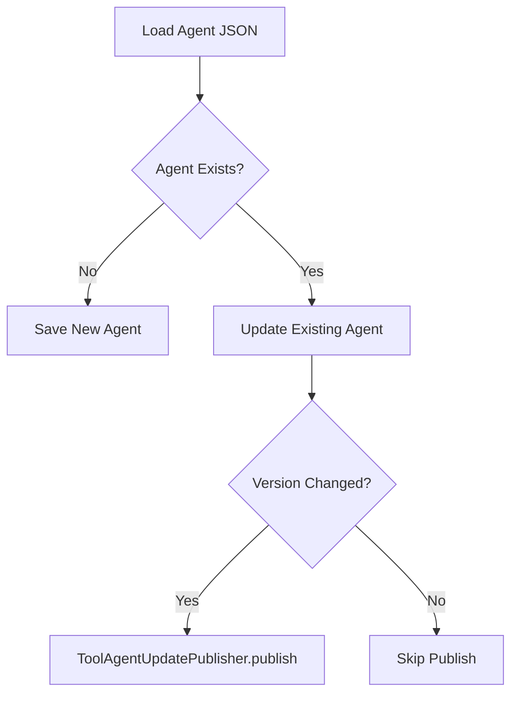
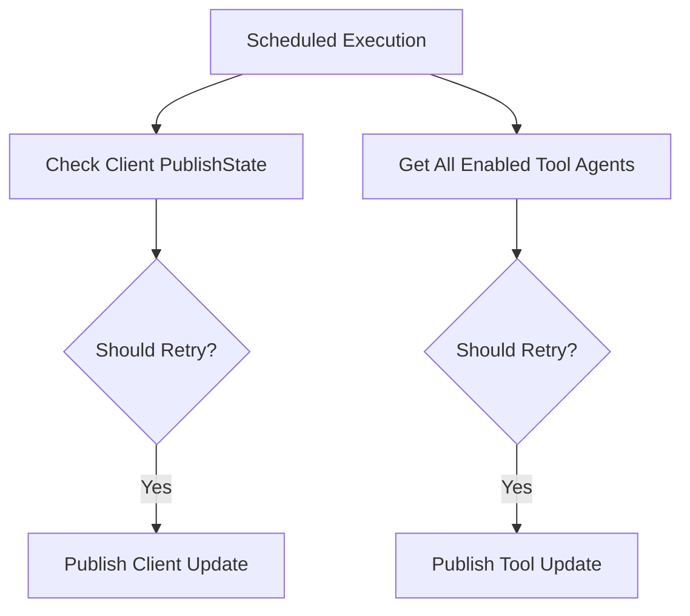
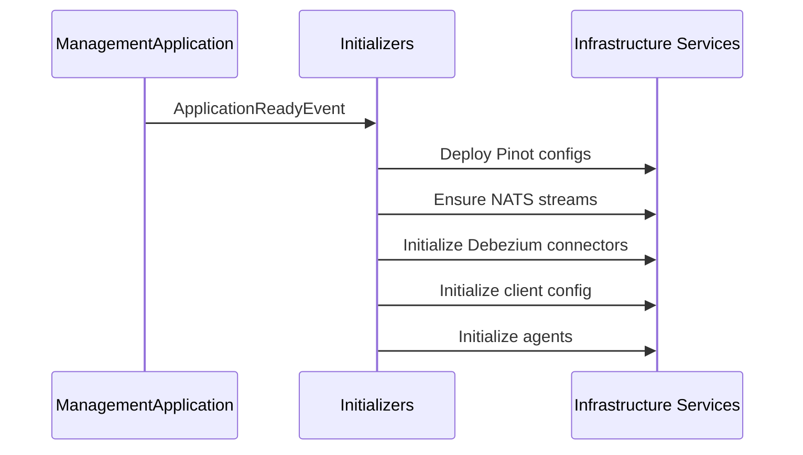

# Management Service Core

The **Management Service Core** module is responsible for cluster-level orchestration, system initialization, distributed scheduling, and infrastructure bootstrap logic within the OpenFrame platform.

It acts as the operational control plane for:

- Integrated tool lifecycle management
- Agent configuration bootstrapping
- Debezium connector orchestration
- NATS stream initialization
- Pinot schema and table deployment
- Distributed scheduled tasks with Redis-based locking
- API key statistics synchronization
- Client and tool version update publishing

This module is packaged into the `ManagementApplication` in the platform applications layer.

---

# Architecture Overview

The Management Service Core sits between persistent storage, messaging infrastructure, and higher-level platform services.



The module coordinates infrastructure components during application startup and continuously maintains system integrity through scheduled tasks.

---

# Core Responsibilities

## 1. Configuration Layer

### Management Configuration
- Enables component scanning across `com.openframe`
- Excludes Cassandra health indicator
- Provides `PasswordEncoder` (BCrypt)

### ShedLock Configuration
- Enables distributed scheduling
- Uses Redis-based `LockProvider`
- Tenant-aware lock key structure:

```text
of:{tenantId}:job-lock:{environment}:{lockName}
```

### Pinot Configuration Initializer
On application startup:

- Deploys Pinot schemas
- Deploys real-time and offline table configurations
- Retries on network failures
- Uses environment placeholder resolution

Pinot configurations are deployed from classpath resources under:

```text
classpath:pinot/config/
```

---

## 2. REST Controllers

### Integrated Tool Controller (`/v1/tools`)

Responsibilities:
- List all integrated tools
- Retrieve tool by ID
- Save/update tool configuration
- Trigger Debezium connector updates
- Execute post-save hooks

Save flow:


Extension mechanism:

```java
public interface IntegratedToolPostSaveHook {
    void onToolSaved(String toolId, IntegratedTool tool);
}
```

This provides lightweight extensibility without event bus complexity.

---

### Release Version Controller (`/v1/cluster-registrations`)

Accepts cluster release version updates and delegates processing to `ReleaseVersionService`.

---

# 3. System Initializers

Initializers run automatically at startup and ensure platform consistency.

## Agent Registration Secret Initializer
- Ensures initial agent registration secret exists
- Delegates to `AgentRegistrationSecretManagementService`

## Integrated Tool Agent Initializer
- Loads tool agent definitions from classpath
- Preserves release versions
- Publishes version updates when required

Version update flow:



---

## OpenFrame Client Configuration Initializer

- Loads default client configuration
- Preserves existing version to prevent override
- Ensures publish state continuity

---

## NATS Stream Configuration Initializer

Defines and ensures JetStream streams exist:

- TOOL_INSTALLATION
- CLIENT_UPDATE
- TOOL_UPDATE
- TOOL_CONNECTIONS
- INSTALLED_AGENTS

Each stream uses:
- File storage
- Limits retention policy

---

## Debezium Connector Initializer

Conditionally enabled.

On startup:
- Checks if connectors exist
- If none exist, recreates them from IntegratedTool Mongo documents

---

# 4. Scheduled Jobs

All scheduled jobs use ShedLock to guarantee single execution across clustered instances.

## Agent Version Update Publish Fallback Scheduler

Purpose:
- Retry publishing failed client/tool version updates
- Stops retrying after configured maximum attempts

Logic:



---

## API Key Stats Sync Scheduler

- Synchronizes API key statistics from Redis to MongoDB
- Protected by distributed lock
- Configurable interval and lock duration

---

## Debezium Health Check Scheduler

- Periodically checks connector health
- Restarts failed tasks
- Uses distributed locking

---

# 5. Infrastructure Integrations

The Management Service Core integrates with:

- **MongoDB** – tool configs, agents, client configuration
- **Redis** – distributed locking, API key statistics
- **Debezium Connect** – CDC connector lifecycle management
- **NATS JetStream** – event distribution streams
- **Apache Pinot** – analytics schema and table deployment

---

# Operational Model

Startup sequence:



Runtime behavior:

- Controllers modify state
- Hooks execute side effects
- Schedulers maintain consistency
- Retry mechanisms ensure eventual success

---

# Design Principles

### Idempotent Initialization
All initializers are safe to run multiple times.

### Distributed Safety
All scheduled jobs use Redis-backed ShedLock.

### Tenant Awareness
Lock keys and configuration patterns are tenant-scoped.

### Infrastructure as Code
Pinot schemas, NATS streams, and agent configs are declared in code or classpath resources.

### Extension Without Tight Coupling
`IntegratedToolPostSaveHook` enables modular extension.

---

# Summary

The **Management Service Core** provides the orchestration backbone of the OpenFrame platform.

It ensures:

- Infrastructure components are configured correctly
- Tool integrations are provisioned and synchronized
- Version updates are reliably published
- Distributed tasks execute safely
- Analytics schemas are deployed automatically

Without this module, the platform would lack automated bootstrapping, distributed reliability guarantees, and infrastructure lifecycle control.
