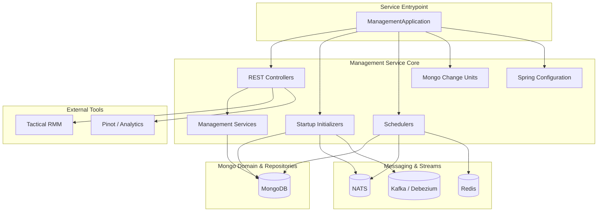
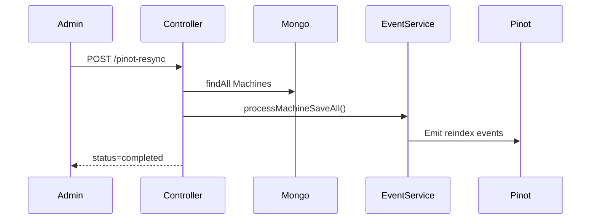
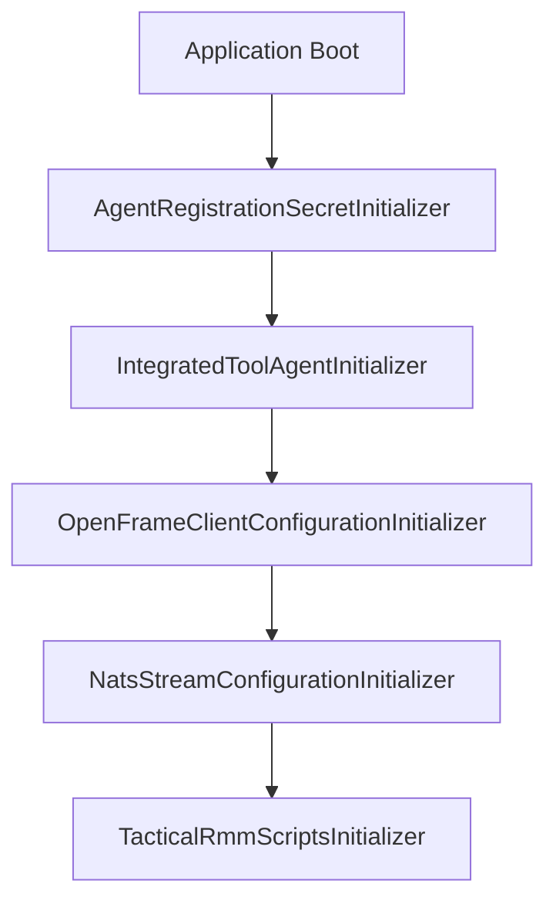
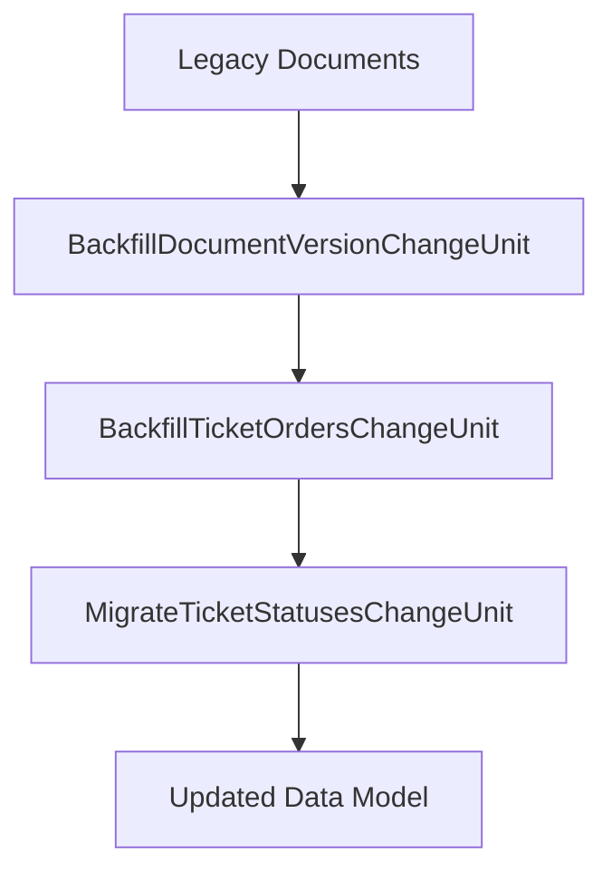

# Management Service Core

The **Management Service Core** module is the operational backbone of the OpenFrame platform. It is responsible for:

- Cluster and release version coordination
- Integrated tool lifecycle management
- Agent and client configuration initialization
- Background scheduling and distributed job locking
- Data migrations and operational backfills
- Stream and messaging infrastructure bootstrap

This module acts as the **control plane** for runtime configuration, orchestration, and maintenance tasks across tenants.

---

## Architectural Overview

The Management Service Core sits between the API layer, data layer, stream processing, and external tool integrations.



---

# Core Responsibilities

## 1. Configuration Layer

### ManagementConfiguration
- Enables component scanning across `com.openframe`
- Excludes `CassandraHealthIndicator`
- Registers a `BCryptPasswordEncoder` for secure password hashing

### RetryConfiguration
- Enables Spring Retry via `@EnableRetry`
- Used for resilient operations (external APIs, messaging, etc.)

### ShedLockConfig
- Enables distributed scheduling with:
  - `@EnableScheduling`
  - `@EnableSchedulerLock`
- Uses Redis as a distributed lock provider
- Tenant-scoped lock keys:

```text
of:{tenantId}:job-lock:{environment}:{lockName}
```

This ensures:
- No duplicate job execution across replicas
- Multi-tenant safety
- Environment isolation

---

# REST Controllers

## DevicePinotResyncController

**Endpoint:** `POST /v1/devices/pinot-resync`

Purpose:
- Loads all machines from MongoDB
- Re-emits machine events via `MachineTagEventService`
- Rebuilds downstream Pinot analytics projections



---

## IntegratedToolController

**Base Path:** `/v1/tools`

Responsibilities:
- List integrated tools
- Retrieve tool configuration
- Save/update tool configuration
- Conditionally trigger Debezium connector updates
- Invoke post-save hooks

Key behaviors:
- If tenant is not registered → store connector templates only
- If tenant is registered → create/update Debezium connectors immediately
- Executes `IntegratedToolPostSaveHook` implementations

This provides a lightweight extension mechanism without full Spring event wiring.

---

## ReleaseVersionController

**Endpoint:** `POST /v1/cluster-registrations`

- Accepts `ReleaseVersionRequest`
- Delegates to `ReleaseVersionService`
- Used to propagate cluster image tag updates

---

# Startup Initializers

Initializers implement `ApplicationRunner` and execute at boot time.



## AgentRegistrationSecretInitializer
- Ensures a default agent registration secret exists
- Delegates to `AgentRegistrationSecretManagementService`
- Post-processing handled by `DefaultAgentRegistrationSecretManagementProcessor`

## IntegratedToolAgentInitializer
- Loads agent configurations from classpath JSON files
- Applies configuration via `IntegratedToolAgentService`
- Fails fast if no configuration is provided

## OpenFrameClientConfigurationInitializer
- Loads default client configuration JSON
- Applies via `OpenFrameClientConfigurationService`
- Forces default ID usage

## NatsStreamConfigurationInitializer
Creates NATS streams for:
- TOOL_INSTALLATION
- CLIENT_UPDATE
- TOOL_UPDATE
- TOOL_CONNECTIONS
- INSTALLED_AGENTS

Allows additional stream configuration providers.

## TacticalRmmScriptsInitializer

- Retrieves Tactical RMM tool configuration
- Loads PowerShell scripts from classpath
- Creates or updates scripts via `TacticalRmmClient`

Ensures OpenFrame client update automation is available in Tactical RMM.

---

# Scheduled Jobs

## AgentVersionUpdatePublishFallbackScheduler

Conditional on:

```text
openframe.agent-version-update-publish-fallback.enabled=true
```

Responsibilities:
- Detect unpublished client configurations
- Detect unpublished tool agents
- Retry publishing via NATS
- Enforced by ShedLock to prevent duplicate execution

Retry logic:
- Skip if already published
- Retry until `max-attempts` threshold reached

---

## DeviceHeartbeatOfflineDetectionScheduler

Conditional on:

```text
openframe.device.heartbeat.offline-detection.enabled=true
```

Responsibilities:
- Periodically mark stale devices offline
- Delegates to `DeviceHeartbeatOfflineDetectionService`

---

# MongoDB Migrations (Mongock)

The module uses `@ChangeUnit` for schema evolution.



## BackfillDocumentVersionChangeUnit
- Adds `documentVersion = 0` if missing
- Applies to multiple collections

## BackfillTicketOrdersChangeUnit
- Assigns LexoRank ordering
- Ensures consistent ticket ordering per status

## MigrateTicketStatusesChangeUnit
- Migrates legacy ticket status model
- Seeds system status definitions
- Maps legacy fields to new structured model
- Controlled by feature flag:

```text
openframe.features.tickets.lifecycle.enabled
```

---

# Service Layer

## OpenFrameClientVersionUpdateService

- Intended to process new release versions
- Publishes updates via `OpenFrameClientUpdatePublisher`
- Acts as bridge between release version updates and runtime agents

## DefaultAgentRegistrationSecretManagementProcessor

- Default implementation of secret post-processing
- Logs secret creation
- Replaceable via `@ConditionalOnMissingBean`

---

# Distributed Scheduling Strategy

The module combines:

- Spring `@Scheduled`
- ShedLock
- Redis-backed `LockProvider`


Benefits:
- Safe horizontal scaling
- Tenant-aware locking
- Protection from duplicate job execution

---

# Multi-Tenant Considerations

The Management Service Core is tenant-aware through:

- Tenant-scoped Redis keys
- Tenant-aware repositories
- Conditional Debezium connector provisioning
- Tenant-registered checks before runtime activation

This ensures isolation while allowing shared infrastructure.

---

# Integration Points Across Platform

The module interacts with:

- API layer for management endpoints
- MongoDB repositories for persistent configuration
- NATS for real-time update propagation
- Kafka/Debezium for CDC connectors
- Redis for distributed locking
- Tactical RMM for script automation
- Pinot for analytics resynchronization

It functions as the **operational orchestrator** of OpenFrame.

---

# Summary

The **Management Service Core** module provides:

- Operational control plane APIs
- Infrastructure bootstrap logic
- Distributed scheduling
- Migration and lifecycle management
- Integrated tool orchestration
- Agent and client update coordination

It is responsible for keeping the OpenFrame runtime consistent, synchronized, and operational across tenants and clusters.