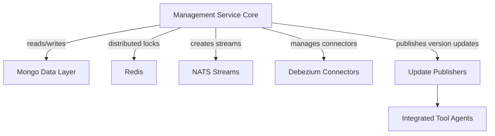
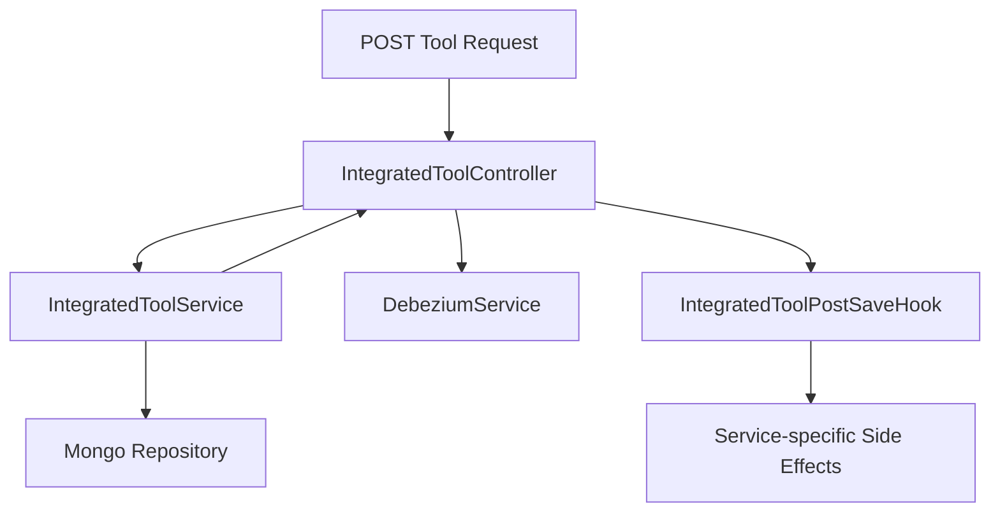
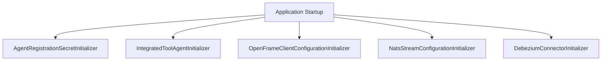
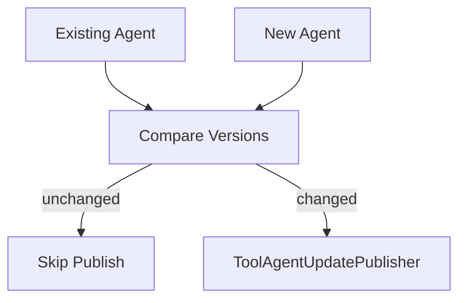
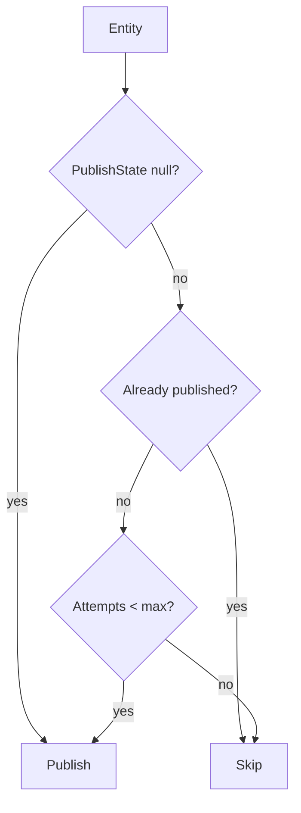
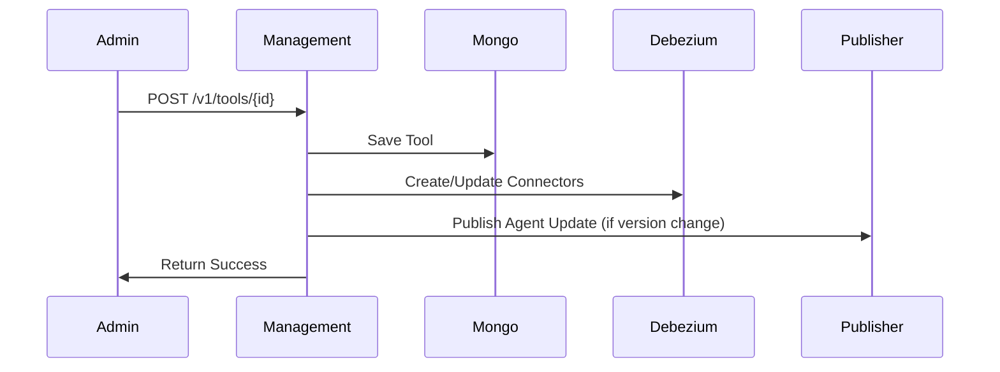

# Management Service Core

## Overview

The **Management Service Core** module is responsible for cluster-level orchestration, configuration bootstrapping, tool lifecycle management, stream initialization, and version propagation across the OpenFrame platform.

It acts as the operational control plane for:

- Integrated Tool configuration and lifecycle management  
- Agent configuration and version propagation  
- Debezium connector initialization and synchronization  
- NATS stream provisioning  
- Cluster release version handling  
- Scheduled publish fallback mechanisms  

This module is typically packaged within the Management service entrypoint and operates as a coordination layer between data services, stream infrastructure, and update publishers.

---

## Architectural Role in the Platform

The Management Service Core sits between:

- Data Layer (Mongo, Kafka, Redis)
- Stream Infrastructure (NATS, Debezium)
- Client & Agent Update Publishers
- Integrated Tool definitions

It ensures that configuration, connectors, streams, and version updates are consistent across tenants and clusters.



---

## Core Responsibilities

### 1. Configuration Bootstrapping

Bootstraps foundational components at startup:

- Agent registration secret
- Integrated Tool agent definitions
- Default OpenFrame client configuration
- NATS streams
- Debezium connectors

### 2. Integrated Tool Management

Provides REST APIs for:

- Retrieving tool definitions
- Updating tool configuration
- Triggering Debezium connector creation
- Executing post-save extension hooks

### 3. Version & Release Management

Handles:

- Cluster release version updates
- Tool agent version updates
- OpenFrame client version propagation
- Fallback publishing retries

### 4. Distributed Scheduling & Locking

Uses ShedLock + Redis to ensure:

- Scheduled jobs run once per tenant
- Safe multi-instance deployments

---

# Component-Level Architecture

## 1. Core Configuration

### ManagementConfiguration

- Performs broad component scanning
- Excludes `CassandraHealthIndicator`
- Defines a `BCryptPasswordEncoder` bean

This ensures secure password hashing for any internal credential workflows.

### ShedLockConfig

Enables distributed scheduled locking using:

- RedisLockProvider
- Tenant-scoped key prefix
- Configurable environment identifier

Lock key structure:

```text
of:{tenantId}:job-lock:{environment}:{lockName}
```

This guarantees scheduled tasks execute only once per tenant across clustered deployments.

---

## 2. Integrated Tool Management

### IntegratedToolController

Base path:

```text
/v1/tools
```

Endpoints:

- `GET /v1/tools` — list all tools
- `GET /v1/tools/{id}` — retrieve a specific tool
- `POST /v1/tools/{id}` — save/update tool configuration

Save flow:



Behavior on save:

1. Tool is persisted and enabled
2. Debezium connectors are created or updated
3. All registered `IntegratedToolPostSaveHook` implementations execute
4. Failures in hooks do not break the main transaction

### IntegratedToolPostSaveHook

A lightweight extension interface:

```text
void onToolSaved(String toolId, IntegratedTool tool)
```

Used for service-specific side effects without introducing Spring event complexity.

---

## 3. Release Version Management

### ReleaseVersionController

Base path:

```text
/v1/cluster-registrations
```

Accepts:

- `ReleaseVersionRequest`
- Delegates to `ReleaseVersionService`

This enables clusters to notify the platform of deployed image tag versions.

### OpenFrameClientVersionUpdateService

Responsible for processing client release version updates.

Although currently minimal, it is intended to:

- Compare release versions
- Trigger client update publishers
- Coordinate rollout logic

---

## 4. Startup Initializers

Startup initializers ensure the system is self-healing and reproducible.



### AgentRegistrationSecretInitializer

- Runs as `ApplicationRunner`
- Ensures agent registration secret exists
- Safe to run repeatedly

### IntegratedToolAgentInitializer

- Loads agent configuration JSON files from classpath
- Creates or updates `IntegratedToolAgent` entities
- Preserves version for release agents
- Publishes version updates if versions change

Version update logic:



### OpenFrameClientConfigurationInitializer

- Loads default client configuration
- Preserves existing version
- Maintains publish state
- Prevents accidental downgrade

### NatsStreamConfigurationInitializer

Creates predefined streams:

- TOOL_INSTALLATION
- CLIENT_UPDATE
- TOOL_UPDATE
- TOOL_CONNECTIONS
- INSTALLED_AGENTS

Each stream:

- Uses file storage
- Uses retention policy limits

### DebeziumConnectorInitializer

Triggered on `ApplicationReadyEvent` (conditional on property).

Behavior:

1. Checks if connectors exist
2. If none exist:
   - Loads tools from Mongo
   - Creates connectors for tools with Debezium configuration

This guarantees connector recovery after fresh deployments.

---

## 5. Scheduled Fallback Publishing

### AgentVersionUpdatePublishFallbackScheduler

Enabled via configuration property.

Runs on fixed delay and:

- Retrieves OpenFrame client configuration
- Retrieves all enabled Integrated Tool Agents
- Publishes entities that:
  - Are not marked as published
  - Have attempts below max threshold

Decision logic:



This ensures eventual consistency in distributed environments where message publishing may temporarily fail.

---

# Runtime Behavior Summary

## Tool Update Lifecycle



---

# Cross-Cutting Concerns

## Multi-Tenancy

- Tenant-scoped Redis lock keys
- Tenant-aware stream subject patterns
- Tool and agent isolation via data layer

## Idempotency

All initializers are designed to:

- Detect existing state
- Preserve versions
- Avoid destructive overwrites

## Fault Tolerance

- Hook execution failures do not break tool save
- Fallback scheduler retries publishing
- Debezium initialization is conditional and safe

---

# Summary

The **Management Service Core** module functions as the operational backbone of OpenFrame:

- Bootstraps infrastructure components
- Manages tool configuration lifecycle
- Coordinates connector and stream provisioning
- Ensures version consistency across agents and clients
- Provides distributed-safe scheduling

It bridges application configuration, stream infrastructure, and update propagation—making it essential for cluster stability, upgrade orchestration, and multi-tenant reliability.