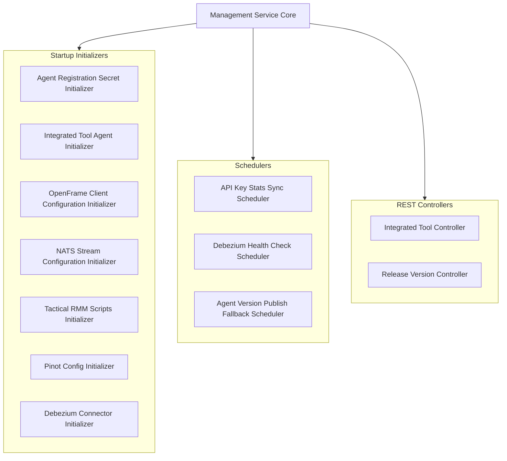
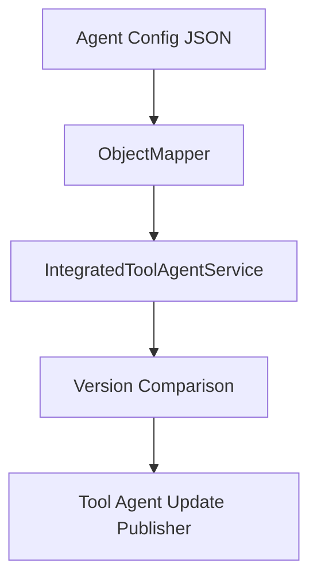
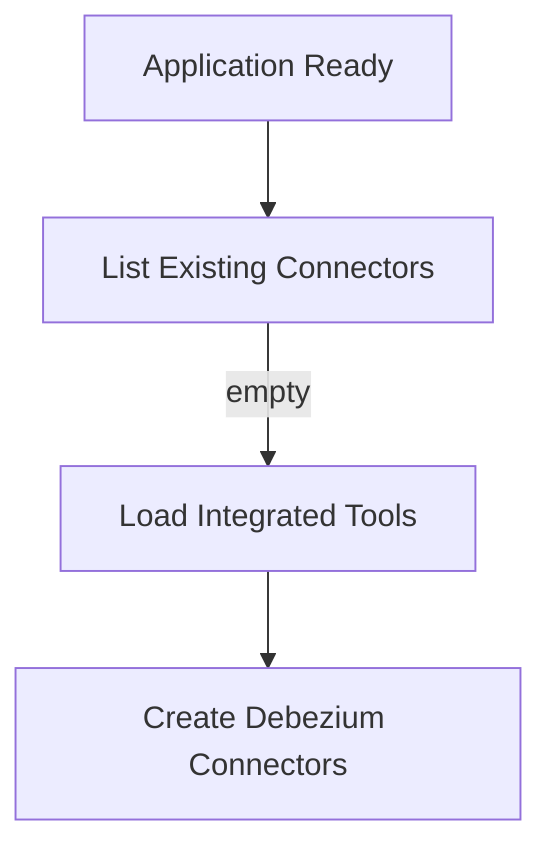
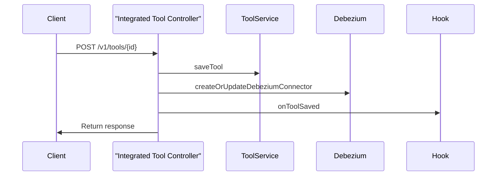
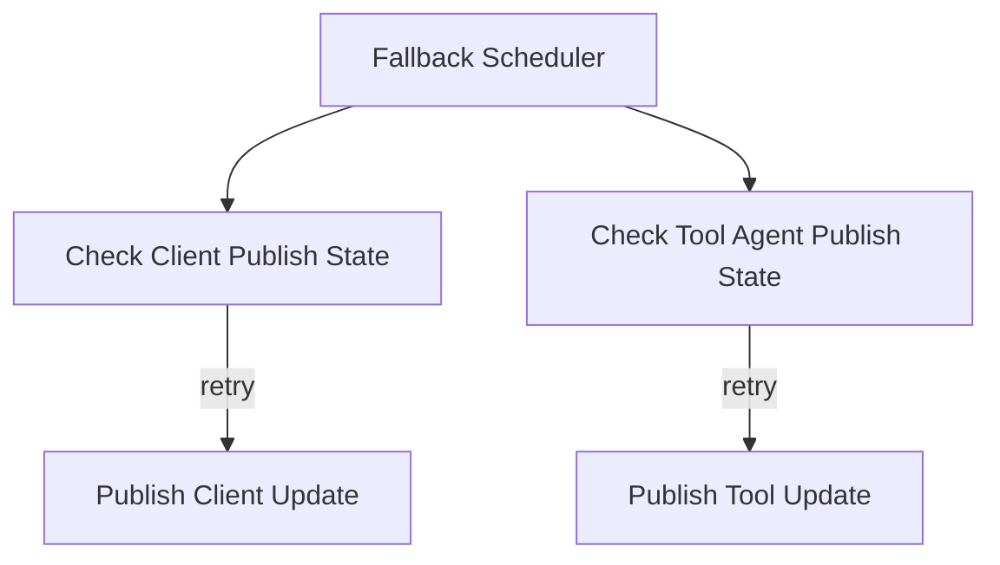
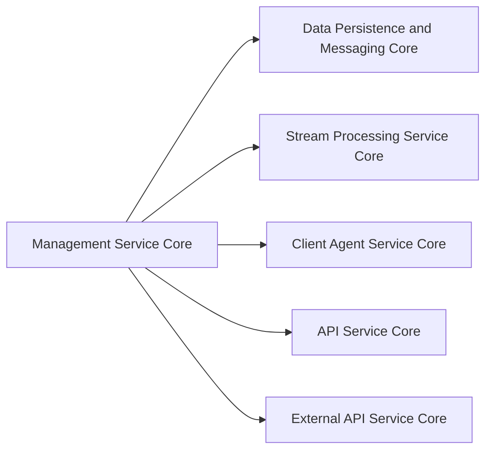

# Management Service Core

The **Management Service Core** module is the operational control plane of the OpenFrame platform. It is responsible for:

- System and tool initialization
- Version and release orchestration
- Distributed scheduling and background maintenance
- Debezium and stream connector lifecycle management
- Integrated tool configuration and post-processing
- Cluster-level synchronization tasks

This service acts as a bridge between persistent configuration (MongoDB, Redis), streaming infrastructure (NATS, Debezium), analytics systems (Pinot), and other OpenFrame services such as the API Service Core, Stream Processing Service Core, and Client Agent Service Core.

---

## 1. Architectural Overview

The Management Service Core runs as a Spring Boot application and coordinates initialization logic, scheduled maintenance, and cluster-wide configuration tasks.

---

## 2. Application Bootstrap

### 2.1 ManagementApplication

**Component:** `ManagementApplication`

- Standard Spring Boot entry point.
- Scans `com.openframe.management`, `com.openframe.data`, and `com.openframe.core`.
- Explicitly excludes `CassandraHealthIndicator` to avoid Cassandra dependency in this service.

This ensures the Management Service Core remains focused on orchestration and configuration, not direct Cassandra health reporting.

---

## 3. Configuration Layer

### 3.1 ManagementConfiguration

- Performs wide `com.openframe` component scanning.
- Excludes `CassandraHealthIndicator`.
- Provides a `PasswordEncoder` bean (`BCryptPasswordEncoder`) for secure hashing.

### 3.2 ShedLockConfig

Enables distributed locking for scheduled jobs using Redis.

Key characteristics:

- Uses `RedisLockProvider`.
- Locks are tenant-scoped using `OpenframeRedisKeyBuilder`.
- Prevents duplicate execution in multi-instance deployments.

This guarantees cluster-safe background processing.

### 3.3 PinotConfigInitializer

Deploys Apache Pinot schemas and table configurations on application startup.

Responsibilities:

- Loads schema and table JSON from classpath.
- Resolves Spring placeholders.
- Calls Pinot Controller REST endpoints.
- Retries failed deployments with configurable delay and attempts.

Configured tables include:

- `devices`
- `logs`

This ensures analytics infrastructure is aligned with the current schema version.

---

## 4. Initialization Components

Initialization logic runs during startup and ensures system consistency.

### 4.1 AgentRegistrationSecretInitializer

- Invokes `AgentRegistrationSecretManagementService`.
- Creates initial agent registration secret.
- Ensures secure onboarding for agents.

### 4.2 IntegratedToolAgentInitializer

Loads agent definitions from configuration resources and:

- Creates missing agents.
- Updates existing ones.
- Preserves release versions.
- Publishes version updates when necessary.

### 4.3 OpenFrameClientConfigurationInitializer

- Loads default client configuration.
- Preserves existing version and publish state.
- Ensures consistent client rollout configuration.

### 4.4 NatsStreamConfigurationInitializer

Creates predefined NATS streams:

- TOOL_INSTALLATION
- CLIENT_UPDATE
- TOOL_UPDATE
- TOOL_CONNECTIONS
- INSTALLED_AGENTS

This prepares the event-driven infrastructure for:

- Agent updates
- Tool installation events
- Client lifecycle events

### 4.5 TacticalRmmScriptsInitializer

Integrates with Tactical RMM:

- Loads PowerShell scripts from resources.
- Creates or updates scripts via `TacticalRmmClient`.
- Uses credentials stored in `IntegratedTool` configuration.

This ensures external RMM tooling remains synchronized with OpenFrame updates.

### 4.6 DebeziumConnectorInitializer

Triggered on application ready (when enabled):

- Checks existing Debezium connectors.
- If none exist, loads configurations from MongoDB.
- Creates connectors for tools that define Debezium configurations.

---

## 5. REST Controllers

### 5.1 Integrated Tool Controller

**Base path:** `/v1/tools`

Responsibilities:

- Retrieve all tools.
- Retrieve tool by ID.
- Save tool configuration.
- Trigger Debezium connector updates.
- Execute post-save hooks.

Post-save extension point:

- `IntegratedToolPostSaveHook`
- Enables service-specific side effects.

### 5.2 Release Version Controller

**Base path:** `/v1/cluster-registrations`

- Accepts `ReleaseVersionRequest`.
- Delegates processing to `ReleaseVersionService`.
- Intended for cluster-wide release version updates.

---

## 6. Scheduling and Background Tasks

### 6.1 ApiKeyStatsSyncScheduler

- Syncs Redis API key usage stats to MongoDB.
- Uses ShedLock for distributed execution.
- Enabled by default.

### 6.2 DebeziumHealthCheckScheduler

- Periodically checks Debezium connector health.
- Restarts failed tasks when required.
- Uses distributed locking.

### 6.3 AgentVersionUpdatePublishFallbackScheduler

Ensures reliability of version publishing:

- Re-publishes unpublished `OpenFrameClientConfiguration`.
- Re-publishes `IntegratedToolAgent` updates.
- Honors max retry attempts.

---

## 7. Version Update Services

### 7.1 OpenFrameClientVersionUpdateService

- Wraps `OpenFrameClientUpdatePublisher`.
- Intended to process new release versions.
- Designed to integrate with release workflows triggered by cluster registration events.

---

## 8. Cross-Service Integration

The Management Service Core integrates with:

- **Data Persistence and Messaging Core** (MongoDB, Redis, Kafka, Pinot repositories)
- **Stream Processing Service Core** (event enrichment and downstream processing)
- **Client Agent Service Core** (agent registration and lifecycle)
- **API Service Core** (administrative APIs)
- **External API Service Core** (external exposure of tool and organization data)

The module does not duplicate business logic from these services but orchestrates and initializes them.

---

## 9. Design Principles

The Management Service Core follows these principles:

- **Idempotent initialization** – Safe to restart without duplication.
- **Distributed safety** – Uses Redis-based ShedLock.
- **Event-driven updates** – Publishes version updates to streaming infrastructure.
- **Extensibility** – Post-save hooks for tool customization.
- **Operational automation** – Self-configures analytics and streaming components.

---

# Summary

The **Management Service Core** is the orchestration backbone of OpenFrame. It ensures:

- Infrastructure components are initialized correctly.
- Distributed jobs run safely in clustered environments.
- Tool configurations remain synchronized.
- Debezium connectors and analytics schemas stay consistent.
- Client and agent version updates are reliably published.

It does not serve end-user business workflows directly; instead, it guarantees that the platform's operational foundation remains stable, synchronized, and self-healing.