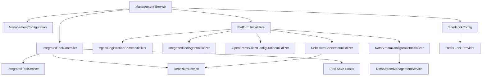
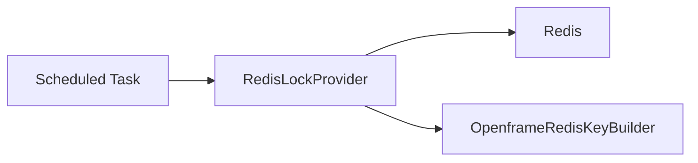
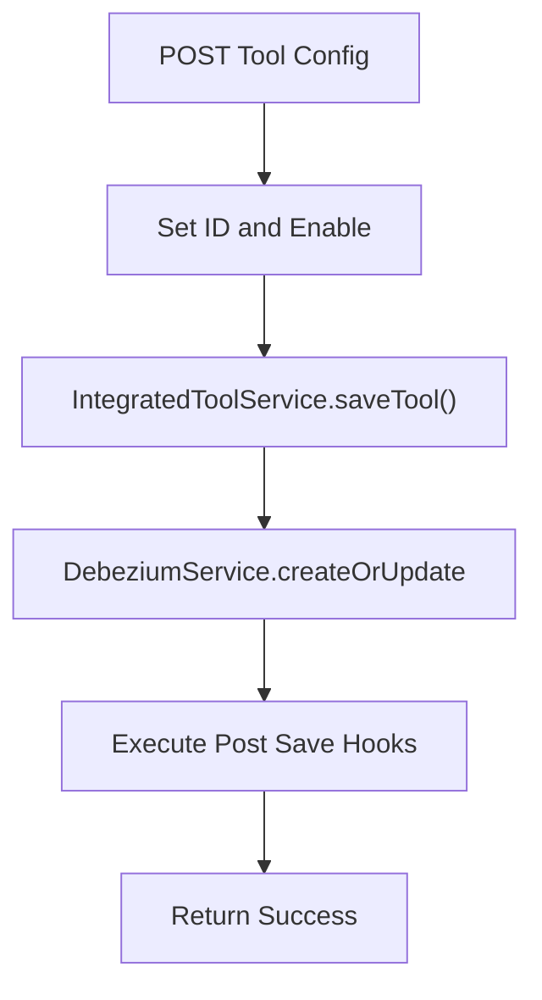
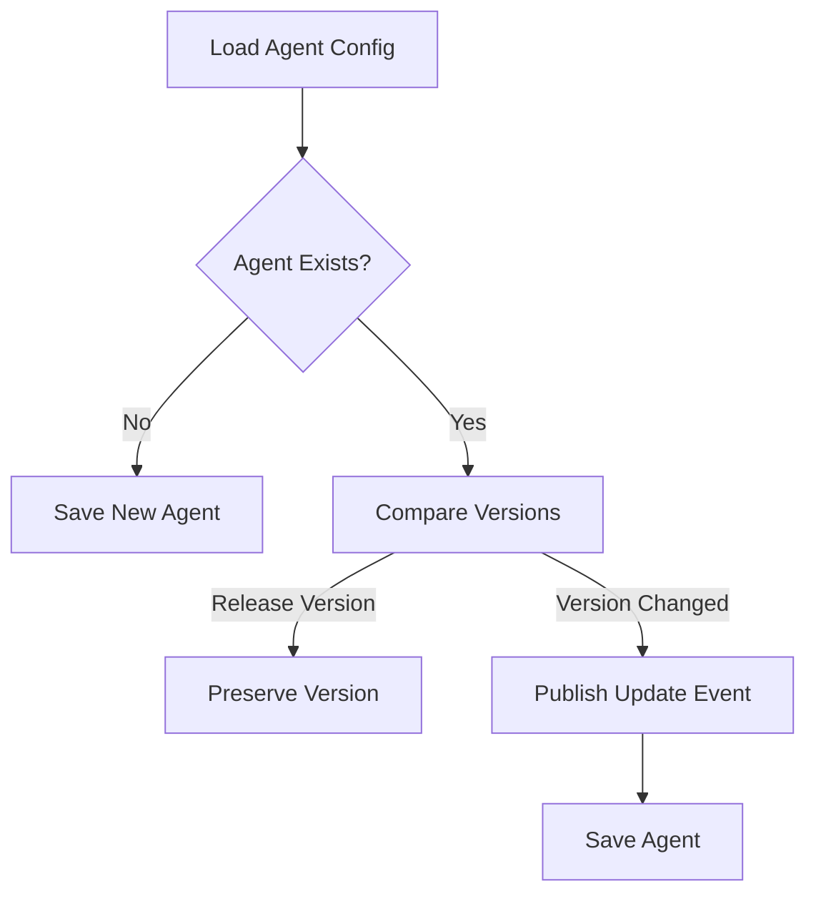
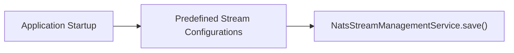
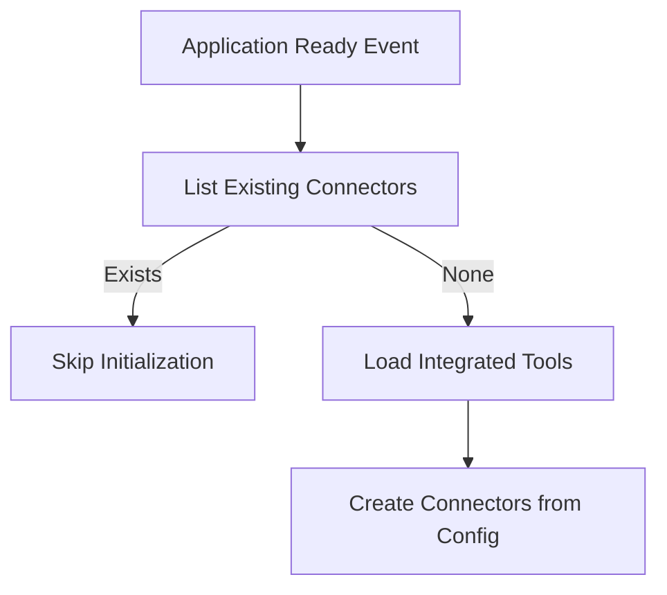
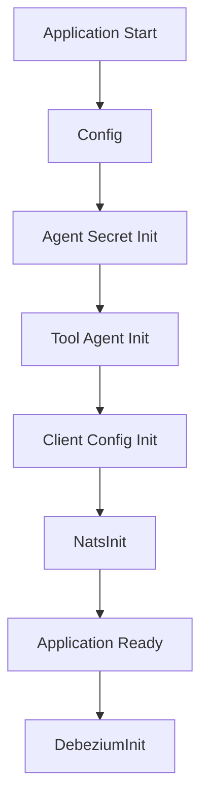

# Management Service Core

## Overview

The **Management Service Core** module is responsible for platform bootstrap, operational configuration, tool lifecycle orchestration, and infrastructure initialization within the OpenFrame ecosystem.

It acts as the operational control plane for:

- Integrated tool configuration and persistence
- Debezium connector lifecycle management
- Agent and client configuration bootstrapping
- NATS stream provisioning
- Distributed scheduled task coordination
- Agent registration secret initialization

This module ensures that when the Management service starts, the platform is correctly initialized, synchronized, and ready to manage tools, agents, and client configurations across tenants.

---

## Architectural Role in the Platform

Within the broader OpenFrame architecture, the Management Service Core sits between:

- Data persistence (Mongo, Redis)
- Messaging infrastructure (NATS, Kafka, Debezium)
- Tool and Agent domain services
- External stream processors

It does **not** primarily serve end-user business APIs. Instead, it provides:

- Operational orchestration
- Configuration enforcement
- Infrastructure health and initialization
- Tool lifecycle management

---

## High-Level Architecture



---

# Core Components

## 1. ManagementConfiguration

### Purpose
Provides base Spring configuration for the Management service.

### Responsibilities

- Enables component scanning across `com.openframe`
- Excludes `CassandraHealthIndicator`
- Defines a `BCryptPasswordEncoder` bean

### Why It Matters

The password encoder ensures that any secrets or credentials managed by this service are securely hashed using BCrypt.

---

## 2. ShedLockConfig

### Purpose
Enables distributed scheduled task locking using Redis.

### Key Features

- Uses `RedisLockProvider`
- Tenant-scoped lock keys
- Default lock duration: 10 minutes
- Ensures scheduled jobs are not executed concurrently across instances

### Lock Key Strategy

```text
of:{tenantId}:job-lock:{environment}:{lockName}
```

### Architecture



This guarantees horizontal scalability without duplicate execution.

---

## 3. IntegratedToolController

### Purpose
Exposes REST endpoints for managing Integrated Tools.

### Endpoints

```text
GET    /v1/tools
GET    /v1/tools/{id}
POST   /v1/tools/{id}
```

### Responsibilities

- Retrieve tool configurations
- Save or update tool configurations
- Trigger Debezium connector creation
- Execute post-save hooks

### Save Flow



### Error Handling

- Returns HTTP 500 on failure
- Logs hook-level failures without failing the main transaction

This design prevents auxiliary failures from breaking core configuration persistence.

---

## 4. AgentRegistrationSecretInitializer

### Purpose
Ensures an initial agent registration secret exists at application startup.

### Lifecycle

- Implements `ApplicationRunner`
- Executes on startup
- Calls `createInitialSecret()`

### Why It Matters

Agents require a secure bootstrap secret to register with the platform. This initializer guarantees secure onboarding readiness.

---

## 5. IntegratedToolAgentInitializer

### Purpose
Bootstraps and synchronizes Integrated Tool Agent definitions from resource files.

### Behavior

- Loads agent configuration JSON files
- Creates new agents if missing
- Updates existing agents
- Preserves release versions
- Publishes version updates when changed

### Version Update Logic



### Key Principles

- Release versions are immutable
- Non-release versions trigger update events
- Version changes propagate through message publishers

---

## 6. NatsStreamConfigurationInitializer

### Purpose
Provisions required NATS JetStream streams during startup.

### Streams Created

- TOOL_INSTALLATION
- CLIENT_UPDATE
- TOOL_UPDATE
- TOOL_CONNECTIONS
- INSTALLED_AGENTS

### Example Subjects

```text
machine.*.tool-installation
machine.*.client-update
machine.*.tool.*.update
machine.*.tool-connection
machine.*.installed-agent
```

### Flow



This guarantees messaging infrastructure readiness before agents or tools emit events.

---

## 7. OpenFrameClientConfigurationInitializer

### Purpose
Initializes the default OpenFrame client configuration.

### Behavior

- Loads `client-configuration.json`
- Sets default ID
- Preserves existing version
- Updates publish state

### Why Version Preservation Matters

Prevents overwriting production-deployed client versions during service restarts.

---

## 8. DebeziumConnectorInitializer

### Purpose
Ensures Debezium connectors exist when the application becomes ready.

### Conditional Activation

Enabled only when:

```text
openframe.debezium.health-check.enabled=true
```

### Initialization Flow



### Key Guarantee

Prevents duplicate connector creation while ensuring infrastructure consistency.

---

## 9. OpenFrameClientVersionUpdateService

### Purpose
Responsible for processing client release version updates.

### Current State

- Injects `OpenFrameClientUpdatePublisher`
- Placeholder for version propagation logic

This component is designed to trigger client update events across the fleet.

---

# Initialization Lifecycle Summary



---

# Key Design Principles

## 1. Idempotent Initialization

All initializers are safe to run multiple times.

## 2. Version Preservation

Release versions are never overwritten automatically.

## 3. Distributed Safety

ShedLock prevents duplicate job execution in clustered environments.

## 4. Event-Driven Synchronization

Version updates and configuration changes propagate via publishers and messaging streams.

## 5. Infrastructure as Code

Stream configurations and tool definitions are declared declaratively and applied at startup.

---

# Operational Responsibilities Summary

| Concern | Component | Purpose |
|----------|------------|----------|
| Password Security | ManagementConfiguration | BCrypt hashing |
| Distributed Locks | ShedLockConfig | Prevent duplicate job execution |
| Tool API | IntegratedToolController | Tool configuration management |
| Agent Secret | AgentRegistrationSecretInitializer | Secure bootstrap |
| Tool Agent Sync | IntegratedToolAgentInitializer | Agent lifecycle management |
| NATS Streams | NatsStreamConfigurationInitializer | Messaging infrastructure |
| Client Config | OpenFrameClientConfigurationInitializer | Client bootstrap |
| Debezium Connectors | DebeziumConnectorInitializer | CDC synchronization |
| Client Version Events | OpenFrameClientVersionUpdateService | Fleet updates |

---

# Conclusion

The **Management Service Core** module is the operational backbone of the OpenFrame platform. It ensures that:

- Tools are correctly configured and synchronized
- Agents are version-managed and updated safely
- Messaging streams are provisioned
- Connectors are initialized consistently
- Distributed tasks run safely
- Client configurations are preserved and propagated

Without this module, the platform would lack deterministic startup behavior, infrastructure consistency, and coordinated configuration management.