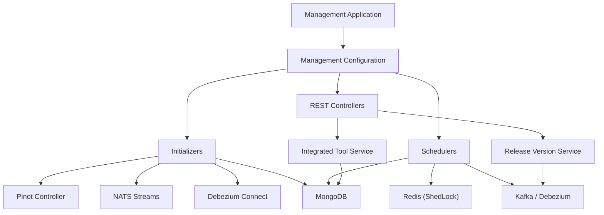
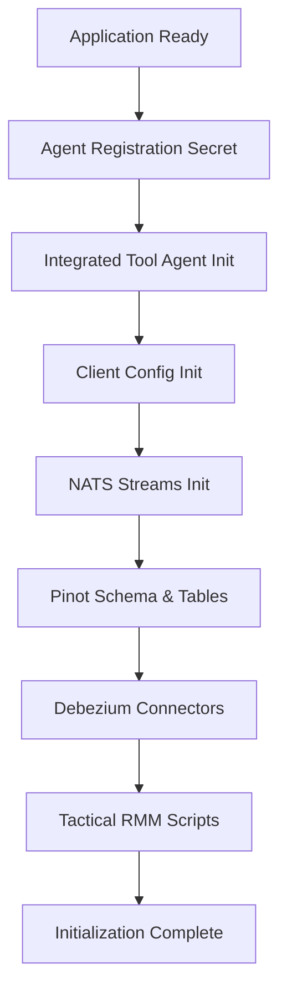
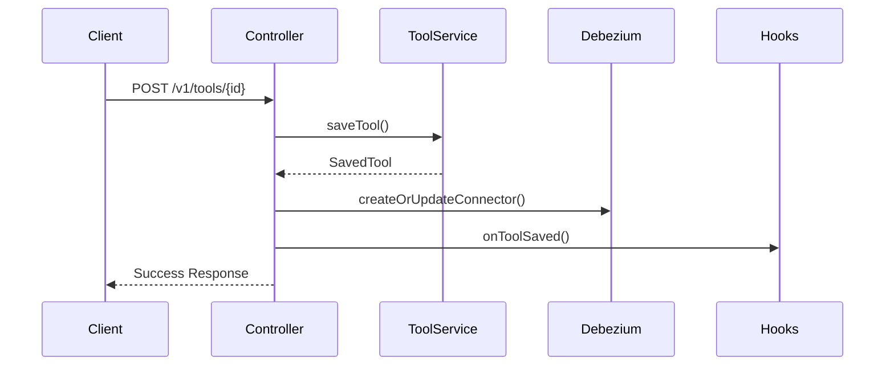

# Management Service Core

The **Management Service Core** module is responsible for system bootstrap, operational automation, tool lifecycle management, and cross-service infrastructure orchestration within the OpenFrame platform.

It acts as the operational brain of the platform by:

- Initializing critical infrastructure (Pinot, NATS, Debezium)
- Managing Integrated Tools and Tool Agents
- Orchestrating version publishing for agents and clients
- Running distributed scheduled jobs with tenant-scoped locking
- Ensuring cluster-wide consistency across deployments

This module is primarily used by the `openframe-management` service entrypoint and integrates heavily with the data layer, streaming layer, and client agent ecosystem.

---

# High-Level Architecture

The Management Service Core sits between infrastructure systems and domain services, coordinating initialization and runtime automation.



---

# Core Responsibilities

## 1. System Bootstrapping

Executed at application startup:

- Agent registration secret creation
- Integrated tool agent provisioning
- Default OpenFrame client configuration initialization
- NATS stream creation
- Pinot schema & table deployment
- Tactical RMM script synchronization
- Debezium connector initialization

## 2. Tool Lifecycle Management

The module provides APIs to:

- Retrieve tools
- Update tool configuration
- Create/update Debezium connectors
- Trigger post-save hooks

## 3. Distributed Scheduling & Reliability

Using **ShedLock with Redis**, the module ensures:

- Only one node executes critical scheduled tasks
- Safe multi-node cluster deployments
- Retry-based publish fallback logic

## 4. Version & Update Orchestration

Handles:

- Agent version update publishing
- Client configuration publishing
- Release version processing
- Fallback retries for failed publish events

---

# Configuration Layer

## Management Configuration

**Class:** `ManagementConfiguration`

- Component scanning for `com.openframe`
- Excludes Cassandra health indicator
- Provides `BCryptPasswordEncoder` bean

## Distributed Locking (ShedLock)

**Class:** `ShedLockConfig`

Key characteristics:

- Uses Redis as lock provider
- Tenant-scoped key prefix
- Environment-specific lock isolation

Lock key format:

```text
of:{tenantId}:job-lock:{environment}:{lockName}
```

This guarantees safe execution in multi-tenant clustered environments.

---

# Infrastructure Initializers

These components run at startup and ensure platform infrastructure is correctly provisioned.

## Initialization Flow



---

## Pinot Configuration Deployment

**Class:** `PinotConfigInitializer`

Responsibilities:

- Loads schema & table JSON from classpath
- Resolves Spring placeholders
- Deploys via HTTP to Pinot Controller
- Retries with exponential delay
- Creates or updates tables

Configured datasets:

- `devices`
- `logs`

Ensures analytics layer (Pinot) remains consistent across environments.

---

## Integrated Tool Agent Initialization

**Class:** `IntegratedToolAgentInitializer`

- Loads agent configurations from configured resource paths
- Creates or updates existing agents
- Preserves release version integrity
- Publishes version updates when changed

Version handling logic:

- Release agents preserve version
- Non-release agents trigger update publish

---

## OpenFrame Client Configuration Initialization

**Class:** `OpenFrameClientConfigurationInitializer`

- Loads default client configuration JSON
- Preserves existing version if present
- Maintains publish state

Ensures consistent baseline configuration for OpenFrame clients.

---

## NATS Stream Initialization

**Class:** `NatsStreamConfigurationInitializer`

Creates streams:

- TOOL_INSTALLATION
- CLIENT_UPDATE
- TOOL_UPDATE
- TOOL_CONNECTIONS
- INSTALLED_AGENTS

All streams use:

- File storage
- Limits retention policy

---

## Tactical RMM Script Synchronization

**Class:** `TacticalRmmScriptsInitializer`

- Fetches Tactical RMM API credentials
- Compares existing scripts
- Creates or updates scripts from classpath
- Ensures update automation script exists

---

## Debezium Connector Initialization

**Class:** `DebeziumConnectorInitializer`

- Runs on ApplicationReadyEvent
- If no connectors exist:
  - Reads tool configurations
  - Creates connectors for tools with Debezium config

---

# REST API Layer

## Integrated Tool Controller

**Endpoint Base:** `/v1/tools`

Capabilities:

- GET all tools
- GET tool by ID
- POST save/update tool

Save flow:



Extensibility is achieved via `IntegratedToolPostSaveHook`.

---

## Release Version Controller

**Endpoint Base:** `/v1/cluster-registrations`

Accepts:

```json
{
  "imageTagVersion": "v1.2.3"
}
```

Delegates to `ReleaseVersionService` for cluster-wide version propagation.

---

# Scheduling & Reliability Layer

## Agent Version Update Publish Fallback Scheduler

**Class:** `AgentVersionUpdatePublishFallbackScheduler`

- Periodically checks unpublished entities
- Retries publishing until max attempts reached
- Supports both client configuration and tool agents

Retry logic:

- Skip if published
- Retry if attempts < configured max

---

## API Key Stats Sync Scheduler

**Class:** `ApiKeyStatsSyncScheduler`

- Syncs Redis statistics into MongoDB
- Uses distributed locking
- Configurable intervals

---

## Debezium Health Check Scheduler

**Class:** `DebeziumHealthCheckScheduler`

- Periodically checks connector state
- Restarts failed tasks
- Distributed lock protected

---

# Data Structures

## Release Version Request

```java
public class ReleaseVersionRequest {
    private String imageTagVersion;
}
```

## Debezium Connector Status

Represents:

- Connector state
- Task states
- Worker IDs
- Failure trace

Used for monitoring and automated recovery.

---

# Cross-Module Relationships

The Management Service Core integrates with:

- Data Layer (Mongo, Redis, Cassandra, Pinot)
- Kafka & Debezium
- Stream Processing Layer
- Client Agent Service Core
- Gateway Service Core

It does not replace these modules — it orchestrates and stabilizes them.

---

# Deployment Considerations

✅ Requires Redis for ShedLock
✅ Requires Pinot Controller reachable
✅ Requires Debezium Connect reachable
✅ Requires NATS server available
✅ Requires MongoDB for persistence

Cluster-safe by design.

---

# Summary

The **Management Service Core** is the automation and orchestration backbone of OpenFrame.

It ensures:

- Infrastructure consistency
- Tool lifecycle control
- Reliable distributed scheduling
- Automated recovery of streaming components
- Safe multi-tenant cluster behavior

Without this module, the platform would lack coordinated initialization, update propagation, and runtime reliability controls.
