# Management Service Core

The **Management Service Core** module is responsible for operational orchestration, infrastructure initialization, cluster-level configuration, and cross-service coordination within the OpenFrame platform.

It acts as the control plane for:

- Integrated tool lifecycle management
- Agent and client configuration bootstrapping
- Debezium connector provisioning and health management
- NATS stream provisioning
- Pinot analytics configuration deployment
- Scheduled background orchestration with distributed locking
- API key statistics synchronization

This module is deployed via the `ManagementApplication` entrypoint and operates alongside other backend services such as the API Service Core, Gateway Service Core, Stream Processing Service Core, and Data Platform modules.

---

## 1. Architectural Overview

The Management Service Core sits between persistent data stores, streaming infrastructure, and operational tooling services.

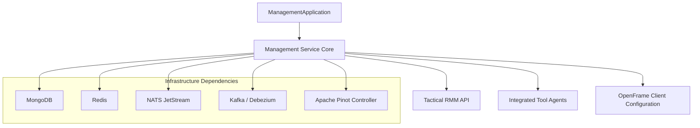

### Core Responsibilities

| Area | Responsibility |
|------|---------------|
| Configuration | Bootstraps Pinot schemas, NATS streams, client configs |
| Tool Management | CRUD + post-save hooks + Debezium connector provisioning |
| Agent Lifecycle | Initializes and publishes agent updates |
| Scheduling | Distributed job execution via ShedLock + Redis |
| CDC Management | Debezium connector creation + health monitoring |
| Metrics | API key statistics sync from Redis to Mongo |

---

## 2. Configuration Layer

### 2.1 Management Configuration

**Class:** `ManagementConfiguration`

Responsibilities:
- Enables component scanning across `com.openframe`
- Excludes `CassandraHealthIndicator` (to prevent unintended health auto-binding)
- Defines `BCryptPasswordEncoder` bean

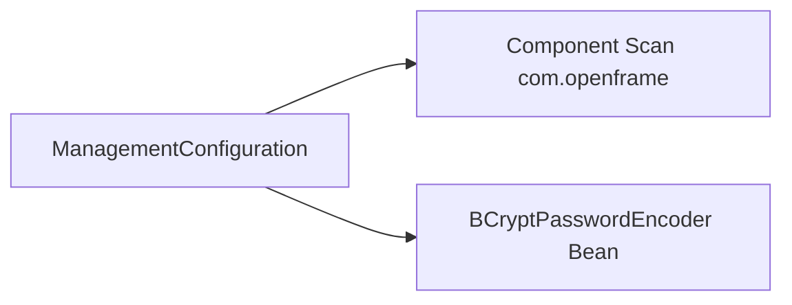

---

### 2.2 ShedLock Configuration

**Class:** `ShedLockConfig`

Enables:
- Spring scheduling
- Distributed locking via Redis
- Tenant-scoped lock keys

Lock key format:

```text
of:{tenantId}:job-lock:{environment}:{lockName}
```

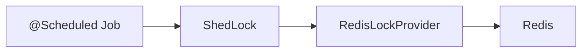

This ensures only one instance executes a scheduled task across a cluster.

---

### 2.3 Pinot Configuration Initializer

**Class:** `PinotConfigInitializer`

On `ApplicationReadyEvent`:

1. Loads schema and table configs from classpath
2. Resolves environment placeholders
3. Deploys to Pinot Controller
4. Retries on transient failures

Configured datasets:
- `devices`
- `logs`

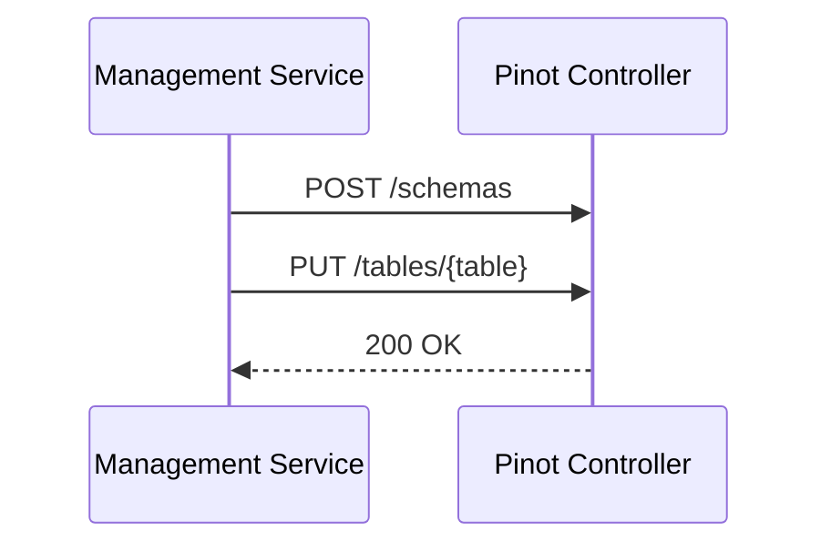

If a table does not exist, it falls back to creation via POST.

---

## 3. Integrated Tool Management

### 3.1 Integrated Tool Controller

**Class:** `IntegratedToolController`

Endpoint: `/v1/tools`

Capabilities:
- List tools
- Get tool by ID
- Save tool configuration
- Create/update Debezium connectors
- Execute post-save hooks

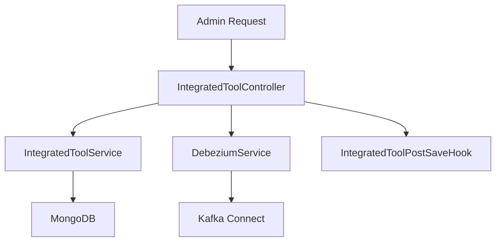

### Save Flow

1. Tool is persisted
2. Debezium connectors are created or updated
3. Post-save hooks execute (extensibility point)

This design avoids heavy Spring events and provides a lightweight extension model.

---

## 4. Initialization Components

The Management Service Core contains multiple bootstrappers.

### 4.1 Agent Registration Secret

**Class:** `AgentRegistrationSecretInitializer`

- Executes at startup
- Ensures registration secret exists
- Delegates to `AgentRegistrationSecretManagementService`

---

### 4.2 Integrated Tool Agent Initializer

**Class:** `IntegratedToolAgentInitializer`

On startup:

- Loads agent JSON configurations
- Inserts or updates records
- Preserves version for release agents
- Publishes version updates if changed

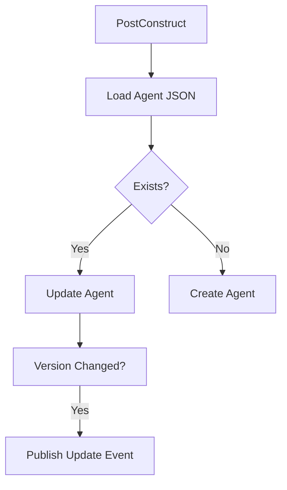

---

### 4.3 OpenFrame Client Configuration Initializer

**Class:** `OpenFrameClientConfigurationInitializer`

- Loads `client-configuration.json`
- Preserves version if already existing
- Ensures default configuration ID

Used by client update publisher flows.

---

### 4.4 NATS Stream Configuration Initializer

**Class:** `NatsStreamConfigurationInitializer`

Provisioned Streams:

- `TOOL_INSTALLATION`
- `CLIENT_UPDATE`
- `TOOL_UPDATE`
- `TOOL_CONNECTIONS`
- `INSTALLED_AGENTS`

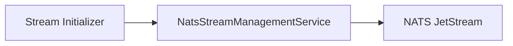

Ensures required messaging topology exists.

---

### 4.5 Tactical RMM Scripts Initializer

**Class:** `TacticalRmmScriptsInitializer`

- Reads PowerShell scripts from resources
- Calls Tactical RMM API
- Creates or updates scripts

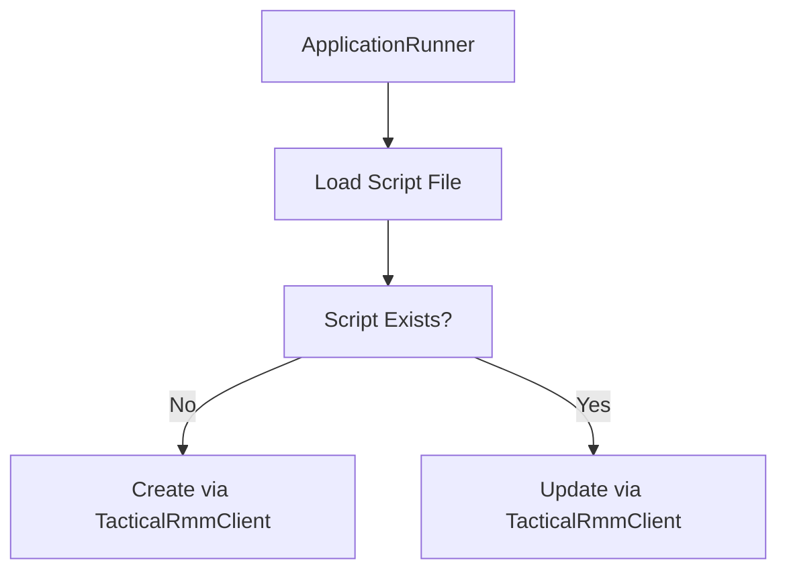

---

## 5. Debezium Connector Management

### 5.1 Connector Initialization

**Class:** `DebeziumConnectorInitializer`

Triggered on `ApplicationReadyEvent` when enabled.

Behavior:

- If no connectors exist
- Fetch all Integrated Tools
- Create connectors defined in tool configuration

---

### 5.2 Debezium Health Scheduler

**Class:** `DebeziumHealthCheckScheduler`

Runs periodically:

- Checks connector task states
- Restarts failed tasks
- Uses ShedLock for cluster safety

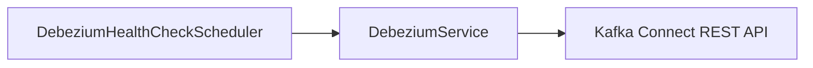

---

## 6. Scheduled Operational Tasks

### 6.1 Agent Version Update Fallback

**Class:** `AgentVersionUpdatePublishFallbackScheduler`

Purpose:

- Retry publishing client and tool agent updates
- Respect max retry attempts
- Avoid infinite retry loops

Logic:

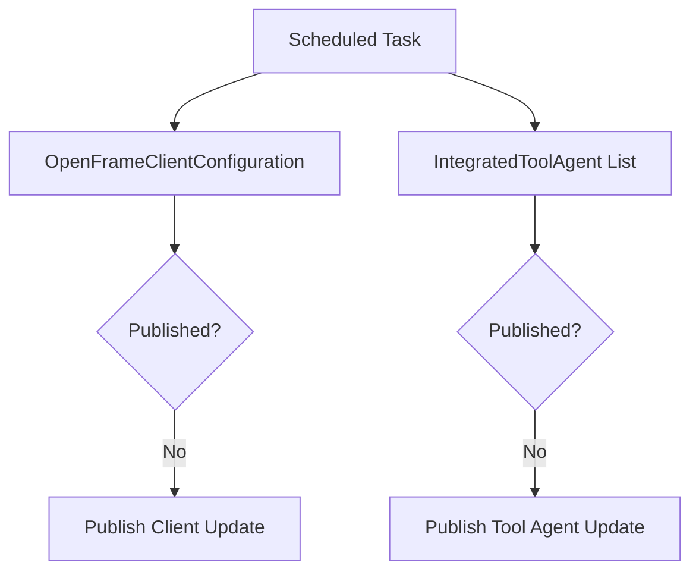

---

### 6.2 API Key Stats Synchronization

**Class:** `ApiKeyStatsSyncScheduler`

- Scheduled Redis → Mongo sync
- Uses distributed lock
- Delegates to `ApiKeyStatsSyncService`

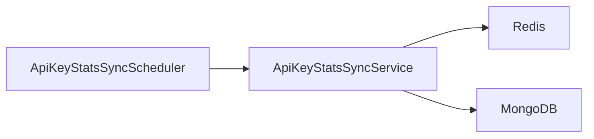

---

## 7. Release Version Handling

### 7.1 Release Version Controller

**Endpoint:** `/v1/cluster-registrations`

Accepts:

```text
{
  "imageTagVersion": "v1.2.3"
}
```

Delegates to `ReleaseVersionService`.

### 7.2 OpenFrame Client Version Update Service

**Class:** `OpenFrameClientVersionUpdateService`

Currently a placeholder for release orchestration logic.

Intended responsibility:

- Process cluster image tag updates
- Trigger appropriate version update publishing

---

## 8. Distributed Scheduling Model

All scheduled tasks rely on:

- `@EnableScheduling`
- `@EnableSchedulerLock`
- Redis-based `RedisLockProvider`

This guarantees:

- Single execution across cluster
- Tenant-aware lock scoping
- Safe retry logic

---

## 9. Cross-Module Integration

The Management Service Core integrates with:

- Data Persistence (Mongo)
- Data Cache (Redis)
- Data Messaging (Kafka, Debezium)
- Stream Processing (via NATS streams)
- Data Platform (Pinot analytics)
- External Tool SDKs (e.g., Tactical RMM)

It does **not** expose user-facing APIs; instead it provides operational and orchestration APIs consumed internally by platform components and administrators.

---

# Summary

The **Management Service Core** is the operational backbone of the OpenFrame platform.

It ensures:

- Infrastructure is provisioned correctly at startup
- Tool integrations are consistently configured
- CDC pipelines remain healthy
- Agent updates are reliably distributed
- Analytics schemas are deployed
- Scheduled tasks execute safely in distributed environments

Without this module, the platform would lack coordinated control over connectors, streams, analytics schemas, and client/agent lifecycle orchestration.