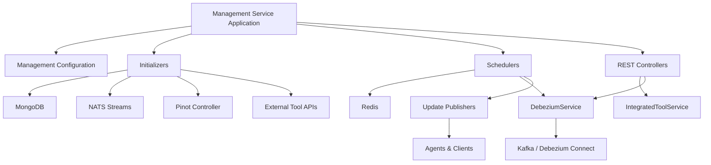
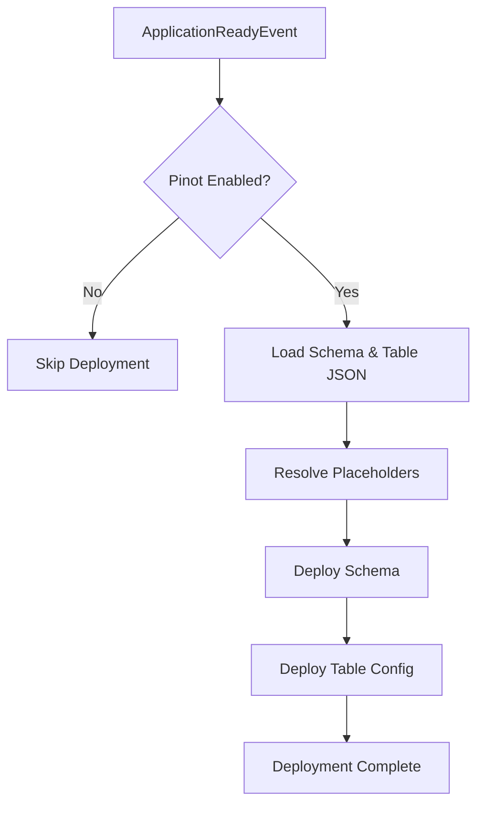
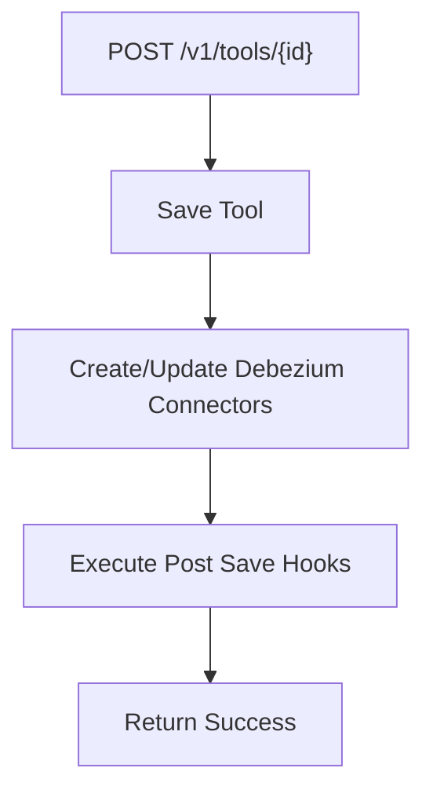
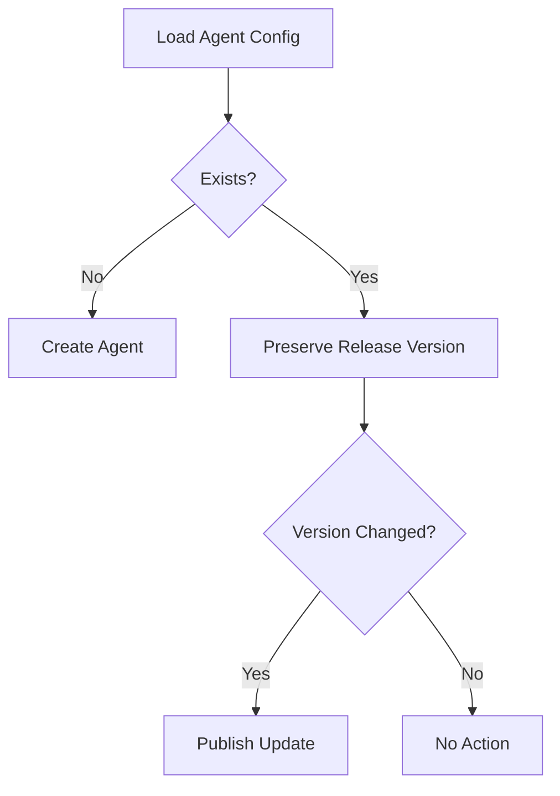
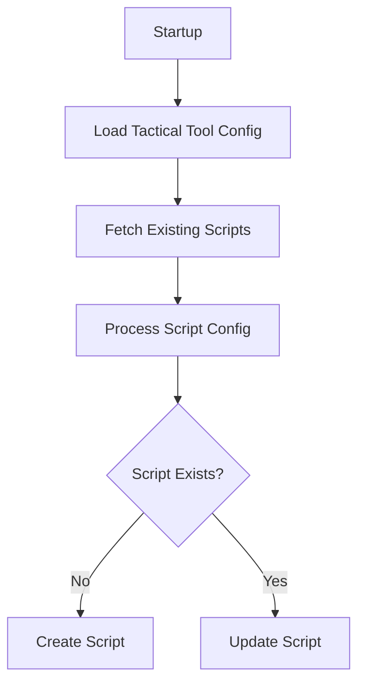
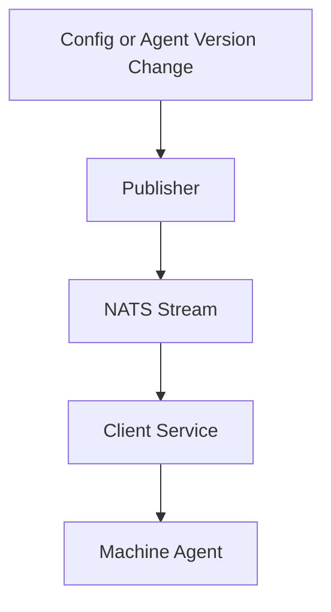

# Management Service Core

## Overview

The **Management Service Core** module is the operational control plane of the OpenFrame platform. It is responsible for:

- Integrated tool lifecycle management
- Agent and client configuration bootstrapping
- Debezium connector orchestration
- NATS stream provisioning
- Pinot analytics configuration deployment
- Version update propagation
- Distributed scheduled maintenance tasks

This module acts as a coordination layer between:

- Data persistence (MongoDB, Redis, Cassandra)
- Streaming and messaging infrastructure (NATS, Kafka, Debezium)
- External tool ecosystems (e.g., Tactical RMM)
- Client and agent update channels

It ensures that platform-level infrastructure and tool integrations are correctly initialized, synchronized, and maintained across tenants.

---

## Architectural Role in the Platform

The Management Service Core sits between persistence, infrastructure services, and operational messaging components.



The module primarily performs **orchestration and infrastructure alignment**, not business logic processing.

---

# Core Configuration Layer

## ManagementConfiguration

Defines:

- Component scanning for `com.openframe`
- Explicit exclusion of `CassandraHealthIndicator`
- A `PasswordEncoder` bean using `BCryptPasswordEncoder`

This ensures:

- Secure hashing for management-level operations
- Isolation from certain data-layer health indicators

---

## ShedLockConfig

Enables:

- `@EnableScheduling`
- `@EnableSchedulerLock`
- Redis-backed distributed locks

Locks are tenant-scoped using the `OpenframeRedisKeyBuilder`.

Lock key structure:

```text
of:{tenantId}:job-lock:{environment}:{lockName}
```

This guarantees:

- No duplicate scheduled executions across instances
- Safe horizontal scaling of the Management Service

---

## PinotConfigInitializer

Deploys Pinot schemas and table configurations on startup.

### Responsibilities

- Loads JSON schema files from classpath
- Resolves Spring placeholders
- Deploys schemas via HTTP
- Creates or updates REALTIME/OFFLINE tables
- Retries on transient network failures

### Deployment Flow



This ensures analytics tables (devices, logs) are always aligned with platform expectations.

---

# REST Controllers

## IntegratedToolController

Endpoint base path:

```text
/v1/tools
```

### Capabilities

- List all integrated tools
- Retrieve tool by ID
- Save or update tool configuration
- Trigger Debezium connector provisioning
- Execute post-save hooks

### Save Flow



The `IntegratedToolPostSaveHook` interface provides an extension mechanism without requiring Spring event plumbing.

---

## ReleaseVersionController

Endpoint base path:

```text
/v1/cluster-registrations
```

Accepts a `ReleaseVersionRequest` containing:

```text
imageTagVersion
```

Delegates to `ReleaseVersionService` for processing release propagation logic.

---

# Initialization Layer

These components execute at application startup.

---

## AgentRegistrationSecretInitializer

- Runs as `ApplicationRunner`
- Ensures a default agent registration secret exists
- Prevents agent onboarding failures

---

## IntegratedToolAgentInitializer

Loads tool agent definitions from configuration resources.

### Behavior

- Reads agent JSON configuration
- Creates new agents if missing
- Updates existing agents
- Preserves release versions
- Publishes version changes

### Version Handling Logic



---

## NatsStreamConfigurationInitializer

Creates required NATS streams at startup:

- TOOL_INSTALLATION
- CLIENT_UPDATE
- TOOL_UPDATE
- TOOL_CONNECTIONS
- INSTALLED_AGENTS

Each stream defines:

- Subjects
- File storage
- Retention policies

This ensures messaging topology exists before agents begin communication.

---

## OpenFrameClientConfigurationInitializer

Bootstraps the default OpenFrame client configuration.

Behavior:

- Loads JSON from classpath
- Sets default ID
- Preserves existing version if present
- Updates publish state

Ensures client update consistency across deployments.

---

## TacticalRmmScriptsInitializer

Integrates with Tactical RMM.

### Responsibilities

- Retrieves Tactical RMM connection details
- Loads PowerShell scripts from classpath
- Creates or updates scripts via Tactical API

### Script Processing Flow



This enables automated OpenFrame client update scripts within Tactical RMM.

---

## DebeziumConnectorInitializer

Conditionally enabled by configuration.

On startup:

- Checks existing connectors
- If none exist, loads connectors from MongoDB
- Creates connectors for tools that define Debezium configs

Ensures CDC pipelines are restored after restarts.

---

# Scheduled Maintenance Layer

All schedulers use distributed locking via ShedLock.

---

## AgentVersionUpdatePublishFallbackScheduler

Periodically retries failed publish attempts.

Targets:

- OpenFrameClientConfiguration
- IntegratedToolAgent

Retry rules:

- Skip if already published
- Retry if attempts < configured max

Ensures eventual consistency in update propagation.

---

## ApiKeyStatsSyncScheduler

Synchronizes API key usage stats:

- Source: Redis
- Destination: MongoDB

Protected with distributed lock:

```text
apiKeyStatsSync
```

Prevents duplicate sync across instances.

---

## DebeziumHealthCheckScheduler

Periodically:

- Checks connector health
- Restarts failed tasks

Maintains reliability of change data capture pipelines.

---

# Supporting Models & DTOs

## ReleaseVersionRequest

Contains:

```text
imageTagVersion
```

---

## ConnectorStatus

Represents Debezium connector state:

- Connector state
- Worker ID
- Task statuses
- Failure traces

Used for health monitoring and restart decisions.

---

## ScriptConfig

Defines Tactical RMM script metadata:

- Name
- Resource path
- Description
- Shell
- Category
- Timeout

---

# Cross-Cutting Concerns

## Distributed Locking

Implemented via:

- ShedLock
- RedisLockProvider

Guarantees:

- Single execution per tenant
- Safe horizontal scaling

---

## Version Propagation Strategy

Management Service Core does not directly push updates to agents.
Instead, it publishes version updates through dedicated publisher services.



This decouples configuration management from execution.

---

# Summary

The **Management Service Core** is the infrastructure orchestration backbone of OpenFrame.

It ensures:

- Integrated tools are provisioned and synchronized
- Messaging infrastructure is initialized
- CDC connectors remain healthy
- Client and agent versions propagate reliably
- Scheduled operational tasks run safely in distributed environments

Without this module, the platform would lack automated infrastructure convergence and operational resilience.