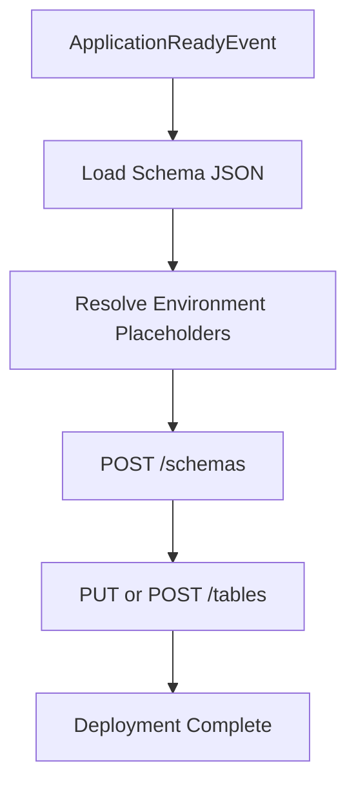
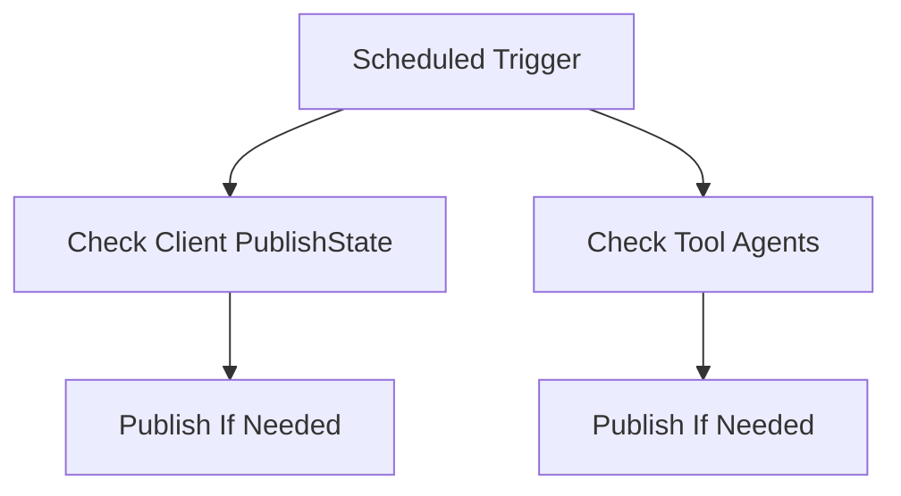
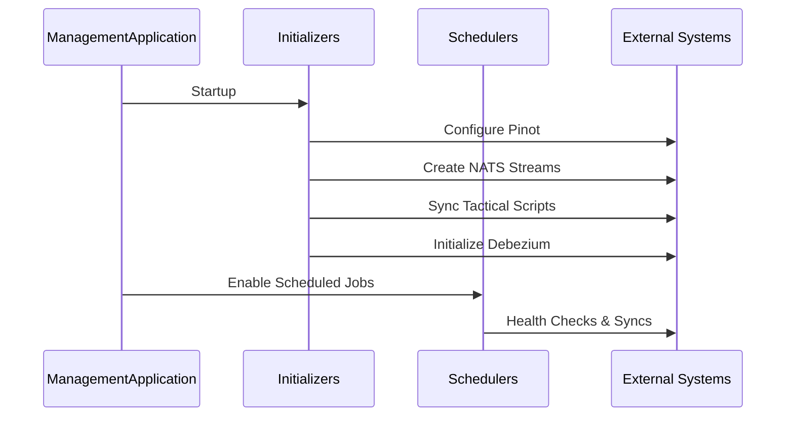

# Management Service Core Initialization Scheduling

The **Management Service Core Initialization Scheduling** module is responsible for bootstrapping, configuring, and continuously maintaining critical platform infrastructure components at runtime.

It acts as the operational backbone of the OpenFrame Management Service by:

- Initializing platform configuration (Pinot, NATS, client configs, agents)
- Managing Debezium connectors
- Scheduling distributed background jobs
- Handling integrated tool lifecycle events
- Publishing version updates to agents and clients

This module is executed as part of the Management Service entrypoint and ensures the platform is correctly wired before serving production traffic.

---

## Architectural Overview

The module coordinates configuration, initialization, scheduling, and operational orchestration.

```mermaid
flowchart TD
    App["ManagementApplication"] --> Config["ManagementConfiguration"]
    App --> Initializers["Initializers"]
    App --> Schedulers["Schedulers"]
    App --> Controllers["Management Controllers"]

    Initializers --> PinotInit["PinotConfigInitializer"]
    Initializers --> NatsInit["NatsStreamConfigurationInitializer"]
    Initializers --> AgentInit["IntegratedToolAgentInitializer"]
    Initializers --> ClientInit["OpenFrameClientConfigurationInitializer"]
    Initializers --> SecretInit["AgentRegistrationSecretInitializer"]
    Initializers --> TacticalInit["TacticalRmmScriptsInitializer"]
    Initializers --> DebeziumInit["DebeziumConnectorInitializer"]

    Schedulers --> ApiKeySched["ApiKeyStatsSyncScheduler"]
    Schedulers --> DebeziumSched["DebeziumHealthCheckScheduler"]
    Schedulers --> FallbackSched["AgentVersionUpdatePublishFallbackScheduler"]

    Controllers --> ToolCtrl["IntegratedToolController"]
    Controllers --> ReleaseCtrl["ReleaseVersionController"]
```



---

# Core Responsibilities

## 1. Core Configuration

### ManagementConfiguration

- Enables component scanning
- Excludes `CassandraHealthIndicator` (handled elsewhere)
- Defines a `PasswordEncoder` bean using `BCryptPasswordEncoder`

This ensures secure hashing support across management workflows.

---

### ShedLockConfig

Enables distributed scheduling using Redis-backed locks.

Key features:

- `@EnableScheduling`
- `@EnableSchedulerLock`
- Redis `LockProvider`
- Tenant-scoped lock keys using `OpenframeRedisKeyBuilder`

Lock key format:

```text
of:{tenantId}:job-lock:{environment}:{lockName}
```

This prevents duplicate job execution in clustered deployments.

---

## 2. Platform Initializers

Initializers execute at startup (`@PostConstruct`, `ApplicationRunner`, or `ApplicationReadyEvent`).

### PinotConfigInitializer

Deploys Pinot schemas and table configurations on startup.

Responsibilities:

- Loads JSON schema files from classpath
- Resolves environment placeholders
- Deploys schemas and tables via Pinot Controller REST API
- Retries deployment with configurable backoff
- Supports REALTIME and OFFLINE tables



---

### IntegratedToolAgentInitializer

Loads and synchronizes agent configurations from classpath resources.

Behavior:

- Creates new agents if missing
- Updates existing agents
- Preserves release versions
- Publishes version updates when versions change

This ensures agent definitions are version-controlled via configuration files.

---

### OpenFrameClientConfigurationInitializer

Initializes the default client configuration.

Key behaviors:

- Loads `client-configuration.json`
- Preserves existing version to prevent override
- Maintains publish state

---

### AgentRegistrationSecretInitializer

Ensures an initial registration secret exists for agent onboarding.

---

### NatsStreamConfigurationInitializer

Creates required NATS streams at startup.

Streams include:

- TOOL_INSTALLATION
- CLIENT_UPDATE
- TOOL_UPDATE
- TOOL_CONNECTIONS
- INSTALLED_AGENTS

These streams support agent communication and update distribution.

---

### TacticalRmmScriptsInitializer

Synchronizes predefined PowerShell scripts to Tactical RMM.

Process:

1. Loads script from classpath
2. Fetches existing scripts from Tactical RMM
3. Creates or updates script

This guarantees required operational scripts exist in external tooling.

---

### DebeziumConnectorInitializer

Executed on `ApplicationReadyEvent` when health-check is enabled.

Behavior:

- Checks existing Debezium connectors
- If none exist, loads connector configs from `IntegratedTool`
- Creates connectors dynamically

This ensures CDC pipelines are restored after restarts.

---

## 3. Controllers

### IntegratedToolController

Manages integrated tool configurations.

Endpoints:

```text
GET  /v1/tools
GET  /v1/tools/{id}
POST /v1/tools/{id}
```

On save:

1. Tool is persisted
2. Debezium connectors are created/updated
3. Post-save hooks are executed


---

### ReleaseVersionController

Endpoint:

```text
POST /v1/cluster-registrations
```

Accepts `ReleaseVersionRequest` and forwards version to `ReleaseVersionService`.

Used to trigger client or cluster upgrade flows.

---

## 4. Schedulers

All schedulers use ShedLock for cluster-safe execution.

### ApiKeyStatsSyncScheduler

- Periodically syncs API key stats from Redis to MongoDB
- Uses distributed locking
- Configurable interval and lock durations

---

### DebeziumHealthCheckScheduler

- Periodically checks Debezium connector health
- Restarts failed tasks
- Distributed via ShedLock

---

### AgentVersionUpdatePublishFallbackScheduler

Retry mechanism for failed version publish events.

Logic:



Prevents permanent desynchronization if message publishing fails.

---

## 5. Version Update Processing

### OpenFrameClientVersionUpdateService

Provides abstraction for publishing new release versions via `OpenFrameClientUpdatePublisher`.

Acts as orchestration entrypoint for version propagation workflows.

---

# Runtime Lifecycle Summary



---

# Operational Characteristics

✅ Distributed-safe scheduling via Redis locks  
✅ Idempotent startup initialization  
✅ Version-aware configuration updates  
✅ Automatic external system reconciliation  
✅ Safe retries with bounded attempts  

---

# How It Fits in the Platform

The Management Service Core Initialization Scheduling module:

- Bootstraps analytics (Pinot)
- Ensures streaming infrastructure (NATS)
- Manages CDC connectors (Debezium)
- Controls integrated tools lifecycle
- Publishes agent and client updates
- Executes cluster-safe scheduled operations

It is the **control plane automation layer** of OpenFrame — ensuring the platform remains consistent, synchronized, and operational across restarts and distributed deployments.
