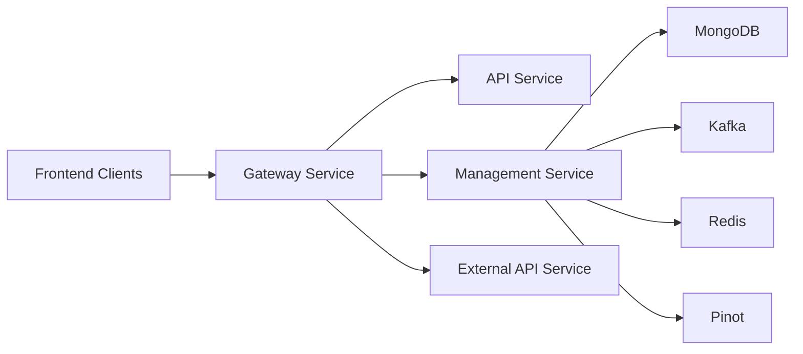
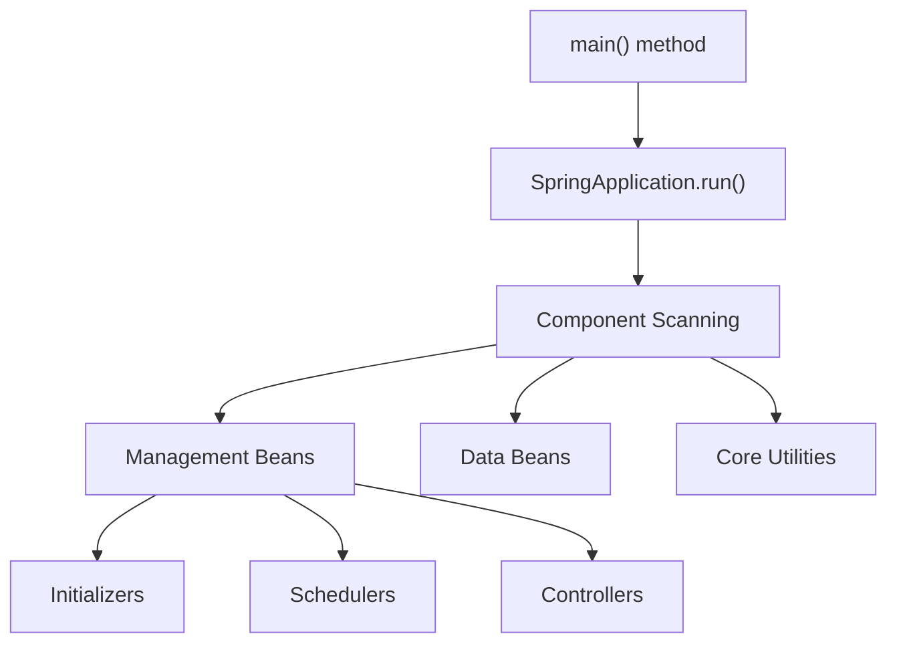
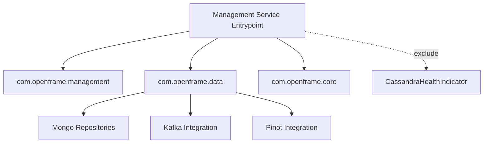

# Management Service Entrypoint

The **Management Service Entrypoint** module is the bootstrap layer of the OpenFrame Management Service. It is responsible for initializing the Spring Boot runtime, configuring component scanning boundaries, and starting all management-specific infrastructure including schedulers, initializers, and administrative controllers.

At its core, this module contains the `ManagementApplication` class, which wires together management logic, shared data modules, and core utilities into a single executable Spring Boot service.

---

## 1. Purpose and Responsibilities

The Management Service Entrypoint serves as:

- 🚀 The **startup class** for the Management Service
- 🧩 The **composition root** for management-related components
- 🔌 The integration point for:
  - Management service core logic
  - Data access modules
  - Shared utilities
- 🛑 A customization boundary for excluding specific infrastructure beans

It does **not** implement business logic directly. Instead, it bootstraps and orchestrates components defined in:

- [Management Service Core](management_service_core/management_service_core.md)
- Data persistence and platform modules
- Shared core utilities

---

## 2. Core Component: ManagementApplication

```java
@SpringBootApplication
@ComponentScan(
    basePackages = {
        "com.openframe.management",
        "com.openframe.data",
        "com.openframe.core"
    },
    excludeFilters = {
        @ComponentScan.Filter(
            type = FilterType.ASSIGNABLE_TYPE,
            classes = CassandraHealthIndicator.class
        )
    }
)
public class ManagementApplication {
    public static void main(String[] args) {
        SpringApplication.run(ManagementApplication.class, args);
    }
}
```

### 2.1 Key Annotations

#### `@SpringBootApplication`
Enables:
- Auto-configuration
- Component scanning
- Spring Boot application bootstrap

#### `@ComponentScan`
Defines explicit scanning boundaries:

| Package | Responsibility |
|----------|----------------|
| `com.openframe.management` | Management-specific controllers, schedulers, initializers |
| `com.openframe.data` | Data access, repositories, health indicators |
| `com.openframe.core` | Shared utilities and common components |

#### Excluded Component

```text
Excluded Bean: CassandraHealthIndicator
Reason: Prevent default Cassandra health checks from being auto-registered
```

This exclusion allows the Management Service to:

- Avoid tight coupling to Cassandra availability
- Provide custom health strategies
- Operate in environments where Cassandra is optional or externally managed

---

## 3. Service Architecture Context

The Management Service Entrypoint is one of several service entrypoints in the OpenFrame microservices architecture.



### Architectural Role

The Management Service primarily handles:

- Integrated tool lifecycle management
- Release version management
- Agent version publishing fallback
- Debezium connector monitoring
- NATS stream configuration
- Client configuration initialization

All of these capabilities are implemented in the **Management Service Core** module.

---

## 4. Internal Bootstrapping Flow

The startup lifecycle follows a standard Spring Boot execution model:



### 4.1 Initialization Phases

1. **Spring Context Creation**  
2. **Component Scan Across Declared Packages**  
3. **Bean Registration**  
4. **Initializer Execution**  
5. **Scheduler Activation**  
6. **Service Ready State**

All domain-level behavior lives in the scanned packages—this module only orchestrates their activation.

---

## 5. Relationship to Management Service Core

The actual operational logic of the Management Service is implemented in:

👉 **[Management Service Core](management_service_core/management_service_core.md)**

That module contains:

- Configuration classes
- Controllers (e.g., IntegratedToolController)
- Initializers
- Schedulers
- Post-save hooks
- Version update services

The Entrypoint module ensures these components are:

- Discovered
- Instantiated
- Wired together
- Executed at runtime

---

## 6. Dependency Boundaries

The component scan configuration clearly defines system boundaries.



### Why Exclude `CassandraHealthIndicator`?

Possible architectural reasons:

- Cassandra may be optional for management operations
- Health checks may be delegated to a separate monitoring service
- Startup should not fail due to Cassandra unavailability

This selective exclusion demonstrates deliberate infrastructure control.

---

## 7. Operational Characteristics

### 7.1 Stateless Boot Layer

The Entrypoint:
- Maintains no business state
- Exposes no direct endpoints
- Contains no domain logic

It is purely:

```text
Bootstrap + Wiring + Boundary Definition
```

### 7.2 Deployment Characteristics

- Packaged as a standalone Spring Boot application
- Can be containerized independently
- Runs alongside other OpenFrame services
- Scales independently from API and Stream services

---

## 8. How It Fits Into the Platform

Within the broader OpenFrame architecture:

| Service | Responsibility |
|----------|----------------|
| API Service | Tenant-facing REST & GraphQL |
| Authorization Server | OAuth2 / OIDC |
| Gateway Service | Routing & Security |
| Stream Service | Event processing |
| Client Service | Agent interactions |
| **Management Service** | Tool lifecycle & system orchestration |

The Management Service Entrypoint is the executable wrapper enabling the Management domain to operate as an independent microservice.

---

## 9. Summary

The **Management Service Entrypoint** module:

- Bootstraps the Management microservice
- Defines component scan boundaries
- Excludes specific infrastructure beans for controlled behavior
- Integrates management, data, and core modules
- Delegates all operational logic to the Management Service Core

It represents the **execution boundary** of the Management domain within the OpenFrame distributed system.

---

## Next Module

To understand the internal logic, schedulers, controllers, and lifecycle hooks, continue with:

➡️ **[Management Service Core](management_service_core/management_service_core.md)**
