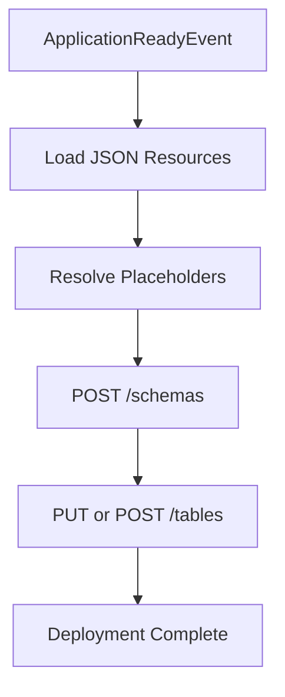
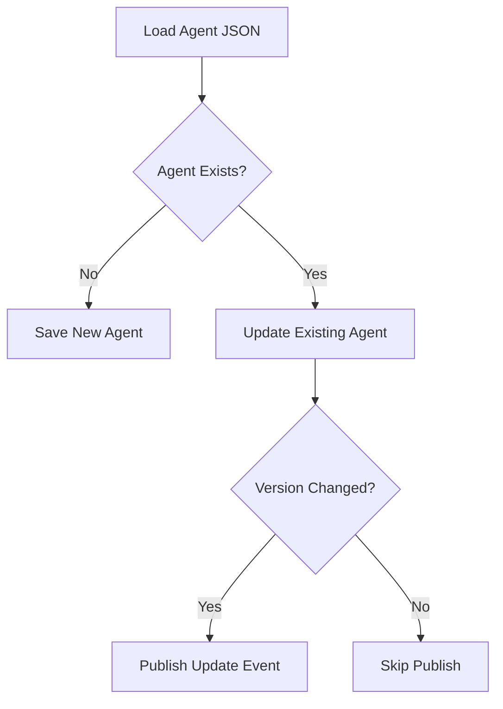
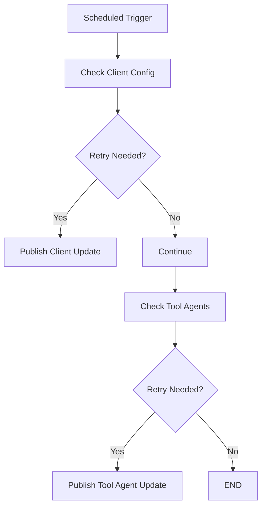

# Management Service Initializers Schedulers

The **Management Service Initializers Schedulers** module is responsible for bootstrapping, configuring, and continuously maintaining critical runtime infrastructure within the OpenFrame platform. It ensures that external systems (Pinot, Debezium, NATS, Tactical RMM), internal configuration artifacts, and distributed jobs are correctly initialized and kept in a healthy state.

This module acts as the operational backbone of the Management Service, bridging configuration, orchestration, and reliability concerns.

---

## 1. Purpose and Responsibilities

The Management Service Initializers Schedulers module provides:

- ✅ Application bootstrap initializations
- ✅ Distributed scheduled job execution
- ✅ External system configuration provisioning
- ✅ Release and version propagation
- ✅ Tool lifecycle orchestration
- ✅ Debezium connector lifecycle management
- ✅ NATS stream provisioning

It ensures the system is **self-healing, idempotent, and distributed-safe**.

---

## 2. High-Level Architecture

```mermaid
flowchart TD
    AppStart["Management Application Startup"] --> Init["Initializers"]
    AppStart --> Schedulers["Schedulers"]
    AppStart --> Controllers["Management REST Controllers"]

    Init --> Pinot["PinotConfigInitializer"]
    Init --> AgentSecret["AgentRegistrationSecretInitializer"]
    Init --> ToolAgentInit["IntegratedToolAgentInitializer"]
    Init --> NatsInit["NatsStreamConfigurationInitializer"]
    Init --> ClientConfigInit["OpenFrameClientConfigurationInitializer"]
    Init --> TacticalInit["TacticalRmmScriptsInitializer"]
    Init --> DebeziumInit["DebeziumConnectorInitializer"]

    Schedulers --> ApiKeyScheduler["ApiKeyStatsSyncScheduler"]
    Schedulers --> DebeziumScheduler["DebeziumHealthCheckScheduler"]
    Schedulers --> AgentFallback["AgentVersionUpdatePublishFallbackScheduler"]

    Controllers --> ToolController["IntegratedToolController"]
    Controllers --> ReleaseController["ReleaseVersionController"]

    ToolController --> DebeziumService
    AgentFallback --> PublishServices["Publishers"]
    ApiKeyScheduler --> RedisMongoSync["Redis → Mongo Sync"]
    DebeziumScheduler --> DebeziumService
```



---

## 3. Configuration Layer

### 3.1 ManagementConfiguration

Defines the Spring component scan and registers a `PasswordEncoder` using `BCryptPasswordEncoder`.

Key responsibilities:
- Enables component scanning across `com.openframe`
- Excludes `CassandraHealthIndicator`
- Provides secure password hashing

---

### 3.2 ShedLockConfig

Enables distributed scheduling using:

- `@EnableScheduling`
- `@EnableSchedulerLock`
- `RedisLockProvider`

Lock keys are tenant-scoped:

```text
of:{tenantId}:job-lock:<environment>:<lockName>
```

This guarantees:
- No duplicate scheduler execution across clustered deployments
- Tenant-aware job isolation

---

## 4. Boot-Time Initializers

All initializers are idempotent and safe to run repeatedly.

---

### 4.1 PinotConfigInitializer

Deploys:
- Pinot schemas
- Realtime table configs
- Offline table configs (if configured)

Behavior:
- Triggered on `ApplicationReadyEvent`
- Retries failed deployments
- Resolves environment placeholders
- Creates or updates tables

Flow:



This ensures analytics storage (Pinot) is fully provisioned before usage.

---

### 4.2 AgentRegistrationSecretInitializer

Ensures an initial agent registration secret exists.

- Implements `ApplicationRunner`
- Delegates to `AgentRegistrationSecretManagementService`
- Creates secret if missing

This guarantees secure agent onboarding.

---

### 4.3 IntegratedToolAgentInitializer

Loads `IntegratedToolAgent` definitions from configuration files.

Key logic:
- Reads agent JSON from classpath
- Updates existing agents
- Preserves release version metadata
- Publishes version updates if changed

Version Update Flow:



---

### 4.4 NatsStreamConfigurationInitializer

Creates required NATS streams:

- TOOL_INSTALLATION
- CLIENT_UPDATE
- TOOL_UPDATE
- TOOL_CONNECTIONS
- INSTALLED_AGENTS

Streams use:
- File storage
- Limits retention policy

Ensures messaging backbone is provisioned.

---

### 4.5 OpenFrameClientConfigurationInitializer

Bootstraps default client configuration:

- Loads `client-configuration.json`
- Preserves existing version
- Maintains publish state

Prevents accidental version regression.

---

### 4.6 TacticalRmmScriptsInitializer

Synchronizes required PowerShell scripts into Tactical RMM:

Process:
1. Load script from resources
2. Fetch existing scripts from Tactical RMM
3. Create or update script

Script metadata model:

```text
ScriptConfig
 ├─ name
 ├─ resourcePath
 ├─ description
 ├─ shell
 ├─ category
 └─ defaultTimeout
```

Ensures operational scripts are always available in integrated tools.

---

### 4.7 DebeziumConnectorInitializer

Triggered on `ApplicationReadyEvent` when health-check is enabled.

Behavior:
- If no connectors exist
- Load Debezium connector definitions from IntegratedTools
- Create connectors dynamically

Guarantees CDC pipelines are restored automatically.

---

## 5. Scheduled Jobs

Schedulers are distributed-safe using ShedLock.

---

### 5.1 ApiKeyStatsSyncScheduler

Purpose:
- Sync API key stats from Redis to MongoDB

Features:
- Distributed lock: `apiKeyStatsSync`
- Configurable interval
- Fault-tolerant execution

---

### 5.2 DebeziumHealthCheckScheduler

Purpose:
- Periodically check Debezium connector health
- Restart failed tasks

Distributed lock:

```text
debeziumHealthCheck
```

Prevents duplicated restart attempts.

---

### 5.3 AgentVersionUpdatePublishFallbackScheduler

Ensures version updates are eventually published.

Logic:
- Inspect OpenFrameClientConfiguration
- Inspect IntegratedToolAgents
- Retry publish if not yet published
- Stop retry after max attempts



This prevents version drift across distributed systems.

---

## 6. REST Controllers

### 6.1 IntegratedToolController

Base path: `/v1/tools`

Provides:
- List tools
- Get tool by ID
- Save tool configuration

On save:
1. Persist tool
2. Create/update Debezium connectors
3. Execute `IntegratedToolPostSaveHook`

Hook interface:

```text
void onToolSaved(String toolId, IntegratedTool tool)
```

Lightweight extension point without Spring events.

---

### 6.2 ReleaseVersionController

Base path: `/v1/cluster-registrations`

Accepts:

```text
ReleaseVersionRequest
 └─ imageTagVersion
```

Delegates to `ReleaseVersionService` for cluster version updates.

---

## 7. Debezium Connector Model

`ConnectorStatus` DTO represents:

```text
ConnectorStatus
 ├─ name
 ├─ connector.state
 └─ tasks[].state
```

Used for monitoring and restart decisions.

---

## 8. Reliability and Safety Mechanisms

| Concern | Mechanism |
|----------|------------|
| Distributed execution | ShedLock + Redis |
| Idempotent initialization | Conditional existence checks |
| Retry logic | Pinot deployWithRetry |
| Version drift | Fallback scheduler |
| Connector self-healing | DebeziumHealthCheckScheduler |
| Safe updates | PublishState tracking |

---

## 9. How This Module Fits Into the System

Within the overall OpenFrame architecture, this module:

- Provisions analytics (Pinot)
- Maintains CDC pipelines (Debezium)
- Ensures messaging streams (NATS)
- Synchronizes external RMM scripts
- Publishes client and agent updates
- Protects scheduled jobs in clustered environments

It operates as the **operational control plane** of the Management Service.

---

## 10. Summary

The Management Service Initializers Schedulers module ensures that:

- Infrastructure dependencies are deployed automatically
- Configuration is consistent and version-safe
- Distributed jobs execute safely
- Connectors are self-healing
- Release updates propagate reliably

It transforms the Management Service from a static API into a **self-managing operational orchestrator** within the OpenFrame ecosystem.

---

**End of Management Service Initializers Schedulers documentation**
