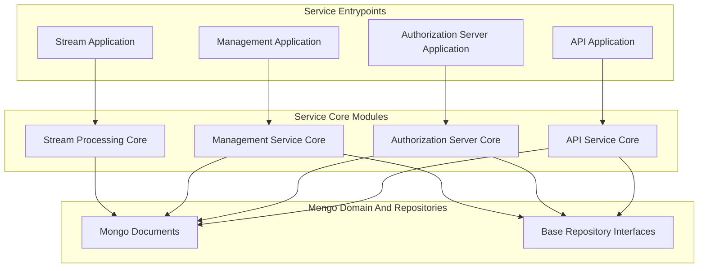
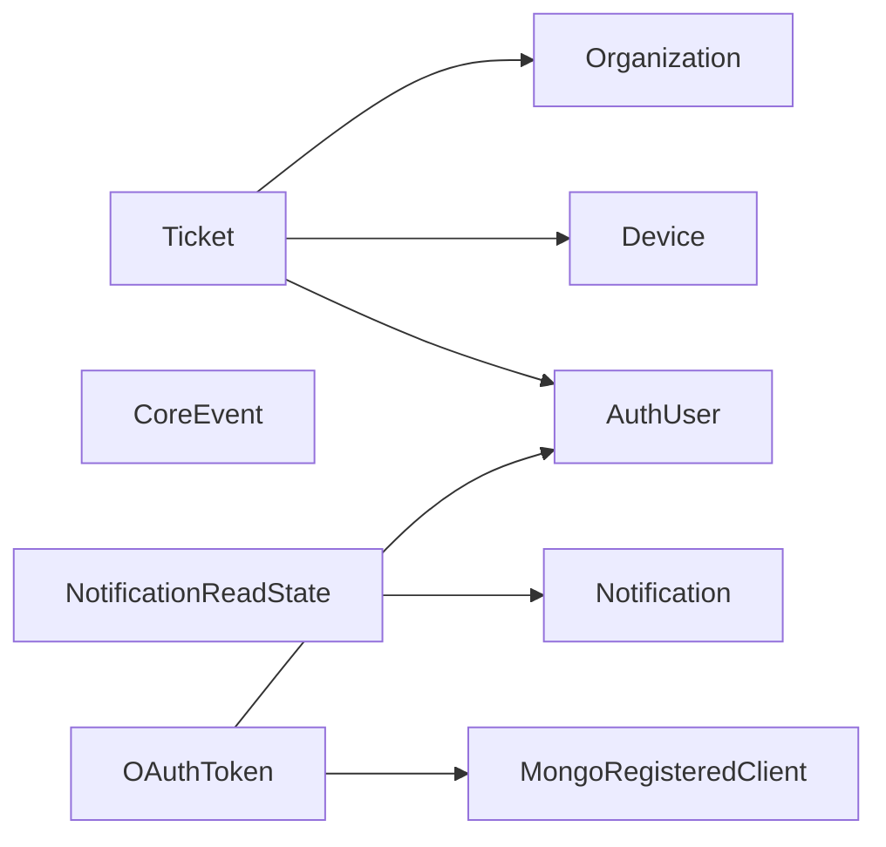
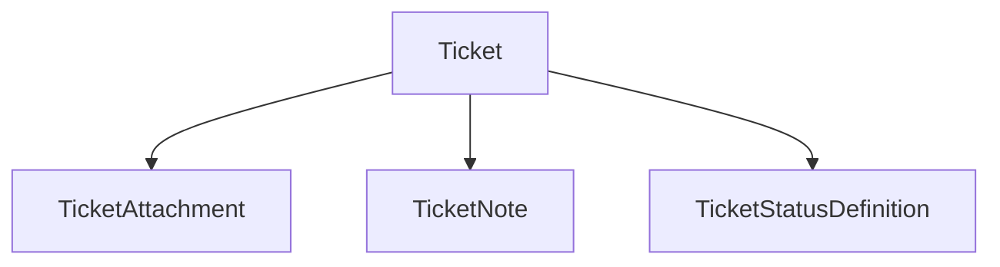
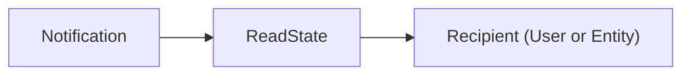
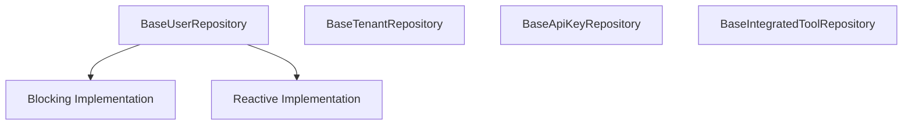
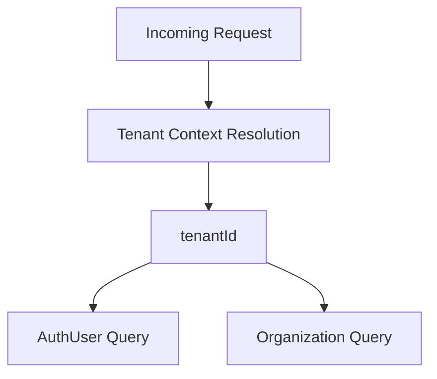

# Mongo Domain And Repositories

The **Mongo Domain And Repositories** module defines the core MongoDB-backed domain model and repository contracts used across the OpenFrame platform. It provides:

- Canonical MongoDB document models (users, organizations, tickets, devices, events, notifications, OAuth)
- Shared repository abstractions (blocking and reactive compatible)
- Multi-tenant–aware data structures for authorization and tenant isolation
- A consistent persistence foundation for API, Authorization, Gateway, Management, and Stream services

This module is intentionally **infrastructure-focused**: it contains no controllers or business orchestration logic. Instead, it defines the persistent data structures and repository contracts consumed by higher-level modules such as:

- [API Service Core](../api-service-core/api-service-core.md)
- [Authorization Server Core](../authorization-server-core/authorization-server-core.md)
- [Management Service Core](../management-service-core/management-service-core.md)
- [Stream Processing Core](../stream-processing-core/stream-processing-core.md)

---

## 1. Architectural Role In The Platform

At a high level, Mongo Domain And Repositories sits at the bottom of the service stack and provides the shared persistence layer.



### Responsibilities

| Layer | Responsibility |
|--------|---------------|
| Mongo Domain And Repositories | Data modeling, indexes, schema design, repository contracts |
| Service Core modules | Business logic, validation, orchestration |
| Service Entrypoints | Bootstrapping, configuration, runtime wiring |

---

## 2. Domain Model Overview

The module defines persistent document models organized around major platform domains.



Each document is mapped with `@Document`, `@Indexed`, and compound index annotations to ensure:

- Efficient filtering
- Multi-tenant isolation
- Consistency under high load
- Optimized query patterns used by GraphQL and REST APIs

---

## 3. Core Document Models

### 3.1 AuthUser

**Collection:** `auth_user` (inherits from base `User`)

`AuthUser` is the multi-tenant identity model used by the Authorization Server.

Key characteristics:

- Compound unique index on `(tenantId, email)`
- Supports multiple login providers (`LOCAL`, `GOOGLE`, etc.)
- Stores password hash and external provider ID
- Caches profile image URL for SSO claim propagation

Multi-tenancy is enforced via:

```text
CompoundIndex: {'tenantId': 1, 'email': 1} (unique, partial if tenantId exists)
```

This ensures email uniqueness within a tenant while allowing identical emails across tenants.

Used heavily by:
- Authorization Server Core (login, registration, SSO)
- API Service Core (user resolution via DataLoaders)

---

### 3.2 Organization

**Collection:** `organizations`

Represents a business entity inside a tenant.

Key features:

- Immutable `organizationId` (UUID-style identifier)
- Soft-delete via `OrganizationStatus` (ACTIVE, ARCHIVED, DELETED)
- Contract lifecycle fields (`contractStartDate`, `contractEndDate`)
- Indexed for filtering and pagination

Business logic helpers:

- `isContractActive()`
- `isDeleted()`
- `isArchived()`

This document underpins:

- Device ownership
- Ticket organization context
- Tenant-level reporting

---

### 3.3 Device

**Collection:** `devices`

Represents a managed endpoint.

Fields include:

- `machineId` (external system link)
- `status` (ACTIVE, OFFLINE, MAINTENANCE)
- `type` (DESKTOP, LAPTOP, SERVER, etc.)
- `lastCheckin`
- Embedded configuration and health structures

Devices are central to:

- Monitoring workflows
- Ticket associations
- Stream processing events

---

### 3.4 Ticketing Domain

Ticketing is a primary PSA feature and consists of multiple collections.



#### Ticket

**Collection:** `tickets`

Key design decisions:

- Unique `ticketNumber`
- Indexed status and ordering fields
- Explicit `statusKind` and `statusId` for lifecycle evolution
- Links to `deviceId`, `organizationId`, `assignedTo`

Compound indexes support board-style queries:

```text
{'status': 1, 'order': 1}
{'statusKind': 1}
{'statusId': 1, 'order': 1}
```

#### TicketAttachment

- Metadata only (file stored externally)
- Indexed by `ticketId`
- Stores storage key (S3/MinIO)

#### TicketNote

- Technician-authored notes
- Indexed by `(ticketId, createdAt desc)`
- Supports edit and deletion tracking

#### TicketStatusDefinition

- Defines lifecycle states
- Partial unique constraint on selected `kind` values
- Supports AI-assisted and technician-required workflows

---

### 3.5 Notifications

Two-collection model:

- `Notification`
- `NotificationReadState`



#### Notification

- Severity (INFO default)
- Title and description
- Context payload
- Auto `createdAt`

#### NotificationReadState

Compound indexes enforce uniqueness and filtering:

```text
{'recipientId': 1, 'recipientType': 1, 'notificationId': 1} (unique)
{'recipientId': 1, 'recipientType': 1, 'status': 1}
{'recipientId': 1, 'recipientType': 1, 'category': 1, 'status': 1}
```

This supports:

- Efficient unread counts
- Category filtering
- Per-recipient visibility tracking

---

### 3.6 Events

**Collection:** `events`

`CoreEvent` acts as a generic event log entry:

- `type`
- `payload`
- `timestamp`
- `status` (CREATED, PROCESSING, COMPLETED, FAILED)

Used by:

- Stream Processing Core
- Activity enrichment
- Audit and monitoring flows

---

### 3.7 OAuth And Client Registration

#### MongoRegisteredClient

**Collection:** `oauth_registered_clients`

Stores OAuth client configuration:

- `clientId` (unique)
- Authentication methods
- Grant types
- Redirect URIs
- Token TTL configuration
- PKCE requirement flags

#### OAuthToken

**Collection:** `oauth_tokens`

Stores issued tokens:

- Access token and refresh token
- Expiry timestamps
- Scopes
- Client linkage

These documents are consumed by the Authorization Server Core and its Mongo-backed services.

---

## 4. Repository Abstractions

Mongo Domain And Repositories defines base repository interfaces that are **technology-agnostic**.



### 4.1 Design Principles

- Generic return wrappers (`Optional`, `Mono`, `Flux`)
- Compatible with both blocking and reactive stacks
- Shared query semantics across services
- Encourages consistent naming and filtering patterns

### 4.2 BaseUserRepository

Supports:

- `findByEmail`
- `existsByEmail`
- `existsByEmailAndStatus`

Used by:

- Authorization Server Core
- API Service Core

### 4.3 BaseTenantRepository

Supports:

- `findByDomain`
- `existsByDomain`

Critical for domain-based tenancy resolution.

### 4.4 BaseApiKeyRepository

Supports:

- Lookup by key ID and user
- Retrieval of user keys
- Expired key discovery

Used by API and Gateway security layers.

### 4.5 BaseIntegratedToolRepository

Supports:

- `findByType`

Used by Management and Integration modules.

---

## 5. Multi-Tenancy Strategy

Mongo Domain And Repositories supports domain-based multi-tenancy through:

- Tenant-bound AuthUser via `tenantId`
- Domain-based lookup in BaseTenantRepository
- Per-tenant isolation in Authorization Server Core
- Scoped data loading in API DataFetchers



Tenant context is enforced in upper layers, while this module guarantees structural support for isolation.

---

## 6. Indexing And Performance Considerations

The module makes heavy use of:

- `@Indexed`
- `@CompoundIndex`
- `@CompoundIndexes`
- Partial filters for selective uniqueness

Goals:

- Efficient pagination for GraphQL Relay queries
- Ticket board sorting by status and order
- Fast unread notification counts
- Unique constraints under multi-tenant conditions

Index definitions are embedded at the document level to keep schema definition close to the domain model.

---

## 7. How Other Modules Use This Layer

| Module | Usage Pattern |
|--------|--------------|
| API Service Core | DataFetchers and DataLoaders query documents via repositories |
| Authorization Server Core | AuthUser, OAuthToken, MongoRegisteredClient |
| Management Service Core | Ticket, Device, Organization lifecycle management |
| Stream Processing Core | CoreEvent ingestion and enrichment |
| Gateway Service Core | API key and user resolution via repository layer |

Mongo Domain And Repositories does **not** contain business rules; it provides durable, indexed, and consistent data structures that other modules orchestrate.

---

# Summary

The **Mongo Domain And Repositories** module is the foundational persistence layer for the OpenFrame platform. It:

- Defines all primary MongoDB documents
- Encodes multi-tenant constraints and indexing strategies
- Provides repository contracts reusable across blocking and reactive stacks
- Enables clean separation between data modeling and business orchestration

By centralizing MongoDB schema and repository contracts in one module, the platform ensures consistency, performance, and evolvability across all services.