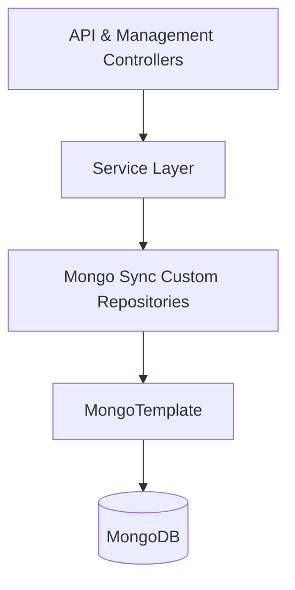
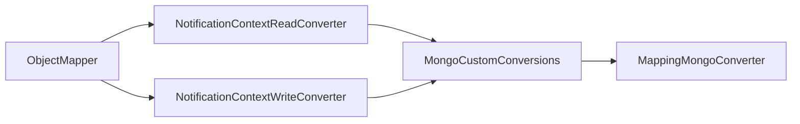
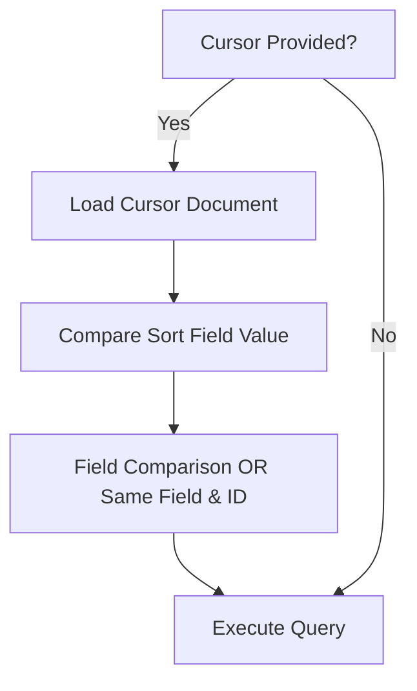
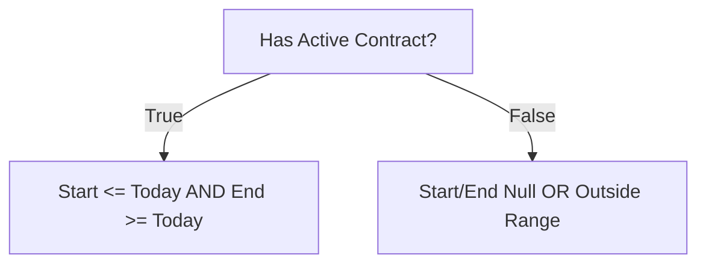
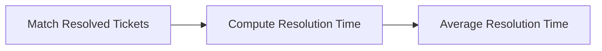
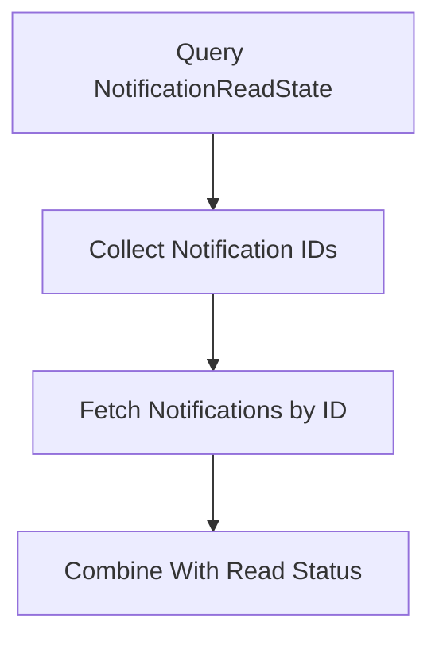
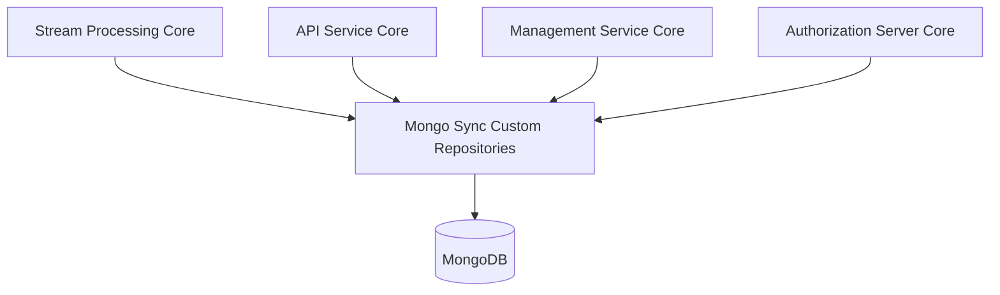

# Mongo Sync Custom Repositories

## Overview

The **Mongo Sync Custom Repositories** module provides advanced MongoDB repository implementations for the OpenFrame platform. It extends the base domain repositories defined in the Mongo domain layer with:

- Cursor-based pagination
- Advanced filtering and search
- Aggregation-based analytics
- Bulk operations
- Custom MongoDB conversions and type mapping

This module acts as the **database-facing query engine** for higher-level modules such as API Service Core, Management Service Core, and Authorization Server Core.

It is activated only when the property `spring.data.mongodb.enabled=true` is set, ensuring it can be conditionally enabled in specific runtime environments.

---

## Architectural Role in the Platform

At a high level, the module sits between service-layer components and MongoDB, providing optimized query logic for complex use cases.



### Responsibilities

- Translate high-level filter objects into Mongo `Query` and `Criteria`
- Implement cursor-based pagination using `_id` and composite sort fields
- Execute aggregation pipelines for analytics
- Handle bulk writes safely
- Customize Mongo type mapping and conversions

---

## Module Structure

The module consists of two main parts:

1. **Mongo Configuration Layer**
2. **Custom Repository Implementations per Domain**

```mermaid
flowchart TD
    Config["Configuration Layer"] --> CoreMongo["MongoSyncConfig"]
    Config --> NotificationMongo["NotificationContextMongoConfig"]

    Repos["Custom Repository Implementations"] --> MachineRepo["CustomMachineRepositoryImpl"]
    Repos --> EventRepo["CustomEventRepositoryImpl"]
    Repos --> TicketRepo["CustomTicketRepositoryImpl"]
    Repos --> OrgRepo["CustomOrganizationRepositoryImpl"]
    Repos --> UserRepo["CustomUserRepositoryImpl"]
    Repos --> ToolRepo["CustomIntegratedToolRepositoryImpl"]
    Repos --> KBRepo["CustomKnowledgeBaseItemRepositoryImpl"]
    Repos --> NotificationRepo["CustomNotificationRepositoryImpl"]
    Repos --> NotificationStateRepo["CustomNotificationReadStateRepositoryImpl"]
```



---

# 1. Mongo Configuration Layer

## MongoSyncConfig

**Component:** `MongoSyncConfig`

### Purpose

- Enables Mongo repositories in `com.openframe.data.repository`
- Enables Mongo auditing
- Customizes `MappingMongoConverter`

### Key Customization

```java
converter.setMapKeyDotReplacement("__dot__");
```

MongoDB does not allow dots in map keys. This replacement ensures compatibility when storing map-based fields.

### Activation

```text
Property: spring.data.mongodb.enabled=true
```

If not enabled, the entire module remains inactive.

---

## NotificationContextMongoConfig

**Component:** `NotificationContextMongoConfig`

### Responsibilities

- Registers custom read/write converters
- Configures `MongoCustomConversions`
- Applies a selective type mapper



This configuration ensures notification context objects are serialized and deserialized correctly without leaking unwanted type metadata.

---

# 2. Custom Repository Implementations

Each custom repository extends Spring Data behavior using `MongoTemplate` for full query control.

Common patterns across repositories:

- `buildXQuery(filter, search)` → builds `Query`
- `findWithCursor(...)` → cursor-based pagination
- `count(...)` → efficient counting
- `isSortableField(...)` → sort field validation
- `getDefaultSortField()` → fallback sorting

---

## Device / Machine Repository

**Component:** `CustomMachineRepositoryImpl`

### Capabilities

- Filter by status, device type, OS type, organization
- Regex-based multi-field search
- Cursor-based pagination
- Composite sorting (field + `_id`)

### Cursor Pagination Strategy

If sorting by a non-`_id` field, the query applies:

- `(field < value)` OR
- `(field == value AND _id < cursorId)`



This guarantees stable pagination even when sort field values collide.

---

## Event Repository

**Component:** `CustomEventRepositoryImpl`

### Features

- Filtering by user IDs and event types
- Date range filtering converted to `Instant`
- Full-text style search on `type` and `data`
- Distinct value extraction (`userId`, `type`)

It supports analytics-style queries used by dashboards and activity views.

---

## Knowledge Base Repository

**Component:** `CustomKnowledgeBaseItemRepositoryImpl`

### Highlights

- Folder vs Article filtering
- Archived vs active logic
- Cursor-based pagination by `updatedAt`
- Composite `$or` + `$and` handling to avoid Spring Data `$or` conflicts

Special handling merges:

- Search `$or`
- Cursor `$or`

Into a single root `$and` to prevent null-key collisions.

---

## Organization Repository

**Component:** `CustomOrganizationRepositoryImpl`

### Advanced Filtering

- Default ACTIVE status enforcement
- Category (case-insensitive exact match)
- Employee count ranges
- Active contract detection via date comparison

### Contract Logic Example



Ensures business logic is enforced at the database layer.

---

## Ticket Repository

**Component:** `CustomTicketRepositoryImpl`

This is the most advanced repository in the module.

### Capabilities

- Complex filtering (status, assignee, device, organization, date ranges)
- Owner-based restriction
- Cursor pagination with composite fields
- Aggregation-based analytics
- Bulk updates

### Aggregation Examples

- Count by `TicketStatus`
- Count by `TicketStatusKind`
- Count by `statusId`
- Average resolution time



### Bulk Updates

- `updateStatusBulk`
- `reassignTicketsToStatus`
- `updateTitle`

These operations update large datasets efficiently using MongoDB multi-update semantics.

---

## Notification Repositories

### CustomNotificationRepositoryImpl

Provides recipient-scoped pagination using a two-phase strategy:

1. Query `NotificationReadState`
2. Fetch `Notification` documents preserving order



Supports:

- Read/unread filtering
- Title search
- Backward pagination
- Order preservation

---

### CustomNotificationReadStateRepositoryImpl

Implements unordered bulk insert with duplicate-key tolerance.

If all errors are Mongo duplicate-key errors (code 11000), they are swallowed to ensure idempotent operations.

---

## Integrated Tool Repository

**Component:** `CustomIntegratedToolRepositoryImpl`

### Features

- Filter by enabled, type, category, platform category
- Regex search on name and description
- Distinct value extraction
- Sort validation and fallback

Used primarily by integration management and tool configuration workflows.

---

## User Repository

**Component:** `CustomUserRepositoryImpl`

Provides:

- Status filtering
- Email regex filtering
- First/last name regex search
- Sorted results by `createdAt DESC`

Optimized for directory-style user lookups.

---

# Common Design Patterns Across Repositories

## 1. Cursor-Based Pagination

All major repositories implement cursor pagination using `_id` and optional secondary fields.

Benefits:

- No offset-based performance degradation
- Stable ordering
- Safe under concurrent writes

---

## 2. Sort Field Validation

Each repository defines:

```text
SORTABLE_FIELDS
DEFAULT_SORT_FIELD
```

This prevents arbitrary field injection into Mongo sort operations.

---

## 3. Database-Level Filtering

Business logic is pushed into Mongo queries:

- Contract validity
- Archived vs active states
- Ownership restrictions
- Status-based filtering

This reduces application-layer processing and improves scalability.

---

## 4. Aggregation Pipelines for Analytics

Used primarily in Ticket repository for:

- Counting
- Grouping
- Average resolution time

Avoids loading entire datasets into memory.

---

# How This Module Fits into the Overall System



The module acts as:

- The persistence backbone for query-heavy operations
- The performance optimization layer for filtering and pagination
- The analytics computation layer for ticket metrics

---

# Summary

The **Mongo Sync Custom Repositories** module is the advanced MongoDB access layer of the OpenFrame platform.

It provides:

- Robust cursor-based pagination
- Rich filtering logic
- Aggregation-based analytics
- Safe bulk operations
- Custom conversion and type mapping

By centralizing complex query logic inside repository implementations, the platform maintains:

- Clean service layers
- Consistent pagination behavior
- Secure and validated sorting
- High-performance database access

This module is foundational for scalability across devices, tickets, events, organizations, tools, notifications, and users in the OpenFrame ecosystem.
