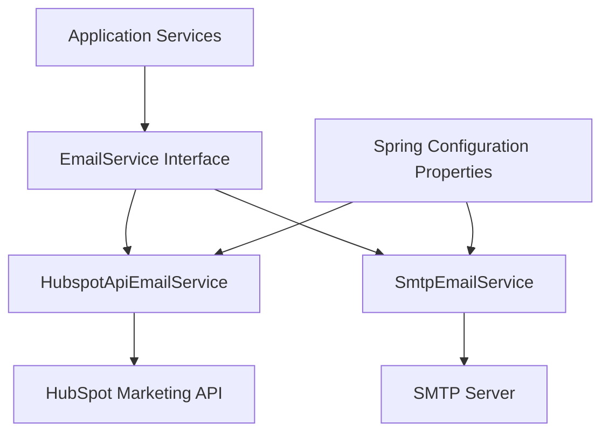
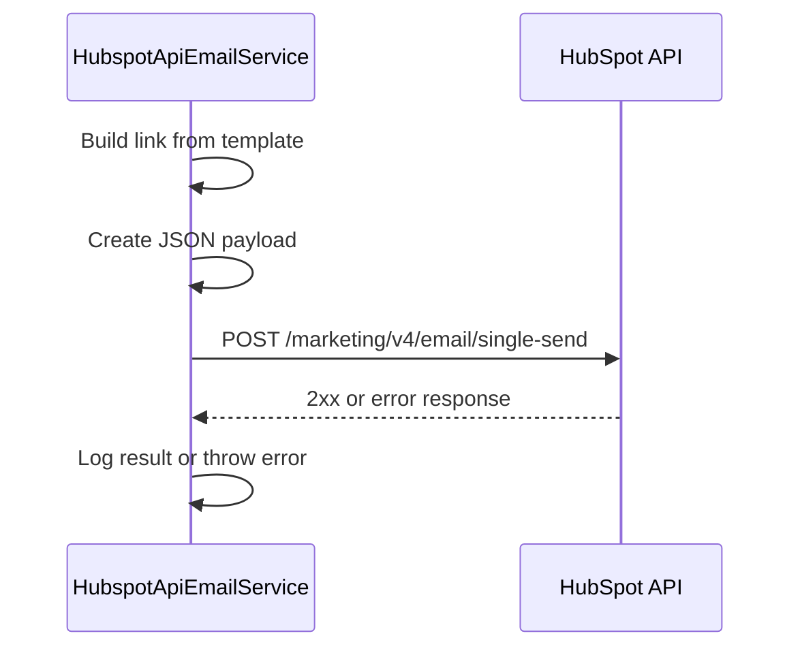
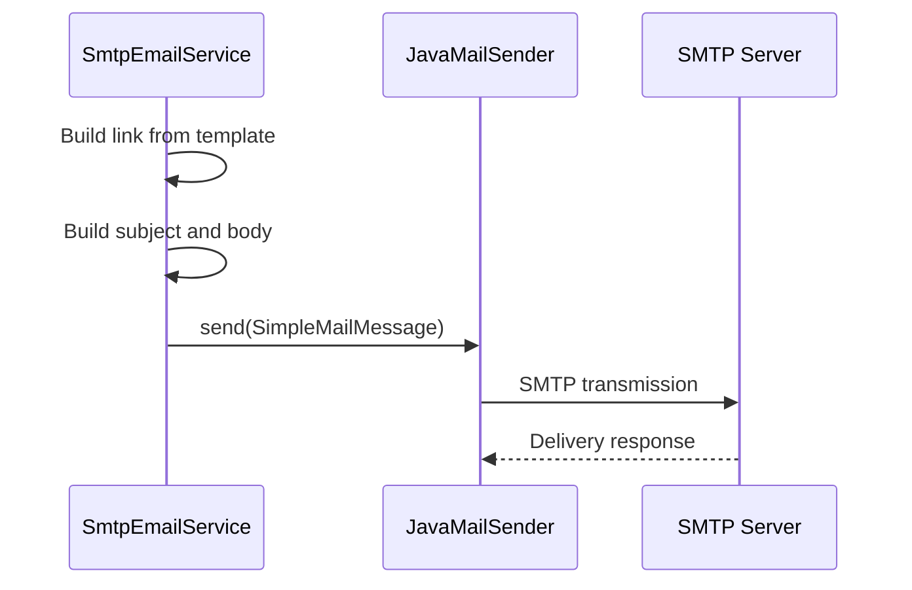

# Notification Mail

The **Notification Mail** module is responsible for sending transactional emails across the OpenFrame platform. It provides a pluggable email delivery abstraction with multiple providers, enabling the system to send:

- Invitation emails
- Password reset emails
- Email verification emails (HubSpot only)

The module is designed to be **provider-agnostic**, with runtime selection based on configuration properties.

---

## Purpose and Responsibilities

The Notification Mail module:

- Exposes a unified `EmailService` abstraction
- Supports multiple implementations via Spring Boot conditional configuration
- Handles dynamic link generation using configurable templates
- Integrates with external email infrastructure (SMTP or HubSpot API)
- Logs delivery attempts and provider responses

It is primarily used by:

- Authorization flows (invitation, password reset, email verification)
- User lifecycle processors
- Tenant onboarding workflows

---

## High-Level Architecture



### Key Design Points

- **Conditional Activation** using `@ConditionalOnProperty`
- **Configuration-driven provider selection** via `openframe.mail.provider`
- **Template-based link generation** using property placeholders
- **Synchronous execution** with blocking behavior for API calls

---

## Provider Selection

The provider is selected using:

```text
openframe.mail.provider=smtp
openframe.mail.provider=hubspot-api
```

### Default Behavior

If no provider is defined:

- `SmtpEmailService` is used (matchIfMissing = true)

---

# HubspotApiEmailService

**Component:**  
`deps.openframe-oss-lib.openframe-notification-mail.src.main.java.com.openframe.notification.mail.service.HubspotApiEmailService.HubspotApiEmailService`

## Overview

This implementation integrates with the **HubSpot Marketing Single Send API** using Spring WebClient.

It supports:

- Invitation emails
- Password reset emails
- Email verification emails

## Configuration Properties

```text
openframe.mail.provider=hubspot-api
openframe.mail.from=sender@example.com
openframe.mail.hubspot.access-token=YOUR_TOKEN
openframe.mail.hubspot.base-url=https://api.hubapi.com
openframe.mail.hubspot.invitation-email-id=ID
openframe.mail.hubspot.reset-email-id=ID
openframe.mail.hubspot.verify-email-id=ID
openframe.invitations.link-template=https://app/register/{id}
openframe.password-reset.link-template=https://app/reset/{token}
openframe.email-verify.link-template=https://app/verify/{token}
```

## Internal Flow



## Key Characteristics

- Uses `WebClient` with base URL configured at startup
- Injects Bearer token via Authorization header
- Logs payload in debug mode
- Throws `IllegalStateException` on non-2xx responses
- Blocks on reactive chain using `.block()`

---

# SmtpEmailService

**Component:**  
`deps.openframe-oss-lib.openframe-notification-mail.src.main.java.com.openframe.notification.mail.service.SmtpEmailService.SmtpEmailService`

## Overview

This implementation uses Spring’s `JavaMailSender` to send plain text emails via SMTP.

It supports:

- Invitation emails
- Password reset emails

Email verification is intentionally unsupported and throws an exception.

## Configuration

Relies on standard Spring Mail properties:

```text
openframe.mail.provider=smtp
spring.mail.host=smtp.example.com
spring.mail.port=587
spring.mail.username=user
spring.mail.password=secret
openframe.invitations.link-template=https://app/register/{id}
openframe.password-reset.link-template=https://app/reset/{token}
```

## Internal Flow



## Key Characteristics

- Uses `SimpleMailMessage` for plain text content
- No HTML templating support
- Minimal provider dependency
- Default fallback implementation

---

## Link Template Mechanism

Both providers use property-driven templates with placeholders:

```text
Invitation: https://app/register/{id}
Password Reset: https://app/reset/{token}
Email Verify: https://app/verify/{token}
```

Placeholders are replaced at runtime using simple string substitution.

---

## Error Handling Strategy

### HubSpot Provider

- Throws exception on non-2xx response
- Logs response body for debugging
- Fails fast to surface integration issues

### SMTP Provider

- Relies on `JavaMailSender` exception propagation
- Logs successful deliveries

---

## Integration Within the Platform

The Notification Mail module is typically invoked by:

- Authorization workflows during registration
- Password reset processors
- Tenant onboarding flows

It operates as an infrastructure-level component and does not contain business logic itself. Business modules generate tokens or invitation IDs and delegate delivery to this module.

---

## Design Considerations

### Extensibility

To add a new provider:

1. Implement the `EmailService` interface
2. Add `@ConditionalOnProperty`
3. Introduce provider-specific configuration properties

### Blocking vs Reactive

Although HubSpot uses `WebClient`, the call is blocked. This keeps the abstraction synchronous and consistent with SMTP.

### Security

- Access tokens are injected via configuration
- Sensitive values should be stored in secure configuration sources
- Links must be HTTPS in production environments

---

## Summary

The **Notification Mail** module provides a configurable and extensible email delivery layer for OpenFrame. By abstracting provider details behind a unified interface and using Spring conditional configuration, it ensures:

- Clean separation of concerns
- Easy provider switching
- Minimal coupling with business logic
- Production-ready integration with external email infrastructure

It acts as a critical infrastructure component enabling secure user onboarding and account recovery workflows.