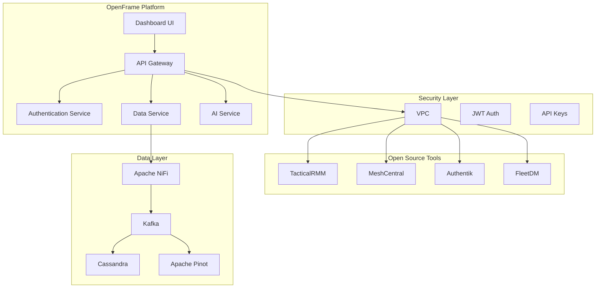
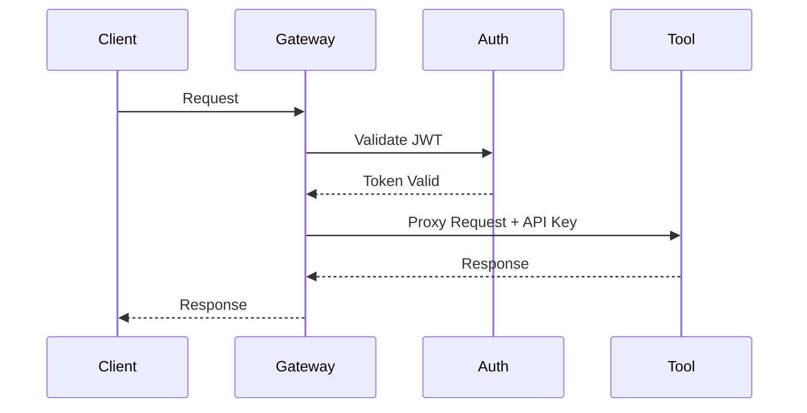
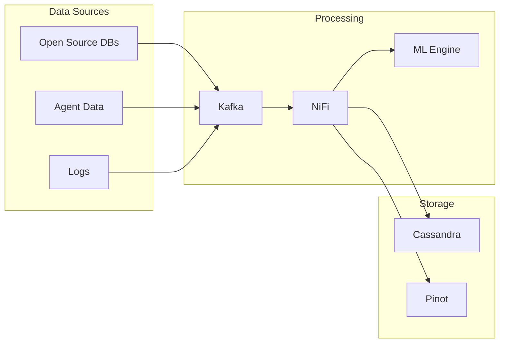

# OpenFrame Architecture Overview

OpenFrame is a comprehensive system that unifies various open-source IT and security products under a single platform, providing integrated data management, AI capabilities, dashboards, APIs, and security layers.

## System Architecture

## Core Components

### 1. Deployment Management
- Kubernetes-based deployment of all components
- VPC isolation for open-source tools
- Automated API key generation and management
- Internal microservices orchestration

### 2. Security Layer
- JWT-based authentication via Spring Security
- OpenFrame Gateway for request proxying
- VPC isolation for open-source tools
- Machine identity token management
- WebSocket/API client agent support

### 3. Data Layer
- Apache NiFi for data pipeline management
- Kafka for pub/sub messaging
- Cassandra for data storage
- Apache Pinot for real-time analytics
- Unified data structure and indexing

### 4. AI and Analytics
- Deep/machine learning for anomaly detection
- AI-powered issue resolution
- Log analysis and inference
- Automated problem resolution via MCP server

### 5. Unified Interface
- Integrated dashboard for all tools
- NIST-compliant unified objects
- SIEM-like log management
- Automation and orchestration capabilities

## Key Features

1. **Unified Access**
   - Single authentication point
   - Centralized API management
   - Secure proxy for all tools

2. **Data Integration**
   - Real-time data streaming
   - Unified data structure
   - Advanced analytics capabilities

3. **Intelligent Operations**
   - AI-powered issue resolution
   - Automated problem detection
   - Smart orchestration

4. **Comprehensive Monitoring**
   - Unified monitoring dashboard
   - Integrated logging
   - Performance analytics

## Security Architecture

## Data Flow Architecture

## Next Steps

- [Detailed Component Documentation](./components/)
- [Security Implementation](./security/)
- [Data Pipeline Architecture](./data-pipeline/)
- [AI and Analytics](./ai-analytics/)
- [API Integration](./api-integration/)
- [Deployment Guide](../deployment/) 