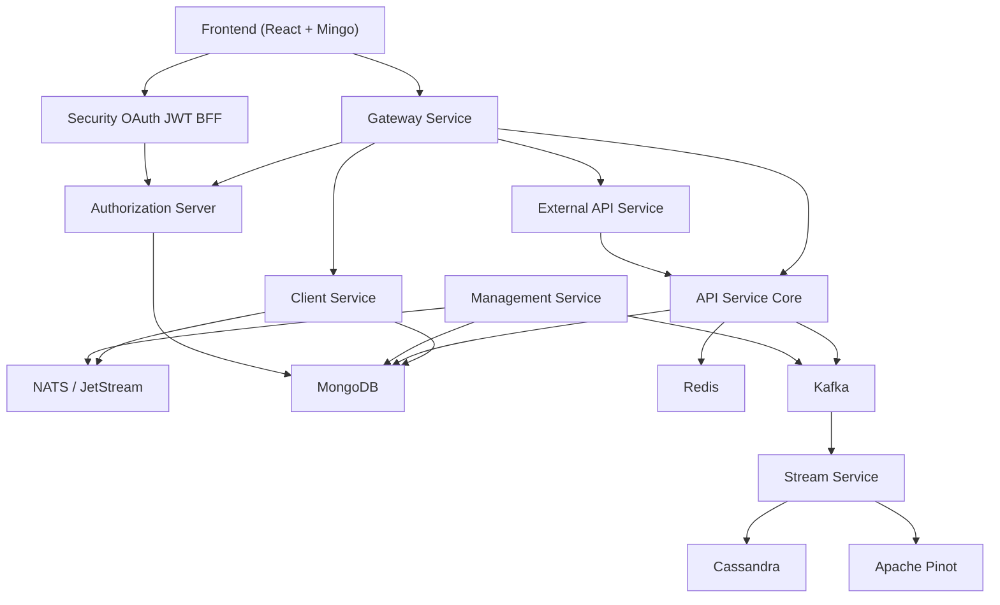
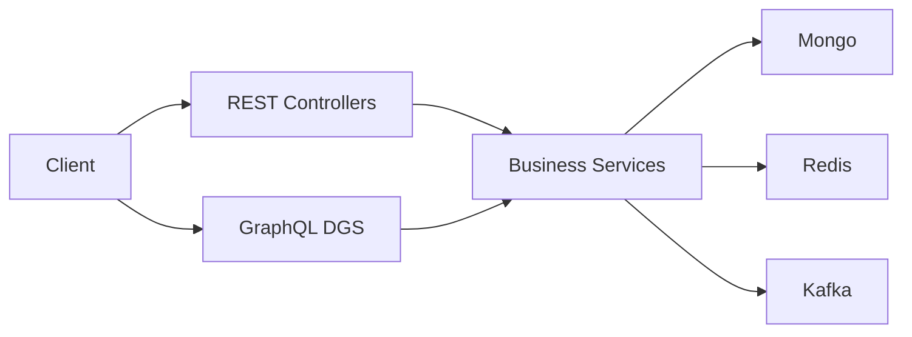
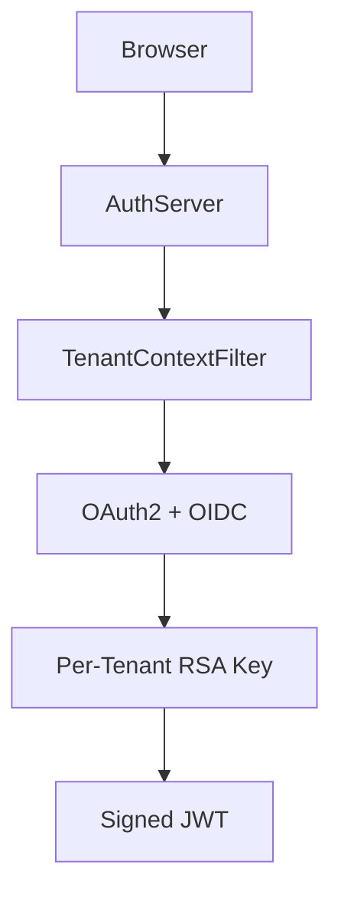
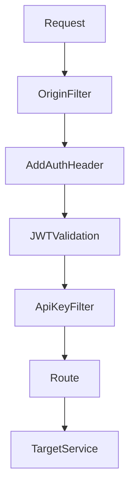
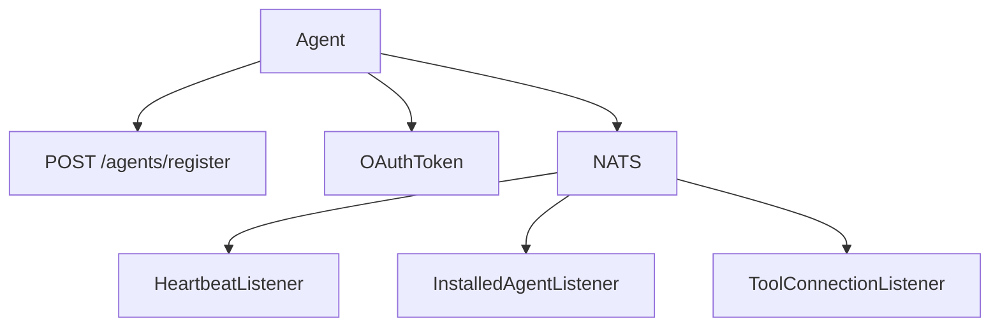
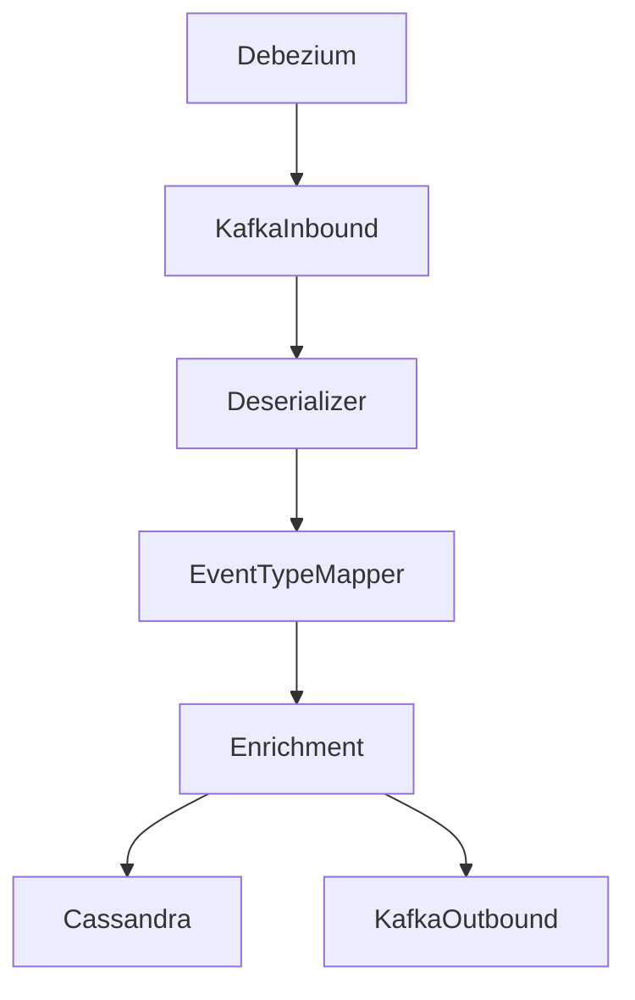
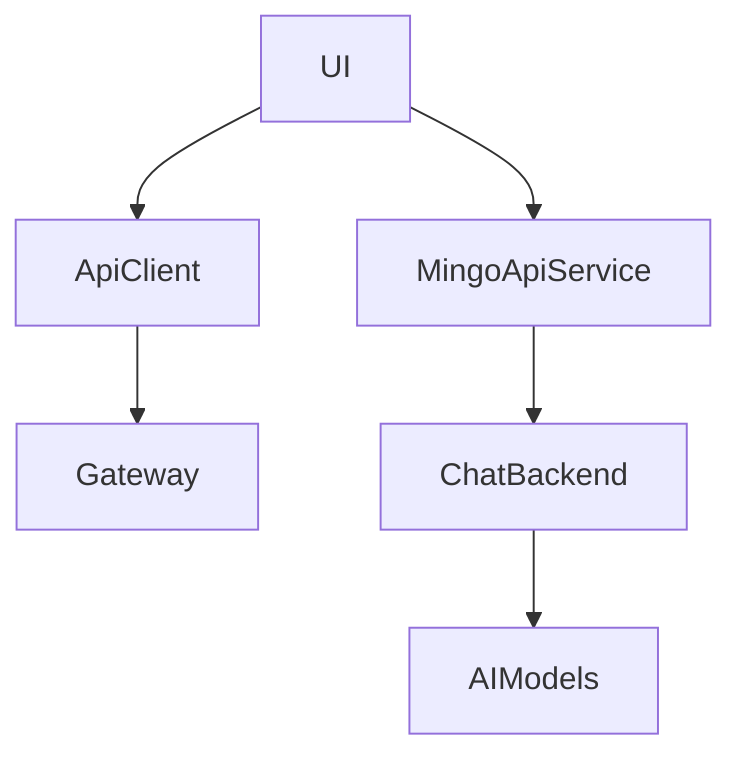
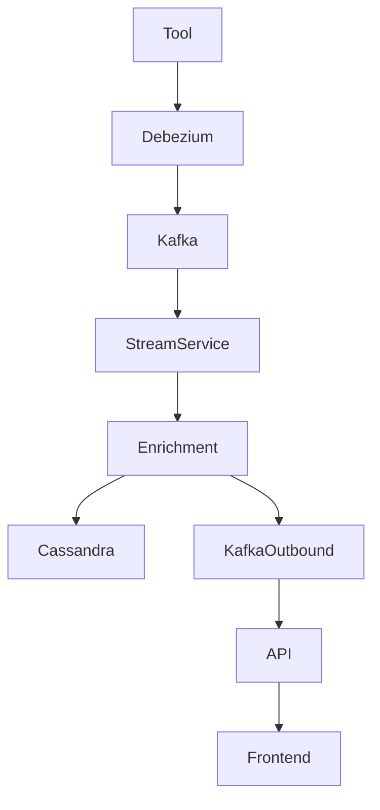

# OpenFrame OSS Tenant – Repository Overview

The **`openframe-oss-tenant`** repository is the full open-source, multi-tenant backend and frontend stack powering **OpenFrame**, Flamingo’s unified AI-driven MSP platform.

It implements:

- ✅ Multi-tenant identity and SSO
- ✅ REST + GraphQL API layer
- ✅ Gateway with JWT & API key enforcement
- ✅ Agent ingest and device lifecycle
- ✅ Kafka-based event streaming
- ✅ Cassandra + Pinot analytics
- ✅ Mongo persistence
- ✅ Redis distributed caching
- ✅ AI-powered chat (Mingo)
- ✅ Tool integrations (Fleet MDM, Tactical RMM, MeshCentral)

This repository contains all service entrypoints and shared infrastructure modules required to deploy a full OpenFrame OSS tenant environment.

---

# Platform Purpose

OpenFrame replaces fragmented MSP tooling with a **unified, event-driven, AI-enhanced IT operations platform**.

It provides:

- Device & organization management
- Event ingestion & normalization
- External tool orchestration
- Secure multi-tenant OAuth2 identity
- Analytics via Pinot & Cassandra
- AI chat interface (Mingo)
- Distributed scheduling & infrastructure automation

The system is designed to be:

- 🔐 Secure by default (OAuth2 + PKCE + JWT)
- 🏢 Multi-tenant isolated
- ⚡ Event-driven
- 🧩 Modular & microservice-based
- ☁️ Cloud-native deployable

---

# End-to-End Architecture

Below is the complete high-level architecture of `openframe-oss-tenant`.


```mermaid
flowchart TD
    Browser["Frontend (React + Mingo)"] --> Gateway["Gateway Service"]
    Browser --> AuthBFF["Security OAuth JWT BFF"]

    Gateway --> ApiService["API Service Core"]
    Gateway --> ExternalApi["External API Service"]
    Gateway --> ClientService["Client Service"]
    Gateway --> AuthServer["Authorization Server"]

    AuthBFF --> AuthServer

    ClientService --> NATS["NATS / JetStream"]
    ClientService --> Mongo["MongoDB"]

    ApiService --> Mongo
    ApiService --> Redis["Redis"]
    ApiService --> Kafka["Kafka"]

    ExternalApi --> ApiService

    Kafka --> StreamService["Stream Service"]
    StreamService --> Cassandra["Cassandra"]
    StreamService --> Pinot["Apache Pinot"]

    ManagementService["Management Service"] --> Mongo
    ManagementService --> Kafka
    ManagementService --> NATS

    AuthServer --> Mongo
```

---

# Service-Level Architecture

The repository is structured as a collection of deployable services and shared infrastructure modules.

## Service Entrypoints

Located under:

```text
openframe/services
```

| Service | Purpose |
|----------|----------|
| API Service | REST + GraphQL application layer |
| Authorization Server | OAuth2 + OIDC multi-tenant identity |
| Gateway Service | Edge security, routing, WebSocket proxy |
| External API | API key protected REST surface |
| Client Service | Agent ingest & machine lifecycle |
| Stream Service | Kafka CDC + enrichment |
| Management Service | Initializers & schedulers |
| Config Server | Centralized configuration |
| Frontend | React UI + Mingo AI |

---

# Core Architectural Domains

---

## 1️⃣ API Layer

### Module
`api-service_core_graphql_rest`

### Responsibilities

- REST controllers
- GraphQL (Netflix DGS)
- DataLoaders
- JWT principal resolution
- API key management
- Device, user, organization CRUD


```mermaid
flowchart LR
    Client --> REST["REST Controllers"]
    Client --> GraphQL["GraphQL DGS"]

    REST --> Services["Business Services"]
    GraphQL --> Services

    Services --> Mongo
    Services --> Redis
    Services --> Kafka
```

📚 Core Documentation:
- `api-service_core_graphql_rest`
- `api-service_core_dtos`
- `api-service_core_business_services`

---

## 2️⃣ Authorization & Identity

### Module
`authorization-server_core_tenant_sso_registration`

Implements:

- Spring Authorization Server
- Per-tenant JWT signing keys
- Google & Microsoft SSO
- PKCE support
- Tenant onboarding
- Invitation flows


```mermaid
flowchart TD
    Browser --> AuthServer
    AuthServer --> TenantContext["TenantContextFilter"]
    TenantContext --> OAuthFlow["OAuth2 + OIDC"]
    OAuthFlow --> JwtSigner["Per-Tenant RSA Key"]
    JwtSigner --> JWT["Signed JWT"]
```

📚 Core Documentation:
- `authorization-server_core_tenant_sso_registration`
- `security_oauth_jwt_bff`

---

## 3️⃣ Gateway & Security

### Module
`gateway_service_security_websocket_proxy`

- JWT validation
- Dynamic issuer resolution
- API key validation
- Rate limiting
- WebSocket proxy
- Tool routing


```mermaid
flowchart TD
    Request --> OriginFilter
    OriginFilter --> AddAuthHeader
    AddAuthHeader --> JWTValidation
    JWTValidation --> ApiKeyFilter
    ApiKeyFilter --> Route
    Route --> TargetService
```

📚 Core Documentation:
- `gateway_service_security_websocket_proxy`

---

## 4️⃣ Client & Agent Ingest

### Module
`client_service_agent_ingest`

Handles:

- Agent authentication
- Machine registration
- Heartbeats (NATS)
- Installed agents
- Tool connections
- Tool ID transformation


```mermaid
flowchart TD
    Agent --> Register["POST /agents/register"]
    Agent --> OAuthToken
    Agent --> NATS

    NATS --> HeartbeatListener
    NATS --> InstalledAgentListener
    NATS --> ToolConnectionListener
```

📚 Core Documentation:
- `client_service_agent_ingest`

---

## 5️⃣ Event Streaming & Enrichment

### Module
`stream_service_kafka_debezium_enrichment`

Responsible for:

- Debezium CDC ingestion
- Tool-specific deserialization
- UnifiedEventType mapping
- Device & org enrichment
- Cassandra persistence
- Kafka republishing


```mermaid
flowchart TD
    Debezium --> KafkaInbound
    KafkaInbound --> Deserializer
    Deserializer --> EventTypeMapper
    EventTypeMapper --> Enrichment
    Enrichment --> Cassandra
    Enrichment --> KafkaOutbound
```

📚 Core Documentation:
- `stream_service_kafka_debezium_enrichment`
- `data_kafka_tenant_autoconfig`

---

## 6️⃣ Data Infrastructure

### Mongo Layer
`data_mongo_documents_and_repositories`

- Domain documents
- Custom repository filtering
- Cursor pagination
- OAuth persistence

### Cassandra + Pinot
`data_core_cassandra_pinot_and_models`

- Device & log analytics
- Pinot query layer
- Cassandra persistence
- MachineTag event propagation

### Redis
`data_redis_cache_config`

- Distributed caching
- Tenant-aware key prefixing
- Reactive + blocking templates

---

## 7️⃣ Management & Initialization

### Module
`management_service_initializers_schedulers`

Handles:

- Pinot schema deployment
- NATS stream provisioning
- Debezium connector creation
- API key stat sync
- Version publishing fallback
- Release management

---

## 8️⃣ External API Surface

### Module
`external-api_service_rest`

- Versioned REST API
- API key authentication
- Filtering + cursor pagination
- Tool proxy passthrough

---

## 9️⃣ Frontend & AI (Mingo)

### Modules
- `frontend_service_api_clients_and_mingo`
- `chat_client_services`

Provides:

- Token-aware API client
- SaaS multi-tenant routing
- Tool API clients
- AI chat streaming
- GraphQL dialog pagination
- Zustand state management


```mermaid
flowchart TD
    UI --> ApiClient
    ApiClient --> Gateway
    UI --> MingoApiService
    MingoApiService --> ChatBackend
    ChatBackend --> AIModels
```

---

# Data & Event Flow

End-to-end device event lifecycle:


```mermaid
flowchart TD
    Tool --> Debezium
    Debezium --> Kafka
    Kafka --> StreamService
    StreamService --> Enrichment
    Enrichment --> Cassandra
    Enrichment --> KafkaOutbound
    KafkaOutbound --> API
    API --> Frontend
```

---

# Repository Structure Summary

```
openframe-oss-tenant/
├── openframe/services/            # Deployable Spring Boot services
├── openframe-oss-lib/             # Shared infrastructure libraries
├── clients/openframe-chat/        # Desktop chat client
├── frontend service               # React frontend + Mingo
```

Core shared modules:

- `data_mongo_documents_and_repositories`
- `data_core_cassandra_pinot_and_models`
- `data_kafka_tenant_autoconfig`
- `data_redis_cache_config`
- `security_oauth_jwt_bff`
- `api-lib_contracts_mappers_services`

---

# Architectural Characteristics

✅ Fully multi-tenant  
✅ Per-tenant JWT signing keys  
✅ Event-driven architecture  
✅ CQRS-style REST + GraphQL separation  
✅ Kafka CDC ingestion  
✅ Cassandra + Pinot analytics  
✅ Redis distributed caching  
✅ BFF OAuth with PKCE  
✅ Pluggable tool integrations  
✅ Modular microservices  

---

# Conclusion

The **`openframe-oss-tenant`** repository is a complete multi-service, event-driven, AI-integrated MSP backend platform.

It combines:

- Identity (OAuth2 + SSO)
- Gateway security
- REST & GraphQL APIs
- Device & organization management
- Streaming ingestion & normalization
- Distributed scheduling
- Analytics via Cassandra + Pinot
- AI chat interface
- Tool orchestration & proxying

It forms the backbone of the OpenFrame ecosystem and provides the full OSS foundation for deploying a secure, scalable, tenant-aware IT operations platform.