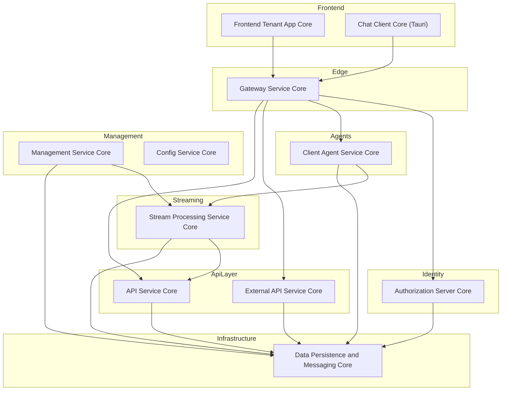
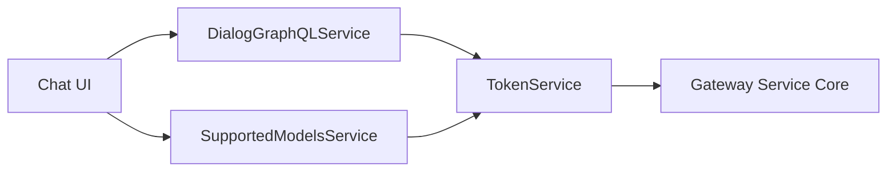
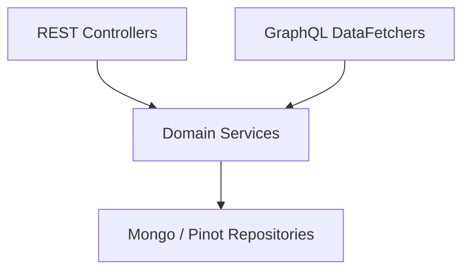
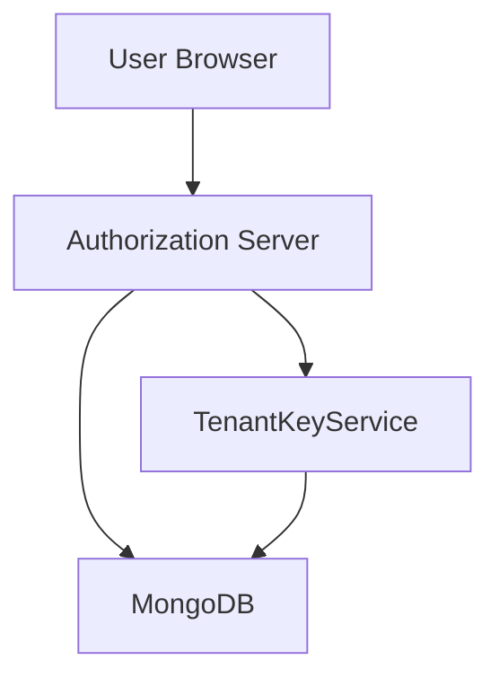
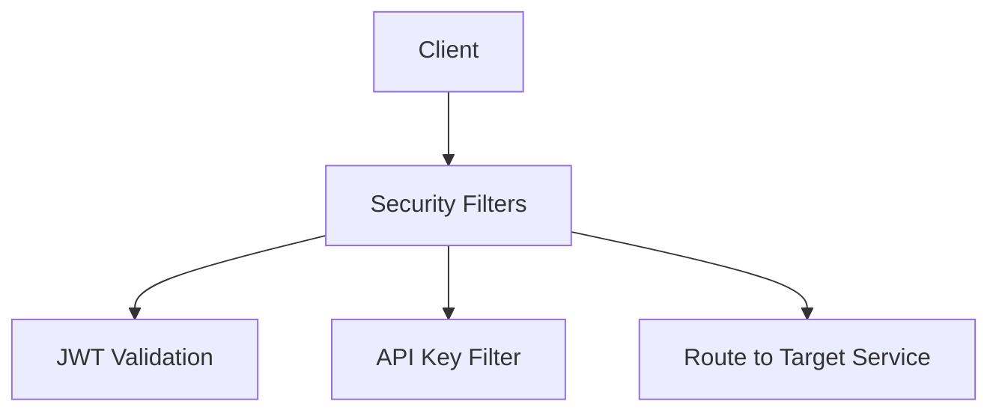
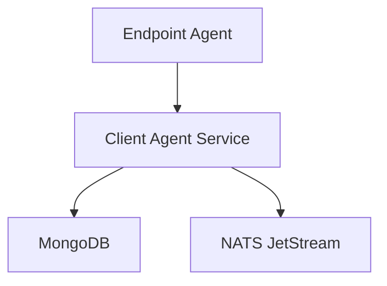
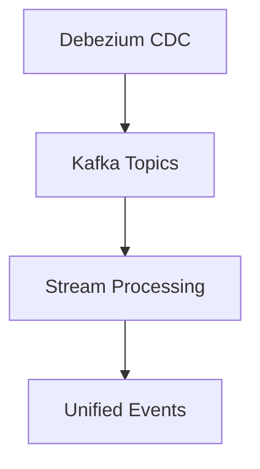
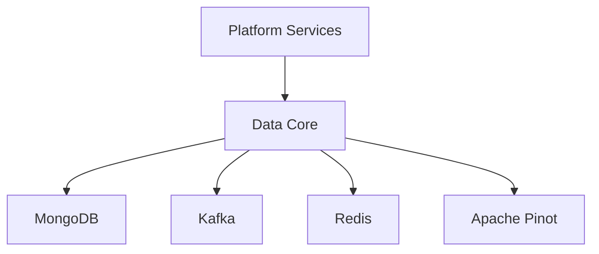
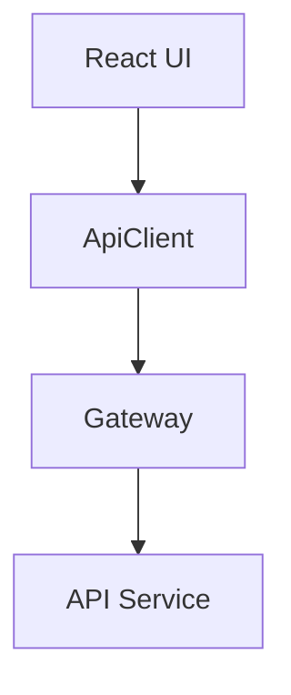
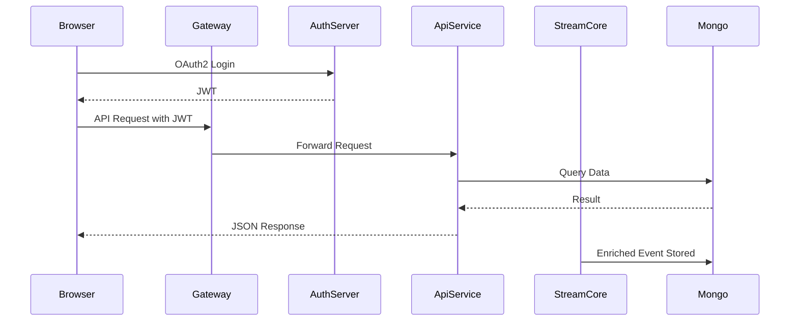

# OpenFrame OSS Tenant – Repository Overview

The **`openframe-oss-tenant`** repository is the reference multi-tenant implementation of the OpenFrame platform. It assembles all core backend services, frontend tenant applications, chat runtime, infrastructure layers, and shared libraries required to run a fully operational AI-powered MSP platform.

This repository represents the **complete tenant stack**, including:

- Identity and OAuth2 server
- Gateway and edge routing
- API layer (REST + GraphQL)
- External API for third-party integrations
- Agent lifecycle management
- Stream processing and enrichment
- Management and orchestration services
- Config server
- Shared data/messaging infrastructure
- Frontend tenant application
- Desktop chat client runtime

---

# Purpose of the Repository

The `openframe-oss-tenant` repository provides:

- ✅ A production-ready **multi-tenant architecture**
- ✅ Secure OAuth2 / OIDC identity with per-tenant signing keys
- ✅ API gateway with JWT validation and API key enforcement
- ✅ Event-driven processing using Kafka + Debezium
- ✅ Real-time enrichment and analytics (Pinot)
- ✅ Agent lifecycle and MSP tooling integration
- ✅ Tenant frontend (React-based)
- ✅ Desktop Chat client (Tauri-based)

It acts as the **OSS foundation** for Flamingo / OpenFrame deployments.

---

# End-to-End Architecture

Below is the high-level system architecture across all modules.

```mermaid
flowchart TD
    subgraph Frontend
        TenantApp["Frontend Tenant App Core"]
        ChatClient["Chat Client Core (Tauri)"]
    end

    subgraph Edge
        Gateway["Gateway Service Core"]
    end

    subgraph Identity
        AuthServer["Authorization Server Core"]
    end

    subgraph ApiLayer
        ApiService["API Service Core"]
        ExternalApi["External API Service Core"]
    end

    subgraph Agents
        ClientAgent["Client Agent Service Core"]
    end

    subgraph Streaming
        StreamCore["Stream Processing Service Core"]
    end

    subgraph Management
        ManagementCore["Management Service Core"]
        ConfigCore["Config Service Core"]
    end

    subgraph Infrastructure
        DataCore["Data Persistence and Messaging Core"]
    end

    TenantApp --> Gateway
    ChatClient --> Gateway
    Gateway --> ApiService
    Gateway --> ExternalApi
    Gateway --> ClientAgent
    Gateway --> AuthServer

    ApiService --> DataCore
    ExternalApi --> DataCore
    ClientAgent --> DataCore
    AuthServer --> DataCore
    StreamCore --> DataCore
    ManagementCore --> DataCore

    ManagementCore --> StreamCore
    ClientAgent --> StreamCore
    StreamCore --> ApiService
```

---

# Core Modules

---

## 1. Chat Client Core  
`clients/openframe-chat/src`

Desktop runtime for AI chat inside a Tauri environment.

### Responsibilities

- Token lifecycle (`TokenService`)
- GraphQL dialog retrieval (`DialogGraphQLService`)
- AI model discovery (`SupportedModelsService`)
- Debug runtime context

### Architecture

```mermaid
flowchart LR
    UI["Chat UI"] --> DialogService["DialogGraphQLService"]
    UI --> ModelsService["SupportedModelsService"]
    DialogService --> TokenService["TokenService"]
    ModelsService --> TokenService
    TokenService --> Gateway["Gateway Service Core"]
```

📖 See:  
`chat_client_core`

---

## 2. API Service Core  
`openframe/services/openframe-api`

Central business API layer (REST + GraphQL via DGS).

### Responsibilities

- Devices
- Events
- Logs
- Organizations
- Users
- Invitations
- API Keys
- SSO Config
- GraphQL DataFetchers
- DataLoader optimization

### Internal Layers

```mermaid
flowchart TD
    Controllers["REST Controllers"] --> Services["Domain Services"]
    DataFetchers["GraphQL DataFetchers"] --> Services
    Services --> Repositories["Mongo / Pinot Repositories"]
```

📖 See:  
`api_service_core`

---

## 3. Authorization Server Core  
`openframe/services/openframe-authorization-server`

Multi-tenant OAuth2 / OIDC identity provider.

### Key Features

- Per-tenant RSA signing keys
- OAuth2 authorization code flow
- PKCE support
- Google & Microsoft SSO
- Invitation-based onboarding
- Password reset

```mermaid
flowchart TD
    Browser["User Browser"] --> AuthServer["Authorization Server"]
    AuthServer --> Mongo["MongoDB"]
    AuthServer --> TenantKeys["TenantKeyService"]
    TenantKeys --> Mongo
```

📖 See:  
`authorization_server_core`

---

## 4. Gateway Service Core  
`openframe/services/openframe-gateway`

Reactive edge layer using Spring WebFlux.

### Responsibilities

- JWT validation (multi-issuer)
- API key enforcement
- Rate limiting
- WebSocket routing
- Role-based access control
- Integration proxying

```mermaid
flowchart TD
    Client["Client"] --> Filters["Security Filters"]
    Filters --> JwtValidation["JWT Validation"]
    Filters --> ApiKeyFilter["API Key Filter"]
    Filters --> Routing["Route to Target Service"]
```

📖 See:  
`gateway_service_core`

---

## 5. External API Service Core  
`openframe/services/openframe-external-api`

Public API surface secured by API keys.

- Devices API
- Events API
- Logs API
- Organizations API
- Tool integrations
- RestProxyService

📖 See:  
`external_api_service_core`

---

## 6. Client Agent Service Core  
`openframe/services/openframe-client`

Manages endpoint agents and machine lifecycle.

### Capabilities

- Agent OAuth authentication
- Registration (`/api/agents/register`)
- Heartbeat tracking
- Tool connection synchronization
- JetStream durable consumers

```mermaid
flowchart TD
    Agent["Endpoint Agent"] --> ClientCore["Client Agent Service"]
    ClientCore --> Mongo["MongoDB"]
    ClientCore --> NATS["NATS JetStream"]
```

📖 See:  
`client_agent_service_core`

---

## 7. Stream Processing Service Core  
`openframe/services/openframe-stream`

Kafka + Debezium event transformation engine.

### Responsibilities

- Consume CDC streams
- Normalize event types
- Enrich with organization + machine context
- Join activity streams
- Publish unified events

```mermaid
flowchart TD
    Debezium["Debezium CDC"] --> Kafka["Kafka Topics"]
    Kafka --> StreamCore["Stream Processing"]
    StreamCore --> Enriched["Unified Events"]
```

📖 See:  
`stream_processing_service_core`

---

## 8. Management Service Core  
`openframe/services/openframe-management`

Operational control plane.

- Tool initialization
- Pinot schema deployment
- Debezium connector management
- Version publishing
- Distributed schedulers (ShedLock + Redis)

📖 See:  
`management_service_core`

---

## 9. Config Service Core  
`openframe/services/openframe-config`

Spring Cloud Config Server.

- Centralized configuration
- Logging config distribution
- Environment-aware property loading

📖 See:  
`config_service_core`

---

## 10. Data Persistence and Messaging Core  
`openframe-oss-lib/openframe-data*`

Infrastructure abstraction layer.

### Technologies

- MongoDB (primary store)
- Kafka (event backbone)
- Redis (caching)
- Cassandra (optional)
- Apache Pinot (analytics)

```mermaid
flowchart TD
    Services["Platform Services"] --> DataCore["Data Core"]
    DataCore --> Mongo["MongoDB"]
    DataCore --> Kafka["Kafka"]
    DataCore --> Redis["Redis"]
    DataCore --> Pinot["Apache Pinot"]
```

📖 See:  
`data_persistence_and_messaging_core`

---

## 11. Frontend Tenant App Core  
`openframe/services/openframe-frontend`

React-based tenant UI.

### Responsibilities

- API abstraction (`ApiClient`)
- OAuth flows (`AuthApiClient`)
- Tool adapters (Fleet, Tactical)
- AI chat state (Mingo)
- Ticket dialog GraphQL orchestration
- Zustand stores

```mermaid
flowchart TD
    UI["React UI"] --> ApiClient["ApiClient"]
    ApiClient --> Gateway["Gateway"]
    Gateway --> ApiService["API Service"]
```

📖 See:  
`frontend_tenant_app_core`

---

# End-to-End Request Flow Example

User logs in → calls API → agent event processed → dashboard updated:

```mermaid
sequenceDiagram
    participant Browser
    participant Gateway
    participant AuthServer
    participant ApiService
    participant StreamCore
    participant Mongo

    Browser->>AuthServer: OAuth2 Login
    AuthServer-->>Browser: JWT
    Browser->>Gateway: API Request with JWT
    Gateway->>ApiService: Forward Request
    ApiService->>Mongo: Query Data
    Mongo-->>ApiService: Result
    ApiService-->>Browser: JSON Response

    StreamCore->>Mongo: Enriched Event Stored
```

---

# Architectural Principles

- ✅ Strict separation of concerns
- ✅ Multi-tenant isolation
- ✅ Per-tenant JWT signing keys
- ✅ Event-driven architecture
- ✅ Reactive gateway edge
- ✅ Cursor-based pagination
- ✅ Idempotent initialization
- ✅ Distributed scheduling with locking
- ✅ Tool-agnostic integration abstraction

---

# Summary

The **`openframe-oss-tenant`** repository is the complete, production-grade OSS implementation of the OpenFrame platform.

It delivers:

- Identity & OAuth2 server
- Secure multi-tenant gateway
- Rich REST + GraphQL APIs
- External integration APIs
- Endpoint agent lifecycle management
- Real-time stream processing
- Operational management services
- Shared infrastructure layer
- React tenant frontend
- Tauri desktop chat runtime

Together, these modules form a **scalable, secure, AI-enabled MSP platform foundation**.