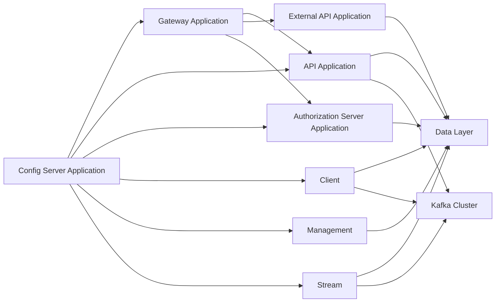
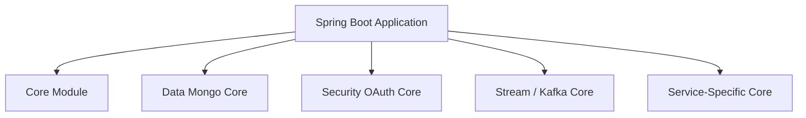
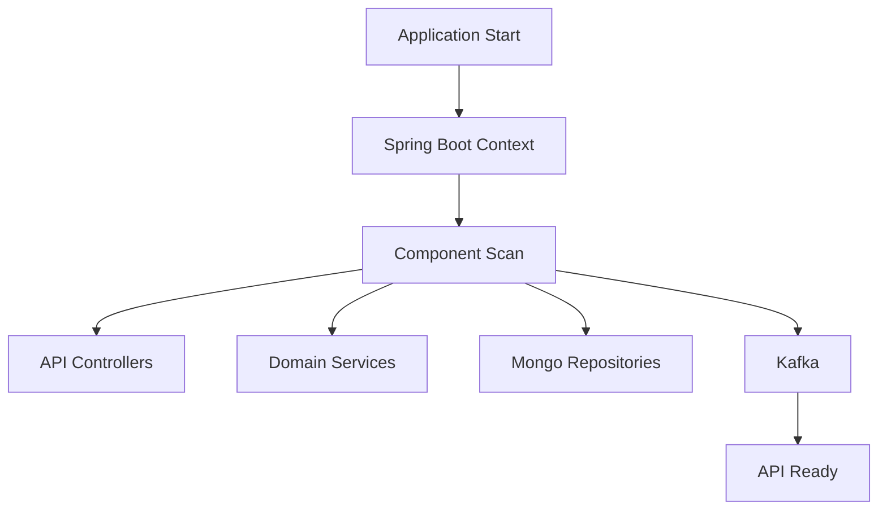
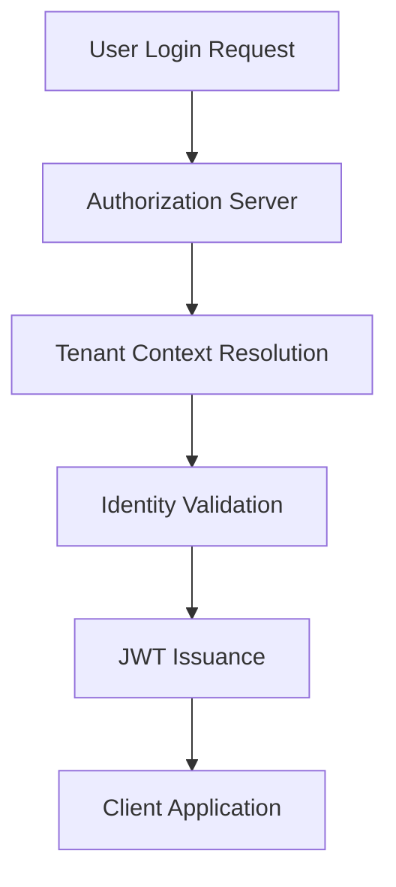
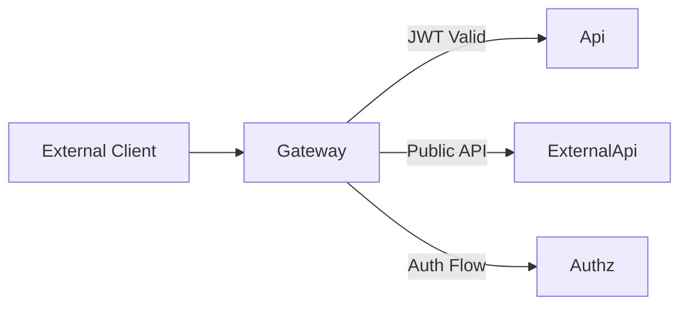
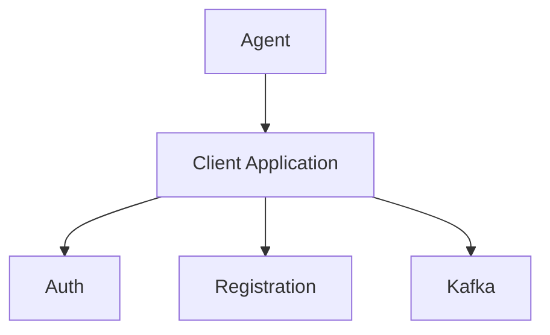
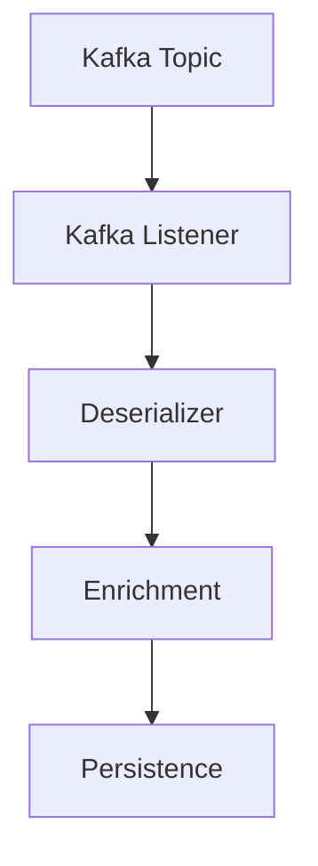
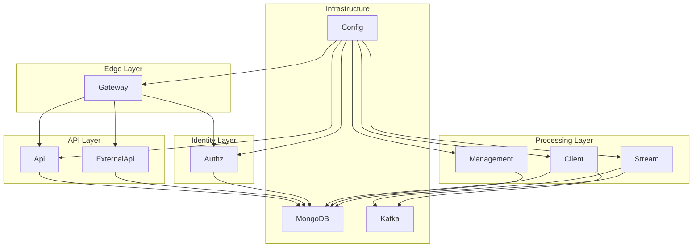

# Platform Applications

## Overview

The **Platform Applications** module is the executable layer of the OpenFrame platform. It contains the Spring Boot entry points that bootstrap and compose the underlying core libraries (API, Authorization, Gateway, Stream, Data, Security, Management, and Client services) into deployable microservices.

Each application in this module is a thin orchestration layer responsible for:

- Bootstrapping Spring Boot
- Defining component scanning boundaries
- Enabling infrastructure features (Kafka, Discovery, etc.)
- Assembling core modules into runnable services

The actual business logic resides in the respective `*-service-core`, `data-*`, and `security-*` modules. Platform Applications wires them together into independently deployable services.

---

## High-Level Architecture

The Platform Applications module represents the runtime topology of the OpenFrame system.

### Architectural Roles

- **Gateway Application** – Edge routing, authentication enforcement, and request forwarding.
- **API Application** – Internal GraphQL/REST APIs for platform UI and internal consumers.
- **External API Application** – Public-facing APIs for integrations and third-party systems.
- **Authorization Server Application** – OAuth2/OIDC identity provider and tenant-aware authentication.
- **Client Application** – Agent-facing APIs and client-side integration endpoints.
- **Management Application** – Operational management, initialization, scheduling, and tool lifecycle control.
- **Stream Application** – Kafka-driven event processing and enrichment.
- **Config Server Application** – Centralized configuration source for all services.

---

## Service Composition Model

Each application uses `@SpringBootApplication` combined with explicit `@ComponentScan` configuration to assemble functionality from shared modules.

This pattern ensures:

- Clear separation between infrastructure and business logic
- Reusable core modules across multiple services
- Independent deployability of each application
- Controlled component visibility via package scanning

---

# Applications

## API Application

**Entry Point:** `ApiApplication`

### Responsibilities

- Bootstraps the internal API service
- Exposes GraphQL and REST controllers
- Integrates data access, notification, and Kafka components
- Serves platform UI and internal clients

### Component Scan Scope

- `com.openframe.api`
- `com.openframe.data`
- `com.openframe.core`
- `com.openframe.notification`
- `com.openframe.kafka`

### Startup Flow

---

## Authorization Server Application

**Entry Point:** `OpenFrameAuthorizationServerApplication`

### Responsibilities

- OAuth2 Authorization Server
- OIDC provider
- Tenant-aware authentication
- SSO integration (Google, Microsoft, etc.)
- Client registration and token management

### Key Characteristics

- `@EnableDiscoveryClient` enabled
- Multi-tenant context handling
- RSA key management per tenant

---

## Gateway Application

**Entry Point:** `GatewayApplication`

### Responsibilities

- Edge entry point for all external traffic
- JWT validation and API key authentication
- CORS enforcement
- WebSocket proxying
- Routing to internal services

### Component Scope

- `com.openframe.gateway`
- `com.openframe.core`
- `com.openframe.data`
- `com.openframe.security`

---

## External API Application

**Entry Point:** `ExternalApiApplication`

### Responsibilities

- Public REST APIs
- Tool integrations
- External event ingestion
- Log and device access endpoints

### Design Characteristics

- Uses shared data and core services
- Integrates Kafka for event publishing
- Isolated from internal-only APIs

---

## Client Application

**Entry Point:** `ClientApplication`

### Responsibilities

- Agent authentication
- Agent registration processing
- Tool file management
- Machine heartbeat ingestion

### Notable Configuration

- Excludes `CassandraHealthIndicator`
- Includes Kafka producers
- Integrates security core

---

## Management Application

**Entry Point:** `ManagementApplication`

### Responsibilities

- Tool lifecycle management
- Secret initialization
- Scheduler execution
- System health coordination
- Stream and integration bootstrap

### Infrastructure Features

- Scheduled jobs
- Initialization hooks
- Debezium connectors

---

## Stream Application

**Entry Point:** `StreamApplication`

### Responsibilities

- Kafka consumers and listeners
- Event deserialization
- Event enrichment
- Activity mapping

### Key Feature

- `@EnableKafka` enabled

---

## Config Server Application

**Entry Point:** `ConfigServerApplication`

### Responsibilities

- Centralized configuration distribution
- Environment-specific property resolution
- Externalized secrets integration

All other applications depend on this service for runtime configuration.

---

# Deployment Model

The Platform Applications module enables independent deployment of each service.

---

# Key Design Principles

## 1. Clear Service Boundaries
Each application has a single responsibility and dedicated component scan scope.

## 2. Reusable Core Libraries
Business logic lives in reusable `*-core` modules. Platform Applications only assemble them.

## 3. Multi-Tenancy First
Tenant resolution and security contexts are enforced at the authorization and gateway layers.

## 4. Event-Driven Architecture
Kafka-based streaming and enrichment ensure scalable event processing.

## 5. Independent Scalability
Services can scale horizontally depending on workload (API-heavy, stream-heavy, or auth-heavy).

---

# Conclusion

The **Platform Applications** module is the runtime orchestration layer of OpenFrame. It transforms modular core libraries into a cohesive, production-ready microservices architecture.

By separating bootstrapping concerns from business logic and infrastructure components, the platform achieves:

- Clean modularity
- High scalability
- Strong security boundaries
- Tenant-aware identity enforcement
- Event-driven extensibility

This module is the foundation for deploying and operating the OpenFrame ecosystem in production environments.