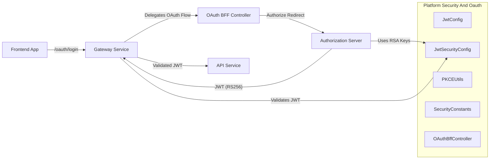
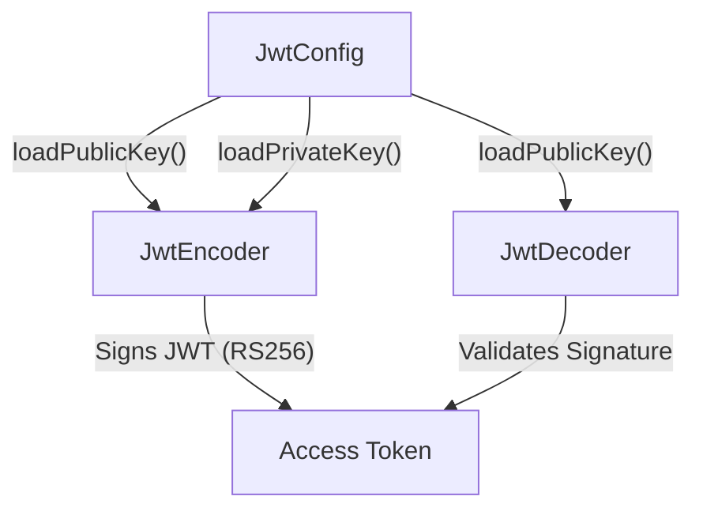
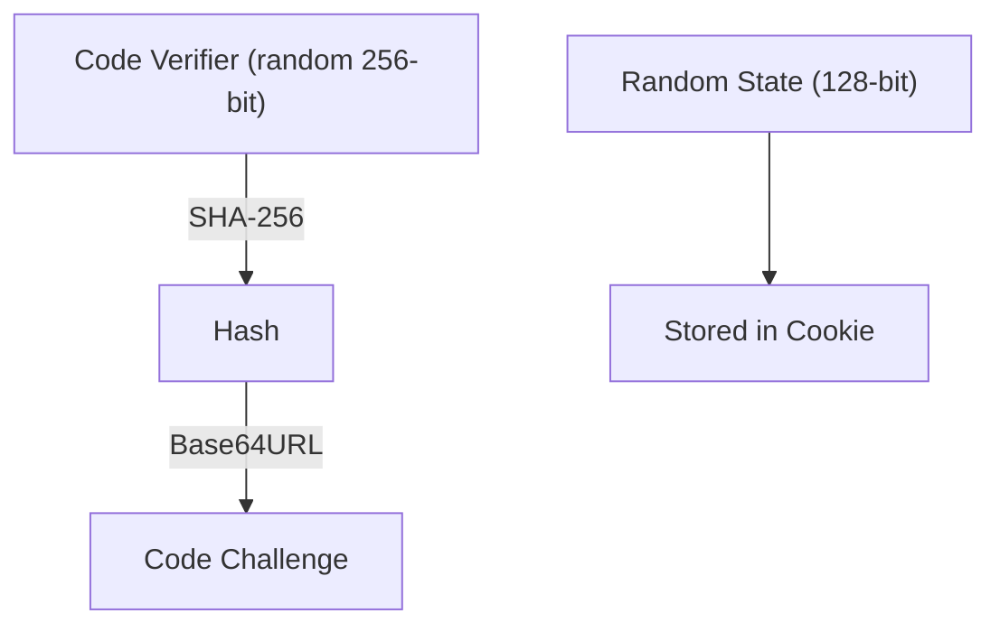
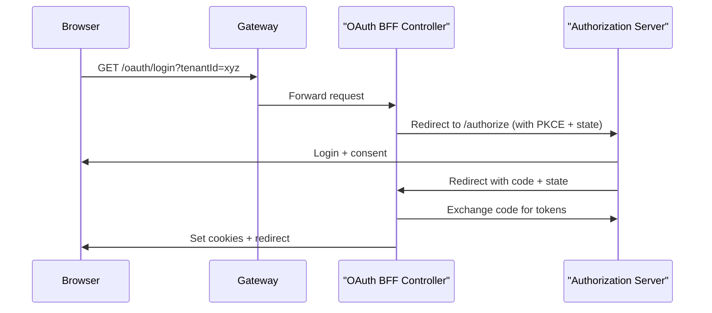
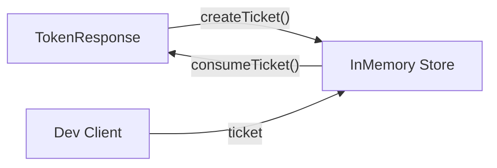
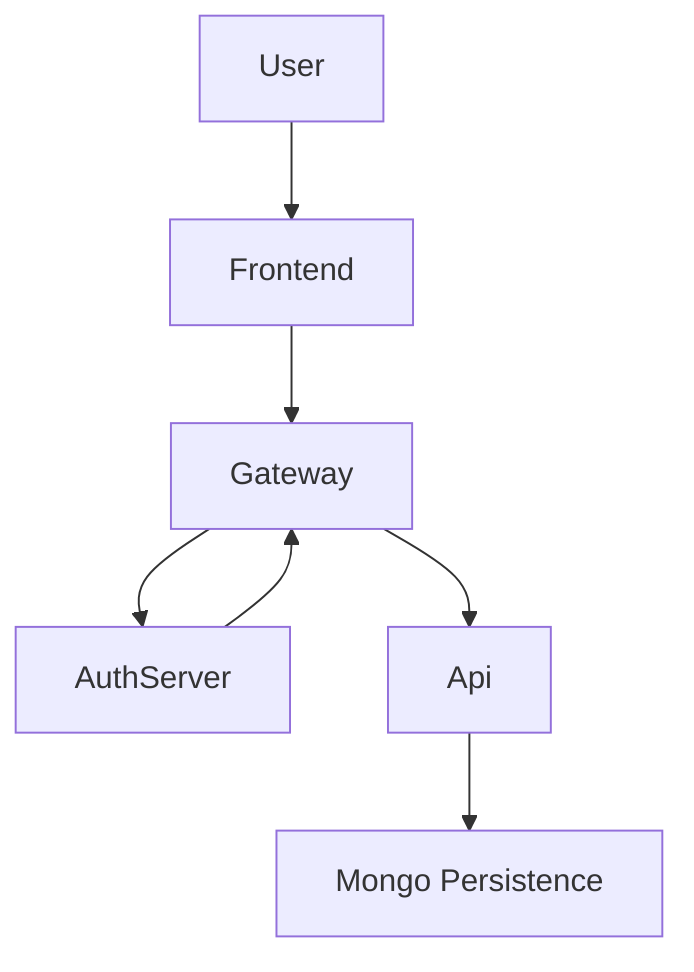

# Platform Security And Oauth

The **Platform Security And Oauth** module provides the foundational security building blocks for the OpenFrame platform. It centralizes:

- JWT encoding and decoding
- RSA key handling and configuration
- OAuth2 BFF (Backend-for-Frontend) flows
- PKCE utilities for secure public clients
- Token and cookie conventions

This module is consumed by multiple services, including the Gateway, Authorization Server, API services, and frontend clients. It ensures a consistent, multi-tenant aware security model across the platform.

---

## 1. Architectural Overview

At a high level, Platform Security And Oauth sits between the Authorization Server, the Gateway, and frontend clients, providing shared JWT and OAuth logic.



### Key Responsibilities

1. Provide RSA-based JWT encoder and decoder configuration.
2. Standardize OAuth token and header naming conventions.
3. Implement PKCE support for secure OAuth flows.
4. Expose BFF endpoints to manage login, callback, refresh, and logout.
5. Support development-mode token exchange via short-lived tickets.

---

## 2. JWT Infrastructure

### 2.1 JwtConfig

**Component:**  
`deps.openframe-oss-lib.openframe-security-core.src.main.java.com.openframe.security.jwt.JwtConfig.JwtConfig`

`JwtConfig` is a Spring `@ConfigurationProperties` service responsible for:

- Loading RSA public and private keys from configuration (`jwt.publicKey`, `jwt.privateKey`).
- Parsing PEM-encoded private keys into `RSAPrivateKey`.
- Exposing issuer and audience configuration.

This class ensures:

- Keys are externalized (e.g., environment, config server).
- Private keys are never hardcoded.
- Consistent RSA key handling across services.

---

### 2.2 JwtSecurityConfig

**Component:**  
`deps.openframe-oss-lib.openframe-security-core.src.main.java.com.openframe.security.config.JwtSecurityConfig.JwtSecurityConfig`

`JwtSecurityConfig` defines two critical Spring beans:

- `JwtEncoder` using `NimbusJwtEncoder`
- `JwtDecoder` using `NimbusJwtDecoder`

It constructs a JWK (JSON Web Key) from the RSA key pair:



This guarantees:

- Tokens are signed with RS256.
- Validation relies only on the public key.
- Services can validate tokens without sharing private keys.

These beans are reused by services such as:

- [Authorization Server Core](../authorization_server_core/authorization_server_core.md)
- [Gateway Service Core](../gateway_service_core/gateway_service_core.md)
- [API Service Core](../api_service_core/api_service_core.md)

---

## 3. OAuth Constants

### SecurityConstants

**Component:**  
`deps.openframe-oss-lib.openframe-security-core.src.main.java.com.openframe.security.oauth.SecurityConstants.SecurityConstants`

Defines standardized names for:

- `access_token`
- `refresh_token`
- `Access-Token` header
- `Refresh-Token` header
- `authorization` query parameter

By centralizing these values, the platform avoids:

- Header mismatches
- Cookie naming inconsistencies
- Divergent token conventions across services

---

## 4. PKCE Support

### PKCEUtils

**Component:**  
`deps.openframe-oss-lib.openframe-security-core.src.main.java.com.openframe.security.pkce.PKCEUtils.PKCEUtils`

`PKCEUtils` provides secure helpers for OAuth2 PKCE flows:

- `generateState()` – 128-bit random state
- `generateCodeVerifier()` – 256-bit random verifier
- `generateCodeChallenge(verifier)` – SHA-256 based challenge
- `urlEncode()` – safe redirect parameter encoding



Security guarantees:

- Prevents authorization code interception.
- Mitigates CSRF via state validation.
- Uses `SecureRandom` and Base64URL encoding without padding.

This is critical for frontend clients and public applications.

---

## 5. OAuth BFF Layer

### OAuthBffController

**Component:**  
`deps.openframe-oss-lib.openframe-security-oauth.src.main.java.com.openframe.security.oauth.controller.OAuthBffController.OAuthBffController`

The OAuth BFF (Backend-for-Frontend) controller exposes reactive endpoints under `/oauth`:

- `GET /oauth/login`
- `GET /oauth/continue`
- `GET /oauth/callback`
- `POST /oauth/refresh`
- `GET /oauth/logout`
- `GET /oauth/dev-exchange`

This controller is conditionally enabled via:

```text
openframe.gateway.oauth.enable=true
```

### 5.1 Login Flow



Key behaviors:

- Clears stale cookies before login.
- Generates state JWT and stores it in a secure cookie.
- Adds access and refresh tokens as HTTP-only cookies.
- Clears state cookie after successful callback.

---

### 5.2 Refresh Flow

`POST /oauth/refresh`

- Reads refresh token from cookie or header.
- Delegates token refresh to `OAuthBffService`.
- Returns `204 No Content` with updated cookies.
- Returns `401` if refresh token is missing or invalid.

---

### 5.3 Logout Flow

`GET /oauth/logout`

- Clears authentication cookies.
- Revokes refresh token via Authorization Server.
- Returns `204 No Content`.

---

## 6. Development Ticket Exchange

### InMemoryOAuthDevTicketStore

**Component:**  
`deps.openframe-oss-lib.openframe-security-oauth.src.main.java.com.openframe.security.oauth.service.InMemoryOAuthDevTicketStore.InMemoryOAuthDevTicketStore`

Provides an in-memory implementation of `OAuthDevTicketStore`.

Purpose:

- Allow frontend development without direct cookie access.
- Exchange a short-lived ticket for tokens via `/oauth/dev-exchange`.



Characteristics:

- Backed by `ConcurrentHashMap`.
- One-time consumption.
- Enabled only when dev ticket mode is active.

This should not be used in production without a persistent implementation.

---

## 7. Redirect Resolution

### DefaultRedirectTargetResolver

**Component:**  
`deps.openframe-oss-lib.openframe-security-oauth.src.main.java.com.openframe.security.oauth.service.redirect.DefaultRedirectTargetResolver.DefaultRedirectTargetResolver`

Responsible for determining the final redirect target after OAuth completion.

Resolution order:

1. Explicit `redirectTo` parameter.
2. HTTP `Referer` header.
3. Fallback to `/`.

This ensures:

- Safe fallback behavior.
- Flexible post-login navigation.
- Multi-tenant friendly redirect handling.

---

## 8. Integration with Other Modules

Platform Security And Oauth integrates closely with:

- [Authorization Server Core](../authorization_server_core/authorization_server_core.md) – issues tokens and handles client registration.
- [Gateway Service Core](../gateway_service_core/gateway_service_core.md) – validates JWTs and routes traffic.
- [API Service Core](../api_service_core/api_service_core.md) – protects REST and GraphQL endpoints.
- [Frontend App Core Clients](../frontend_app_core_clients/frontend_app_core_clients.md) – consumes OAuth flows and secured APIs.

Together, these modules form the full security lifecycle:



---

## 9. Security Design Principles

The Platform Security And Oauth module enforces the following principles:

- **Asymmetric cryptography (RSA)** for token signing.
- **Stateless access tokens** validated via public key.
- **Refresh token rotation and revocation**.
- **PKCE for public clients**.
- **Cookie-based token storage for BFF pattern**.
- **Multi-tenant compatibility** through tenant-aware flows.

---

## 10. Summary

Platform Security And Oauth is the foundational security layer of OpenFrame. It:

- Standardizes JWT handling.
- Secures OAuth flows with PKCE.
- Implements a production-ready BFF pattern.
- Enables multi-tenant secure authentication.
- Provides extension points for custom redirect and ticket storage strategies.

All higher-level services depend on this module to ensure consistent, secure, and scalable authentication across the platform.