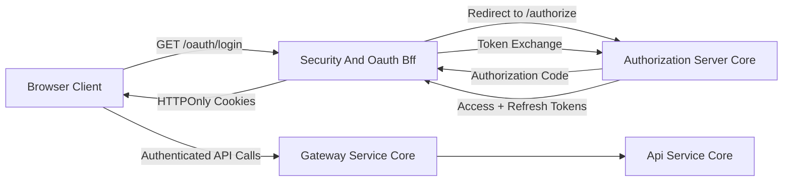
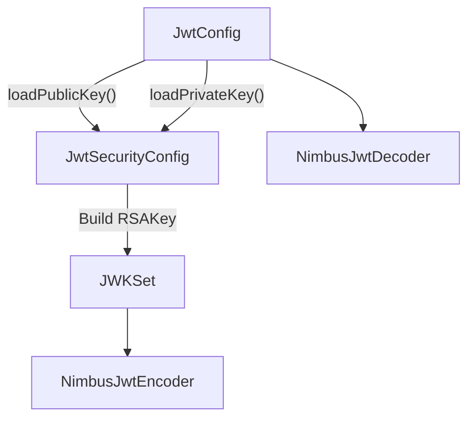
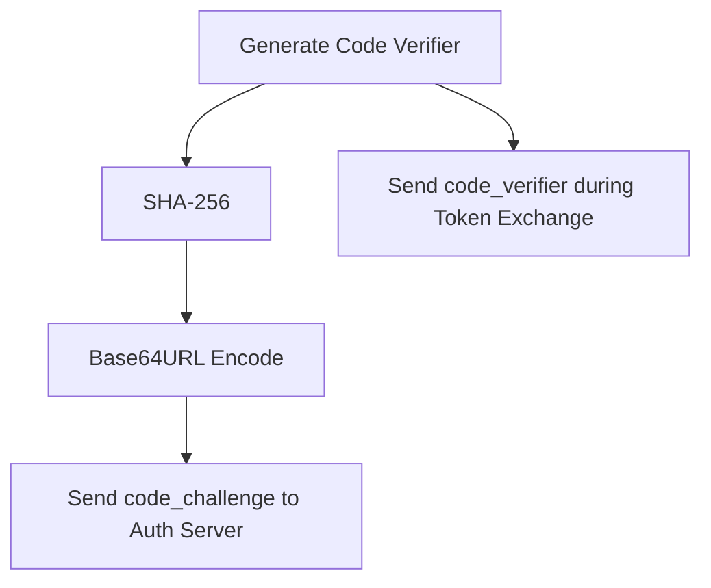
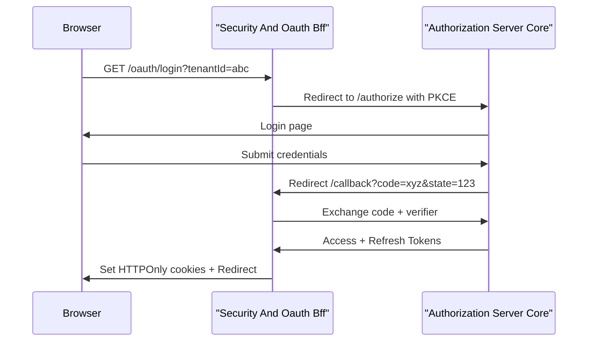
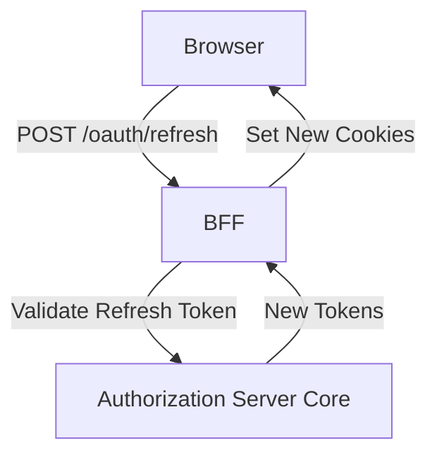
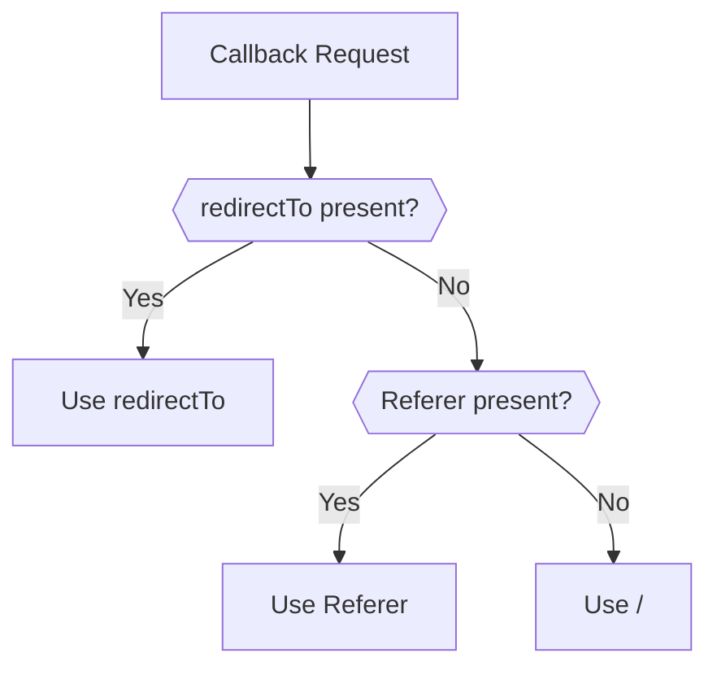
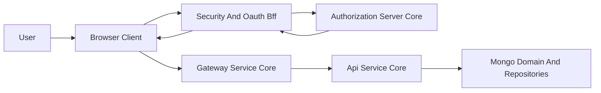

# Security And Oauth Bff

## Overview

The **Security And Oauth Bff** module implements the Backend-for-Frontend (BFF) layer for OAuth2/OIDC authentication within the OpenFrame platform. It bridges browser-based clients and the Authorization Server, handling:

- OAuth2 Authorization Code flow with PKCE
- Secure JWT encoding and decoding
- State validation and CSRF protection
- Token refresh and revocation
- Secure cookie handling for access and refresh tokens
- Tenant-aware redirect resolution

This module is designed to operate alongside:

- [Authorization Server Core](../authorization-server-core/authorization-server-core.md)
- [Gateway Service Core](../gateway-service-core/gateway-service-core.md)
- [Api Service Core](../api-service-core/api-service-core.md)
- [Mongo Domain And Repositories](../mongo-domain-and-repositories/mongo-domain-and-repositories.md)

It does **not** replace the Authorization Server. Instead, it protects browser clients by preventing direct token exposure and centralizing OAuth logic in a trusted backend.

---

## Architectural Role in the Platform

At runtime, Security And Oauth Bff sits between the browser client and the Authorization Server.



### Responsibilities

| Concern | Owned By Security And Oauth Bff |
|----------|----------------------------------|
| PKCE generation | ✅ |
| State parameter generation | ✅ |
| OAuth redirects | ✅ |
| Cookie-based token storage | ✅ |
| JWT encoding/decoding | ✅ |
| Token issuance | ❌ (Authorization Server Core) |
| Resource authorization | ❌ (Gateway + API layers) |

---

## Core Components

The module consists of two logical layers:

1. **JWT Infrastructure (security-core)**
2. **OAuth BFF Flow (security-oauth)**

---

# 1. JWT Infrastructure

## JwtSecurityConfig

Component:

- `deps.openframe-oss-lib.openframe-security-core.src.main.java.com.openframe.security.config.JwtSecurityConfig.JwtSecurityConfig`

This configuration class defines:

- `JwtEncoder` (NimbusJwtEncoder)
- `JwtDecoder` (NimbusJwtDecoder)

It constructs an RSA-based JWK set from configured public/private keys.

### Internal Flow



### Key Characteristics

- Uses RSA asymmetric signing
- Compatible with Spring Security OAuth2 Resource Server
- Supports multi-tenant issuer and audience configuration

---

## JwtConfig

Component:

- `deps.openframe-oss-lib.openframe-security-core.src.main.java.com.openframe.security.jwt.JwtConfig.JwtConfig`

This class loads and parses RSA keys from configuration properties.

### Configuration Properties

```text
jwt.public-key.value
jwt.private-key.value
jwt.issuer
jwt.audience
```

### Behavior

- Removes PEM headers
- Base64 decodes private key
- Builds `RSAPrivateKey` via `PKCS8EncodedKeySpec`
- Exposes issuer and audience for token validation

This configuration is used by both:

- Authorization Server
- Gateway resource validation
- BFF token validation

---

## SecurityConstants

Component:

- `deps.openframe-oss-lib.openframe-security-core.src.main.java.com.openframe.security.oauth.SecurityConstants.SecurityConstants`

Defines standardized token and header names:

```text
ACCESS_TOKEN
REFRESH_TOKEN
ACCESS_TOKEN_HEADER
REFRESH_TOKEN_HEADER
```

This ensures consistency across:

- Gateway filters
- BFF cookies
- Dev ticket exchange

---

## PKCEUtils

Component:

- `deps.openframe-oss-lib.openframe-security-core.src.main.java.com.openframe.security.pkce.PKCEUtils.PKCEUtils`

Provides cryptographically secure utilities for OAuth2 PKCE flows.

### Provided Methods

| Method | Purpose |
|--------|----------|
| `generateState()` | CSRF protection |
| `generateCodeVerifier()` | PKCE secret |
| `generateCodeChallenge()` | SHA-256 challenge |
| `urlEncode()` | Safe redirect encoding |

### PKCE Flow Logic



Security guarantees:

- Mitigates authorization code interception
- Prevents CSRF via random state
- Uses `SecureRandom`

---

# 2. OAuth BFF Flow

## OAuthBffController

Component:

- `deps.openframe-oss-lib.openframe-security-oauth.src.main.java.com.openframe.security.oauth.controller.OAuthBffController.OAuthBffController`

This is the central BFF controller exposed under:

```text
/oauth/*
```

Enabled only when:

```text
openframe.gateway.oauth.enable=true
```

---

## Endpoint Overview

| Endpoint | Purpose |
|-----------|----------|
| `/oauth/login` | Start OAuth flow |
| `/oauth/continue` | Continue after SSO |
| `/oauth/callback` | Handle authorization code |
| `/oauth/refresh` | Refresh access token |
| `/oauth/logout` | Revoke refresh token |
| `/oauth/dev-exchange` | Development ticket exchange |

---

## Login Flow



### Important Behaviors

- Clears previous SAS cookies
- Generates signed state JWT
- Stores state in HTTPOnly cookie
- Redirects with 302 FOUND

---

## Callback Processing

In `/oauth/callback`:

1. Validates state
2. Exchanges authorization code
3. Resolves redirect target
4. Sets cookies
5. Optionally creates dev ticket

Error handling:

- Redirects to configured `openframe.auth.error-url`
- URL-encodes error message

---

## Refresh Flow

Endpoint:

```text
POST /oauth/refresh
```

Token source priority:

1. Cookie `refresh_token`
2. Header `Refresh-Token`

Flow:



If no token present → `401 Unauthorized`

---

## Logout Flow

Endpoint:

```text
GET /oauth/logout
```

Behavior:

- Clears auth cookies
- Revokes refresh token
- Returns 204 No Content

Supports:

- Direct tenantId-based revocation
- Lookup-based revocation

---

## Dev Ticket Exchange

Endpoint:

```text
GET /oauth/dev-exchange
```

Used for development environments when:

```text
openframe.gateway.oauth.dev-ticket-enabled=true
```

Allows token exchange via short-lived ticket without exposing cookies.

---

## Redirect Resolution

### DefaultRedirectTargetResolver

Component:

- `deps.openframe-oss-lib.openframe-security-oauth.src.main.java.com.openframe.security.oauth.service.redirect.DefaultRedirectTargetResolver.DefaultRedirectTargetResolver`

Resolution priority:

1. `redirectTo` query parameter
2. HTTP `Referer` header
3. `/`



Custom resolvers may override this behavior via Spring bean replacement.

---

# Security Model

## Token Handling Strategy

| Token | Storage |
|--------|----------|
| Access Token | HTTPOnly Cookie |
| Refresh Token | HTTPOnly Cookie |
| State Token | HTTPOnly Cookie |

Advantages:

- Prevents XSS token exfiltration
- Prevents client-side JS access
- Centralizes refresh logic

---

## CSRF Protection

- PKCE verifier binding
- Signed state JWT
- Short-lived state cookie TTL

---

## Multi-Tenant Awareness

Security And Oauth Bff integrates with tenant resolution from:

- Authorization Server tenant discovery
- Gateway issuer resolution

Each OAuth request includes `tenantId`.

---

# Interaction with Other Modules

### Authorization Server Core

Handles:

- Token issuance
- Client registration
- RSA key generation
- OIDC user mapping

Security And Oauth Bff delegates all token creation here.

---

### Gateway Service Core

- Validates JWTs
- Applies rate limits
- Injects Authorization headers upstream

Security And Oauth Bff ensures tokens are available via cookies for gateway validation.

---

### Api Service Core

- Business logic
- GraphQL data fetchers
- Controllers

Receives authenticated requests after gateway validation.

---

# End-to-End Authentication Flow



---

# Configuration Summary

```text
openframe.gateway.oauth.enable
openframe.gateway.oauth.state-cookie-ttl-seconds
openframe.gateway.oauth.dev-ticket-enabled
openframe.auth.error-url
jwt.public-key
jwt.private-key
jwt.issuer
jwt.audience
```

---

# Conclusion

Security And Oauth Bff provides a secure, PKCE-compliant, multi-tenant OAuth2 Backend-for-Frontend implementation for OpenFrame.

It ensures:

- Browser-safe token handling
- Secure cookie management
- Centralized OAuth orchestration
- Seamless integration with Authorization Server and Gateway

This module is critical for production-grade, secure authentication in the OpenFrame platform.