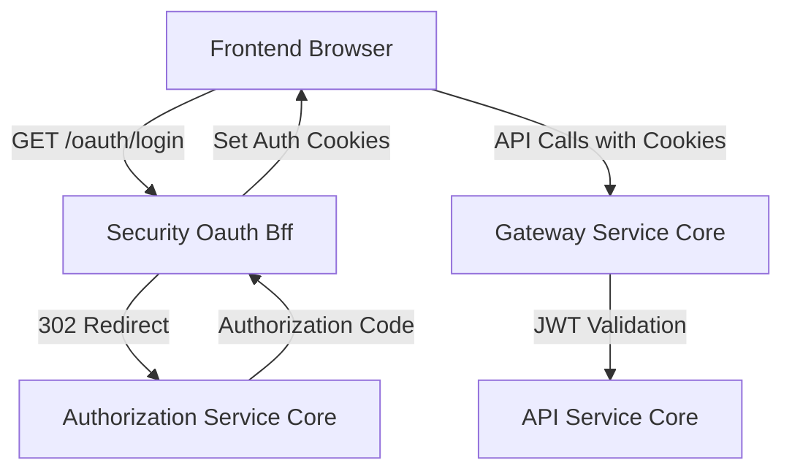
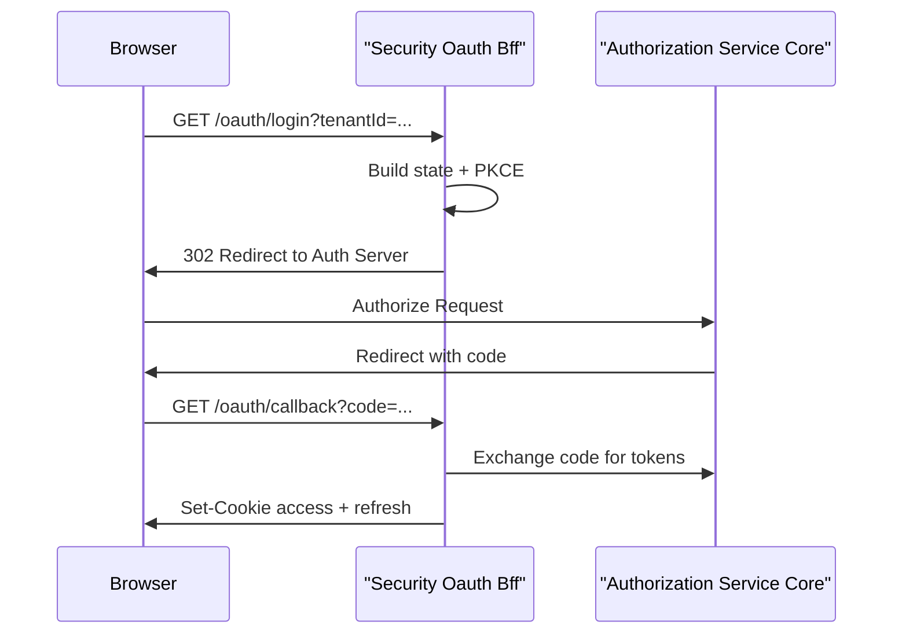
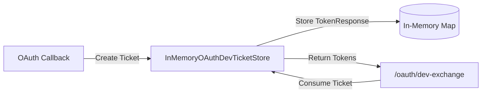
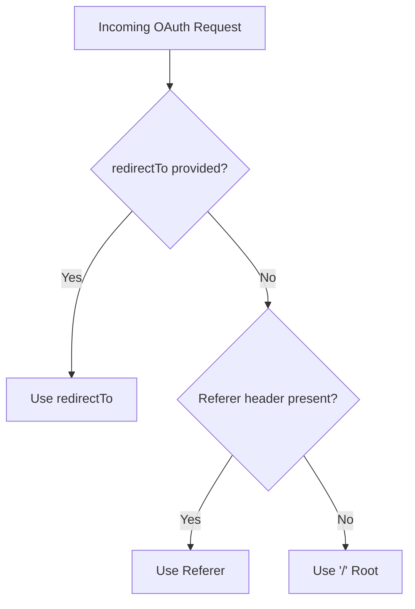
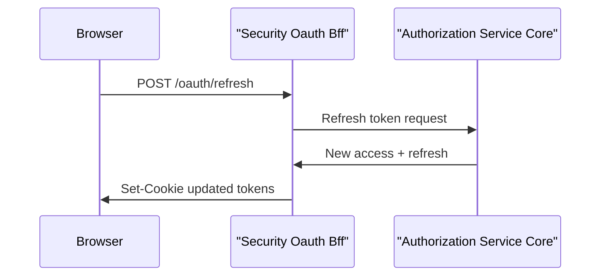
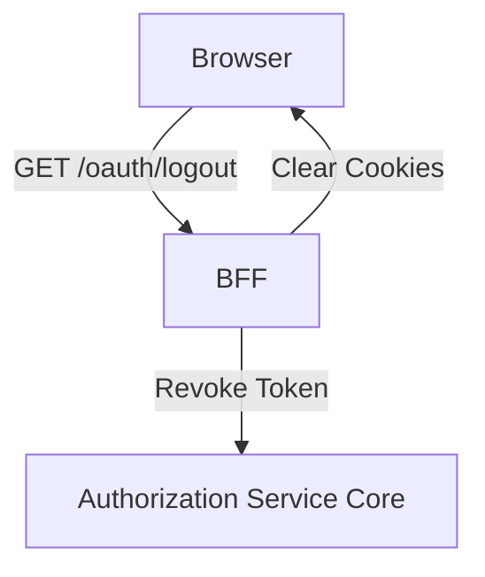

# Security Oauth Bff

## Overview

The **Security Oauth Bff** module implements a Backend-for-Frontend (BFF) layer for OAuth2 and OpenID Connect flows in the OpenFrame platform. It is responsible for:

- Initiating OAuth2 Authorization Code + PKCE flows
- Handling callbacks and token exchange
- Managing secure HTTP-only authentication cookies
- Supporting refresh and logout flows
- Providing a development-only ticket exchange mechanism

This module sits between the frontend clients (such as the Tenant Frontend) and the Authorization Server, abstracting token handling away from the browser and enforcing secure cookie-based session management.

It works closely with:

- Security Jwt Core (JWT, PKCE, constants)
- Authorization Service Core (OAuth2 Authorization Server)
- Gateway Service Core (edge routing and security filters)
- Frontend Tenant API Clients (AuthApiClient, ApiClient)

---

## Architectural Role

Security Oauth Bff acts as the OAuth orchestration layer inside the Gateway tier. Instead of exposing raw tokens to the frontend, it:

1. Redirects users to the Authorization Server
2. Exchanges authorization codes for tokens
3. Stores tokens in secure cookies
4. Handles refresh and revocation

### High-Level Flow



This separation ensures:

- Tokens are never stored in local storage
- Access and refresh tokens are managed server-side
- Frontend remains unaware of OAuth complexity

---

## Core Components

The Security Oauth Bff module contains three main components:

### 1. OAuthBffController

**Component:**  
`deps.openframe-oss-lib.openframe-security-oauth.src.main.java.com.openframe.security.oauth.controller.OAuthBffController.OAuthBffController`

The central REST controller exposing OAuth endpoints under `/oauth`.

#### Exposed Endpoints

- `GET /oauth/login`
- `GET /oauth/continue`
- `GET /oauth/callback`
- `POST /oauth/refresh`
- `GET /oauth/logout`
- `GET /oauth/dev-exchange`

#### Responsibilities

- Builds authorization redirects using `OAuthBffService`
- Creates and validates state JWTs
- Sets and clears OAuth cookies via `CookieService`
- Exchanges authorization codes for tokens
- Handles refresh token rotation
- Revokes tokens during logout
- Optionally appends development tickets

### Login Flow



---

### 2. InMemoryOAuthDevTicketStore

**Component:**  
`deps.openframe-oss-lib.openframe-security-oauth.src.main.java.com.openframe.security.oauth.service.InMemoryOAuthDevTicketStore.InMemoryOAuthDevTicketStore`

A development-only in-memory ticket store implementing `OAuthDevTicketStore`.

#### Purpose

When `openframe.gateway.oauth.dev-ticket-enabled=true`, the module:

- Generates a temporary "dev ticket"
- Associates it with a `TokenResponse`
- Allows token retrieval via `/oauth/dev-exchange`

This enables local development and testing scenarios where tokens may need to be accessed programmatically.

#### Behavior

- Uses `ConcurrentHashMap` for storage
- Tickets are one-time use (removed on consumption)
- Designed for non-production usage



---

### 3. DefaultRedirectTargetResolver

**Component:**  
`deps.openframe-oss-lib.openframe-security-oauth.src.main.java.com.openframe.security.oauth.service.redirect.DefaultRedirectTargetResolver.DefaultRedirectTargetResolver`

Resolves the final redirect target after successful authentication.

#### Resolution Strategy

1. Use `redirectTo` request parameter if provided
2. Otherwise use HTTP `Referer` header
3. Fallback to `/`

This ensures safe and predictable navigation after login.



---

## OAuth Lifecycle Management

### State Handling

- A signed state JWT is generated per login
- Stored in a secure state cookie
- Validated during callback
- Cleared after successful exchange

### Cookie Management

The module delegates cookie logic to `CookieService`:

- Adds secure HTTP-only access token cookie
- Adds refresh token cookie
- Clears cookies on logout
- Clears state cookie after callback

### Refresh Flow



If no refresh token is found in cookies or headers, the endpoint returns `401 Unauthorized`.

---

## Logout Flow

Logout performs two operations:

1. Clears authentication cookies
2. Revokes refresh token via Authorization Server



This ensures both client and server-side session invalidation.

---

## Configuration Properties

The controller is conditionally enabled via:

```text
openframe.gateway.oauth.enable=true
```

Key properties:

```text
openframe.gateway.oauth.state-cookie-ttl-seconds=180
openframe.gateway.oauth.dev-ticket-enabled=true
```

- `state-cookie-ttl-seconds`: Expiration for state cookie
- `dev-ticket-enabled`: Enables development ticket flow

---

## Error Handling

If token exchange fails during callback:

- The module attempts to recover the original redirect target
- Appends query parameters:
  - `error=oauth_failed`
  - `message=<encoded_message>`

This preserves UX continuity while avoiding token leakage.

---

## Integration with Other Modules

### Authorization Service Core

- Performs OAuth2 Authorization Code flow
- Issues tokens
- Validates refresh tokens
- Revokes tokens

### Security Jwt Core

- Provides JWT utilities and constants
- Supports PKCE
- Defines token header names

### Gateway Service Core

- Applies JWT validation filters
- Enforces CORS and security policies

### Frontend Tenant API Clients

- Initiate login and refresh calls
- Rely on cookie-based session

---

## Security Considerations

The Security Oauth Bff module enforces:

- Authorization Code + PKCE flow
- Signed state verification
- Secure HTTP-only cookies
- Token rotation on refresh
- One-time development tickets

By centralizing OAuth logic in the BFF, the platform avoids:

- Token storage in browser storage
- Direct token exposure to frontend code
- Complex client-side OAuth handling

---

## Summary

Security Oauth Bff is the secure OAuth gateway for OpenFrame’s frontend applications. It:

- Orchestrates OAuth flows
- Manages token lifecycle
- Protects tokens via cookies
- Integrates seamlessly with Authorization and Gateway layers

It is a foundational component for multi-tenant authentication and secure session handling across the platform.