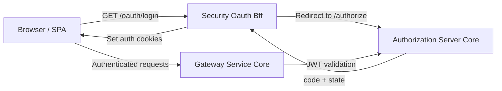
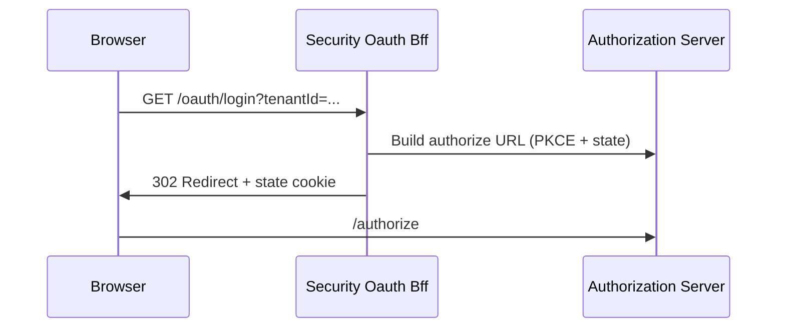
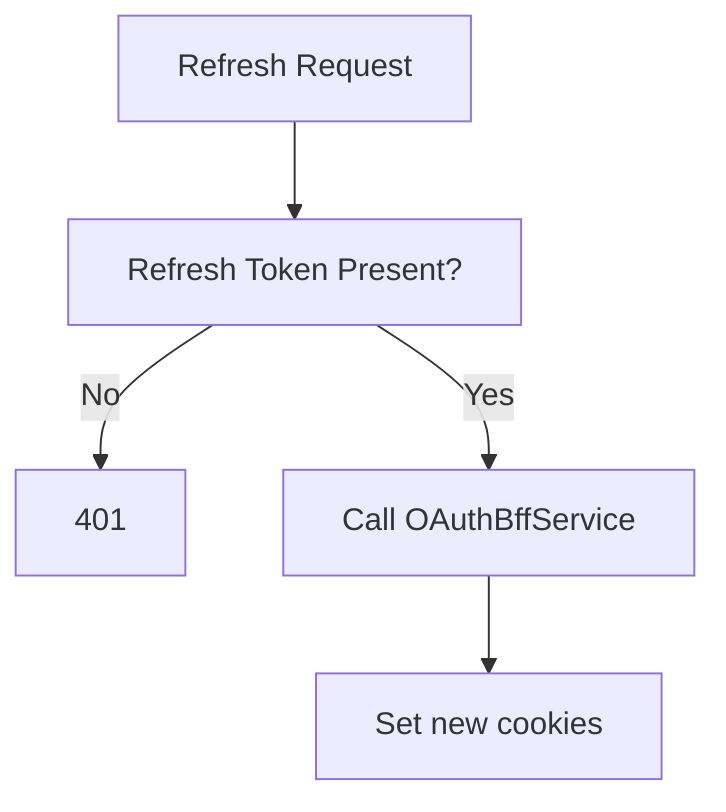
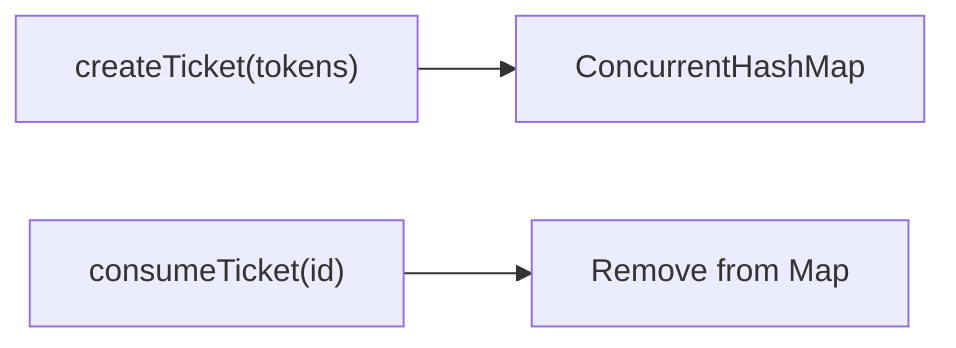
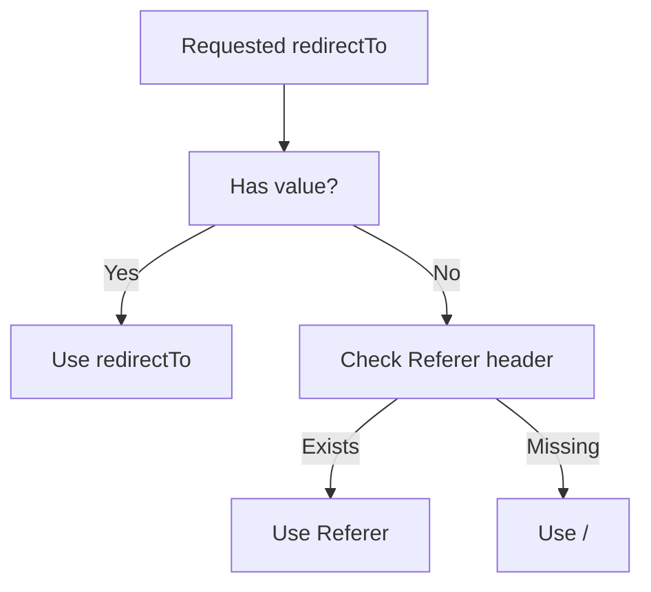

# Security Oauth Bff

## Overview

The **Security Oauth Bff** module implements a Backend-for-Frontend (BFF) layer for OAuth2 and OpenID Connect flows in OpenFrame.  
It acts as a thin, reactive gateway-facing authentication adapter that:

- Initiates OAuth2 authorization flows (PKCE + state)
- Handles authorization callbacks
- Manages access and refresh tokens via secure HTTP-only cookies
- Supports token refresh and logout
- Provides a development-only ticket exchange mechanism

This module is typically enabled in gateway deployments and integrates with the Authorization Server Core and Gateway Service Core modules.

It is conditionally activated via:

```text
openframe.gateway.oauth.enable=true
```

---

## Architectural Role in the Platform

The Security Oauth Bff module sits between:

- The **frontend client (SPA / UI)**
- The **Gateway Service Core**
- The **Authorization Server Core**

It ensures that:

- OAuth tokens never need to be handled directly by frontend JavaScript
- Tokens are stored in secure cookies
- PKCE and state validation are enforced
- Multi-tenant flows are supported

### High-Level Flow



The module is reactive (Spring WebFlux) and built around `Mono<ResponseEntity<?>>` endpoints.

---

## Core Components

The module is intentionally small and focused. It contains four primary components:

| Component | Responsibility |
|------------|----------------|
| `OAuthBffController` | Exposes OAuth HTTP endpoints (`/login`, `/callback`, `/refresh`, `/logout`) |
| `InMemoryOAuthDevTicketStore` | Stores temporary dev tickets for token exchange |
| `DefaultRedirectTargetResolver` | Determines safe post-auth redirect targets |
| `NoopForwardedHeadersContributor` | Default no-op forwarded header strategy |

---

## OAuthBffController

`OAuthBffController` is the central entry point and exposes the `/oauth` API surface.

### Endpoints

| Endpoint | Method | Purpose |
|----------|--------|----------|
| `/oauth/login` | GET | Start OAuth flow |
| `/oauth/continue` | GET | Resume flow without clearing cookies |
| `/oauth/callback` | GET | Handle authorization code exchange |
| `/oauth/refresh` | POST | Refresh access token |
| `/oauth/logout` | GET | Revoke refresh token + clear cookies |
| `/oauth/dev-exchange` | GET | Exchange dev ticket for headers |

---

### 1. Login Flow (`/oauth/login`)

Responsibilities:

- Clears existing authentication cookies
- Builds an OAuth authorization redirect (PKCE + state)
- Creates a signed state JWT
- Stores state in a short-lived cookie
- Redirects user to Authorization Server



State TTL is configurable:

```text
openframe.gateway.oauth.state-cookie-ttl-seconds=180
```

---

### 2. Callback Flow (`/oauth/callback`)

Responsibilities:

- Validates state
- Exchanges authorization code for tokens
- Sets access and refresh cookies
- Clears state cookie
- Redirects to computed target
- Handles error redirection

Error redirection uses:

```text
openframe.auth.error-url
```

If development tickets are enabled:

```text
openframe.gateway.oauth.dev-ticket-enabled=true
```

A temporary `devTicket` parameter is appended to the redirect URL.

---

### 3. Token Refresh (`/oauth/refresh`)

Supports:

- Cookie-based refresh token
- Header-based refresh token fallback
- Tenant-aware refresh
- Lookup-based refresh (if tenantId not provided)

Flow:



Returns `204 No Content` with updated cookies.

---

### 4. Logout (`/oauth/logout`)

- Clears authentication cookies
- Revokes refresh token
- Supports tenant-aware or lookup-based revocation
- Returns `204 No Content`

---

### 5. Dev Ticket Exchange (`/oauth/dev-exchange`)

Development-only feature:

- Accepts one-time ticket
- Returns tokens via headers
- Removes ticket from store

Disabled automatically if:

```text
openframe.gateway.oauth.dev-ticket-enabled=false
```

---

## InMemoryOAuthDevTicketStore

A lightweight in-memory implementation of `OAuthDevTicketStore`.

### Behavior

- Generates random UUID ticket
- Stores `TokenResponse` in a concurrent map
- Removes entry on consumption



### Characteristics

- Thread-safe
- Non-persistent
- Intended for development only
- Auto-configured when no custom store bean is defined

---

## DefaultRedirectTargetResolver

Resolves post-authentication redirect target.

Resolution order:

1. Explicit `redirectTo` request parameter
2. `Referer` header
3. Default `/`



This ensures a safe fallback mechanism without hard failure.

---

## NoopForwardedHeadersContributor

A default implementation of `ForwardedHeadersContributor`.

- Contributes no additional headers
- Used when no custom bean is provided
- Enables extension for reverse-proxy aware deployments

This design allows injection of custom forwarded header logic (for example when behind load balancers or ingress controllers).

---

## Cookie Management Strategy

The module relies on `CookieService` for:

- Access token cookie
- Refresh token cookie
- OAuth state cookie
- Cookie clearing operations

### Security Characteristics

- HTTP-only cookies
- Short-lived state cookie
- Separate access and refresh handling
- Explicit state clearing on callback

---

## Multi-Tenancy Considerations

Tenant context is required for:

- Authorization URL construction
- Token refresh
- Refresh token revocation

When tenant ID is omitted during refresh or logout, the module delegates lookup-based resolution.

---

## Configuration Summary

```text
openframe.gateway.oauth.enable=true
openframe.gateway.oauth.state-cookie-ttl-seconds=180
openframe.gateway.oauth.dev-ticket-enabled=true
openframe.auth.error-url=https://example.com/error
```

---

## Extension Points

The module is intentionally extensible:

| Extension | Purpose |
|------------|----------|
| Custom `OAuthDevTicketStore` | Persistent or distributed ticket storage |
| Custom `RedirectTargetResolver` | Strict redirect validation logic |
| Custom `ForwardedHeadersContributor` | Reverse proxy header adjustments |

Spring Boot conditional configuration ensures defaults are only used when no custom bean exists.

---

## Design Principles

The Security Oauth Bff module follows these principles:

- **Token isolation** — frontend never directly manages OAuth tokens
- **Cookie-based session model** — improves XSS resilience
- **Reactive execution** — non-blocking WebFlux controllers
- **Minimal surface area** — focused only on OAuth boundary concerns
- **Multi-tenant aware** — explicit tenant resolution in all critical flows

---

## Summary

The Security Oauth Bff module provides a secure, reactive OAuth2 BFF layer that:

- Initiates and completes OAuth flows
- Manages tokens via secure cookies
- Supports refresh and revocation
- Enables development ticket exchange
- Allows deployment-specific extensibility

It plays a critical role in isolating frontend clients from direct token handling while maintaining full compatibility with the Authorization Server Core and Gateway Service Core components of the OpenFrame platform.
